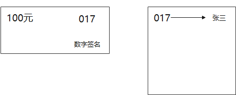

# 北大肖臻老师《区块链技术与应用》公开课学习
* 学习地址：[https://www.bilibili.com/video/BV1Vt411X7JF](https://www.bilibili.com/video/BV1Vt411X7JF)

## 密码学原理

比特币被称为加密货币 `cryptocurrency`。但其实区块链上内容都是公开的，包括区块的地址，转账的金额。
比特币主要用到了密码学中的两个功能: 1.哈希 2.签名

密码学中用到的哈希函数被称为 `cryptographic hash function`, 它有两个重要的性质:
* `collision resistance`(抗碰撞性): 例如 `x≠y H(x)=H(y)` 两个不同的输入，输出却是相等的，这就称[哈希碰撞](https://www.ruanyifeng.com/blog/2018/09/hash-collision-and-birthday-attack.html)。它是不可避免的，因为输入空间总大于输出空间。哈希碰撞中，给出x，很难找到y，除非蛮力求解(brute-force)。难以发现碰撞的性质称为`collision resistance`
  * 作用：检测上传到云端的文件是否被更改，上传文件前先求该文件的hash值，过段时间下载该文件后，再求一次hash值，比较两值是否相等即可知道文件是否被篡改。
  * 人工制造碰撞：我国著名密码学家王小云教授在 2004 年就找到算法，人工制造了哈希函数 MD5 的哈希碰撞，使得 MD5函数 安全性收到了冲击。如果无法人工制造哈希碰撞，那么坏人就只能用 `brute-force` 蛮力穷举，这种工作量就巨大到不可能了。
* `hiding`: 哈希函数的计算过程是单向的，不可逆的。例如从 `H(x)` 无法推导出 `x`, `hiding` 性质前提是输入空间足够大(不然很容易遍历完)，分布比较均匀(hash 结果不能只是某几个值)。如果输入不是足够大，一般在 `x` 后面拼接一个随机数，如 `x123213124`，整体取哈希值。
  * 作用：和 `collision resistance` 结合在一起，用来实现 `digital commitment` (又称为 `digital equivalent of a sealed envelope`)。把预测结果作为输入 `x`，算出一个哈希值，将哈希值公布，`hiding` 让人们知道哈希值而不知道预测值，最后再将 `x` 公布，因为有 `collision resistance` 的性质，预测结果是不可篡改的。
* `puzzle friendly`: 所谓 `puzzle friendly`，意思是对于哈希函数，他的输出是无法预测的，要找到特定区间内的哈希值的输入x，没有捷径。 比如，我要找到SHA256函数（比特币中用的 hash 函数: Secure Hash algorithm）的哈希值，前60位都是零，我除了一个一个试验以外，没有其他的方法。 （挖矿很难，验证很容易）

关于签名，首先要介绍比特币中的账户管理，开户方式: 只需要创建一对公私钥即可（非对称加密），公钥是公开的，私钥是私密的。

> 那么每个人都有公私钥，可不可以不断生成公私钥，与区块链上已存在的公钥进行对比，如果相同，则用对应的私钥去攻击他。答案是不可能，因为概率微乎其微，但是前提是生成公私钥的时候要有好的随机源。

比特币的本质就是数字签名，对于一笔交易，要用发起人的私钥进行签名，大家可以用发起人的公钥对这笔交易进行验证。

## 数据结构
### Hash Pointer（哈希指针）
> 在比特币中，其最基本的数据结构便是一个个区块形成的区块链。区块链与链表的区别就是用哈希指针代替了普通指针。
> 一般的链表我们都可以改造为使用哈希指针的链表，但当链表中存在环时，哈希指针便不能再使用。

对于链表中的节点，对链表中的内容做一次哈希运算，记 `H()` 为该节点的哈希值，该值与节点中内容有关。当节点（区块）中内容发生改变，该哈希值也会发生改变，从而保证了区块内容不能被篡改。

> 如图中所示，如果我们想要破坏区块链完整性。篡改B的内容，而C中保存有B的哈希值，所以C也得进行修改。而同样C后区块也得修改。而用户只需要记住最后一个区块链的哈希地址，就可以检测区块链上内容是否被篡改。
在实际应用中，一整条链可能会被切断分开保存在多个地方。若用户仅仅具有其中一段，当用到前面部分区块数据时，直接问系统中其他节点要即可，当要到之后，仅仅通过计算要到的最后一个哈希值和自己保存哈希值是否一致可以判断所给内容是否确实为区块链上真实的内容。

### Merkle Tree（默克尔树）
> Merkle Tree 与 Binary Tree 的区别就是用哈希指针代替了普通指针。

> 上图即为一个简单的Merkle Tree，其中Tx0、Tx1、Tx2、Tx3为数据块，代表每一次交易。Tx0、Tx1各有一个哈希值，将其合并放在一个节点中，Tx2、Tx3同样操作，而后，针对得到的两个节点Hash01、Hash23分别取哈希，又可以得到两个新的哈希值，即为图中根节点。实际中，在区块块头中存储的是根节点的哈希值（对其再取一次哈希）

该数据结构的优点在于：只需要记住 `Root Hash（根哈希值）`，便可以检测出对树中任何部位的修改。不论在哪里篡改了，都会通过哈希值向上反应，最终反馈到 `Root Hash` 值上。

> 在比特币系统中，不同区块通过哈希值指针连接，在同一个区块中的多个交易（数据块），则通过 `Merkle Tree` 的形式组织在一起。区块本身分为两部分（块头和块身），在块头中存在有根哈希值（没有交易的具体信息），块身中存在交易列表。

### 轻节点与全节点 
> 全节点保存整个区块的所有内容，而轻节点仅仅保存区块的块头信息。
> 为什么要分轻节点和全节点？
> 因为硬件的局限。一个区块大小为1MB，对于移动便携设备来说，如果存储区块的所有内容，则所需空间过大，而这是不现实的。所以轻节点只需要存储区块块头信息，全节点存储区块所有内容。

当需要向轻节点证明某条交易是否被写入区块链，便需要用到 `Merkle proof`。我们将交易到根节点这一条路径称为 `Merkle proof`，全节点将整个 `Merkle tree` 的信息发送给轻节点，轻节点即可根据其算出根哈希值，和自己保存的对比，从而验证该交易是否被写入区块链。只要沿着该路径，计算出来的根哈希值正确，说明内容没有被修改过。

那么全节点是否可以修改 Hash 值，向轻节点发送修改后的 Hash 值使得向上一层计算的 Hash 值仍然正确呢？
> 实际上，这种情况为人为制造哈希碰撞。由于哈希函数的 `collision resistance` 性质，这种情况是不会发生的，保证了系统的不可篡改性。同时，这样一个 `Merkle Proof` 的事件复杂度为 `O(log n)`, 非常高效【证明交易存在】。如果要证明交易不存在，如果不对叶节点规定排序顺序，没有一个效率较高的方法证明不存在。在比特币系统中，没有相应的需求，所以在比特币系统中并没有对 `Merkle Tree` 进行排序。

## 协议

### 数字货币的问题
假设权威机构——中央银行发行数字货币，发行了数字货币，用央行的私钥签名，然后使用的时候，用户直接拿央行的公钥验证签名（假设大家都知道公钥）。

虽然签名保证了没办法篡改其中的内容，但是数字货币本质上还是一个文件，这样的数字货币可复制，就会造成**双花攻击**（double spending attack）。不像是纸质货币，花出去手上就没有。

### 中心化
为解决这个问题，央行还要维护一个数据库，即记录每个编号的数字货币是归哪个用户所有。

在支付时，不仅要用公钥验证签名是央行签署的，还要通过央行验证该货币是归自己所有，央行再将货币所有者改成支付给的那个用户。不仅数字货币的发行是由央行统一控制，而且每次交易都要由央行确认其合法性，这种方案是一个中心化的方案。

### 去中心化
将央行的职能改成由广大的用户来共同承担，也就是去中心化的方案，这是BTC等数字货币系统要解决的问题，即：
> 1️⃣ 怎么决定数字货币的发行及发行量
> 2️⃣ 怎么验证交易的合法性，防止双花攻击
第一个问题在 BTC 系统中是挖矿决定的
第二个问题的解决，要维护一个数据结构，由所有用户来共同维护，这个数据结构就是**区块链**。

假设用户 A 获得了铸币权，他发行了 10 个 BTC。然后他将这 10 个 BTC 转给 B 和 C，每个人分 5 个 BTC。接下来 B 给 C 2 个货币，给 D 3 个货币。最后 C 将所得的 7 个货币全部给 E。

> 红色箭头会说明【币的来源】，这也就防止了双花攻击，如过 B 已经将自己的 5个BTC 花掉了，假设 B 尝试再花一次，将 5个BTC 转给F。这时顺着区块链去检查这个区块到来源交易之间的区块，发现 B 已经花了来源区块的BTC，说明这新个交易是不合法的，也就不会接受这个转给F的区块进入区块链。

以 A 向 B 转账为例：
* B的公钥: A 向 B 转账，A 需要知道 B 的地址。因为 BTC 系统中的收款地址就是收款人的公钥取哈希再经过一些转换得到的。BTC系统也没有提供查询某用户的公钥或账户地址的功能，要向 B 转账，就需要 B 提供公钥或账户地址。这种情况 B 可以把公钥公布在网站上。（虽然公钥可以公开，但实际中更多公开的是公钥的哈希）
* A的公钥: A 向 B 转账，B 也需要知道 A 的公钥。因为一方面 A 的公钥代表 A 的身份，B 要知道转账的是谁，另一方面是为了验证 BTC 交易中 A 的签名（私钥签名公钥验证），也就是说所有结点都需要知道 A 的公钥才行，每个结点都需要独立验证，即使是一个和交易无关的旁观者也要验证这笔交易的合法性。
* 如何知道 A 的公钥: A 的公钥是 A 自己写在这笔交易的输入部分里，即在交易中付款方自己宣称的。实际中 A 转账时候提供的公钥需要和铸币交易中公钥对的上，这样就防止了恶意节点伪造 A 的公钥来“偷”走 A 的比特币。
* 在比特币系统中，通过执行脚本实现上述验证过程。将当前交易输入脚本与前一个交易输出脚本（说明币的来源的交易）拼接执行，如果可以正确执行，说明交易合法。