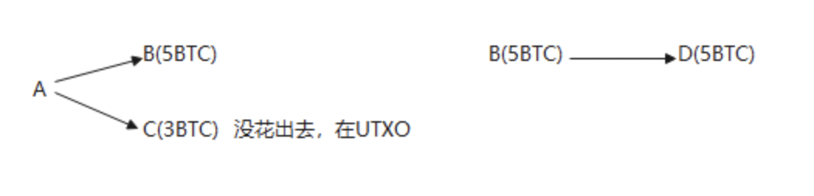
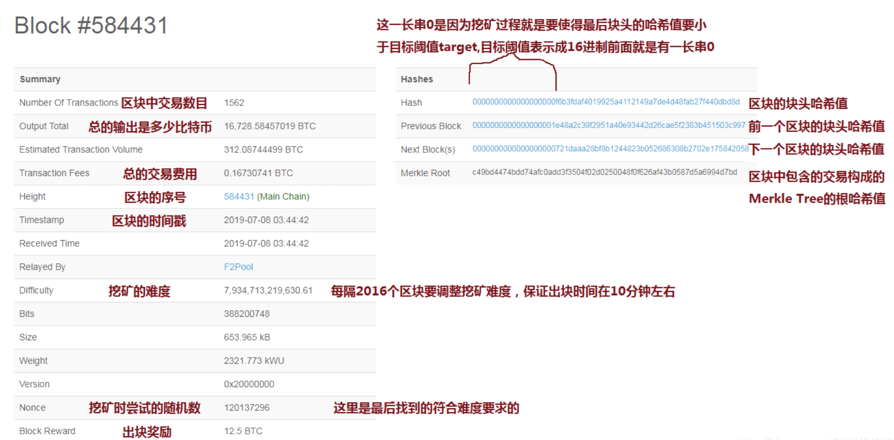
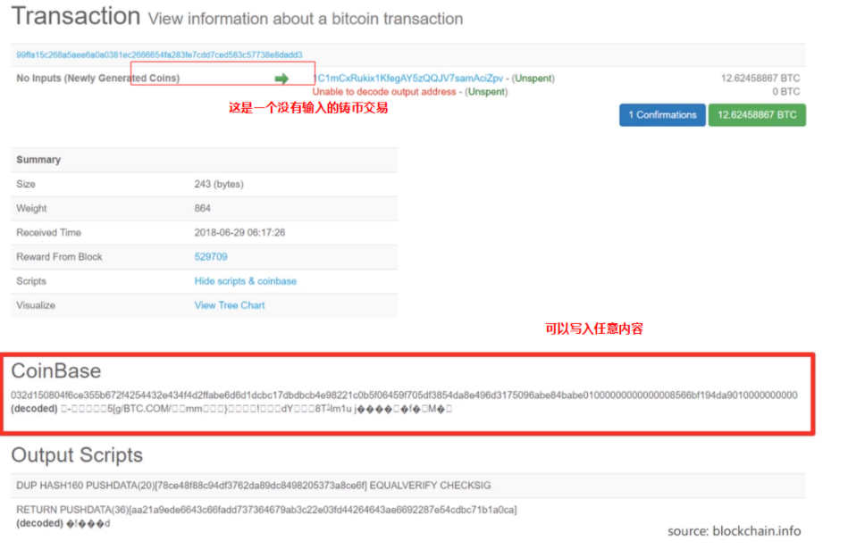
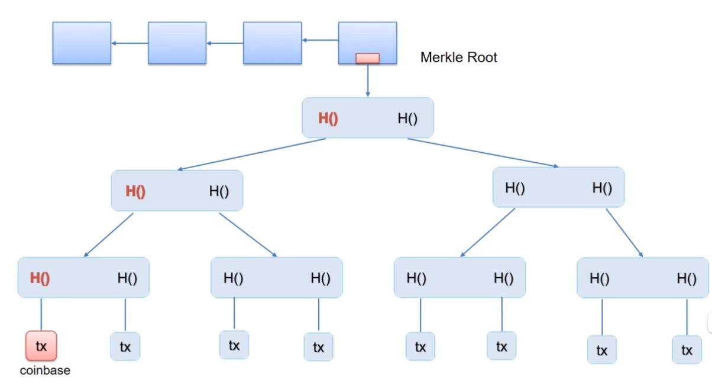
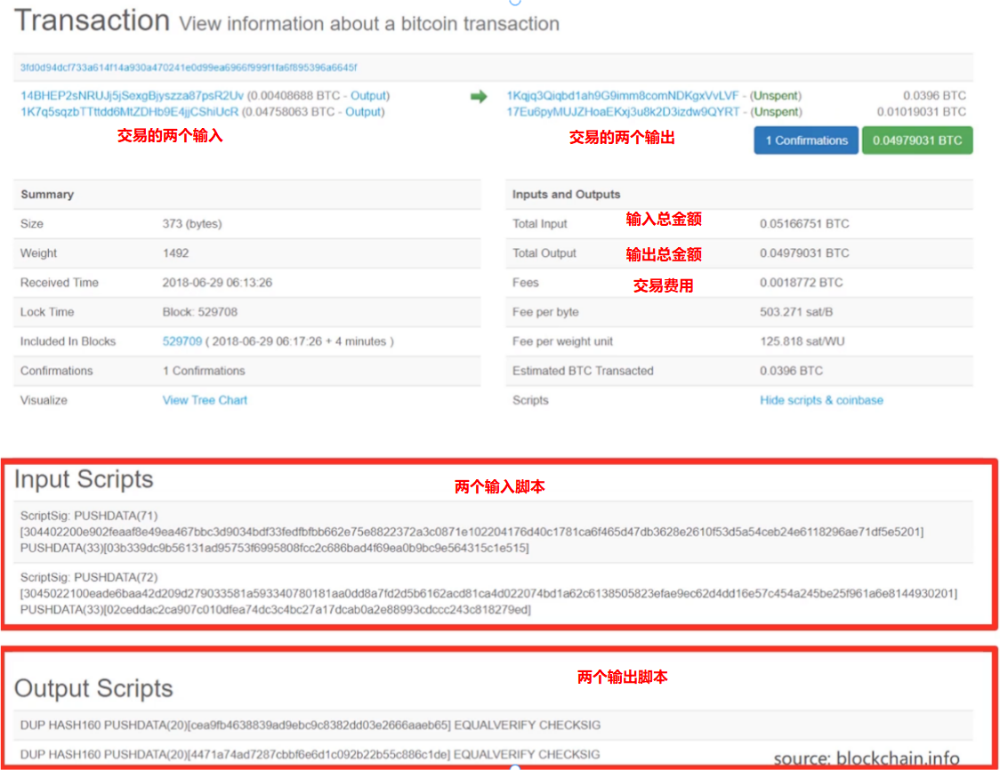
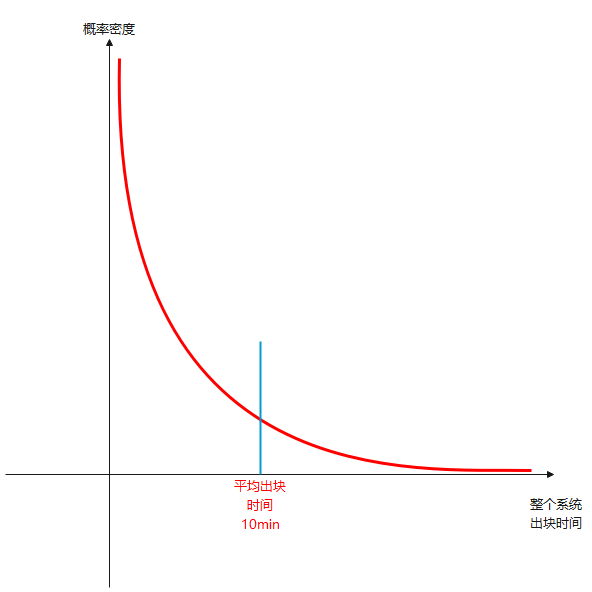

# 北大肖臻老师《区块链技术与应用》公开课学习 2
* 学习地址：[https://www.bilibili.com/video/BV1Vt411X7JF](https://www.bilibili.com/video/BV1Vt411X7JF)

## BTC 系统实现

区块链是去中心化的账本，BTC采用的是基于交易的账本模式（transaction-based ledger），只记录了转账交易和铸币交易，并没有直接记录每个账户上有多少钱。如果想知道某个BTC账户上有多少钱，要通过交易记录来推算。

除了BTC系统这样基于交易的账本模式（transaction-based ledger），还有一些系统是基于账户的模式（account-based ledger），比如后面要学的以太坊。在这种模式中系统要显式的记录每个账户中有多少个币。

BTC系统的这种模式，隐私保护性比较好，但会带来一些代价，如转账交易要说明币的来源（币是从之前的哪个交易的哪个输出中来的）以防止双花攻击。

### UTXO
BTC 中的全结点要维护一个叫 `UTXO（Unspent Transaction Output）` 的数据结构，即还没有被花出去的交易的输出。一个交易可能有多个输出，被花掉的就不在 `UTXO` 里了。如果拥有不花就一直放在 `UTXO` 中



`UTXO` 集合中的每个元素要给出产生这个输出的交易的哈希值，以及它在这个交易中是第几个输出。用这两个信息就可以定位到一个确定的交易中确定的输出。

使用 `UTXO` 可以用来快速检测双花攻击，想知道新发布的交易是不是合法的，要查一下全结点存在内存中的 `UTXO`。要花掉的币只有在这个`UTXO` 这个集合里才是合法的，否则要么是不存在的，要么是已经花过了的。

### 交易费
有些交易的总输入可能略微大于总输出，如可能总输出是1个BTC，总输出是0.99个BTC，这之中的差额就作为记账费给了获得记账权的那个结点。
> 这是因为仅有出块奖励是不够的，给予交易费可以给别人记账的动机。`0.01BTC` 的费用已经很高了，有些简单的交易是没有费用的。目前的激励机制主要还是出块奖励

### 区块举例



```java
// block header 数据结构
class CBlockHeader {
	public:
  	int32_t nVersion; // BTC版本号，没法改
    uint256 hashPrevBlock; // 前一个区块块头哈希值（32字节）不能改
    uint256 hashMerkleRoot; // 通过修改Merkle Tree中铸币交易的CoinBase域来调整其根哈希值
  	uint32_t nTime; // 区块产生时间，有一定的调整余地，BTC系统并不要求非常精确的时间，这个域可以在一定范围内调整
  	uint32_t nBits; // 挖矿目标阈值编码后的版本，只能按照协议中的要求定期进行调整，不能改
  	unit32_t nNonce
}
```

区块中的 `nonce` 是4字节即32位整数，也就只 `2^32` 种取值。因为BTC近些年太火爆了，挖矿的人数很多，所以挖矿的难度被调整的很高，单纯靠调整 `nonce` 是很可能得不到符合难度要求的解的（搜索空间不够大）。



铸币交易是没有交易来源的，所以可以在其 `CoinBase` 域里随便写入内容，铸币交易的变化会使该交易的哈希发生变化，变化沿着 `Merkle Tree` 一路向上传递，最终使整棵 `Merkle Tree` 的根哈希值发生变化，间接地调整块头的哈希值。所以可以把这个字段当做一个 `extra nonce`，块头的 `nonce` 字段不够用，就再拿着这个域的一部分字节一起调整，就增大了搜索空间。例如，拿出这个域的前 `8` 个字节当做`extra nonce`，则搜索空间一下子就增大到了 `2^96`



实际挖矿时，一般也是为此设计了两层循环，外层循环调整铸币交易的 `CoinBase` 域的 `extra nonce`，然后算出 `Merkle Tree` 的根哈希值；内层循环调整块头的 `nonce`，计算整个块头的哈希值。

### 交易举例


BTC系统中交易的输入和输出都是用脚本来指定的，验证交易输入输出的过程就是把输入脚本和输出脚本配对执行（不是把同一个交易的输入输出脚本配对执行，而是把这个交易的输入脚本和提供币的来源的那个交易的输出脚本配对执行）。只要配对后都能成功执行，交易验证就是通过的。

### 概率分析
挖矿的过程就是不断尝试 `nonce` 去求解 `puzzle`，每次尝试可以看做一个伯努利试验 `Bernoulli trial：a random experiment with binary outcome`。掷硬币就是一个最简单的伯努利试验，要么正面朝上要么反面朝上，这两个概率不必一样大，对于挖矿而言，成功和失败的概率相差非常悬殊，成功的概率很小。

当进行了大量的伯努利试验，这些伯努利试验就构成了伯努利过程 `Bernoulli process：a sequence of independent Bernoulli trails`。伯努利过程的一个性质是无记忆性（memoryless），即做大量的试验，前面的试验结果对后面没有影响，例如掷硬币很多次都是反面朝上，下一次掷硬币正面朝上的概率也不会增加。

对于挖矿来说，可以采用泊松分布进行近似，由此通过概率论可以推断出，系统出块时间服从指数分布。(需要注意的是，出块时间指的是整个系统出块时间，并非挖矿的个人)



出块时间服从的指数分布也是无记忆性的，也就是说从任何一个位置将其截断，剩下的部分仍然是服从指数分布的。`将来还要挖多少时间` 和 `过去已经挖了多少时间` 是没有关系的。不管已经挖了多长时间，接下来系统中要出块的平均时间仍然还是10分钟左右。

`progress free` ——过去做了多少工作不会让后续成功的概率变化。这个性质是必要的。假设一个加密货币系统不满足 `progress free`，即过去做的工作越多，后面成功的概率就越大，那么就会造成算力强的矿工会有不成比例的优势，而不能按照算力的比例计算优势。

### BTC 总量
出块奖励是系统中产生新的 `BTC` 的唯一途径，而出块奖励每隔 `21万个` 区块（大约每隔4年）要减半。
> 21万 * 50 * (1 + 1/2 + 1/4 + 1/8 + ...) = 2100万

### 安全性分析
* 偷币: 假设一个有恶意的结点 `M` 获得了记账权，它想把结点 `A` 的钱转走，但因为没法伪造 `A` 的签名（没有A的私钥），这样的攻击是无效的。
* 分叉攻击: M把BTC转给A，然后就紧接着挖矿挖到了一个区块，在这里填写了M把BTC转给自己的交易，以希望沿着这个区块成为最长合法链，这样就能将转给A的挤掉，从而将花出去的BTC回滚。这也是双花攻击的一种。如果大部分结点掌握在诚实结点手里，这样攻击的难度非常大，有恶意的结点要连续获得好多次记账权才可能改变最长合法链。所以一种最简单的防范方法就是多等几个区块，也叫多等几个确认（confirmation）。缺省的是要等 `6个confirmation`（大约一小时）
* selfish mining: 提前挖到但不发布，继续挖下去，等到想要攻击的交易等了6次确认认为安全之后将整条链发布出去，试图回滚原来记录。这种情况，需要恶意节点掌握系统中半数以上算力才行，否则无法成为最长合法链。

## BTC 网络工作原理
用户将交易发布到比特币网络上，节点收到交易后打包到区块中，然后将区块发布到比特币网络上，那么新发布的交易和区块在比特币网络上是如何传播的呢？

比特币工作于网络应用层，其底层（网络层）是一个 `P2P Overlay network`（P2P覆盖网络）。比特币系统中所有节点完全平等，不像一些其他网络存在超级节点(super node)。要加入网络，至少需要知道一个种子节点，通过种子节点告知自己它所知道的节点。节点之间的通信采用了 `TCP协议`，便于穿透防火墙。当节点离开时，只需要自行退出即可，其他节点在一定时间后仍然没有收到该节点消息，便会将其删掉。

比特币网络设计原则：简单、鲁棒（最坏情况下能达到最优状况，即健壮性）而非高效。
每个节点维护一个邻居节点集合，消息传播在网络中采用洪泛法，某个节点在收到一条消息会将其发送给所有邻居节点并标记，下次再收到便不会再发送该消息。邻居节点选取随机，未考虑网络底层拓扑结构，也与现实世界物理地址无关。该网络具有极强鲁棒性，但牺牲了网络效率。

比特币系统中，每个节点要维护一个等待上链的交易集合。第一次听到交易，若是合法交易，则将其加入该交易集合并转发给邻居节点，以后再收到该交易就不再转发（避免网络上交易无线传输）。假如网络中存在两个冲突交易，如交易1：`A->B`,交易2：`A->C`（假设花费的同一笔钱）。具体接收哪个取决于节点先接收到哪个交易，之后收到另一个交易会将其放弃。

> 假如某个节点先听到 `A->B`，但又听到 `A->C` 已经上链，则此时 `A->B` 为非法交易，所以要再等待上链交易集合中删除 `A->B`

新发布区块在网络中传播方式与新发布交易传播方式类似，每个节点除检查该区块内容是否合法，还要检查是否位于最长合法链上。区块越大，则网络上传输越慢。BTC协议对于区块大小限制为不大于1M大小。

> 区块大小越大，网络上传播时延越长；区块大小越小，则可以包含的交易数目越少。

此外，比特币网络传播属于 `Best effort`（尽力而为），不能保证一定传输成功。以一个交易发布到网络上，未必所有节点都能收到，也未必所有节点收到交易顺序都一致。

## 挖矿难度
挖矿本质上就是不断调整 `block header` 中的 `nonce` 值，使整个 `block header` 的哈希值小于等于给定的目标阈值。即：`H(block header)<=target`.（target便是目标阈值，target越小，目标难度就越大）对于挖矿难度的调整，可以视为调整目标空间在整个输出空间中所占比例大小。
> 比特币系统采用的哈希算法为 `SHA-256`，所以整个输出空间大小为 `2^256`，调整目标空间所占比例，简单的说需要目标值前需要多少个0。

1. 如果不调整挖矿难度会怎么样？
系统总算力越来越强，若挖矿难度保持不变，则出块时间会越来越短。
2. 出块时间越来越短是好事吗？
出块时间缩短，那么交易可以很快便被写入区块链，并且提高了系统响应时间，增加了区块链系统效率。但是，出块时间并不是越短越好。出块时间太短，也会造成一定的问题。首先，区块在网络上传播具有时延，假如出块时间为1秒，但网络传播需要10秒，则会使得系统中节点经常性处于不一致的状态，增加了系统不稳定性，且系统经常性位于分叉状态（不仅二分叉，乃至多分叉）。分叉过多，则不利于系统达成共识，且会造成算力分散，使得黑客攻击成本大大降低(不再需要整个系统51%的算力)。
3. 10min的出块间隔是最优吗？
当然不是，但可以确定的是，系统出块时间需要维持在一个定值附近。后续文章中会介绍以太坊，以太坊中平均出块时间仅为15秒左右，但同样在以太坊中也有相应难度调整算法维持其平均出块时间(后续会写文介绍)，当然15s的时间明显会产生经常性的分叉，所以以太坊设计了新的共识协议Ghost（后续文章中会介绍）。
当然，对于一个交易系统来说，10min这样一个交易时间是比较长的。但对于跨国交易来说，这个时间反而大大缩短了交易时间，减少了相应成本。

### BTC 如何调整挖矿难度
在BTC协议中规定，每隔2016个区块需要调整一次难度，因为平均 `10min` 产生一个新区块，大概需要14天的时间调整一次难度。具体调整公式如下：
> target = target × (expectual time / actual time)

`expected time` 就是预期的两次调整的间隔时间，即 `2016乘以10分钟`；而 `actual time` 是系统中产生最近的2016个区块实际花费的时间。实际的时间越大，就越需要降低难度，即提高 `target`；实际的时间越小，就越需要提高难度，即降低 `target`。

为了避免系统中出现某些意外情况，导致系统出现非常大的波动，每次对目标阈值 `target` 的调整最大不能超过 `4` 倍，最小不能小于 `1/4`。
​
恶意节点可不可以不调整 target？如果不调整 `target`，那么发布的区块块头里的4字节 `nBits域`（32字节的target压缩编码后的版本）就不是正确的，诚实的结点不会接收这样的区块。