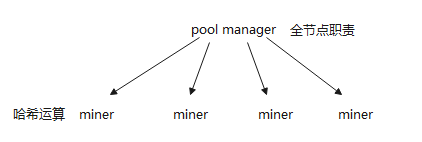
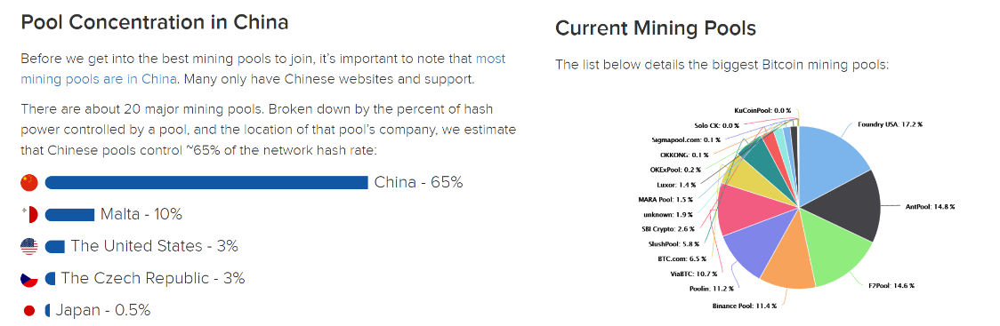
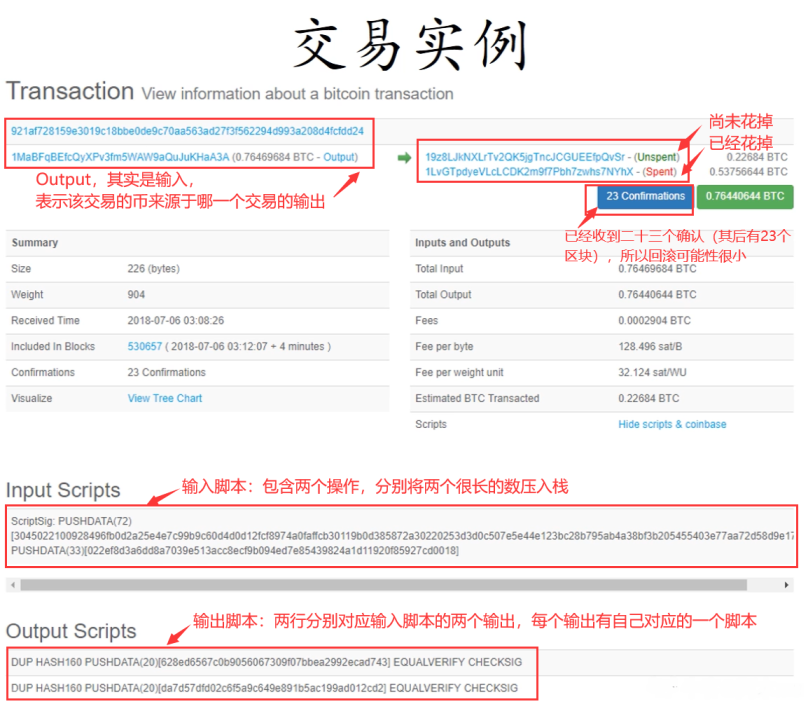
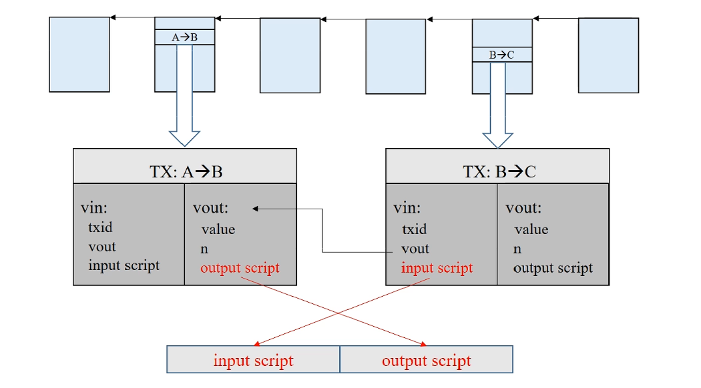
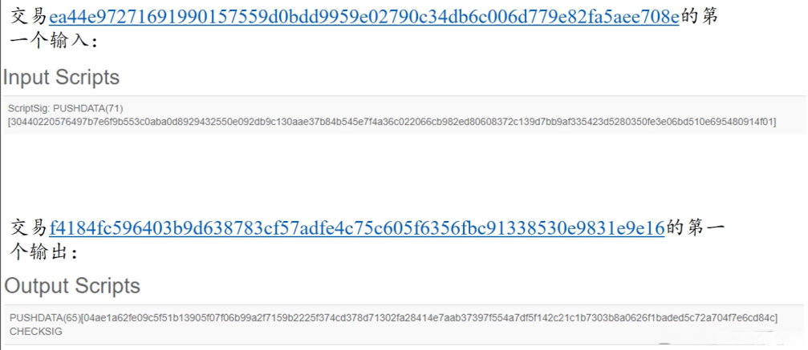
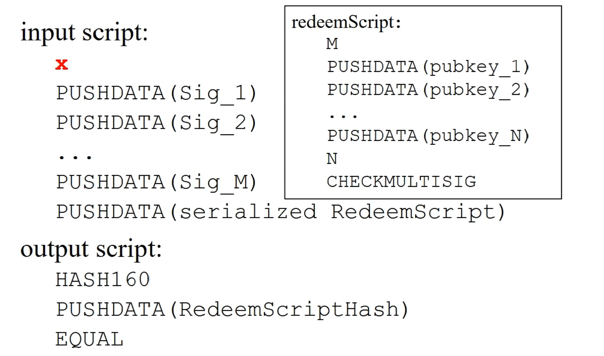
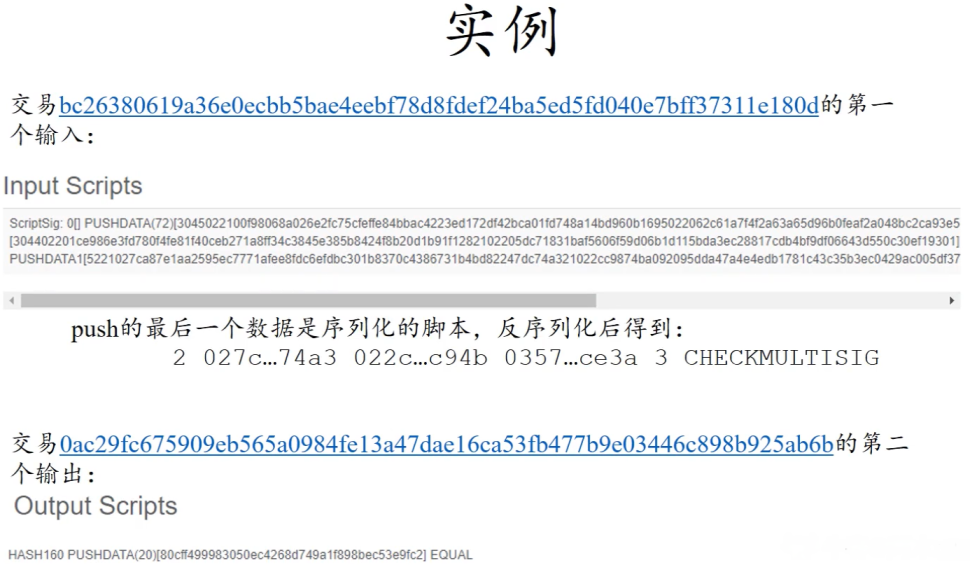
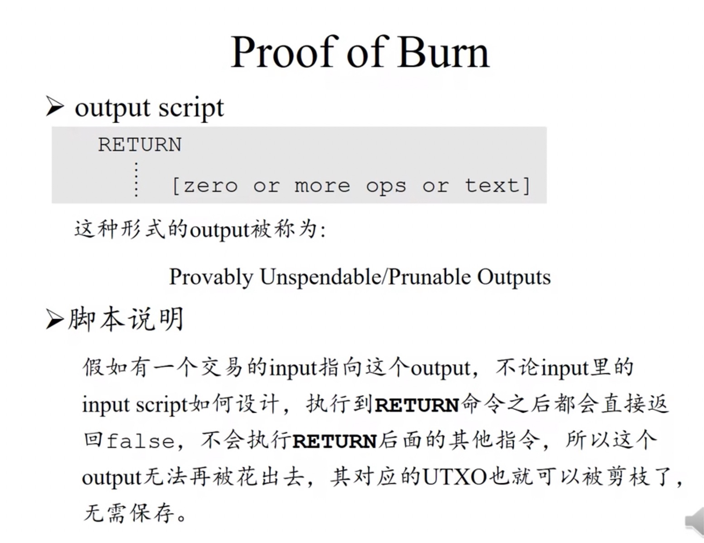
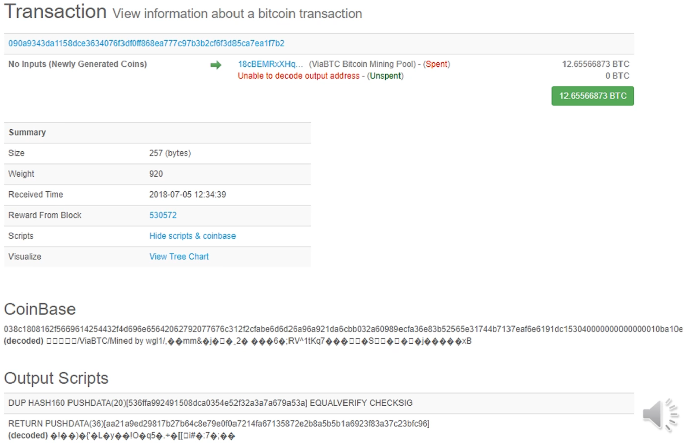
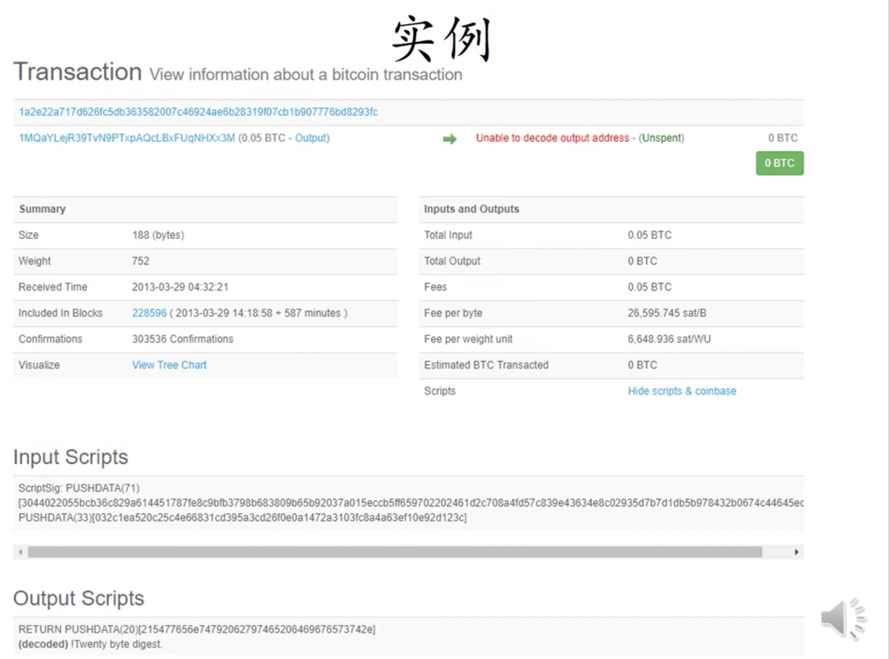

# 北大肖臻老师《区块链技术与应用》公开课学习 3
* 学习地址：[https://www.bilibili.com/video/BV1Vt411X7JF](https://www.bilibili.com/video/BV1Vt411X7JF)

## BTC 中的节点

### 全节点
* 一直在线
* 在本地硬盘上维护完整区块链信息
* 在内存中维护UTXO集合，以便于快速检验交易合法性
* 监听比特币网络中交易内容，验证每个交易合法性
* 决定哪些交易会打包到区块中
* 监听其他矿工挖出的区块，验证其合法性
  * 区块中的每个交易都要合法
  * 发布的区块是不是符合难度要求、难度目标阈值的设置是否正确、每两周调整的挖矿难度
  * 区块是在延伸最长合法链
* 挖矿
  * 决定沿着哪条链挖下去
  * 当出现等长分叉，选择哪一个分叉

### 轻节点
* 不是一直在线
* 不保存整个区块链，只需要保存每隔区块块头
* 不保存全部交易，只保存和自己有关的交易
* 无法验证大多数交易合法性，只能检验和自己相关的交易合法性
* 无法检测网上发布的区块正确性
* 可以验证挖矿难度
* 只能检测哪个是最长链，不知道哪个是最长合法链

在比特币网络中，大多数节点都是轻节点。如果只是想进行转账操作，不需要挖矿，就无需运行一个全节点。在挖矿过程中，如果监听到别人已经挖出区块延申了最长合法链，此时应该立刻放弃当前区块，在本地重新组装一个指向最后这个新合法区块的候选区块，重新开始挖矿。

这样是不是有些可惜？之前花费好多资源，全部白挖了。
> 实际上并不可惜。之前文章中提及，挖矿本身具有无记忆性，前面无论挖多久，对后续继续挖矿没有影响。
比特币系统如何安全性？
> 一是密码学的保证：别人没有自己的私钥，就无法伪造其合法签名，从而无法将其账户上BTC转走。（前提：系统中大多数算力掌握在好人手中）
> 二是共识机制：保证了恶意交易不被系统承认。

## 挖矿设备演化
目前，挖矿设备逐渐趋于专业化，其经历了三个过程，总体趋势从通用到越来越专用。
普通CPU -> GPU -> ASIC芯片（挖矿专用矿机）
> 实际上，挖矿本身就是计算，对于普通计算机来说，挖矿过程中大多数内存、硬盘、CPU中大多数部件（用到指令较少）等都是闲置的，如果用普通计算机专门用于挖矿是根本不划算的。随着挖矿难度提高，用通用计算机挖矿很快变得无利可图。
> 所以，挖矿设备转入第二代——GPU(主要用于大规模并行计算，如：深度学习)。但是，用GPU挖矿，仍然有一定浪费(GPU为通用并行计算设计，挖矿仍然有很多部件闲置。例如：浮点数运算部件，挖矿过程只使用整数操作，该部分部件根本不会用到)。
GPU价格上涨，仅仅是深度学习火热导致的吗？实际上，很多GPU被用于了挖矿。
> 当然，目前GPU挖矿也已经不划算了（目前一些新开发货币仍然用GPU挖矿）。所以，开始进入第三代设备：ASIC芯片（专门为挖矿设计的芯片），这种芯片专门为挖矿设计，只能用于特定币种的挖矿。
> 但ASIC芯片设计、流片流程很长，假如BTC价格剧烈变化，前期投入很可能会血本无归。所以，ASIC芯片需要提前预订。假如BTC系统中，算力突然很猛烈增加，一般是一个大的厂商生产出新的ASIC矿机。

## 矿池
单个矿工挖矿的收益是很不稳定的，平均出块时间10分钟是对于比特币系统中的所有矿工而言的。一个矿工用一个矿机挖出矿的时间可能要很久，并且除了挖矿之外还要承担全结点的其它责任。

矿池将很多矿工组织起来，一般的架构就是一个矿主（pool manager）全结点去驱动很多矿机，下属矿工只负责计算哈希值，全结点的其它职能只由矿主来承担。有了收益以后再大家一起分配。



如果矿机来自不同机构，这时候矿工很可能分布在世界各地，只是都加入了这个矿池。矿工和矿主联系，矿主将要计算的哈希值的任务分配给他，矿工计算好后将结果发给矿主，最终得到出块奖励后一起参与分红。

### 矿工利益分配
1. 平均分配，所有人平分出块奖励。
> 大家一起"吃大锅饭"，会导致某些矿工懈怠，不干活（挖矿要费电，需要成本）。反正又不影响最后平均分配。
> 所以，这里也需要进行按劳分配，需要一个工作量证明的方案。如何证明每个矿工所作的工作量呢？
2. 降低挖矿难度
> 假设原本挖矿难度要求，计算所得 `126位` 的哈希值前 `70位` 都必须为0，现在降低要求，只需要前 `60位` 为0，这样挖矿会更容易挖到。当然，这个哈希是不会被区块链所承认的，我们将其称为一个 `share`，或 `almost valid share`。矿工每挖到一个 `share`，将其提交给矿主，矿主对其进行记录，作为矿工工作量的证明。等到某个矿工真正挖到符合要求的的区块后，根据所有矿工提交的 `share` 数量进行分配。因为每个矿工尝试的 `nonce` 越多，挖到矿的可能性越大，所能得到的 `share` 也会越多，所以这种方案作为工作量证明方案是可行的。

### 可能出现的问题
1. 矿工会不会平时正常提交 `share`，但真正挖到区块后不提交给矿主而是自己偷偷发布出去
> 不可能。因为矿主已经组装好了区块，交给矿工计算，区块中铸币交易的收款人地址是矿主。
2. 那么矿工可以可以把铸币交易的收款人改成自己呢？
> 如果自己把铸币交易的地址改成自己的，然后去挖矿，这样提交上去的 `share` 矿主是不认可的，挖出来的矿虽然是自己的，但是整体看来就是自己单干，根本没必要加入矿池。
3. 有没有可能矿工捣乱？平时提交share，等挖到后扔掉区块，不提交？
> 可能是有，如果矿工本身仅仅想捣乱，是可以这么做的。但扔掉区块后，对其本身来说，也没有相应的奖励获得，看似是损人不利己的情况。
> 但是，矿池之间存在竞争关系。有可能为了打击竞争对手，从而起到搞破坏的作用。

### 矿池的数据


如果存在一个矿池(GHash.IO)算力比例占据全部算力一半以上，当时引起了恐慌(一个矿池就可以发动51攻击)。之后，该矿池主动降低了矿池算力，避免动摇人们对比特币信心。

有可能表面看上去是安全的，但实际实上某个机构如果有超过50%算力，其必然不会将其放入一个矿池中。而是将其分散隐藏，真正需要发动攻击时候再集中起来发动攻击

> 由这些数据可以得知，矿池本身对 BTC 系统带来了较大威胁。某个恶意用户如果想发动攻击，以前需要自己达到 51% 算力，现在自己只需要作为矿主，只需要很少一部分算力就可以了。只要能够吸引到足够多的不明真相的矿工，便可以用较低成本实现攻击。
> 当然，矿主经验管理矿池，也需要收取一定比例(出块奖励、交易费)作为管理费用。如果恶意者想要攻击系统，会将管理费降低甚至赔本吸引足够多矿工加入。这便使得发动攻击变得容易了起来。

### 矿池可以发动哪些攻击
1. 分叉攻击: 对已经经过6次确认的交易分叉，利用51%算力将交易记录回滚。
> 矿工只能计算哈希值，并不知道区块包含哪些交易，区块链状况是什么，所以容易被利用。
> 此外，51%攻击只是一个概率问题，并非达到51%算力就能发动攻击，不能达到就无法发动攻击。此外，矿池本身算力也是在不断变化的。
2. 封锁交易
> 假如攻击者不喜欢某个账户A，不想让A的交易上区块链，在监听到有其他人将A的交易发布到区块链上时，立刻发动分叉攻击，使A所在链无法成为最长合法链。这样，便实现了对A账户的封锁。其他矿工因为害怕，可能也不会将A的交易记录下来。
3. 偷币
> 这个是不可能的，因为其并没有他人账户私钥。如果依仗算力强，强行将没有签名的转账发布到区块链，正常节点不会认为其合法，这样，即使这条链再长，其他人也不会认为其是最长合法链。

## BTC 脚本篇



### 交易结构
```json
"result": {
  "txid": "921a.dd24", // 交易id
  "hash": "921a.dd24", // 交易的哈希值
  "version": 1, // 使用的比特币协议版本号
  "size": 226, // 交易的大小
  "locktime": 0, // 交易的生效时间，0代表立即生效，非0代表经过几个区块后才允许上链
  "vin": [...], // 交易的输入
          "vout": [...], // 交易的输出
  "blockhash": "0000000000000000002c510d..5c0b", // 交易所在区块的哈希值
  "confirmations": 23, // 目前已经有几个确认，包括自己及其后面有多少区块上链
  "time": 1530846727, // 交易产生的时间戳
  "blocktime": 1530846727 // 该交易所在的区块的产生时间
}

// 交易的输入，是一个数组，可以有多个输入，每个输入都要指明来源，并给出签名。
"vin": [{
  "txid": "c0cb...c57b",// 该输入的来源交易的哈希值
  "vout": 0, // 该输入对应『来源交易』的第几个输出。是一个索引值
  "scriptsig": { // 输入脚本，这里是最简单的形式，只有签名    
    "asm": "3045...0018",
    "hex": "4830...0018"
  }	
}],

// 交易的输出
"vout":[{
  "va1ue": 0.22684000, // 金额，即转过去多少BTC
  "n": 0, // 序号，表示这个输出在这个交易中的索引
  "scriptPubKey": { // 输出脚本
    "asm": "DUP HASH160 628e...d/43 EQUALVERTFY CHECKSTG",
    "hex": "76a9.88ac",
    "regsigs": 1, // 这个输出需要多少个签名才能兑现，有的输出需要多重签名
    "type": "pubkeyhash", // 输出的类型，此处 pubkeyhash 是公钥的哈希
    "addresses": ["19z8LJkNXLrTv2QK5jgTncJCGUEEfpQvSr"] // 输出的地址
  }
},{
  "va1ue": 0.53756644,
  "n": 1,
  "scriptPubKey": {
    "asm": "DUP HASH160 da7d...2cd2 EQUALVERIFY CHECKSIG",
    "hex": "76a9.88ac",
    "regsigs": 1,
    "type": "pubkeyhash",
    "addresses": ["1LVGTpdyeVLCLCDK2m9f7Pbh7zwhs7NYhX"]
  }
}]
```

### 脚本举例说明

> 在早期的比特币系统中，`B->C` 这个交易的输入脚本和 `A->B` 这个交易的输出脚本拼在一起执行。
> 后来，出于安全因素的考虑，这两个脚本改为分别执行，首先执行输入脚本，如果没有出错，那么再执行输出脚本，如果能顺利执行，并且最后得到非零值（true），那么这个交易就是合法的。
> 如果一个交易有多个输入，每个输入脚本都要去找到前面特定区块中所对应的输出脚本，匹配之后来进行验证。全部验证通过后，这个交易才是合法的。

### P2PK（Pay to Public Key）
```sh
input script:
	PUSHDATA(Sig) # 输入脚本中直接给出签名（收款人用自己的私钥对输入脚本所在的整个交易的签名）
output script:
	PUSHDATA(PubKey) # 输出脚本中直接给出收款人的公钥
	CHECKSIG # 最后的 CHECKSIG 是检查签名
```

入栈执行过程：

1. 第一条语句，将输入脚本中的签名压入栈
2. 第二条语句，将输出脚本中的公钥压入栈
3. 第三条语句，弹出栈顶的两个元素，用公钥 PubKey 检查一下签名 Sig 是否正确。如果正确，返回True，说明验证通过



### P2PKH（Pay to public key hash）——最常用
```sh
input script:
	PUSHDATA(Sig) # 给出私钥签名
	PUSHDATA(PubKey) # 给出公钥
output script:
	DUP
	HASH160
	PUSHDATA(PubKeyHash) # 输出脚本中没有给出收款人的公钥，给出的是公钥的哈希值。
	EQUALVERIEY
	CHECKSIG
```

入栈执行过程：
1. 第一条语句，将输入脚本中的签名压入栈
2. 第二条语句，将输入脚本中的公钥压入栈
3. 第三条语句，将栈顶元素复制一遍（所以又压入了一次公钥）
4. 第四条语句，将栈顶元素取出来取哈希，再将得到的哈希值压入栈（也就是将栈顶的公钥变成了其哈希值）
5. 第五条语句，将输出脚本中提供的公钥的哈希值压入栈
6. 第六条语句，弹出栈顶的两个元素（都是公钥的哈希值），比较它们是否相等——防止有人用自己的公钥冒充币的来源的交易的收款人的公钥
7. 第七条语句，弹出栈顶的两个元素（公钥和签名），用公钥PubKey检查一下签名Sig是否正确。如果正确，返回True，说明验证通过

### P2SH（Pay to Script Hash）
这种形式下输出脚本给出的不是收款人的公钥的哈希，而是收款人提供的赎回脚本（Redeem Script）的哈希。我们举个例子就明白了。
```sh
redeemScript: # 赎回脚本(收款人会公开)
	PUSHDATA(PubKey)
	CHECKSIG
input script:
	PUSHDATA(Sig) # 给出私钥签名
	PUSHDATA(serialized redeemScript) # 给出序列化的赎回脚本
output script:
	HASH160
	PUSHDATA(redeemscriptHash)
	EQUAL
```

入栈执行过程
* 第一阶段
  * 第一步，将输入脚本中的交易签名压入栈
  * 第二步，将输入脚本中给出的赎回脚本压入栈
  * 第三步，弹出栈顶元素取哈希再压栈，也就得到了赎回脚本的哈希（Redeem Script Hash）
  * 第四步，将输出脚本中给出的赎回脚本的哈希值压入栈
  * 第五步，比较栈顶两个元素是否相等，相当于用之前的输出脚本给出的赎回脚本哈希，验证了输入脚本提供的赎回脚本是否是正确的
* 第二阶段（反序列化并执行redeemScript，验证input script中给出的签名是否正确）
  * 第一步，将脚本中写死的公钥压入栈
  * 第二步，验证输入脚本中给出的交易签名的正确性。验证通过就会返回 True

### 多重签名

P2SH常见的应用场景就是对多重签名的支持

比特币系统中一个交易输出可能要求使用它的交易输入提供多个签名，才能把BTC取出来。比如某个公司可能要求5个合伙人中的任意三个提供签名，才能把公司的钱转走。这样设计不但**为私钥的泄露提供了一定安全性保护，也为私钥的丢失提供了一定的容错性**。

```sh
inputScript:
	X # 在输入脚本里往栈中添加一个没用的元素，抵消掉BTC其中的一个bug。
	PUSHDATA(Sig 1)
	PUSHDATA(Sig 2)
	PUSHDATA(Sig M)
outputScript:
	M
	PUSHDATA(pubkey_1)
	PUSHDATA(pubkey_2)
	...
	PUSHDATA(pubkey N)
	N
	CHECKMULTISIG
```

入栈执行过程
1. 第一步，将输入脚本中的多余元素（前述的X）压栈
2. 第二步，将输入脚本里的 M 个签名依次压入栈中（这里 M=2）
3. 第三步，将输出脚本中给定的阈值 M 压栈
4. 第四步，将输出脚本中给定的 N 个公钥压栈
5. 第五步，将输出脚本中给定的公钥数 N 压栈
6. 第六步，执行 CEHCKMULTISIG，以检查堆栈中是否按顺序包含了 N 个签名中的 M 个

> 这是最早的多重签名，并没有用到 P2SH，就是用比特币脚本中原生的 CEHCKMULTISIG 实现的。
> 这样在实际使用时有些不方便的地方，例如电商网站开通了比特币支付渠道，但要求要有5个合伙人中3个人的签名才能把 BTC 转走。但这样做之后，用户在 BTC 支付的时候，生成的转账交易里也给出 5 个合伙人的公钥，同时还要给出N和M的值。
> 而这些公钥，以及 N 和 M 的值就要电商网站公布给用户，而且不同的电商网站规则也不一样，这就让用户生成转账交易变得不方便。因为这些复杂性都暴露给用户了

### 用P2SH实现多重签名
相比前面的实现，这样的本质是将复杂性从输出脚本转移到了赎回脚本中，输出脚本只需要给出赎回脚本的哈希值就行了。N个公钥以及N、M的值都在赎回脚本中给出来，而赎回脚本由输入脚本提供，这样也就和支付给它的用户们隔离开了。

> 从用户的角度来看，采用这种P2SH的支付方式，和P2PKH支付方式没有多大区别，只不过输出脚本中的是赎回脚本的哈希值而不是公钥的哈希值
> 输入脚本就是电商网站要把这笔BTC转出去时候用的，这种方式下输入脚本要包含M个签名，以及赎回脚本的序列化版本。
> 如果电商将来改变了采用的多重签名规则，就只需要改变一下赎回脚本的内容和输入脚本中的内容，然后把新的赎回脚本的哈希值公布出去就可以了。对用户而言也只是付款时候输出脚本中要包含的哈希值发生了变化。

入栈执行过程：
* 第一阶段
  * 第一步，将占位元素 X 压栈
  * 第二步，将输入脚本中的M个签名压栈
  * 第三步，将输入脚本中保存的序列化的赎回脚本压栈
  * 第四步，弹出栈顶元素取哈希再压栈，即将栈顶的赎回脚本取哈希
  * 第五步，将输出脚本中给出的赎回脚本哈希值（RSH）压栈
  * 第六步，判断栈顶两个元素是否相等，即判断一下计算出的赎回脚本哈希和给定的赎回脚本哈希是否相等
* 第二阶段（执行 redeem script）
  * 第一步，将签名数 M 压栈
  * 第二步，将 N 个公钥压栈
  * 第三步，将给定的公钥数 N 压栈
  * 第四步，使用`CEHCKMULTISIG`操作检查多重签名的正确性



### Proof of Burn：销毁BTC

一个特殊的脚本, 以 `RETURN` 开始，后面可以跟任何内容。`RETURN` 操作，无条件返回错误，所以该脚本永远不可能通过验证。执行到RETURN，后续操作不会再执行。该方法是销毁比特币的一种方法。

为什么要销毁比特币？现在比特币价值极高，销毁是不是很可惜？
1. 部分小币种(AltCoin)要求销毁部分比特币才能得到该种小币种。
2. 往区块链中写入内容。我们经常说，区块链是不可篡改的账本，有人便利用该特性往其中添加想要永久保存的内容。例如：知识产权保护——知识产权的哈希值。

> 铸币交易的 CoinBase 域也可以随便写什么内容，为什么不在那里写呢？因为这种方法很难，必须要获得记账权。然而发布交易不需要有记账权。
> 任何用户都可以用 `Proof of Burn` 的方法，销毁极少量的比特币，换取向比特币系统的区块链中写入一些内容的机会。没有销毁比特币，仅仅支付了交易费，也可以向区块链中写入内容。

例如下图为一个铸币交易，其中包含两个交易，第二个交易便是仅仅想要往其中写入内容。


下图为一个普通的转账交易，其就是仅仅为了向区块链写入内容。该交易并未销毁 `BTC`，只是将输入的费用作为交易费给了挖到矿的矿工。这种交易永远不会兑现，所以矿工不会将其保存在 `UTXO` 中，对全节点比较友好。



> BTC系统中使用的脚本语言很简单，它也不是图灵完备的语言，甚至不支持循环，这样设计也有其用意，不支持循环也就不会有死循环。后面学的以太坊的脚本语言就是图灵完备的，这样就靠其它机制来防止进入死循环等。

BTC的脚本语言针对BTC应用场景做了很好的优化，如检查多重签名时的 `CHECKMULTISIG` 操作一条就能实现，这是其强大之处。

