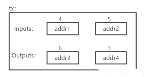
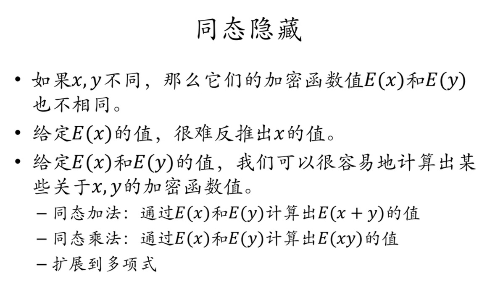
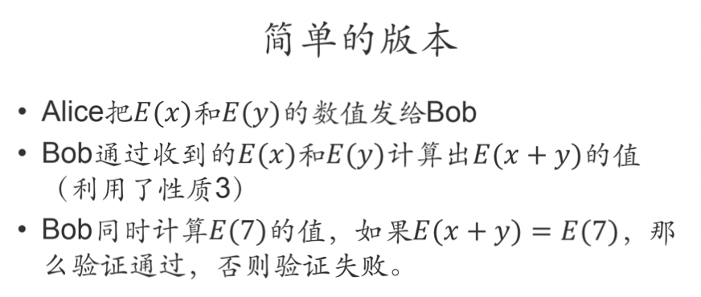
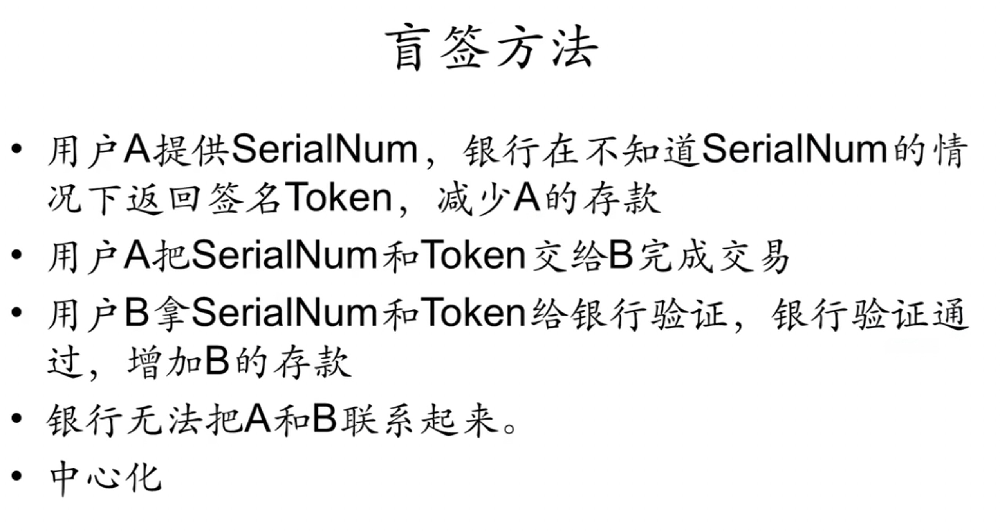
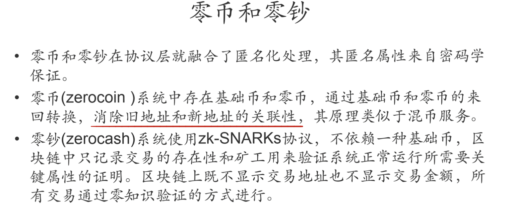

# 北大肖臻老师《区块链技术与应用》公开课学习 4
* 学习地址：[https://www.bilibili.com/video/BV1Vt411X7JF](https://www.bilibili.com/video/BV1Vt411X7JF)

## BTC 分叉

### state fork
如果两个节点差不多同时挖到一个区块，这两个区块都是挂在当前的区块上的，不同节点先收到的区块不同，就会各自沿着先收到的区块往下扩展，这种时候就会出现临时性的分叉，称为`state fork`，即由于对区块链当前的状态有意见分歧而产生的分叉。

分叉攻击（forking attack）也属于`state fork`，只不过这种意见分歧是人为造成的，这种情况也称为 `deliberate fork`。

### protocol fork
要修改比特币协议需要软件升级，在去中心化的系统中，没办法要求所有的结点都升级软件

假设大部分节点升级了软件，少部分节点没有升级（可能是没来得及升级，也可能是不同意协议的修改），这种分叉称为protocol fork，即对比特币协议产生了分歧，使用不同版本的协议而产生的分叉。

在 `protocol fork` 中，根据对协议修改的内容的不同，又可以分为硬分叉和软分叉。

#### 硬分叉
如果区块链软件的共识规则被改变，并且这种规则改变无法向前兼容，旧节点无法认可新节点产生的区块，即为硬分叉。

1. **比特币分叉**

一些人开始觉得比特币的区块容量太小，总出现拥堵，于是这些人要求对比特币的区块大小进行升级扩容。有人支持就有人反对，这种对比特币发展的分歧导致了比特币首次硬分叉，旧链上的币仍然是比特币 `BTC`(区块容量达到了8M)，新链上的币是 `BCH`（Bitcoin Cash，比特币现金。区块容量达到了8M）。

`BCH` 和 `BTC` 最大的区别只是在于区块容量的参数不同，两者分叉前的交易都是一样的，只是交易的币种不一样。可以理解为 `BCH` 那条链把分叉前的区块里的交易按照原来的方式重新运行了一遍，只是把币种由原来的 `BTC` 换成了 `BCH`。

2. **以太坊分叉**

`The DAO` 项目是区块链物联网公司 `Slock.it` 发起的一个众筹项目，于2016年5月正式发布，截止到当年6月，`The DAO` 项目募集资金超过 `1.6` 亿美元。没过多久，`The DAO` 项目就被黑客盯上了，因为智能合约上的巨大漏洞，导致 `The DAO` 项目被转移了市值五千万美元的以太币。

为了挽回众多投资者的资产并停止恐慌，以太坊创始人V神（Vitalik Buterin）最后提出硬分叉的设想，并最终通过社区的多数投票表决在以太坊第 `1920000` 区块完成了硬分叉，回滚了包括被黑客占有的所有以太币。即使以太坊硬分叉成了两条链，依然有部分信仰着区块链不可篡改特性的人留在以太经典这条原链上。

目前的以太坊 `ETH` 就是硬分叉之后的，原来的链是 `ETC`。分叉之初，由于两个链分叉造成了互相影响，产生了很多麻烦。比如：在 `ETH` 链上有一笔转账 `B->C`，有人便在 `ETC` 链上回放，将 `ETC` 链上的货币页转给了 `C`(C收到两笔钱)。后来，对两条链各添加了一个 `chainID`，将两个链区分开，才使得这两条链真正分开。

#### 软分叉
如果区块链的共识规则改变后，这种改变是向前兼容的，旧节点可以兼容新节点产生的区块，即为软分叉。

实际上，软分叉通常刚开始并不会产生两条区块链，因为新规则下产生的块会被旧节点接受，旧节点只是无法识别新规则的真实意义。所以新旧节点仍然处于同一条区块链上，对整个系统的影响也就较小。

1. **coinbase 域**

铸币交易中 `CoinBase` 域。在 `CoinBase` 域中写入任何内容都可以，挖矿本质是调整 `block header` 中的 `nonce` ，但其本身只有 `4` 个字节，搜索空间太小。所以实际使用中，将 `CoinBase` 域前 `8` 个自己作为另一个 `extra nonce`，此时搜索空间从原本`2^32` 增长到 `2^96`，对于目前挖矿难度来说已经足够。但 `CoinBase` 中并不是只有8个字节，还剩下很多空间。

`Coinbase` 交易的输入中有一个字段 `coinbase data` 内容可以任意定制。`BIP-34` 就是要求在 `coinbase data` 中必须包含块高度（Block Height）信息且将块版本（Block version）从 `1` 修改为 `2`。

显然在旧规则下，节点并不关心 `coinbase data` 是什么内容，完全可以兼容包含块高度信息的区块，所以不会就此产生分叉。

`BIP-34` 的升级过程如下：
* 刚开始矿工将块版本号变为`2`以表示准备好进行升级，此时并不要求 `coinbase data` 必须包含块高度信息。
* 当最近 `1000` 个区块中超过 `75%` 的版本号为 `2`时，整个系统开始强制要求版本号为 `2` 的区块 `coinbase data` 中必须包含块高度信息。但版本号为 `1` 的区块仍然被所有节点接受。
* 当最近 `1000` 个区块中超过 `95%` 的版本号为 `2` 时，版本号为 `1` 的区块开始被认为无效，节点会拒绝版本号为 `1` 的区块，于是会逼迫最后一小部分节点进行升级。（否则完成挖矿获得的奖励将失去价值）。

2. **P2SH：Pay to Script Hash**

`P2SH（Pay to Script Hash）` 形式的交易脚本，最开始的比特币系统中是没有的，是后来通过软分叉的方式加进去的。`P2SH` 会把 `redeem script` 的内容在第二阶段执行，这个过程旧节点认为是合法的，因为旧节点只会验证第一阶段。

软分叉提供了一种逐步升级比特币的方式，除了 `BIP-34`，还有 `BIP-65`、`BIP-66`、`BIP-9` 等特性进行了软分叉升级。

> soft fork: 只要系统中拥有半数以上算力节点更新软件，系统就不会产生永久性分叉。
> hard fork: 必须系统中所有节点更新软件，系统才不会产生永久性分叉。

## BTC 问答

1. 转账交易时候，如果接收者不在线(没有连在比特币网络上)怎么办？
> 转账交易只需要在区块链上记录，将某账户比特币转到另一账户，而接收方是否在线并无影响。
2. 假设某全节点收到某个转账交易，会不会有可能转账交易中收款人地址该全节点从未听过。
> 可能，因为比特币账户只需要本地产生即可。只有该账户第一次收到钱时，其他节点才能知道该节点的存在。
3. 如果账户私钥丢失怎么办？
> 没有办法。因为比特币是去中心化货币，没有第三方中心机构可以重置密码，所以账户上的钱也就变成了死钱。
> 通过加密货币交易所(中心化机构)，一般需要提供身份证明，如果忘记私钥可以找交易所申请追回私钥。但目前这类货币的交易所，尚且处于缺少监管的状态，并不一定具有可信力。而且，其本身仅起到“中介”作用，与该提问的回答“私钥丢失无法追回里面的比特币”并不冲突。
> 在历史上，有很多次交易所被黑客攻击偷走大量加密货币的事情，其中最著名的为 `Mt. GOX`（中文译为：门头沟）事件。该交易所曾经为全球最大比特币交易所，交易量占到全球比特币交易量的 `70%` 左右，设于日本。后来由于被攻击丢失大量比特币，导致交易所破产，其 `CEO` 被判刑入狱。
4. 私钥泄露怎么办？
> 尽快将剩余BTC转到其他安全账户上，没有第三方中心机构重置密码或冻结账户，只能自己对自己负责。BTC系统中账户便是公私钥对，密码就是私钥，无法更改。
5. 转账写错地址怎么办？
> 没有办法，只能自认倒霉，无法取消已经发布的交易。如果转入不存在地址，则该部分比特币便成为了死钱。当然，比特币系统中 `UTXO` 会永久保存该交易，记录该并不存在的地址。因此对全节点来说这是不友好的。
6. 之前在 `BTC` 脚本中介绍了 `OP_RETURN` 指令，我们提到，这种方法为普通用户提供了一个向比特币网络中写入想要一直保存的内容。但`OP_RETURN` 执行结果是无条件返回错误，而交易返回错误，区块又怎么会包含它？区块链又如何会接收这个区块？
> 实际上要想清楚，`OP_RETURN` 是写在哪里的。`OP_RETURN` 实际写在当前交易的输出脚本中，而验证交易合法性时，使用的当前交易的输入脚本和前一个交易(币来源的交易)的输出脚本进行验证。也就是说，验证当前交易合法性时，并不会执行该语句。只有在有人想花这笔钱时候，才会执行该语句。
7. BTC系统挖矿，会不会有矿工“偷”答案？例如：某个矿工发现其他矿工发布了nonce，收到后验证该区块合法，将该nonce作为自己找到的nonce发布出去。
> 实际上这是不可能的。发布的区块中包含铸币交易，其收款人地址为挖到矿的矿工地址，如果要偷答案，需要修改该收款地址，而地址改变，铸币交易内容也发生改变，从而引发 `Merkle Tree` 根哈希值改变。从而导致原本的 `nonce` 作废。
8. 交易费是交易者为了自己交易可以上链而给出的“小费”，那么如何得知哪个矿工可以挖到矿？
> 事先无需知道谁会挖到矿，交易中总输入和总输出差额就是交易费。哪个矿工挖到矿，在打包交易时，可以将这些交易费收集起来作为自己获得的交易费。

## BTC 匿名性
一般来说,匿名性多与隐私保护相关。但实际上，比特币中的匿名并非真正的匿名。实际上比特币与纸币相比，纸币的匿名性更好，因为其并没有对个人信息的标记。也正是因为其匿名性，很多非法交易采用现金交易。

实际上，比特币中的数据是完全公开的，而网上的交易是要与实体世界进行交易的，所以大大破坏了其匿名性。假如银行允许用假名(以前的存折时代)，由于银行数据并非公开，所以银行系统的匿名性是要比比特币更好的。

### BTC 什么情况会破坏其匿名性
1. 用户可以生成多个地址账户，但这些地址账户可以被关联起来

例如如下这个交易：

> 在图中可以看到该交易有 2 个输入和 2 个输出，所以 addr1 和 addr2 很可能是同一个人所持有的账户，因为该人同时拥有这两个私钥的地址。(一个账户中的钱可能不够)而在输出中，很有可能有一个地址是属于找零钱的地址，即花掉之后剩余的钱。在某些情况下，也是可以分析出来的。addr4 很明显是找零钱的地址，而非addr3(支付6个比特币，单个账户不够用，所以用两个账户)。
2. 地址账户与个人在真实社会中的身份也可能会产生关联

任何使得BTC和实体世界中关联的操作都有可能泄露用户真实身份，其中最明显的就是资金的转入转出。要得到 `BTC`，如果用钱买，就会与实体世界进行交互。想要将 `BTC` 转为现实中的货币，也同样需要与实体世界交互。

如何防范不法分子采用 `BTC` 进行洗钱呢？其实只需要盯住资金转入转出链即可。对于大额资金转入 `BTC` 或将大量 `BTC` 转为现实货币，很难逃避司法金融机构的监管。

3. BTC 支付
> 例如某些商家接受用 `BTC` 进行支付，例如可以用 `BTC` 购买咖啡、蛋糕等。(但是用 `BTC` 交易延迟高，交易费贵，并非一个好的`idea`)在进行支付时候，便和个人账户建立了联系，从而会泄露掉个人信息。

也就是说，`BTC` 并不是具有很好的匿名信。实际中很多人保持有较好的匿名性。保持最好的便是其开发者中本聪，其参与 `BTC` 时间最长，全世界都想知道他是谁。但实际上，中本聪的比特币并非有花出去，这也使得我们难以发现他具体是谁。

以前美国有一个 `skil road` 网站，主要用于匿名支付，采用各类可以躲避监管的方法(因为售卖的都是违禁品)。但运行没有几年就被查封，其老板当时赚取了许多比特币，但由于其担心被发现，这些钱实际中一个都不敢花，仍然过的是非常简朴的生活。最终据说由于在同一电脑上登录现实社会账户和非法网站上账户，从而被抓。

### 如何提高匿名性
> 从应用层看，可以将各个不同用户的 `BTC` 混合在一起，使得追查变得混乱(Coin mixing)
> 从网络层看，从节点上 ip 地址可以推算出真实身份，所以可以采用多路径转发的方法，数据不直接发送出去，而是经过很多跳(洋葱路由的基本思想)。

实际上正因为 `BTC` 的公开性和不可篡改性，才导致隐私性会有一定的问题。

### 零知识证明
零知识证明是指一方（证明者）项另一方（验证者）证明一个陈述是正确的，而无需透露该陈述是正确的外的任何信息。
> 例如证明某个比特币账户是我的（不能泄露私钥），那么就用私钥产生一个签名，大家用我的公钥来验证。但是因为告诉别人了公钥，所以有争议这种方式是不是零知识证明。

### 同态隐藏

> 例如：Alice 想要向 Bob 证明她知道一组数 x 和 y 使得 x + y = 7，同时不像让 Bob，知道 x 和 y 的具体数值

### 盲签方法
在前面的课程中说到，央行会维护一个中心化的数据库来记录每一笔钱是否花出去，来防止`双花`，那么你的每一笔交易央行都会知道。那么有没有一种办法既然央行做中心化的记账，又不让它知道交易的信息呢。

### 零币和零钞

不常用的原因：
1. btc 的匿名性已经够用了，大家不愿意为了匿名性而去用一种新的币。
2. 零币和零钞运用了密码学和数学的知识来增强匿名性，实现和使用起来比较复杂。
3. 当与现实交互的时候零币和零钞也无法保证100%匿名。

## BTC 思考

### 哈希指针

`BTC` 系统中很多地方使用到了哈希指针。指针保存的本地内存地址，只有在本地计算机上才具有意义，如果发送给其他计算机就没有意义了。那么在区块发布时候，哈希指针如何通过网络进行传播？
> 所谓哈希指针，只是系统中一种形象化的方法。实际应用时候，只有哈希而没有指针。回顾之前提过的Block header数据结构，有一个字段前一个区块的哈希值。
> 因此可见，在 `block header` 中只有 `hash` 值，没有指针。那么如何查找到前一个区块的内容？
全节点一般将区块存储于一个 `key-value` 数据库中，`key` 为哈希，`value` 为区块内容。常用的 `key-value` 数据库为 `levelDB`，只要掌握到最后一个区块的哈希值即可依据哈希值一直往前找到区块链所有内容。有些节点只保存区块链部分信息，如果需要用到前面的区块，可以问其他节点要。哈希指针性质保证了整个区块链内容是不可篡改的。

### 区块『恋』

有情侣一起买 `BTC`，将私钥从中截断，每人保留其中一部分。如果未来两人依旧感情很好，就可以将钱取出；如果分手，这部分钱就会永久锁死，谁也无法取出，通过区块链的不可篡改性作为两人的爱情见证。这样做有什么问题？
如此下来，N 个人怎么办？
如果按照这种方法，将私钥分为 N 份。但这样会有一系列问题。
1. 如果N个人中任意一个人忘记私钥，则无法将钱取出。
2. 截断私钥长度，会降低安全性，因为私钥长度会直接影响破解难度(2^256远远大于2^128)，之间难度差距远远不止一倍。(可见，对于多个人账户，应该使用多重签名，而非截断私钥的方法。)
3. 如果分手，该钱变成死钱，一直保存在UTXO集合中，对矿工不友好。

### 分布式共识

之前有提及，理论上来说，分布式系统不可能达成共识。但实际中为何变成可能了？严格来说，BTC系统的共识随时可能被推翻，例如分叉攻击导致系统回滚。此外，理论和实际存在差异。不可能结论针对特定模型，实际中对模型稍微修改或添加线下方法即可将不可能变为可能。

**知识改变命运，这句话本身没有错，但是对知识的一知半解可能让你的命运变得更差，搞科研是很有意义的，但是不要给学术界的思维限制头脑，不要为程序员的思维限制想象力。**

### BTC 稀缺性

为什么要挖矿？因为有收益，且收益大于开销。早期 `BTC` 难度低且出块奖励高，从而吸引矿工。
之前有提到，`BTC` 总量固定，有人认为其是一个精妙的设计。但实际上，总量固定的东西并不适合作为货币，这也就决定了 `BTC` 并不能在未来完全颠覆现有货币体系。以太坊中便没有 `BTC` 中出块奖励定期减半的做法，此外，某些新型货币会自带通货膨胀的功能。
对个人来说，通货膨胀并非好事，因为钱不值钱了。但人类每年创造的价值，如果用总量固定的东西作为货币，则其只会越来越值钱，而这会导致拥有者不断看着其升值，其他没有的人无论如何奋斗都赶不上（房价也是如此，炒房使一部分人靠房租便可大赚特赚，个人奋斗却很难买房。这也是我国目前存在的较大的问题，社会财富的分配不公，最终引发各种社会矛盾）。

### 量子计算

会不会 `BTC` 这种建立在密码学上的加密货币，在量子计算出来后会不会变得不安全。
1. 量子计算距离使用仍然有很长距离。
2. 量子计算若真正使用到破坏现有加密算法，对传统金融业的破坏才是最大的，网上银行网上转账都不安全了。
3. `BTC` 实际中使用的并非公钥，而是用公钥哈希。而哈希函数一般都是不可逆的，就算量子计算可以从公钥推出私钥，但是即使知道了公钥哈希量子计算也无法反推公钥。加密和哈希不是一回事，加密过程要保证信息不丢失去，但是取哈希会丢失一些信息。`BTC` 中用的 `SHA-256`，无论输入多大，最终结果都为 `256` 位，必然会导致信息丢失，无法反推原本数据。如果能反推数据，那么这将成为前所未有的压缩算法（把整个图书馆的数据作为输入压缩为 256 位，再从 256 位反推出图书馆信息这是不可能的）。