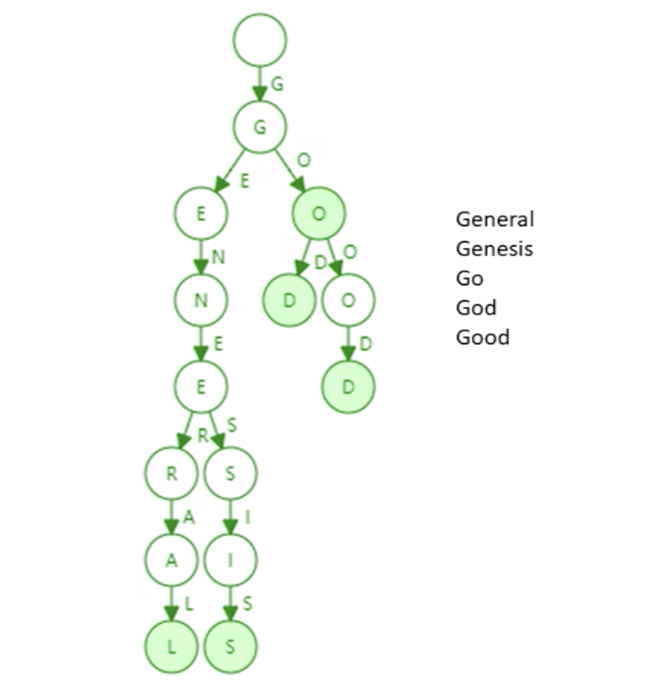
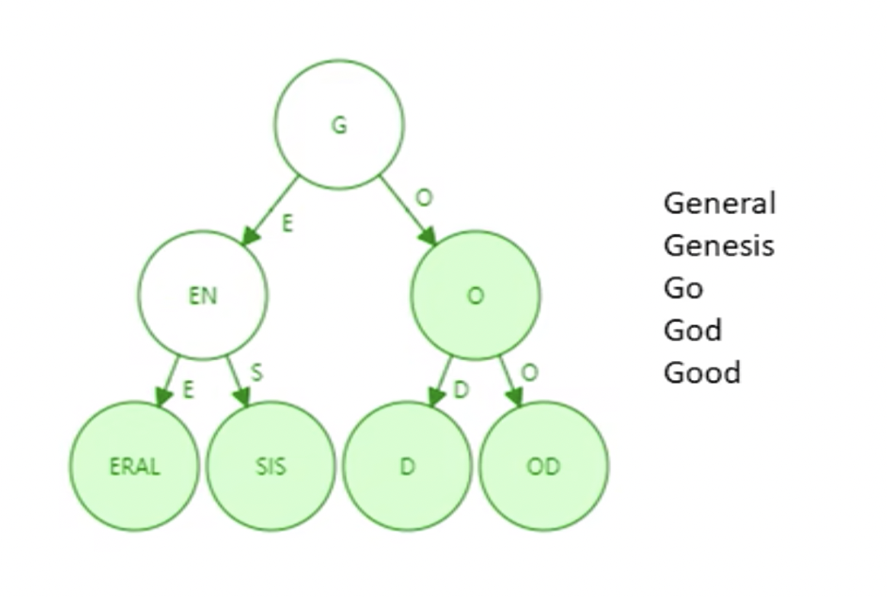
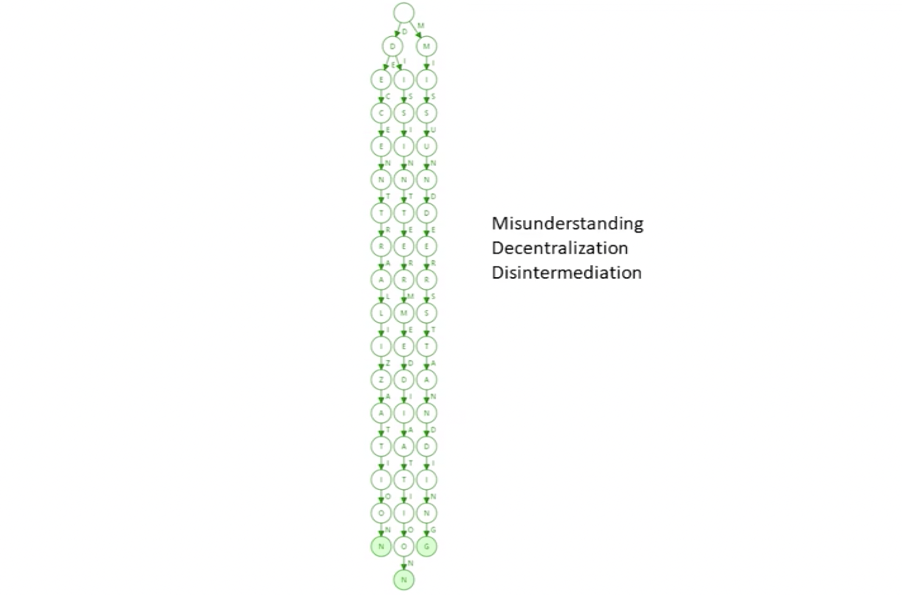
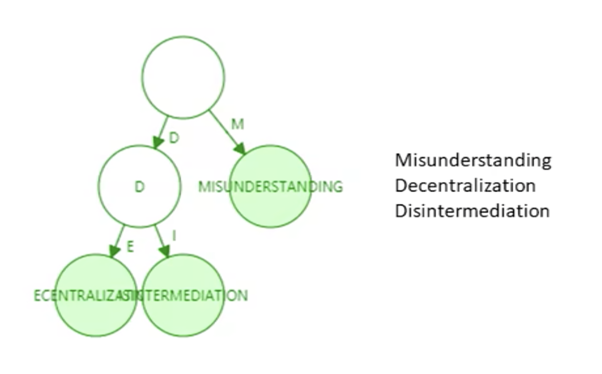
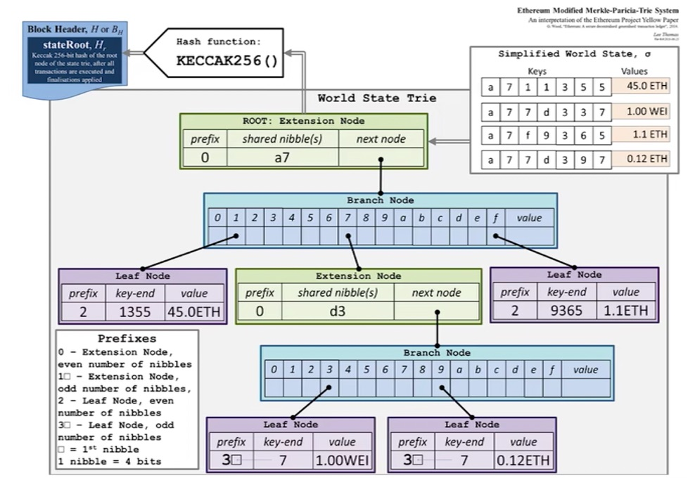
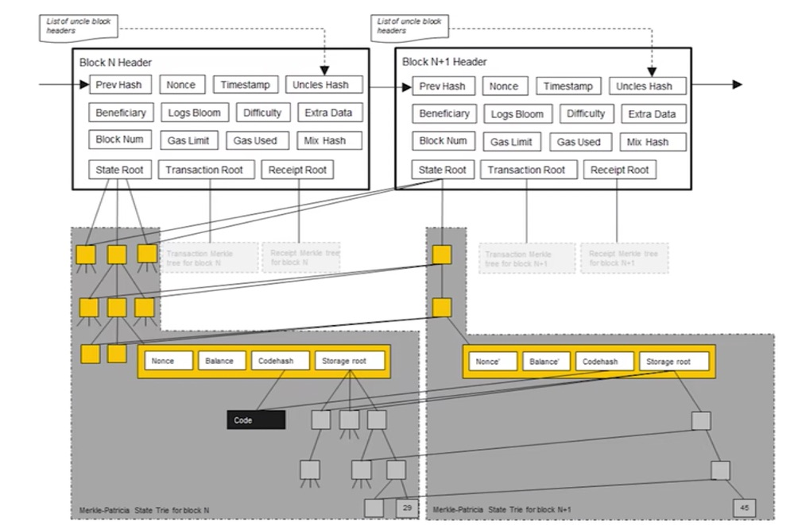
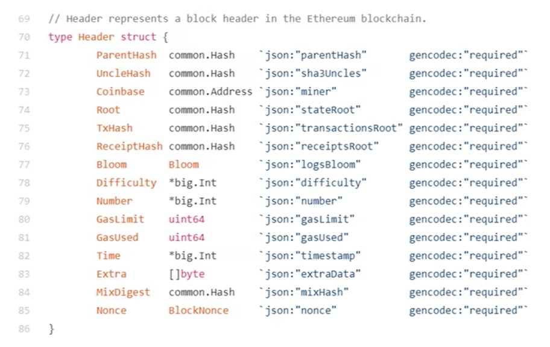
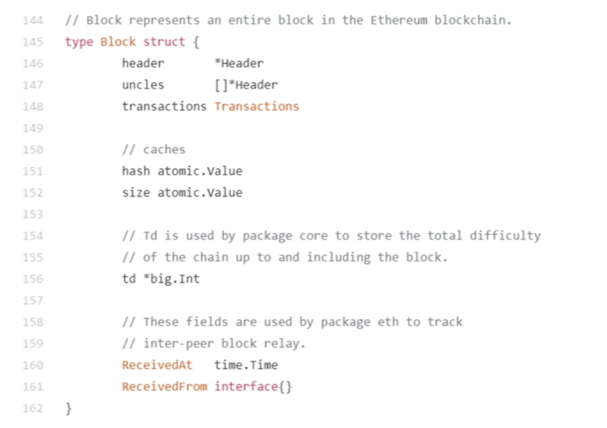

# 北大肖臻老师《区块链技术与应用》公开课学习 5
* 学习地址：[https://www.bilibili.com/video/BV1Vt411X7JF](https://www.bilibili.com/video/BV1Vt411X7JF)
* 参考文章：[北京大学肖臻老师《区块链技术与应用》公开课笔记15——ETH概述篇](https://blog.nowcoder.net/n/f6a89f59329542eb9216caa8ca2c843d)

## ETH 概述
`BTC` 和 `ETH` 为最主要的两种加密货币，`BTC` 称为区块链 `1.0`，以太坊称为区块链 `2.0`。因为了比特币设计中存在某些不足，以太坊便对其进行了改进。例如：
* 出块时间: 以太坊出块时间降低到十几秒，以及设计了一套共识协议
* `mining puzzle`: `BTC` 挖矿属于计算密集型，挖矿设备专业化（ASIC），以太坊设计的 `mining puzzle` 对内存要求高，限制了 `ASIC` 的使用（ASIC resistance）
* 未来，以太坊还将会用权益证明(proof of stake)替代工作量证明(proof of work)
* 此外，以太坊增加了对智能合约（smart contract）的支持。

### 为什么智能合约
`BTC` 本身是一个去中心化的货币，在比特币取得成功之后，很多人就开始思考：除了货币可以去中心化，还有什么可以去中心化？以太坊的一个特性就是增加了对去中心化的合约的支持。
* BitCoin: decenralized currency, BTC, 最小单位一聪
* Ethereum: decenralized contract, ETH, 最小单位一`wei`

货币本身由政府发行，政府公信力为其背书，`BTC` 通过技术手段取代了政府的职能。
现实生活中，我们经常提到 `契约` 或 `合约`。合约的有效性也是需要政府进行维护的，如果产生纠纷需要针对合法性合同进行判决（打官司）。`ETH` 的设计目的就是，通过技术手段来实现取代政府对于合约的职能（区块链的不可篡改性）。并不是所有的合同都可以实现，比较简单的可以使用智能合约。

智能合约有什么好处？
> 去中心化的货币的好处是跨国转账，比法币快很多。
> 智能合约: 若合同签署方并非一个国家，没有统一的司法部门。如果可以编写无法修改的合约，所有人只能按照相关参与方执行，无法违约。

## ETH 账户
`BTC` 系统是基于交易的账本，系统中并未显示记录账户有多少钱，只能通过 `UTXO` 进行推算。这种隐私保护比较好，但是使用起来比较别扭。比如 `A` 转给 `B` 比特币的时候，`A` 需要说明币的来源。但是我们实际中存钱说明来源，花钱则不用。此外，`BTC` 账户中的钱在花的时候，必须一次性全部花出去。

> A => B(10BTC)   B => C(3BTC)
> 如果 B 只转给 C 3个 BTC，那么剩下的 7个 BTC 将作为交易费给矿工，所以还要将剩下的钱转给自己：B => B'(7 BTC)
> 比特币系统中没有显式的基于账户的模型
> 而以太坊系统则采用了基于账户的模型，与现实中银行账户相似。

优点：转账是否合法只需要查看转账者账户中以太币是否足够即可，同时也不需要每次全部转账，这也天然地防范了双花攻击。（你要是花两次我就从你账户扣两次钱）
缺点：重放攻击：`A` 向 `B` 转账，过一段时间，`B` 将 `A` 的交易重新发布，从而导致 `A`账户被扣钱两次。

> 为了防范重放攻击，给账户交易添加计数器记录该账户交易过多少次，转账时候将转账次数计入交易的内容中。
> 系统中全节点维护账户余额和该计数器的交易数，从而防止本地篡改余额或进行重放攻击。
> 交易内容：A => B(10ETH)、nonce = 21(这是第21次交易)、Signed by A
> 如果重放上述交易内容，会发现 nonce = 21 的交易已经被发布了，就不会执行了。

以太坊系统中存在两类账户：外部账户和合约账户。

* 外部账户：类似于 `BTC` 系统中公私钥对。存在账户余额 `balance` 和计数器 `nonce`
* 合约账户：并非通过公私钥对控制。合约账户不能主动发起交易，只能接收到外部账户调用后才能发起交易或调用其他合约账户。其除了`balance` 和 `nonce` 之外还有 `code` (代码)、`storage` (相关状态-存储)

创建合约时候会返回一个地址，就可以对其调用。调用过程中，代码不变但状态会发生改变。

### 为什么以太坊要基于账户的模型
比特币隐私保护比较好，支持每次交易都更换账户。但以太坊是为了支持智能合约，而合约签订双方是比较稳定的身份且较少变化的。尤其是对于合约账户来说，需要保持稳定状态。

## ETH 状态树

首先，我们要实现从账户地址到账户状态的映射。在以太坊中，账户地址为 `160字节` ，表示为 `40个16进制`。状态包含了余额(balance)、交易次数(nonce)，合约账户中还包含了代码(code)、存储(stroge)。

直观地来看，其本质上为 `key-value` 键值对，所以直观想法便用哈希表实现。若不考虑哈希碰撞，查询直接为常数级别的查询效率。但采用哈希表，难以提供 `Merkle proof`

1. 我们能否像 `BTC`，将哈希表的内容组织为 `Merkle Tree` ？
> 当新区块发布，哈希表内容会改变，再次将其组织为新的 `Merkle Tree`。如果这样，每当产生新区块(`ETH` 中新区块产生时间为`10s`左右)，都要重新组织 `Merkle Tree`，很明显这是不现实的。
> 需要注意的是，比特币系统中没有账户概念，交易由区块管理，而区块包含上限为 `4000` 个交易左右，所以 `Merkle Tree` 不是无限增大的。而 `ETH` 中，`Merkle Tree` 来组织账户信息，很明显其会越来越庞大。
> 实际中，发生变化的仅仅为很少一部分数据，我们每次重新构建 Merkle Tree 代价很大
2. 那我们不要哈希表了，直接使用 `Merkle Tree` 把所有的账户都放进去，每次修改只需要修改其中一部分即可，这个可以吗？
> 实际中，`Merkle Tree` 并未提供一个高效的查找和更新的方案。此外，将所有账户构建为一个大的 `Merkle Tree`，为了保证所有节点的一致性和查找速度，必须进行排序。
3. 不排序有什么问题?
> `Merkle Tree` 的叶子节点是账户信息，如果不排序，系统中有很多全节点会按照自己的排序方式进行构造账户信息，导致 `Merkle Tree` 均不相同，根哈希值也不同。
4. 比特币的 `Merkle Tree` 不也没排序吗？
> 比特币每个全节点收到的交易顺序也是不一致的，`Merkle Tree` 根哈希值也不一样。但是比特币是每个节点在本地组装一个候选区块，它自己决定收集哪些交易，然后去挖矿争夺记账权，只有挖到矿的人才能决定发布区块，这个顺序是唯一的。
5. 那么经过排序，使用 `Sorted Merkle Tree` 可以吗？
> 新增账户，由于其地址随机，插入 `Merkle Tree` 时候很大可能在 `Tree` 中间，必须进行重构。所以 `Sorted Merkle Tree` 插入、删除的代价太大。

### MPT
以太坊采取的数据结构：`MPT`，首先介绍一下 `trie` 前缀树（字典树）


1. `trie` 中每个节点的分支数目取决于每个元素的取值范围(图例中最多`26`个英文字母分叉+ `1`个结束标志位)。以太坊中是16进制表示（0 ~ f）加上一个结束标识符为 `17` 个分叉。
2. `trie` 查找效率取决于 `key` 的长度。实际应用中（以太坊地址长度为160字节）。
3. `trie` 上面不会发生哈希碰撞，两个账户的地址不一样，映射到 `trie` 一定是不同的分支。
4. 给定输入，无论如何顺序插入，构造的 `trie` 都是一样的。
5. 更新的局部性比较好：每次发布一个区块，系统中绝大多数账户的状态是不变的，只有个别才会变，所以更新操作的局部性很重要。`trie` 上只需要遍历某一个分支，并不需要遍历整棵树。
6. 缺点：存储上会有浪费，很多节点只有一个子节点。因此引入了 `Patricia tree/trie`（经过路径压缩后的前缀树）。



需要注意的是，如果新插入单词，原本压缩的路径可能需要扩展开来。什么情况下路径压缩效果较好？树中插入的键值分布较为稀疏的情况下，路径压缩效果较好。看以下例子：





在以太坊系统中，`160` 位的地址存在 `2^160` 种，以太坊全世界的账户数加一起也远不足这个数，为什么地址搞的这么稀疏呢？

> 就是因为地址分布稀疏，所以路径压缩效果较好。
> 以太坊创建账户在本地创建即可，类似于比特币，那么会不会两个创建的账户地址一样呢？有可能，但是比地球爆炸的可能性还要低，就是因为地址足够长，足够稀疏。
> 实际上，在以太坊种使用的并非简单的 `Patricia tree`，而是 `MPT(Merkle Patricia tree)`

`MPT` 就是将所有账户组织为一个经过路径压缩和排序的 `Merkle Tree` (指针为哈希指针)，其根哈希值存储于 `block header` 中。根哈希值的用处：
1. 防止篡改。
2. 提供 `Merkle proof` ，可以证明账户余额，轻节点可以进行验证。
3. 给一个账户转账之前，证明某个发生了交易的账户是否存在。

以太坊中针对 `MPT` 进行了修改，我们称其为 `Modified MPT`。



* shared nibble(s)：十六进制
* extension node：扩展节点，经过路径压缩的节点
* leaf node：叶子节点
* branch node：分支节点

每次发布新区块，状态树中部分节点状态会改变。但改变并非在原地修改，而是新建一些分支，保留原本状态。如下图中，仅仅有新发生改变的节点才需要修改，其他未修改节点直接指向前一个区块中的对应节点。



所以，系统中全节点并非维护一棵MPT，而是每次发布新区块都要新建MPT。只不过大部分节点共享。

> 为什么要保存原本状态？为何不直接修改？
> 为了便于回滚。如产生分叉后上面节点胜出，那么下面节点中状态的修改便需要进行回滚。因此，需要维护这些历史记录。

**block header 中的数据结构**



* Parenthash: 父区块的哈希（前一个区块的哈希）
* Unclehash: 叔父区块的哈希
* Coinbase: 矿工地址
* Root: 状态树的根哈希值
* Txhash: 交易树的根哈希值
* Receipthash: 收据树的根哈希值
* Difficulty: 挖矿难度
* GasLimit: 汽油费（类似于比特币中的交易费）相关
* GasUsed: 汽油费（类似于比特币中的交易费）相关
* Time: 区块产生时间
* Mixdigest: 挖矿过程随机数算出来的哈希值
* Nonce: 挖矿时随机数

**区块结构**



* header: 指向 block header 的指针
* uncles: 指向叔父区块的指针
* transactions: 交易列表

**区块在网上真正发布时的信息**

```
type extblock struct {
    Header *Header
    Txs    []*Transactions
    uncles []*Header
}
```

> 状态树中保存 `Key-value` 对，`key` 就是地址，而 `value` 状态通过 `RLP(Recursive Length Prefix，一种进行序列化的方法)` 编码序列号之后再进行存储。