# 北大肖臻老师《区块链技术与应用》公开课学习 6
* 学习地址：[https://www.bilibili.com/video/BV1Vt411X7JF](https://www.bilibili.com/video/BV1Vt411X7JF)
* 参考文章：[北京大学肖臻老师《区块链技术与应用》公开课笔记20——ETH中GHOST协议篇](https://blog.nowcoder.net/n/6d1f8b54058347d4a217b961e5b965f1)

## Ghost 协议
`BTC` 系统中出块时间为 `10min`，而以太坊中出块时间被降低到 `15s`左右，虽然有效提高了系统反应时间和吞吐率，却也导致系统临时性分叉变成常态，且分叉数目更多。这对于共识协议来说，就存在很大挑战。在 `BTC` 系统中，不在最长合法链上的节点最后都是作废的，但如果在以太坊系统中，如果这样处理，由于系统中经常性会出现分叉，则矿工挖到矿很大可能会被废弃，这会大大降低矿工挖矿积极性。而对于个人矿工来说，和大型矿池相比更是存在天然劣势。
对此，以太坊设计了新的共识协议—— `GHOST协议` (该协议并非原创，而是对原本就有的Ghost协议进行了改进)。

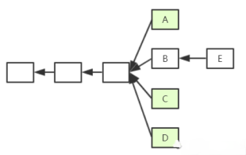

> 如图，假定以太坊系统存在以下情况，`A、B、C、D` 在四个分支上，最后，随着时间推移 `B` 所在链成为最长合法链，因此 `A、C、D` 区块都作废，但为了补偿这些区块所属矿工所作的工作，给这些区块一些 `补偿`，并称其为 `Uncle Block`（叔父区块）。
> 规定 `E` 区块在发布时可以将 `A、C、D` 叔父区块包含进来，`A、C、D` 叔父区块可以得到出块奖励的 `7/8`，而为了激励 `E` 包含叔父区块，规定 `E` 每包含一个叔父区块可以额外得到 `1/32` 的出块奖励。为了防止 `E` 大量包含叔父区块，规定一个区块只能最多包含 `2` 个叔父区块，因此 `E` 在 `A、C、D` 中最多只能包含 `2` 个区块作为自己的出块奖励。
> `E` 把 `A` 作为叔父区块的前提是：在挖 `E` 这个区块的时候就知道 `A` 的存在了，把 `A` 写在自己的块头里修改后继续挖，因为挖矿是无记忆性的所以这并不影响什么。

问题：
1. 因为叔父区块最多只能包含 2 个，如果出现 3 个怎么办？
2. 矿工自私，故意不包含叔父区块，导致叔父区块 7/8 出块奖励没了，而自己仅仅损失 1/32。如果甲、乙两个大型矿池存在竞争关系，那么他们可以采用故意不包含对方的叔父区块，因为这样对自己损失小而对对方损失大。

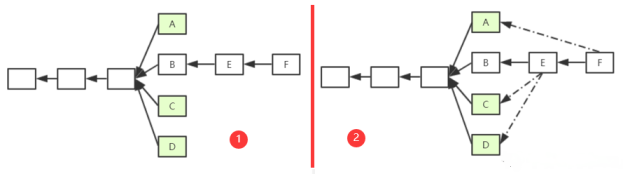

> 如图1为对上面例子的补充，`F` 为 `E` 后面一个新的区块。因为规定 `E` 最多只能包含 `2` 个叔父区块，所以假定 `E` 包含了 `C` 和 `D`。此时，`F` 也可以将 `A` 认为自己的的叔父区块(实际上并非叔父辈的，而是爷爷辈的)。如果继续往下挖，`F` 后的新区块仍然可以包含 `B` 同辈的区块。这样，就有效地解决了上面的问题。
> 就算自己挖的区块成为了叔父区块，自己也可以在最长合法链上挖，然后把自己包含进去。

问题：`叔父` 最多可以隔多少代？

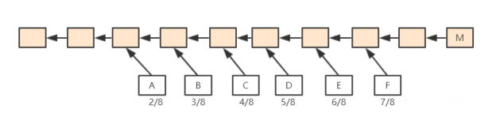

> 以太坊中规定，如果 `M` 包含 `F` 区块，则 `F` 获得 `7/8` 出块奖励；如果 `M` 包含 `E` 区块，则 `F` 获得 `6/8` 出块奖励，以此类推向前。直到包含 `A` 区块，A获得 `2/8` 出块奖励，再往前的叔父区块，对于 `M` 来说就不再认可其为 `M` 的叔父了(合法的叔父只有 6 辈)。对于 `M` 来说，无论包含哪个辈分的叔父，得到的出块奖励都是 `1/32` 出块奖励。
> 这样，就方便了全节点进行记录（有效叔父区块不会无限增加），此外，也从协议上鼓励一旦出现分叉马上进行合并。

以上这些都是为了解决临时性分叉的问题，那么为什么比特币和以太坊要设计最长合法链呢，是为了防止数据被篡改。

* BTC 奖励：block reward（静态奖励）+ tx fee（动态奖励）
* ETH 奖励：block reward（静态奖励）+ gas fee（动态奖励，叔父区块是得不到的）
* BTC 中为了人为制造稀缺性，比特币每隔一段时间出块奖励会降低，最终当出块奖励趋于 0 后会主要依赖于交易费运作。而以太坊中并没有人为规定每隔一段时间降低出块奖励。

> 如果区块里包含智能合约，执行智能合约的时候会获得汽油费。但是所占的比例很小，跟比特币类似交易费占比很小。

把叔父区块包含进来的时候，叔父区块里的交易要不要执行？

> 不应该，叔父区块和同辈的主链上区块有可能包含有冲突的交易。执行完父区块的交易再去执行叔父区块的交易可能就变成非法的了。因此，一个节点在收到一个叔父区块的时候，只检查区块合法性而不检查其中交易的合法性。

分叉后的区块后面还跟着其他区块怎么处理？
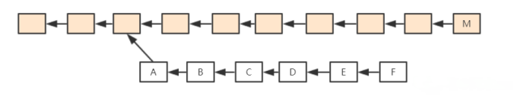

> `A->F` 该链并非一个最长合法链，所以 `B->F` 这些区块怎么办？可不可以规定将下面整条链作为一个整体，给予出块奖励？
> 不行，这一定程度上鼓励了分叉攻击(如果 A 转给 B 一大笔钱，B 等了很多区块后觉得没什么问题了，此时 A 发动分叉攻击将钱转给 A'，这需要挖出更多的区块代价是很大的，但是，后面的区块都给奖励，这就降低了分叉攻击的成本，因为即使攻击失败也有奖励)。因此，`ETH` 系统中规定，只认可 `A` 区块为叔父区块，给予其补偿，而其后的区块全部作废。

### 具体例子
[https://etherscan.io/](https://etherscan.io/)

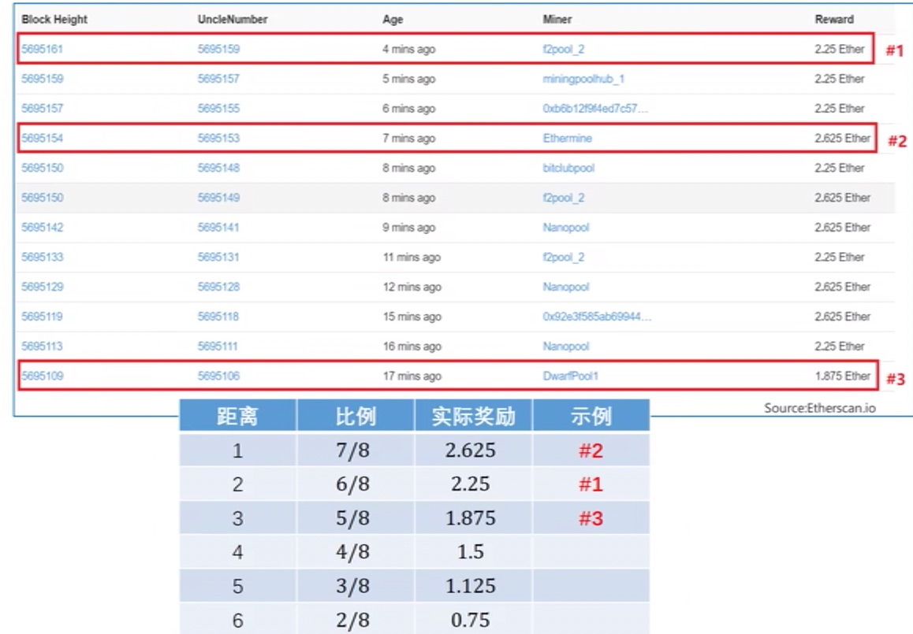

* Block Height 为当前区块的序号，UncleNumber 为叔父区块的序号
* 如果相差为 1，说明是刚刚相差一辈，获得 `7/8` 的奖励，以此类推

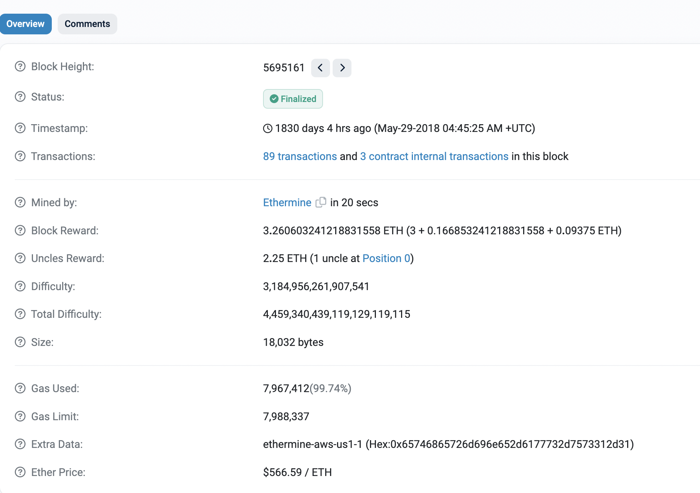

* Block Reward: 出块奖励 + 汽油费 + 包含叔父区块奖励（1个, 0.09375 = 3 * 1 / 32）
* Uncles Reward: 叔父区块获得的奖励，通过计算可知隔两代，2.25 = 3 * 6 / 8

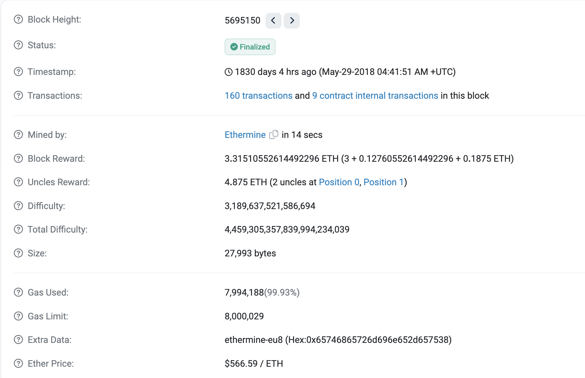

* Block Reward: 出块奖励 + 汽油费 + 包含叔父区块奖励（2个, 0.1875 = 3 * 2 * 1 / 32）
* Uncles Reward: 叔父区块获得的奖励，通过计算可知分别隔两代和隔一代，4.875 = 2.25 (3 * 6 / 8) + 2.625 (3 * 7 / 8)

## ETH 挖矿算法

**Block chain is secured by mining.**
比特币是天然的 `bug bounty`，只要你能找到挖矿的 bug，就能获得赏金。然而比特币的缺点在于专业矿机的出现，不是很符合去中心化的概念。中本聪写到 `one cpu, one vote`，希望每个人都能参与进去。所以后来的加密货币在设计挖矿算法的时候，希望 `ASIC resistance`，怎么解决呢？

* memory hard mining puzzle: 增加对内存的访问, 因为 `ASIC` 主要是算力强，但是内存访问能力弱。一个例子就是 `LiteCoin`，它是基于 `scrypt` 对于内存要求较高，在内存中创建了一个比较大的数组进行运算。

好的 `puzzle` 的准则是 `diffculty to solve, but easy to verify`，但是上述算法在验证的时候也需要同样大小的数组，对于轻节点不友好，如果是手机上的 `APP` 则很难实现，所以实际上莱特币设计的数组大小为 `128K`。但是这种理念对于莱特币的 **冷启动** 很有意义。

ETH 中设计了两个数据集：`16M cache` 和 `1G dataset` (`DAG`)。

> 16M cache 生成方式：通过 Seed (种子数)进行一些运算获得第一个数，之后每个数字都是通过前一个位置的值取哈希获得的。
> 1G DAG 生成方式：从小数组中按照伪随机顺序读取一些元素，如第一次读取 A 位置数据，对当前哈希值更新迭代算出下一次读取位置 B，再进行哈希值更新迭代计算出 C 位置元素。如此来回迭代读取 256 次，最终算出一个数作为 DAG 中第一个元素。
> 考虑到计算机内存不断增大，因此该两个数组需要定期增大。
> 轻节点只保存小的 cache，验证时进行计算即可。但对于挖矿来说，如果这样则大部分算力都花费在了通过 Cache 计算 DAG 上面，因此，其必须保存大的数组 DAG 以便于更快挖矿。

以太坊挖矿过程：
> 根据区块 `block header` 和其中的 `Nonce` 值计算一个初始哈希，在 `DAG` 上根据其映射到某个初始位置 `A1`，读取 `A1` 位置的数及其相邻的后一个位置 `A2` 上的数，根据该两个数进行运算，算得下一个位置 `B1`，读取 `B1` 和 `B2` 位置上的数，依次类推，迭代读取 `64` 次，共读取 `128` 个数。最后，计算出一个哈希值与挖矿难度目标阈值比较，若不符合就更换 `Nonce`，重复以上操作直到最终计算哈希值符合难度要求。

每隔 30000 个块会重新生成 seed （对原来的 seed 求哈希），并且利用新的 seed 生成新的 cache，cache 的初始大小为 16M，每隔 30000 个块重新生成时增大初始大小的 1/128 - 128K，通过 seed 计算 cache 的伪代码：

```python
def mkcache(cache_size, seed):
  o = [hash(seed)]
  for i in range (1, cache_size):
    o.append(hash(o[-1]))
  return o;
```

DAG 初始大小是 1G，也是每隔 30000 个块更新，同时增大初始大小的 1/128 - 8M，通过 cache 来生成 dataset 中第 i 个元素的伪代码

```python
def calc_dataset_item(cache, i):
  cache_size = cache.size
  # 通过 cache 中第 i 个元素生成 mix
  mix = hash(cache[i % cache_size] ^ i)
  # 循环 256 次
  for j in range(256):
    # 每次通过 get_int_from_item 根据当前的 mix 求得下一个 cache 元素的下标
    cache_index = get_int_from_item(mix)
    mix = make_item(mix, cache[cache_index % cache_size])
   # 最终返回 mix 的哈希值，得到第 i 个 dataset 中的元素
   return hash(mix)
```

挖矿过程与轻节点验证过程，先通过 header 和 nonce 求出一个初始的 mix，然后进行 64 次循环，根据 mix 求出要访问的 dataset 的元素下标，然后根据这个下标访问 dataset 中两个连续的值。

```python
def hashimoto_full(header, nonce, full_size, dataset):
  mix = hash(header, nonce)
  for i in range(64):
    dataset_index = get_int_from_item(mix) % full_size
    mix = make_item(mix, dataset[dataset_index])
    mix = make_item(mix, dataset[dataset_index + 1])
  return hash(mix)

# 轻节点是临时计算出用到的 dataset 元素，而矿工是直接访存
def hashimoto_light(header, nonce, full_size, dataset):
  mix = hash(header, nonce)
  for i in range(64):
    dataset_index = get_int_from_item(mix) % full_size
    mix = make_item(mix, calc_dataset_item[cache, dataset_index])
    mix = make_item(mix, calc_dataset_item[cache, dataset_index + 1])
  return hash(mix)
```

挖矿伪代码，随机初始化 nonce，再一个个重试 nonce

```python
def mine(full_size, dataset, header, target):
  nonce = random.randint(0, 2**64)
  while hashimoto_full(header, nonce, full_size, dataset) > target:
    nonce = (nonce + 1) % 2**64
  return nonce
```

> 目前以太坊挖矿以 GPU 为主，可见其设计较为成功，这与以太坊设计的挖矿算法 (Ethash) 所需要的大内存具有很大关系。
> 1G的大数组与128k相比，差距8000多倍，即使是16MB与128K相比，也大了一百多倍，可见对内存需求的差距很大，况且两个数组大小是会不断增长的。
>
> 当然，以太坊实现 `ASIC Resistance` 除了挖矿算法设计之外，还存在另外一个原因，即其预期从**工作量证明(proof of work)**转向**权益证明(proof of stake)**
>
> 而这对于 ASIC 厂商来说有威胁。因为 ASIC 芯片研发周期很长，成本很高，如果以太坊转入权益证明，这些投入的研发费用将全部白费，但截至目前，以太坊仍然基于 POW 共识机制。

### 预挖矿(pre mining)
以太坊中采用的预挖矿的机制。这里 **预挖矿** 并不挖矿，而是在开发以太坊时，给开发者预留了一部分货币，其实这部分预留了很多(在 Genesis 创世纪块)。
和 `Pre-Mining` 对应，还有 `Pre-Sale`，`Pre-Sale` 指的是将预留的货币出售掉用于后续开发工作（众筹）

> 挖矿算法设计一直趋向于让大众参与，这才是公平的。但也有人认为让普通计算机参与挖矿是不安全的，像比特币那样，让中心化矿池参与挖矿才是安全的。为什么呢？
> 因为要攻击系统，需要购入大量矿机通过算力进行 51% 攻击，而且这种矿机不能用于其他币种。而且攻击成功后，证明安全性不够必然导致该币的价值跳水，攻击者投入的硬件成本将会全部打水漂。相反让通用计算机也参与挖矿，发动攻击成本便大幅度降低，目前的大型互联网公司，将其服务器聚集起来进行攻击即可，而攻击完成后这些服务器仍然可以转而运行日常业务。因此有人认为在挖矿上面，`ASIC` 矿机一统天下才是最安全的方式。

## 以太坊挖矿难度调整

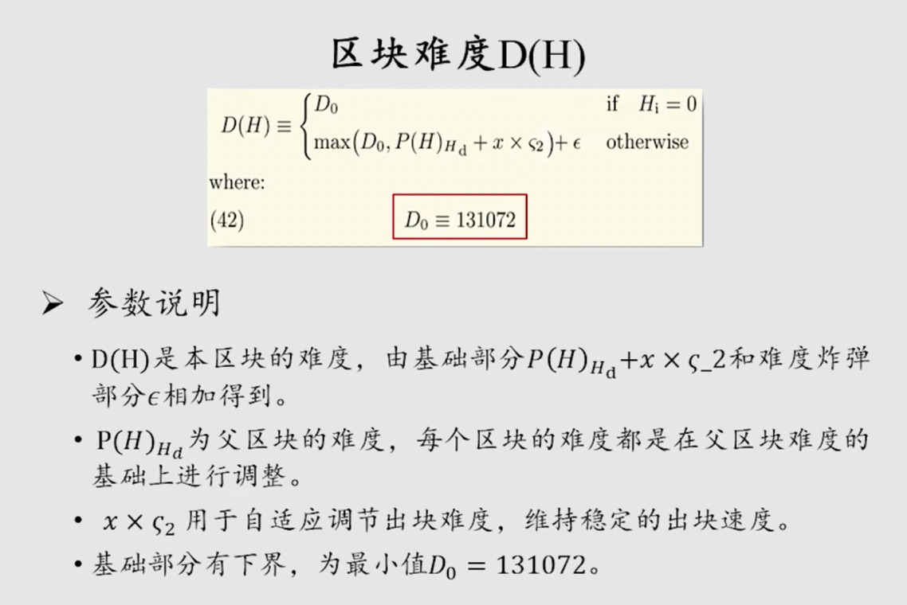

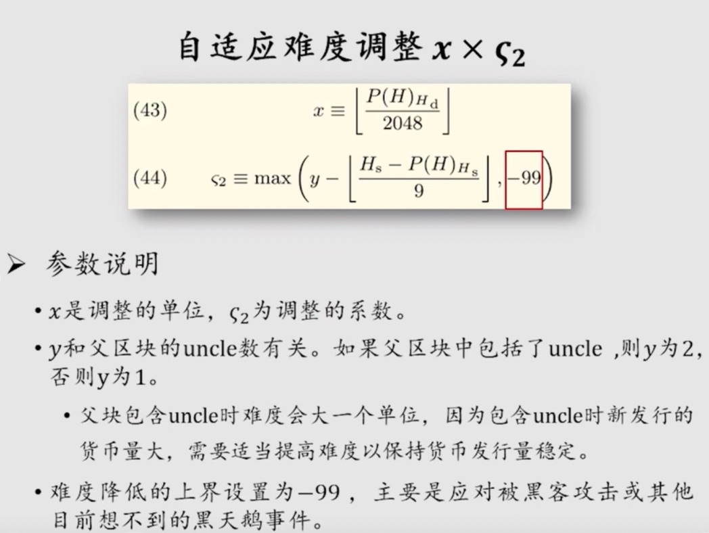

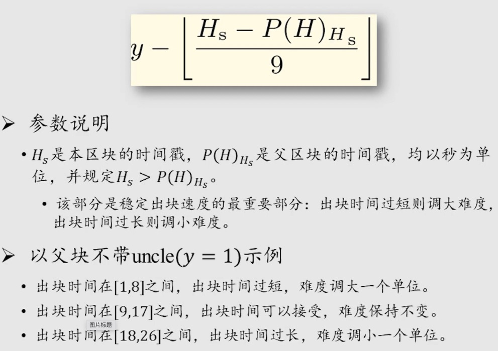

### 难度炸弹
以太坊在设计之初就计划要逐步从 `POW`（工作量证明）转向 `POS`（权益证明），而权益证明不需要挖矿。从旁观者角度来看，挖矿消耗了大量电力、资金等，如果转入放弃挖矿必然是一件好事。但从矿工的角度，花费了很大精力投入成本购买设备，突然被告知不挖矿了，这必然是一件很难接受的事情。因此，以太坊在设计之初便添加了难度炸弹，迫使矿工转入 `POS`。

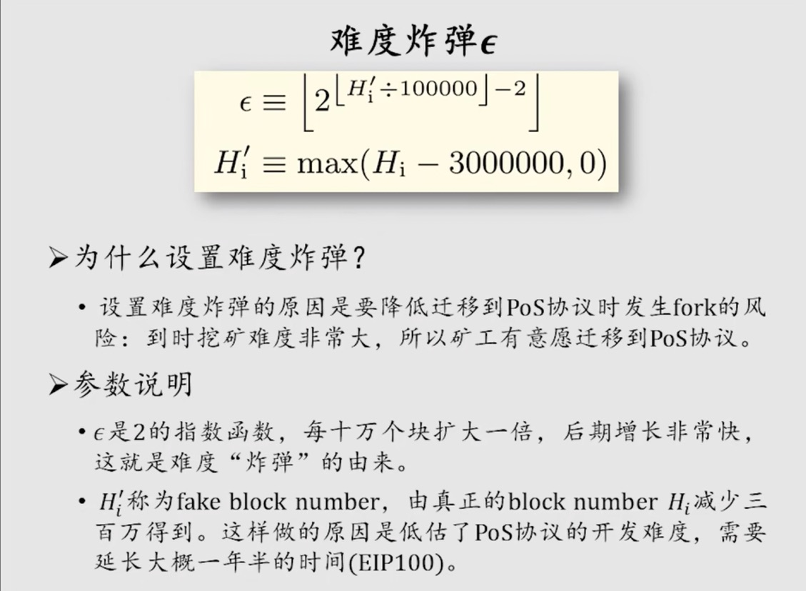

> 难度炸弹属于指数级别，在以太坊早期时，区块号较小难度炸弹计算所得值较小，难度调整级别基本上通过难度调整中的自适应难度调整部分决定，而随着越来越多区块被挖出，难度炸弹的威力开始显露出来，这也就使得挖矿变得越来越难，从而迫使矿工愿意转入 `POS`。
> 但是目前以太坊共识机制仍然是 `POW`，依然需要矿工参与挖矿维护以太坊系统的稳定。所以以太坊决定将区块号减去 300w 个（就是上面图中的公示）

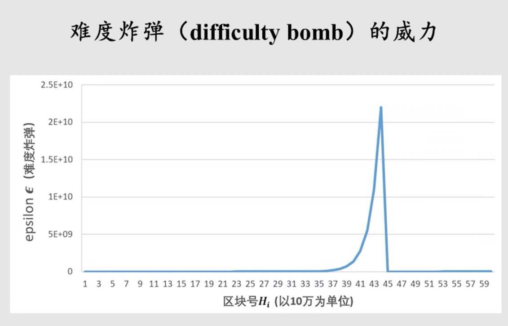

> 上图中展示了回退 300w 个区块前后的难度炸弹的为例

### 以太坊发展的四个阶段

以太坊发展存在四个阶段，我们目前处于第三个阶段中的拜占庭阶段，难度炸弹回调就是在拜占庭阶段进行的。

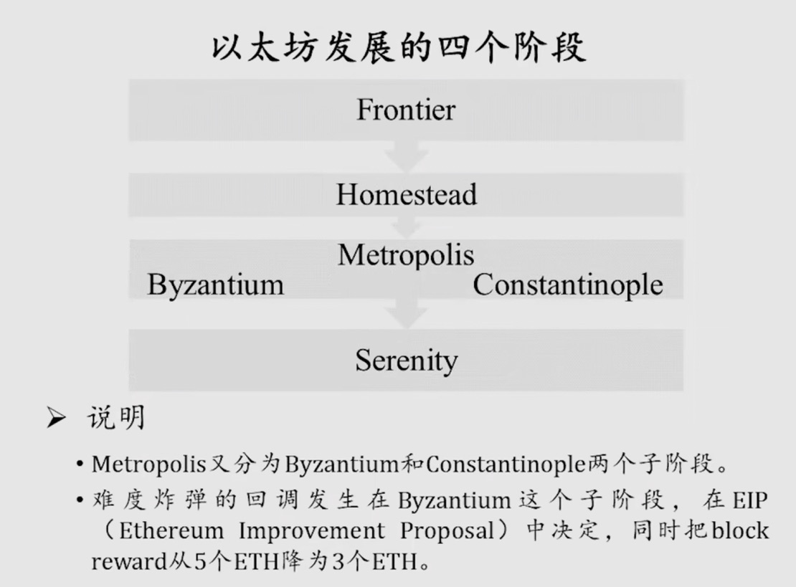

### 代码实现

```go
func calcDifficultyByzantium(curVersion string, time uint64, parent *types.Header) *big.Int {
	// https://github.com/MatrixAINetwork/EIPs/issues/100.
	// algorithm:
	// diff = (parent_diff +
	//         (parent_diff / 2048 * max((2 if len(parent.uncles) else 1) - ((timestamp - parent.timestamp) // 9), -99))
	//        ) + 2^(periodCount - 2)

	bigTime := new(big.Int).SetUint64(time) // 当前区块时间戳
	bigParentTime := new(big.Int).Set(parent.Time) // 父区块时间戳

	// holds intermediate values to make the algo easier to read & audit
	x := new(big.Int)
	y := new(big.Int)
	logger := log.New("CalcDifficulty diff", parent.Difficulty)
	// (2 if len(parent_uncles) else 1) - (block_timestamp - parent_timestamp) // 9
	x.Sub(bigTime, bigParentTime) // 当前区块时间戳 - 父区块时间戳 = 出块时间
	var durationLimit *big.Int
	if manversion.VersionCmp(curVersion, manversion.VersionGamma) >= 0 {
		durationLimit = params.VersionGammaDurationLimit
	} else {
		durationLimit = params.DurationLimit
	}
	logger.Info("CalcDifficulty diff", "duration", durationLimit.String())
	x.Div(x, durationLimit)
	if parent.UncleHash == types.EmptyUncleHash {
		x.Sub(big1, x)
	} else {
		x.Sub(big2, x)
	}
	// max((2 if len(parent_uncles) else 1) - (block_timestamp - parent_timestamp) // 9, -99)
	if x.Cmp(bigMinus99) < 0 {
		x.Set(bigMinus99)
	}
	// parent_diff + (parent_diff / 2048 * max((2 if len(parent.uncles) else 1) - ((timestamp - parent.timestamp) // 9), -99))
	y.Div(parent.Difficulty, params.DifficultyBoundDivisor)
	if y.Sign() == 0 {
		y = big1
	}
	x.Mul(y, x)
	x.Add(parent.Difficulty, x)
  logger.Info("cal Diff", "x", x, "y", y, "minDiff", params.MinimumDifficulty)
	// minimum difficulty can ever be (before exponential factor)
	if x.Cmp(params.MinimumDifficulty) < 0 {
		x.Set(params.MinimumDifficulty) // MinimumDifficulty 是难度下限 D0
	}
	// calculate a fake block number for the ice-age delay:
	//   https://github.com/MatrixAINetwork/EIPs/pull/669
	//   fake_block_number = min(0, block.number - 3_000_000
	fakeBlockNumber := new(big.Int)
	if parent.Number.Cmp(big2999999) >= 0 {
		fakeBlockNumber = fakeBlockNumber.Sub(parent.Number, big2999999) // Note, parent is 1 less than the actual block number
	}
	// for the exponential factor
	periodCount := fakeBlockNumber
	periodCount.Div(periodCount, expDiffPeriod)

	// the exponential factor, commonly referred to as "the bomb"
	// diff = diff + 2^(periodCount - 2)
	if periodCount.Cmp(big1) > 0 {
		y.Sub(periodCount, big2)
		y.Exp(big2, y, nil)
		x.Add(x, y)
	}
	return x
}
```

