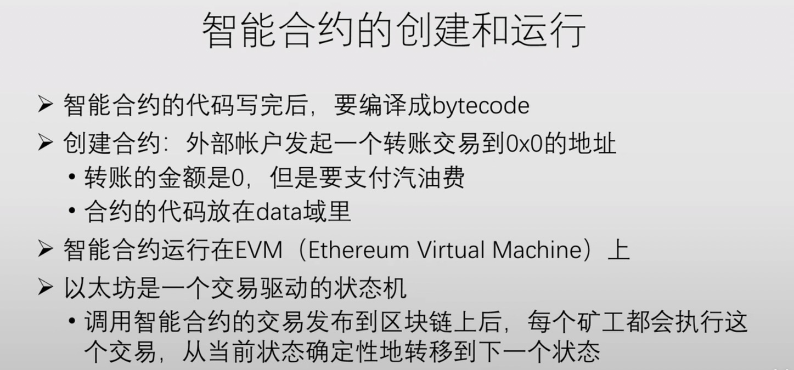
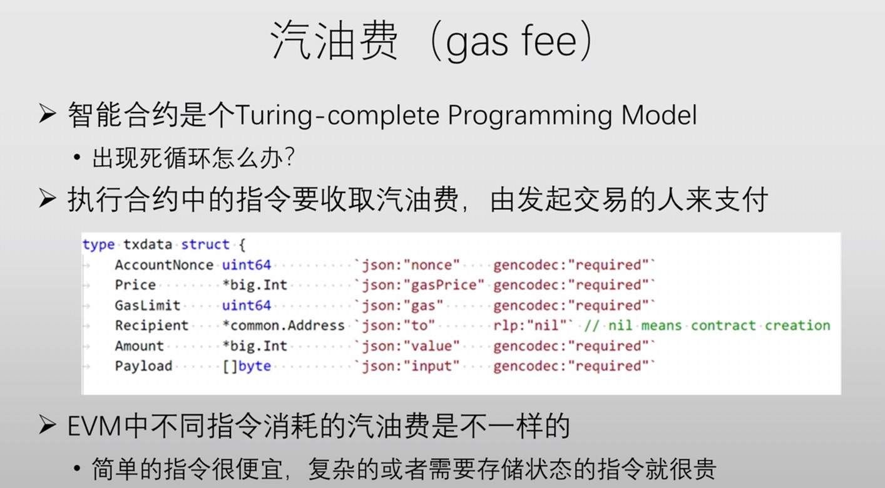
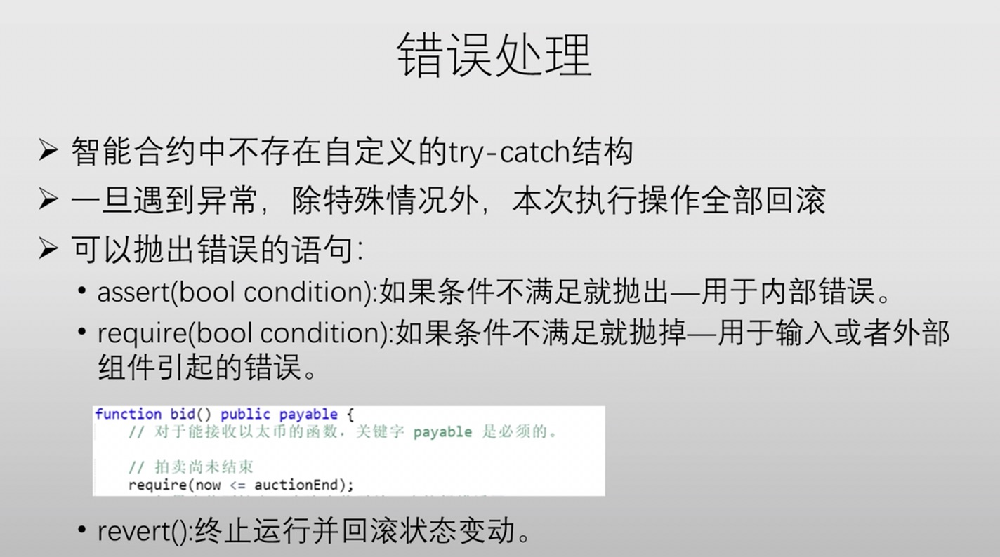
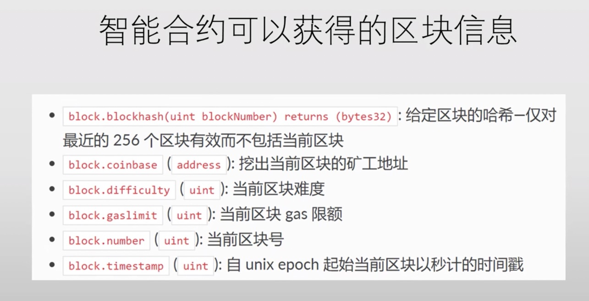
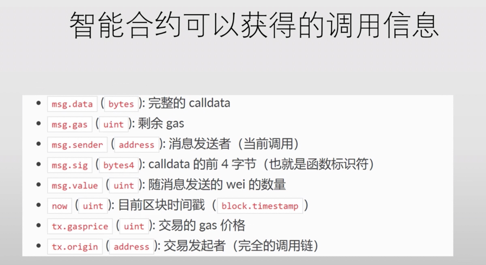
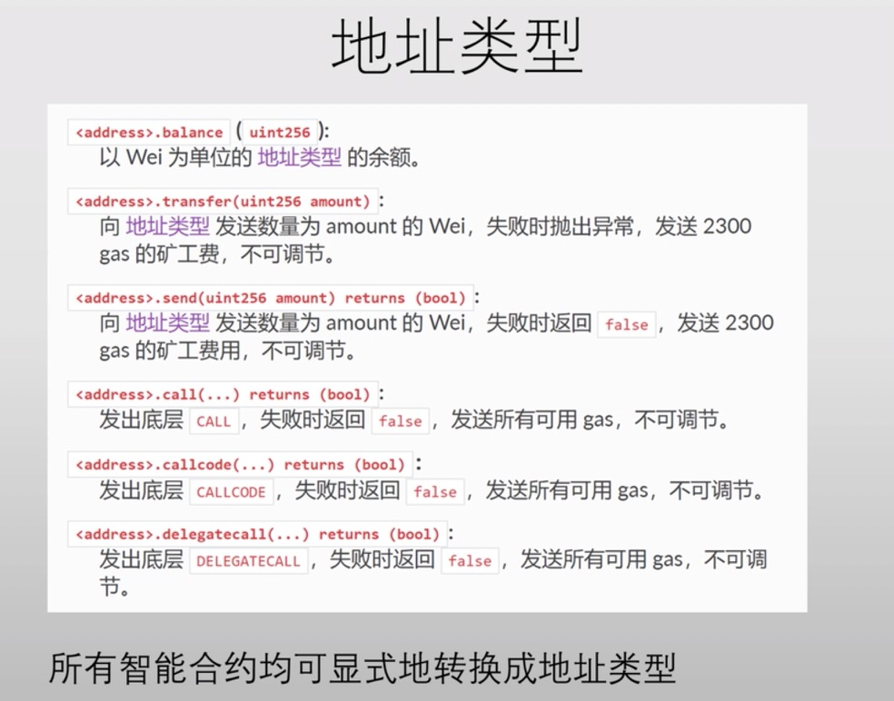

# 北大肖臻老师《区块链技术与应用》公开课学习 7
* 学习地址：[https://www.bilibili.com/video/BV1Vt411X7JF](https://www.bilibili.com/video/BV1Vt411X7JF)
* 参考文章：[北京大学肖臻老师《区块链技术与应用》公开课笔记24——ETH权益证明篇](https://blog.nowcoder.net/n/a509ac93c75242438e71cb47fe59229c、[北京大学肖臻老师《区块链技术与应用》公开课笔记25——ETH智能合约篇1](https://blog.csdn.net/Mu_Xiaoye/article/details/104615168)

## 权益证明

比特币的挖矿过程，消耗了巨大的电力，并且能耗随时间不断增长，平均每一个交易消耗 `1000` 度电。同样地以太坊平均每一个交易消耗 `67` 度电。

> 矿工为什么要挖矿？因为要获得出块奖励。为什么要给矿工奖励？因为激励矿工参与区块链的维护。
> 挖矿的收益是由『拼钱』（买矿机）决定的，那么既然是拼钱，我们直接把钱拿出来比一比行不行？与其买矿机挖矿，我们不如把钱投入到区块链的维护当中，由投入资金的比例来决定最终的收益。这就是 `proof of stake` 权益证明的思想。

优点：
* 省去了挖矿的过程，减少了能耗，减少了温室气体的排放。
* 维护区块链安全的资源形成闭环，而 POW 中维护其安全的资源需要通过现实中流通的货币购买矿机等设备，这也就导致只要有人想要攻击，只需要外部聚集足够资金达到 51% 算力就可以攻击成功。主流的货币抗攻击能力还比较强，刚刚发行的小币种，遇到这种攻击是致命的。`Altcoin Infanticide`。

权益证明是基于拥有的币，如果想发动攻击必须获取一半以上的币，无论你在外部有多少的资金，都不会对加密货币系统造成直接的影响，你只能花钱买到足够多的币才可以（内部闭环），如果一旦有人花钱大量买币，会导致价格大涨，这对开发者是有好处的可以大赚一笔。

### 两边下注
假如一个区块链出现了分叉，如果挖矿会沿着最长合法链去挖，虽然另一条也有可能成为最长合法链，但是你只会沿着一条去挖。但是如果是权益证明，你可以两边都下注。

### 以太坊权益证明
`Casper the Friendly Finality Gadget(FFG)`

`Casper` 协议引入一个概念 `validator` 验证者，想成为 `validator` 必须投入一定的保证金，保证金会被系统锁定。他的职责是推动系统达成共识，投票决定哪条链成为最长合法链，投票的权重为保证金的数目。第一轮投票是 `prepare message`，第二轮投票是 `commit message`，每一轮投票都要得到 `2/3` 以上的验证者同意。实际上 `100` 个区块的 `epoch` 分成两个 `50` 个区块，每 `50` 个区块结束后就进行一轮投票。

> 矿工挖矿会获得出块奖励，而验证者也会得到相应奖励。当然某个验证者行政不作为，不参与投票导致系统迟迟无法达成共识，这时扣掉部分保证金；如果某个验证者乱作为，给两边都进行投票，被发现后没收全部保证金。没收后的保证金直接销毁掉。
> 每个验证者有一定时间的任期，在任期结束后，进入等待期，在此期间等待其他节点检举揭发是否存在不良行为，若通过等待期，则可以取回保证金并获得一定奖励。

通过验证者投票达成的 `Finality`，有没有可能被推翻？
> 假如某个恶意的组织要发生攻击，假如他们是矿工的话，没有验证者作为同伙则无法推翻 `Finality`。矿工无论算力多么强，最终投票权都不在其手中。
> 必须在系统中，存在大量验证者进行了两边投票，也就是说，至少 `1/3`（该协议规定超过2/3才有效）的验证者两侧都投票，才会导致系统被篡改。而这一旦被发现，这 `1/3` 验证者的保证金将会被没收。

**以太坊系统设想，随着时间推移，挖矿奖励逐渐减少而权益证明奖励逐渐增多，从而实现POW到POS的过渡，最终实现完全放弃挖矿。**

既然权益证明这么好，那么为什么没有推广开来？
> 比特币和以太坊的机制都经过了 `bug bounty`，工作量证明已经得到了事实检验，该机制较为成熟。
> 例如 `EOS` 柚子加密货币，它用的就是权益证明的思想，用的是 `DPOS：Delegated Proof of Stake` 协议，通过投票选 21 个超级节点，再由超级节点产生区块。基于权益证明的机制仍然处于探索阶段。

有人认为挖矿消耗的电并不是很多，而且其对于环境的影响是有限的。很多人对工作量证明其实是反感做的是无用功。挖矿提供了将电能转换为钱的手段，而电能本身难以传输和存储。挖矿为将多余的电能转换为有价值的货币提供了很好的解决手段。也就是说挖矿消耗电能可以有效消耗过剩产能，带动当地经济发展。

## 智能合约

智能合约的概念最早是由 `Nick Szabo` 在 `1994` 年提出的。智能合约是一个计算机层面的交易协议，用于执行一系列的合约项。合约旨在满足一些常见的合约条件。

很多区块链网络使用的智能合约功能类似于自动售货机或者说是一个**电子合同**。智能合约与自动售货机类比：如果你向自动售货机（类比分类账本）转入比特币或其他加密货币，一旦输入满足智能合约代码要求，它会自动执行双方约定的义务。

### 智能合约的优点
* 自治 智能合约独立运行在遍布世界各地的计算机上，不依赖于任何中心化的系统。
* 可信 智能合约可信的特点是基于分布式账本的，这些账本可以执行并验证合约。
* 鲁棒性 智能合约存在于分布式的网络中，单点缺失或破坏并不会有影响。
* 速度 智能合约的去中心化的处理过程可以在短时间内完成对业务逻辑的处理。
* 经济 智能合约消除了对律师、见证人以及其他中间机构所构成的庞大的中介链的需求。
### 智能合约的应用
> 知识产权保护：智能合约可以帮助创作者保护他们的知识产权，由于对 `NFT` 等数字商品的担忧，这一点变得越来越重要。创作者可以使用智能合约，在交易过程中转移或保留他们对某一内容的所有权。例如，`NFT` 创造者可能希望保留对其艺术作品的所有权，同时将代币的所有权转让给买方。在 `NFT` 的智能合约中，他们可以概述明确的所有权和支付条款，以保护他们的权利。
> 艺术家也可以使用智能合约获得版税。任何时候，只要他们的艺术作品的 `NFT` 或副本售出，智能合约就可以触发分销商向艺术家的自动付款。

### 智能合约的调用
以太坊中智能合约编写代码为 `Solidity`，其语法与 `JavaScript` 很接近。
调用智能合约其实和转账类似，比如 `A` 发起一个交易转账给 `B`，如果 `B` 是一个普通的账户这就是一次普通转账，但是 `B` 如果是一个合约账户，这就是发起了对 `B` 合约的调用。**外部账户可以调用合约账户，合约账户也可以调用合约账户**

### 智能合约的创建与运行
`EVM` 设计思想类似于 `JAVA` 中的 `JVM` ，便于跨平台增强可移植性。`EVM` 中寻址空间 `256位`，而目前个人机主流位 `32位`和 `64位`，与之存在较大差距。

### 汽油费
比特币相比于以太坊很简单，脚本语言都不支持循环。而以太坊提供图灵完备的平台，从而使得以太坊相对于比特币可以实现很多功能，但这也导致一些问题，例如当一个全节点收到一个对智能合约调用怎么知晓其是否会导致死循环。

事实上无法预知其是否会导致死循环，实际上该问题是一个停机问题，而停机问题不可解。因此，以太坊引入汽油费机制将该问题扔给了发起交易的账户。以太坊规定执行合约中指令需要收取汽油费，并且由发起交易的人进行支付。

* Price: 单位汽油价格
* GasLimit: 愿意支付最大汽油量
* Recipient: 收款人地址
* Amount: 转账金额
* Payload: data 域

当一个全节点收到一个对智能合约的调用，先按照最大汽油费收取从其账户一次性扣除，再根据实际执行情况多退少补(汽油费不够会引发回滚，而非简单的补齐)。一般计算量较大、存储量较大的复杂指令的汽油费比较贵。

> 以太坊中存在 `gaslimit`，通过收取汽油费保障系统中不会存在对资源消耗特别大的调用。但与比特币不同，比特币直接通过限制区块大小 `1MB` 保障对网络资源压力不会过大，这 `1MB` 大小是固定的无法修改。而以太坊中每个矿工都可以以前一个区块中 `gaslimt` 为基数，进行上调或下调 `1/1024`，从而通过绝大多数区块不断上下调整，保证得到一个较为理想化的 `gaslimt` 值。最终整个系统的 `gaslimt` 就是所有矿工希望的平均值。

> 在比特币系统中，交易是比较简单的，仅仅是转账操作，也就是说可以通过交易的字节数衡量出交易所需要消耗的资源多少。但以太坊中引入了智能合约，而智能合约逻辑很复杂，其字节数与消耗资源数并无关联。存在某些交易，从字节数来看很小，但其实际消耗资源很大(例如调用其他合约等)，因此要根据交易的具体操作收费，所有引入了汽油费这一概念。
> 在 `block header` 中包含了 `gaslimit`，其并非将所有交易的消耗汽油费相加，而是该区块中所有交易能够消耗的资源的上限。

汽油费是怎么扣除的？
> 首先，之前在以太坊数据结构中介绍了以太坊中三棵树——状态树、交易树、收据树。这三棵树都位于全节点中，是全节点在本地维护的数据结构，记录了每个账户的状态等数据，所以该节点收到调用时，是在本地对该账户的余额减掉即可。所以多个全节点每人扣一次，仅仅是每个全节点各自在本地扣一次。
> 也就是说，智能合约在执行过程中，修改的都是本地的数据结构，只有在该智能合约被发布到区块链上，所有节点才需要同步状态，各自在本地执行该智能合约。

### 错误处理
以太坊中交易具有原子性，要么全执行，要么全不执行，不会只执行一部分(包含普通转账交易和智能合约)。在执行过程中产生错误导致回滚，已经消耗掉的汽油费是不会退回的。从而有效防止了恶意节点对全节点进行恶意调用。

### 嵌套调用

### 挖矿与智能合约执行

假设全节点要打包一些交易到区块中，其中存在某些交易是对智能合约的调用。全节点应该先执行智能合约再挖矿，还是先挖矿获得记账权后执行智能合约？

如果先挖矿后执行智能合约会如何？
> 智能合约会导致数据结构发生改变，从而修改掉区块中的内容，那么之前挖矿时挖到的 `nonce` 是不适用于此时修改过后的 `block`的，也就是说执行智能合约后的区块并非之前的区块，之前的 `nonce` 不能适用于当前区块，从而无法被加入到区块链中。挖矿导致三棵树数据结构改变，之前挖到的矿就无效了。所以，在以太坊系统中，必然是先执行智能合约，后挖矿。

假如某个矿工执行智能合约消耗了很多资源，但是记账权被别人拿到了，矿工会得到什么补偿？
> 汽油费是没有的，只给获得记账权发布区块的那个矿工进行补偿。以太坊中没有任何补偿，不仅如此还要把发布区块中的交易执行一次更新三棵树的内容算出根哈希值，和别人发布的进行比较。这种情况下挖矿慢的矿工特别吃亏。

会不会有的矿工想不开，你不给我汽油费，那我就不验证你发布区块的正确性？
> 这种情况如果发生最直接的后果是危害区块链的安全。如果他跳过验证过程，本地三棵树的内容没有更新，算出的根哈希值就不对了，以后发布的区块就没人会认了。

发布到区块链上的交易，是不是都是成功执行的？智能合约发生错误，要不要也发不到区块链上去？
> 不一定，执行发生错误的交易也要发布到区块链上去，这样才能成功扣除汽油费。如果交易不被发布到区块链上，是无法收取汽油费的。

智能合约支持多线程吗？
> 多核处理器很常见，计算机可以有很多核，那么智能合约支不支持多核并行处理呢。`Solidity` 不支持多线程，因为以太坊本质为一个交易驱动的状态机，给定一个智能合约，面对同一组输入，必须转移到一个确定的状态，因为所有的全节点都要执行同一组操作来验证。但对于多线程来说，同一组输入的输入顺序不同，最终的结果可能不一致。
> 此外，其他可能导致执行结果不确定的操作也不支持，例如：产生随机数。因此，以太坊中的随机数是伪随机数，不能产生真正意义的随机数。
> 也正是因为其不支持多线程，所以无法通过系统调用获得系统信息，因为每个全节点环境并非完全一样。因此只能通过固定的结构获取。下图分别为为其可以获得的区块链信息和调用信息。

### 地址类型

在以太坊中，转账有以下三种方法。
* transfer: 在转账失败后会导致连锁性回滚，抛出异常；
* send: 转账失败会返回false，不会导致连锁性回滚
* call: 本意是用于发动函数调用，但是也可以进行转账

### code is law

Code is law！智能合约规则是代码逻辑决定的，而发布到区块链上后就再也无法修改。这样的好处是，没有人可以篡改规则；这一的坏处是，规则如果有漏洞，也无法进行修改和补救。智能合约如果设计的不够好，就有可能将收到的以太币永久性锁死，谁也取不出来。

### 锁仓

> 通过智能合约进行锁仓。例如某个团队决定一起开发某个新型加密货币，开发中进行“pre mining”，给开发者预留一部分币。将这些预留币打入到一个合约账户，锁仓三年。三年后，这些币才可以参与交易，从而便于开发者可以集中精力进行这种加密货币开发工作。
> 但是万一在写入时候多写一个0，从3年变成30年，那这些币就会被锁仓30年，没有任何办法取出这些币。这有些类似于【不可撤销的信托(irrevocable trust)】，有些有钱人会采用这种方式来达到财产保护和减税的目的。如果在制定这种不可撤销的信托时，法律条款设置存在漏洞，也可能会导致存入的钱无法取出。
> 因此，在发布一个智能合约之前，需要进行大量、严格的测试。可以去专门的 testnet 网站上，采用虚假的以太币进行测试，确认完全没有问题后再发布。

是否可以在智能合约中留一个后门，用于修复bug？例如给合约创建者超级用户的权力
例如前文例子，记录owner，记录owner的地址，当出现这种问题后其可以及时进行修复。这样做，会存在owner卷款跑路的风险。这样做前提是所有人都要相信这个超级管理员，而这于去中心化的理念背道而驰，是绝大多数区块链用户所不能接受的。