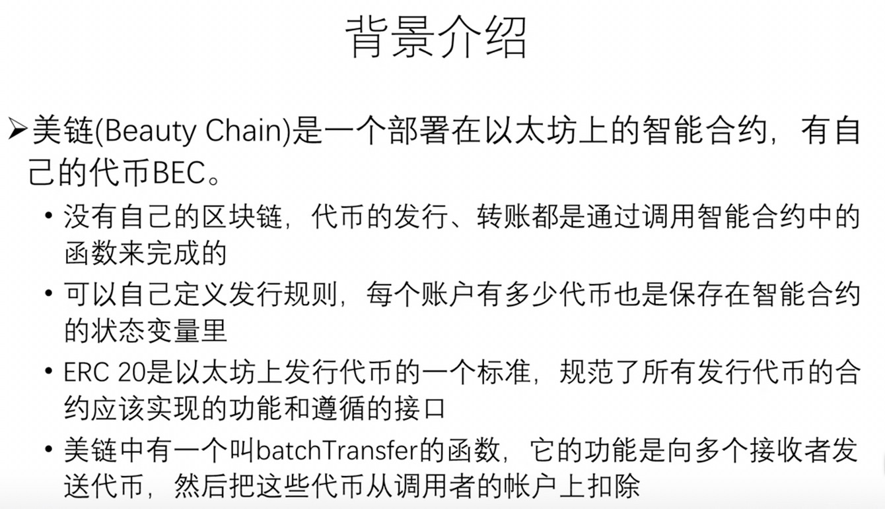

# 北大肖臻老师《区块链技术与应用》公开课学习 8
* 学习地址：[https://www.bilibili.com/video/BV1Vt411X7JF](https://www.bilibili.com/video/BV1Vt411X7JF)
* 参考文章：[https://sinocifeng.github.io/downloadPage.html](https://sinocifeng.github.io/downloadPage.html)

## DAO

为何不将一切都去中心化呢 Decentralize everything. DAO(Decentralize Autonomous Organization)-去中心化自治组织就出现了。组织一般都会有自己的规章制度，DAO 的规章制度是写在代码里的。

### The DAO

2016年5月，出现一个致力于众筹投资的 Dao——The DAO（名字有点歧义）。类似于众筹的基金组织，本质上就是一个运行在以太坊上的智能合约。如果想要参与其众筹，可以将自己的以太币发送到该智能合约换回The DAO 的代币。当需要决定投资哪一个项目时，由代币持有者进行投票表决，每位参与者投票的权重由代笔多少决定。 当投资获得收益，也根据参与者代币数进行分成。

传统的投资都是由几个决策者决定投资方向的，但 `The DAO` 的方式使得所有人都可以参与决策。2016年5月开始众筹，仅一个月时间就已经众筹得到价值极多的以太币。有人认为 3-5 年后的影响力会超过以太坊本身。但是它仅仅存在了 3 个月。

考虑到投资者在投资过程中可能需要用钱，需要用代币换回以太币。在 `The DAO` 的设计中采用了 `拆分(split DAO)` 实现这一功能。其并非单纯取回收益，而是采用生成 `child DAO` 的方法。如果投资过程中某个小众项目不被看好，那么它可以独立出来成立为子基金，极端情况就是单个的投资人成立了 `child DAO`，这个人将钱投资给自己从而取回自己的投资与收益。

拆分前有7天的辩论期，大家可以讨论拆分是否好并决定是否加入拆分。拆分之后，有28天锁定期，28天后才能取出这些以太币。也正是这28天的锁定期，给了以太坊补救时间（惊变28天）。这一理念是民主制度的进一步体现，不仅倡议少数服从多数，也保障了对少数人的权利尊重。但问题出现在了对 `split DAO` 的实现上，这导致了 `The DAO` 最终走向末路。下为 `split DAO` 的实现代码：

```solidity
function splitDAO(
    uint _proposalID,
    address _newCurator
) noEther onlyTokenholders returns (bool _success) {
    // ......
    // Burn DAO Tokens
    Transfer(msg.sender, 0, balances[msg.sender]);
    withdrawRewardFor(msg.sender); // (1) 还钱给调用该函数的人
    totalSupply -= balances[msg.sender]; // (2) 减小 The Dao 中的总金额
    balances[msg.sender] = 0; // (3) 将调用者的账户清零
    paidOut[msg.sender] = 0;
    return true;
}
```

正确的做法应该是先清零再还钱，否则会造成**重入攻击**。

## 重入攻击

计算机程序或子程序在执行过程中中断，然后在它前一次调用完成执行之前再次进行调用，那么该程序或子程序称为重入程序。中断可能是由内部操作（如jump或call）或外部操作（如interrupt 或signal）引起的。重入调用完成后，以前的调用将恢复正常执行。使用某些代码段执行此操作将导致重入攻击。

在上面的示例中，注释（1）部分进行资金转移之后，才对注释（3）账户余额状态进行修改。这时候，会让黑客可以在状态修改之前利用fallback() 函数多次调用该函数，直至取走合约账户内的全部余额。

而黑客通过这一 `bug` 转走了价值近 5000万 的以太币。这在以太坊社区引发了巨大恐慌，从而也引发以太币价格的跳水。对此，以太坊内部进行了大讨论，主流意见分为两派:

1. 一派认为，需要对以太坊进行交易回滚（由于28天锁定期存在，黑客暂时无法取走钱），从而进行及时补救。通过交易回滚，保障投资者正当利益。
2. 另一派则认为，code is law，不需要采取补救措施。因为黑客行为并未违法，既然 `code is law`，那么代码中的bug也是规则中一部分。据说网上流传一封黑客写给以太坊社区的公开信，信中说："我并未做错任何事，我仅仅利用了代码中的 `feature`。既然代码中允许我可以重复、多次取钱，我仅仅是利用了这一特性而已"。这一派人认为不应该采取补救措施，更不应该进行交易的回滚。因为区块链最重要的特性便是不可篡改性，如果产生问题就进行回滚这无疑违背了这一特性。此外，此次出现问题的仅仅是以太坊之上运行的一个应用，以太坊本身并没有问题，且以太坊上存在着无数的应用，如果下一个智能合约出现问题，我们还要进行回滚吗？

以太坊开发团队支持前者，主要原因的 `The DAO` 募集的以太币已经超过当时总流通以太币量 `10%`，这件事对以太坊有着巨大影响，而如果放任不管，大概其中的 1/3 将落入黑客手中，`The DAO`已经是以太坊生态中一个 "too big to fail" 的应用了（企业已经大而不能到了，如果倒了会对社会造成影响）。

## The Dao 补救措施

补救措施，从发生攻击的区块前一个区块处进行分叉，使得新分支最终超越原有分支可行吗？

> 我们假设大家都同意该方案，不再沿着原来链继续挖下去，而是从黑客攻击区块的前一个处进行重新挖矿。然而如果这样做，上面那条链上黑客攻击的交易和其他合法交易都被回滚了，因此该方案不可行。因为 `The DAO` 只是以太坊上的一个智能合约，还有其他智能合约和交易呢。

以太坊团队设定了两步走的方案：1.锁定黑客账户 2.设法从黑客账户退回以太币

1. 以太坊团队发布一个升级，要求凡是与 `The DAO` 基金账户相关的账户均不被允许进行任何交易。发布后大多数矿工都升级了这一软件，接受了这一措施。(这是一个软分叉, 旧矿工认为新区块合法, 新矿工认为旧区块不合法)。然而升级后的软件存在一个与汽油费相关的 `bug`：在收到一个区块发现其中包含与 `The DAO` 账户相关交易，那么还需要收取汽油费吗？直觉告诉我们似乎不应该要，以太坊社区这一升级也遵循了这一直觉，没有收取汽油费。这导致攻击者可以以极低的成本，发起大量的这类 `非法交易` 请求，导致矿工打包的区块频繁不被认可。于是软分叉的方案就失败了。
2. 以太坊发布了新的升级，将 `The DAO` 账户的资金强行转入到一个新的智能合约中，而该智能合约只有退钱（将代币退回成以太币）这一功能。这是硬分叉，软件本质是以软件升级方式强行重新记账。原本应该有账户的签名才行，但现在非常时期，凡是 `The DAO` 账户上的资金无论本人同意与否都强行转入到新的合约中去。升级软件规定挖到第192w个区块时，自动执行这一转账交易。旧矿工必然不认可这一规则，因为没有合法签名属于非法交易。因此最终产生硬分叉。

支持者与反对者进行了激烈争论。为此开发团队开发了一个智能合约对此进行投票。最终结果是，大多数人支持进行硬分叉，大多数矿工也接受了这一升级，大家便开始等待挖出第192w个区块这一历史性时刻。这一次硬分叉成功了。从此两条链之后逐步通过 `chainId` 进行了区分，并共同存活了下去: `ETH` 和 `ETC`。

## 反思

Is smart contract really smart？
> 智能合约与人工智能无关，其实可以称其为 `自动合约` ——以事先写好代码自动执行相应规则。因此智能合约并不智能，写好之后就不可以再进行修改，实际上就相当于一个 `代码合同`。

smart contract is anything but smart.
> 区块链的不可篡改性其实是一个双刃剑。一方面增加了合约的公信力，另一方面也意味着规则中有漏洞很难修复。中心化的软件只需要发布一个 `patch` （补丁）就行了，但是区块链软件更新需要硬分叉。设想你发现银行卡信息被盗，第一反应是通知银行将账户进行冻结。但如果在区块链上，你就只能看着账户中的钱被转移走。(除非比特币发布一个新版本，与你相关的交易都不接受)。
> 智能合约一旦发布到区块链上，就不能阻止其被调用。那么你又必须将智能合约中的钱转走。而智能合约并没有提供转走钱的方法，那就只能通过黑客的方法将剩余资金转移到新账户中。

Nothing is irrevocability.
> 区块链真的不可篡改吗？其实是可以改的。代码是死的，人是活的，宪法都可以修宪呢。真正遇到类似 `The DAO` 这类重大事件，真正想要修改还是可以实现的。

Is solidity the right programming language?
> 一般意义上，A 给 B 转账，B 不可能会反过来调用 A。然而 `solidity` 语言中，A 给 B转账等于隐性调用了B的 `fallback()` 函数，而 B 可以通过 `fallback()` 来反过来调用 A。由于这与我们的常识不符，便容易忽视掉这一漏洞。有人呼吁用更安全的函数式的编程语言，且长远来看，要实现对智能合约理论上正确性的证明。
> 比特币脚本语言简单、表达能力差，很多功能无法表达出现。而以太坊的编程语言是图灵完备的，凡是计算机程序可以完成的，solidity 都可以将其实现。然而，图灵完备的表达能力是一种好事吗？有人认为应该选择一种适中的语言，既不要比特币脚本语言那么简单，又不要 solidity 语言那样图灵完备，希望既可以实现智能合约想要实现的功能，但又不容易出现安全漏洞。然而，找到这样一种语言是困难的，因为设计之初我们无法预料到未来的所有应用场景和所有的安全攻击。现实生活中合同也会出现纠纷，我们并未提供一种专门用于合同编写的专用语言，而是通过提供【模板】来解决。这可能是智能合约未来的发展方向，常用的智能合约可能会出现模板，也可能会出现专门编写智能合约的机构。

开源软件比非开源软件安全。
> 有人认为开源代码被众人所审视，其中出现安全漏洞的可能不大。虽然理论上大家都可以去看，然而实际上真正有时间和精力查看的人很少，即使看，也不一定大多数人都又足够的专业知识看出其中隐藏的漏洞。有可能我们都认为世界上这么多人，别人肯定看过了，但实际上大家可能都这么想，没有几个人真正看过开源代码。**many eyeball fallacy**

What does decentrtilization mean？
> 去中心化不意味着完全拒绝人的干预，不意味着完全不能修改，而是要用去中心化的方法来完成修改。以太坊团队发布升级为什么最终能够成功？因为绝大多数矿工接受了升级软件，以行动支持了分叉方案。即使如此，以太坊团队仍然不能强迫一部分人从旧链转到新链。所以以太坊团队并不能强迫大家去转换，矿工们认为以太坊的决定是符合大家利益的。

分叉是坏事吗？
> 在中心化的系统里，你可以选择放弃但是不能分叉。分叉导致原有一条链变成了两条。然而分叉恰恰是去中心化的体现，存在分叉，恰恰是民主精神的体现。(用户不满意，就有选择分叉的权利)

decentralized 不等于 detributed
> 一个去中心化系统必然是分布式的，但分布式未必是去中心化。比特币、以太坊都属于交易驱动的状态机。

## 美链 Beauty Chain


ERC 指的是 Ethereum Request for Comments.

* IPO: Inital public offering, 指企业首次将自己的股份向公众出售，是中小企业融资的一种方式，通过这种方式成长型企业能够快速募集资金，吸引投资者，增强其股份在市场上的流通性，完成从私人制企业向股份制企业的转变。
* ICO: Inital coin offering, 是区块链行业的一种融资方式，指通过发行代币（Token）的方式进行融资。每个区块链项目会根据投资者投资金额比例，发行相应的代币给投资者，这些代币往往也可以在一些数据货币交易平台（如Counterparty等）进行交易。
* 加密货币指的是任何拥有独立区块链的加密货币（比特币、以太坊）
* 代币是没有自己的区块链，而是依附于其他区块链的加密货币。 代币会从自己依附的区块链技术中获益。

```solidity
// 两个参数 接收地址，转账金额
function batchTransfer(address[] _receivers, uint256 _value) public whenNotPaused returns (bool) {
    uint cnt = _receivers.length;
    uint256 amount = uint256(cnt) * _value; // 计算总金额
    require(cnt > 0 && cnt <= 20); // 接收者最多20个
    require(_value > 0 && balances[msg.sender] >= amount); // 检查发起调用的账户是否用足够多的代币

    balances[msg.sender] = balances[msg.sender].sub(amount); // 发起调用的账户减去 amount
    for (uint i = 0; i < cnt; i++) { // 通过循环给接收者价值 value 的代币
        balances[_receivers[i]] = balances[_receivers[i]].add(_value);
        Transfer(msg.sender, _receivers[i], _value);
    }
    return true;
```

> 问题出现在计算总金额上面： `uint256 amount = uint256(cnt) * _value`。假如计算时，`value` 的值很大，这个乘法结果可能会产生溢出。溢出后算得的 `amount` 可能是一个很小的数。换言之在调用者账户做减法时，减掉的是一个很小的数字，但转账时，转走的仍然是一笔很大的代币。从而导致系统中凭空产生大量代币。

## 区块链的滥用
有人说保险理赔可以上链，因为现有理赔很慢。因为区块链上转账只需要确认后就完成了，与现实中数星期相比具有很大的进步。
> 保险理赔速度慢，并非转账这一过程，而是审核理赔内容。而理赔确认和审核，是区块链所无法完成的。

有人说用区块链做防伪溯源，将有机蔬菜生产全过程上链，在区块链上可以查到蔬菜生产销售的全过程。
> 区块只能保证区块链的数据内容是不可篡改的，而无法检测数据是否真实。写入的时候本身写的就是假的内容。

中心化与去中心化的界限并非是分明的。
> 一个商业模式既可以存在中心化成分，也可以存在去中心化成分。比特币仅仅是一种支付方式，而采用比特币作为支付方式的商业模式本身并不是必须是去中心化的。比如亚马逊如果在未来接受比特币支付。不要因为区块链是去中心化的，而认为所有用到区块链的技术都是去中心化的。

## 法律监管和支付方式
区块链的支付方式目前不受法律监管和保护。现实中信用卡被盗刷可以申请法律监管的保护，但是区块链则不能。
有人认为区块链的交易方式与现有方式相比，支付效率低、能耗大，是不划算的。但是在跨国贸易这一背景下，比特币方式是比现有银行体系更高效的。

## 总结
不要认为去中心化、智能合约等可以解决一切问题，这就迈向了另一个极端。`The DAO` 即使没有黑客攻击的问题，其商业模式是否就没有问题存在？`The DAO` 的投资方向完全民主，由大家一起说了算，但民主就一定是好事吗？大多数人就是对的吗？

**Democracy is the worst form of Government except for those other forms that have been tried
from time to time**