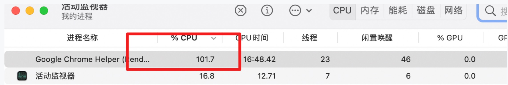
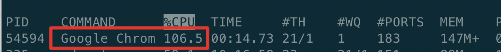
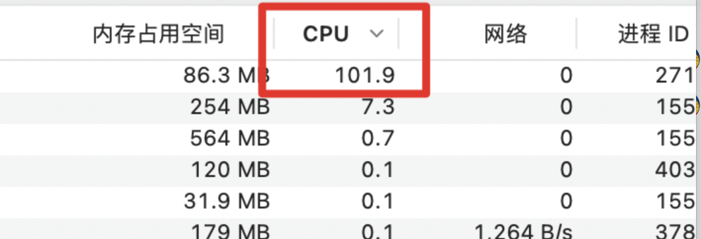
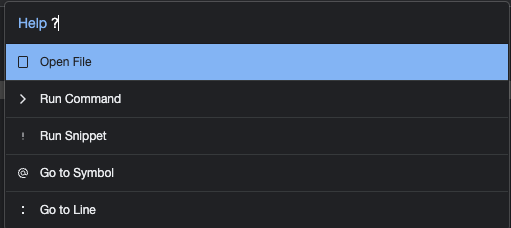
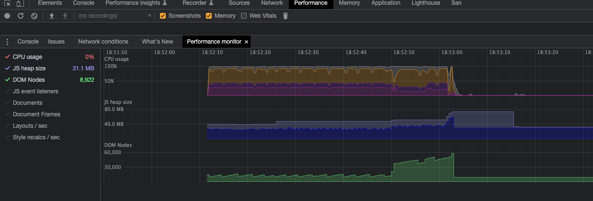
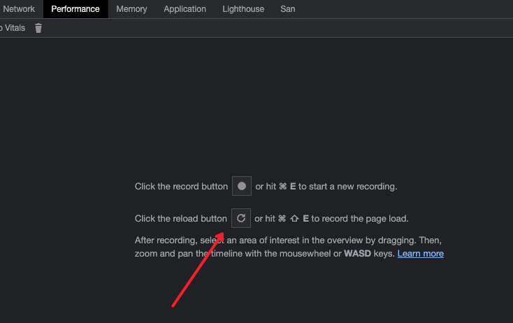

# Chrome性能分析&性能监视器

有一天在启动项目的时候，突然电脑发烫，风扇开始转，此时我打开了 mac 的活动监视器发现：

然后我又运行了一下 top 命令（top命令**是Linux下常用的性能分析工具，能够实时显示系统中各个进程的资源占用状况，类似于Windows的任务管理器**）

然后我又打开了 chrome 的任务管理器，发现确实是这个项目对应的 tab 进程把 cpu 占满了。

然后开始分析项目，发现只有在进入某一个页面的时候才会这样，最后对代码进行分析，发现是 ui 组件库中的一个组件里面有死循环代码，最后升级了版本解决了。其实除了以上几种查看 cpu 的方式，chrome 浏览器还有自带的**性能分析&性能监视器**功能。

## Performance Monitor 性能监视器

打开需要监测的页面，`F12`打开控制台后，`command + p` 打开命令输入，可输入`?`查看以下命令：

* open file：打开文件
* run command：运行命令
* run snippet：运行代码片段
* go to symbol
* go to line：跳转到指定行

我们输入`> Show Performance Monitor`，打开性能监视器，这个过程是实时监测的，比如修复问题后可以看到曲线降了下来。

可以看到左侧的性能指标主要有，可以勾选想要看的指标：

* CPU usage：CPU占用率
* JS head size：JS内存使用大小
* DOM Nodes：内存中挂载的DOM节点个数
* JS event listeners：事件监听数
* Document
* Document Frames
* Layouts / sec：重排
* Style recalcs / sec：重绘

## Performance 性能分析

* record button：录制按钮，点击后开启录制然后点击停止按钮。
* reload button：页面会重新加载，记录页面加载过程中的性能分析，会自动停止。

功能面板介绍：[Chrome DevTools Performance 功能详解](https://juejin.cn/post/7112544960934576136)