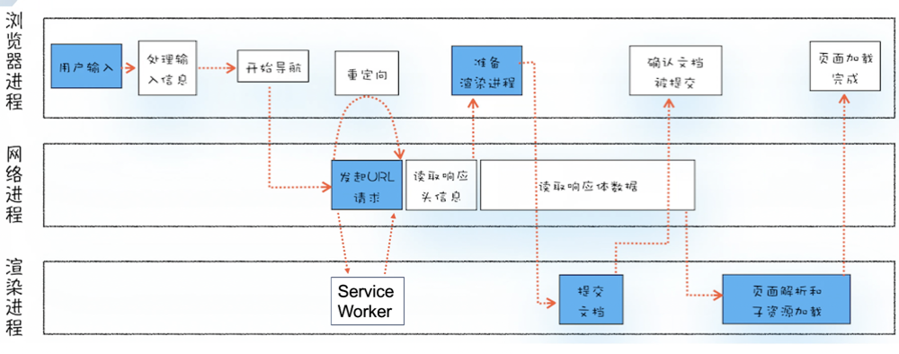
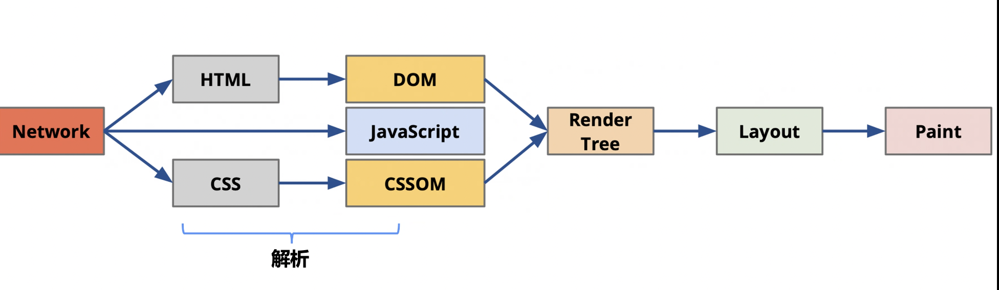
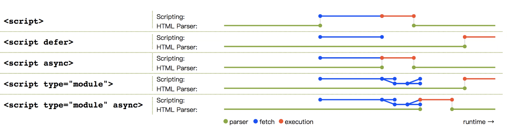

# 浏览器渲染相关
* 浏览器多进程架构
* 浏览器渲染过程
* 渲染进程的三个线程
* js 会阻塞 dom 解析
* css 不会阻塞 dom 解析 
* script标签中的async，defer
* 如何减少回流和重绘

## 浏览器多进程架构

[一文看懂Chrome浏览器运行机制](https://zhuanlan.zhihu.com/p/102149546)，如何查看进程：浏览器中右上角更多工具 => 任务管理器

* Browers主进程：负责界面显示，用户交互，子进程管理，同时提供存储等功能
* 渲染进程：一个tab窗口对应一个(不一定，网站隔离)，核心任务是将 html 转换为用户可以与之交互的网页
* GPU进程：只有一个，实现网页，UI界面的硬件绘制
* 插件进程：主要负责插件的运行，每一个插件对应一个进程
* 网络进程：主要负责页面的网络资源加载

> 浏览器主进程有很多负责不同工作的线程（worker thread）其中包括绘制浏览器顶部按钮和导航栏输入框等组件的UI线程（UI thread）、管理网络请求的网络线程（network thread）、以及控制文件读写的存储线程（storage thread）等。当你在导航栏里面输入一个URL的时候，其实就是UI线程在处理你的输入。

### 单进程缺点

* 不稳定：同一进程中，任何线程或模块的崩溃将导致整个进程的崩溃
* 不流畅：任务排斥，内存泄露
* 不安全：用C或C++写的插件可以获取操作系统资源

### 多进程特点

* 解决了稳定性，流畅性，安全性的问题
* 带来了更多的资源占用
* 带来了更复杂的体系架构（模块直接耦合度高，可扩展性降低）

## 浏览器渲染过程

### 导航流程



### 解析流程



> 解析html以构建dom树 -> 构建render树 -> 布局render树 -> 绘制render树

* DOM Tree：浏览器将HTML解析成树形的数据结构。

* CSS Rule Tree：浏览器将CSS解析成树形的数据结构。

* Render Tree: DOM和CSS合并后生成Render Tree。

* layout: 有了Render Tree，浏览器已经能知道网页中有哪些节点、各个节点的CSS定义以及他们的从属关系，从而去计算出每个节点在屏幕中的位置

* painting: 主线程会遍历之前得到的布局树（layout tree）来生成一系列的绘画记录（paint records）。类似于canvas。

* 合成与光栅化

  > 到目前为止，浏览器已经知道了关于页面以下的信息：文档结构，元素的样式，元素的几何信息以及它们的绘画顺序。那么浏览器是如何利用这些信息来绘制出页面来的呢？**将以上这些信息转化为显示器的像素的过程叫做光栅化（rasterizing）**。
  >
  > 可能一个最简单的做法就是只光栅化视口内（viewport）的网页内容。如果用户进行了页面滚动，就移动光栅帧（rastered frame）并且光栅化更多的内容以补上页面缺失的部分。Chrome的第一个版本其实就是这样做的。然而，对于现代的浏览器来说，它们往往采取一种更加复杂的叫做合成（compositing）的做法。
  >
  > 合成是一种将页面分成若干层，然后分别对它们进行光栅化，最后在一个单独的线程 - 合成线程（compositor thread）里面合并成一个页面的技术。当用户滚动页面时，由于页面各个层都已经被光栅化了，浏览器需要做的只是合成一个新的帧来展示滚动后的效果罢了。页面的动画效果实现也是类似，将页面上的层进行移动并构建出一个新的帧即可。

* reflow（回流）

  > 当浏览器发现某个部分发生了点变化影响了布局，需要倒回去重新渲染，内行称这个回退的过程叫 reflow。reflow 会从 html 这个 root frame 开始递归往下，依次计算所有的结点几何尺寸和位置。reflow 几乎是无法避免的。现在界面上流行的一些效果，比如树状目录的折叠、展开（实质上是元素的显示与隐藏）等，都将引起浏览器的 reflow。鼠标滑过、点击……只要这些行为引起了页面上某些元素的占位面积、定位方式、边距等属性的变化，都会引起它内部、周围甚至整个页面的重新渲 染。通常我们都无法预估浏览器到底会 reflow 哪一部分的代码，它们都彼此相互影响着。

* repaint（重绘）

  > 改变某个元素的背景色、文字颜色、边框颜色等等不影响它周围或内部布局的属性时，屏幕的一部分要重画，但是元素的几何尺寸没有变。
  
* [哪些属性会触发回流与重绘](https://blog.csdn.net/qq_36337754/article/details/103773474)

```js
(1)display:none 的节点不会被加入Render Tree，而visibility: hidden 则会，所以，如果某个节点最开始是不显示的，设为display:none是更优的。

(2)display:none 会触发 reflow，而 visibility:hidden 只会触发 repaint，因为没有发现位置变化。

(3)有些情况下，比如修改了元素的样式，浏览器并不会立刻reflow 或 repaint 一次，而是会把这样的操作积攒一批，然后做一次 reflow，这又叫异步 reflow 或增量异步 reflow。但是在有些情况下，比如resize 窗口，改变了页面默认的字体等。对于这些操作，浏览器会马上进行 reflow。
```

## 渲染进程的三个线程


- Compositor Thread

  一旦页面的层次树创建出来并且页面元素的绘制顺序确定后，主线程就会向合成线程（compositor thread）提交这些信息。然后合成线程就会光栅化页面的每一层。因为页面的一层可能有整个网页那么大，所以合成线程需要将它们切分为一块又一块的小图块（tiles）然后将图块发送给一系列光栅线程（raster threads）。光栅线程会栅格化每个图块并且把它们存储在GPU的内存中。

  当图层上面的图块都被栅格化后，合成线程会收集图块上面叫做**绘画四边形**（draw quads）的信息来构建一个**合成帧**（compositor frame）。

  上面的步骤完成之后，合成线程就会通过IPC向浏览器进程（browser process）提交（commit）一个渲染帧。这个时候可能有另外一个合成帧被浏览器进程的UI线程（UI thread）提交以改变浏览器的UI。这些合成帧都会被发送给GPU从而展示在屏幕上。如果合成线程收到页面滚动的事件，合成线程会构建另外一个合成帧发送给GPU来更新页面。

- Main Thread

  

  这里大家就很熟悉了，chrome devtools的Timeline里Main那一栏显示的内容就是Main Thread完成的相关任务：某段JS的执行、Recalculate Style、Update Layer Tree、Paint、Composite Layers等等。 

- Compositor Tile Worker(s)
  可能有一个或多个线程，比如PC端的chrome是2个或4个，安卓和safari为1个或2个不等。是由Compositor Thread创建的，专门用来处理tile的Rasterization（前文说过的光栅化）。

可以看到Compositor Thread是一个很核心的东西，后面的俩线程都是由他主要进行控制的。
同时，用户输入是直接进入Compositor Thread的，一方面在那些不需要执行JS或者没有CSS动画、不重绘等的场景时，可以直接对用户输入进行处理和响应，而Main Thread是有很复杂的任务流程的。这使得浏览器可以快速响应用户的滚动、打字等等输入，完全不用进主线程。**就比如说js动画要走主线程，css动画有的不会走主线程，直接在 Compositor Thread 中完成**

> 所以说 css 动画会不会被 js 阻塞呢，答案是有时会有时不会，比如 transform，opacity，filter。`transform`在`GPU`直接创建一个新的层

## js 会阻塞 dom

* 现代浏览器会并行加载js文件，但是按照书写顺序执行代码
* 加载或者执行js时会阻塞对标签的解析，也就是阻塞了dom树的形成，只有等到js执行完毕，浏览器才会继续解析标签。没有dom树，浏览器就无法渲染，所以当加载很大的js文件时，可以看到页面很长时间是一片空白
* 之所以会阻塞对标签的解析是因为加载的js中可能会创建，删除节点等，这些操作会对dom树产生影响，如果不阻塞，等浏览器解析完标签生成dom树后，js修改了某些节点，那么浏览器又得重新解析，然后生成dom树，性能比较差

## css 不会阻塞 dom 解析但会阻塞渲染

* 因为需要具有 DOM 以及 CSSOM 才会构建渲染树，加载 css 的时候肯定无法继续渲染

> 为什么把 js 放在底部，css 放在顶部

Js 放在顶部会阻塞 dom 的渲染，浏览器可能一直转圈圈，而 css 不会阻塞 dom 解析。

我们会将 js 放在后面，以减少First Paint的时间

## script标签中的async，defer

* [script标签中的async，defer](https://juejin.cn/post/6844904197423382535)



