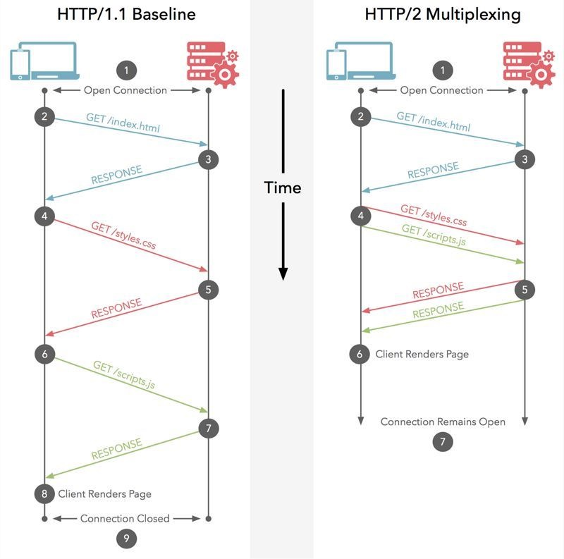
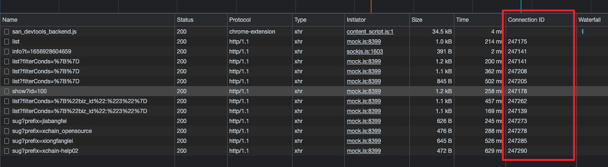
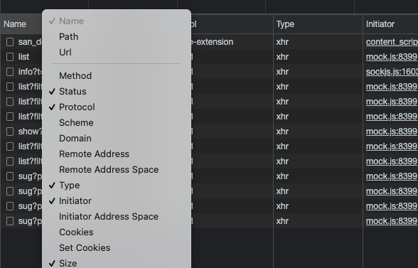
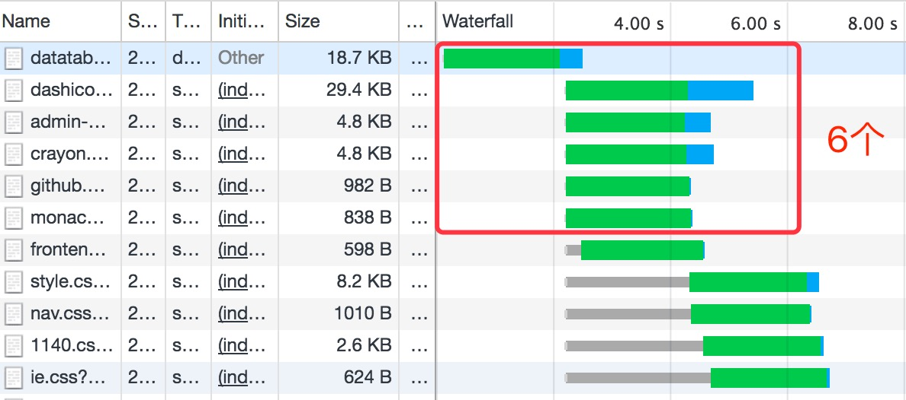
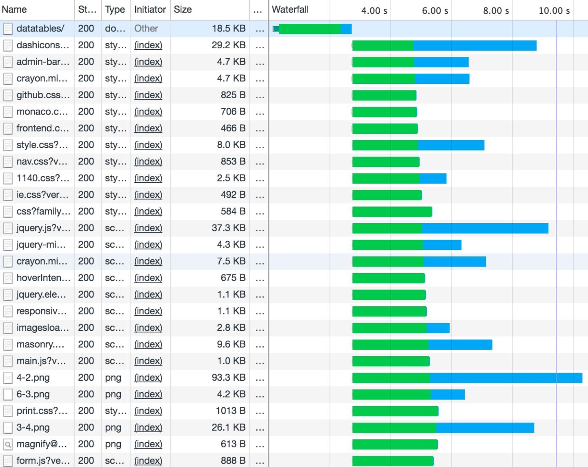

# 计算机基础
* osi七层模型与tcp/ip五层模型
* TCP与UDP的区别
* TCP三次握手，四次挥手
* TCP如何可靠传输
* TCP拥塞控制
* 什么是HTTP协议
* http请求方法
* 常见请求头字段
* 响应头字段
* Content-type
* 长连接与多路复用
* HTTPS
* 进程与线程
* 基于对象与面向对象
* ARP，RARP 协议
* 数据库事务的四个特性
* linux解压命令

## osi七层模型与tcp/ip五层模型

**OSI定义了网络互连的七层框架**

* 应用层：针对你特定应用的协议
* 表示层：设备固定的数据格式和网络标准数据格式之间的转化
* 会话层：通信管理，负责建立和单开通信连接，管理传输层 以下分层
* 传输层：管理两个节点之间的数据传递。负责可靠传输
* 网络层：地址管理和路由选择
* 数据链路层：互联设备之间传送和识别数据帧
* 物理层：界定连接器和网线之间的规格

**TCP/IP四（五）层模型**

每一层都呼叫它的下一层提供的网络来完成自己的需求。（如果是四层模型数据链路层和物理层在一层）

* 物理层：负责光电信号传递方式。集线器工作在物理层。以太网协议。
* 数据链路层：负责设备之间的数据帧的传输和识别。交换机工作在数据链路层。例如网卡设备的驱动，帧同步，冲突检测，数据差错校验等工作。
* 网络层：负责地址管理和路由选择。路由器工作在网络层。
* 传输层：负责两台主机之间的数据传输。
* 应用层：负责应用程序之间的沟通。网络编程主要针对的就是应用层。

## TCP与UDP的区别

* tcp 和 udp 都是属于传输层，传输层提供应用程序间的通信，其功能包括格式化信息流，提供可靠传输。

* TCP面向连接（如打电话要先拨号建立连接）;UDP是无连接的，即发送数据之前不需要建立连接

* TCP提供可靠的服务。也就是说，通过TCP连接传送的数据，无差错，不丢失，不重复，且按序到达;UDP尽最大努力交付，即不保证可靠交付。

* Tcp通过校验和，重传控制，序号标识，滑动窗口、确认应答实现可靠传输。如丢包时的重发控制，还可以对次序乱掉的分包进行顺序控制。

* UDP具有较好的实时性，工作效率比TCP高，适用于对高速传输和实时性有较高的通信或广播通信。

**为什么UDP有时比TCP更有优势?**

* UDP以其简单、传输快的优势，在越来越多场景下取代了TCP,如实时游戏。

* 网速的提升给UDP的稳定性提供可靠网络保障，丢包率很低，如果使用应用层重传，能够确保传输的可靠性。

* TCP为了实现网络通信的可靠性，使用了复杂的拥塞控制算法，建立了繁琐的握手过程，由于TCP内置的系统协议栈中，极难对其进行改进。

* 采用TCP，一旦发生丢包，TCP会将后续的包缓存起来，等前面的包重传并接收到后再继续发送，延时会越来越大，基于UDP对实时性要求较为严格的情况下，采用自定义重传机制，能够把丢包产生的延迟降到最低，尽量减少网络问题对游戏性造成影响

## TCP三次握手，四次挥手

```js
三次握手：通俗的讲
                客户端：HI听见了吗,
                服务器端：HI我听见了，
                客户端：我也听见你了。     接下来开始愉快地聊天
四次握手：通俗的讲
                客户端：我们分手把，
                服务端：好的，你等我把数据给你传输完
                服务端：我传输完了，
                客户端：好了，可以分手了。 接下来就真正的分手了
```

* [三次握手](https://img-blog.csdn.net/20180717202520531?watermark/2/text/aHR0cHM6Ly9ibG9nLmNzZG4ubmV0L3FxXzM4OTUwMzE2/font/5a6L5L2T/fontsize/400/fill/I0JBQkFCMA==/dissolve/70)
* [四次挥手](https://img-blog.csdn.net/20180717204202563?watermark/2/text/aHR0cHM6Ly9ibG9nLmNzZG4ubmV0L3FxXzM4OTUwMzE2/font/5a6L5L2T/fontsize/400/fill/I0JBQkFCMA==/dissolve/70)
* SYN (synchronous建立联机) 
* ACK (acknowledgement 确认) 
* FIN (finish结束) 
* Sequence number (顺序号码) 
* 为什么TIME_WAIT状态需要经过2MSL(最大报文段生存时间)才能返回到CLOSE状态

```js
为了保证A发送的最后一个ACK报文能够到达B。这个ACK报文段有可能丢失，因而使处在LAST-ACK状态的B收不到对已发送的FIN+ACK报文段的确认。B会超时重传这个FIN+ACK报文段，而A就能在2MSL时间内收到这个重传的FIN+ACK报文段。
```

## TCP如何可靠传输

* 重传机制
* 滑动窗口
  * 可以指定窗口大小，窗口大小就是指**无需等待确认应答，而可以继续发送数据的最大值**。
* 流量控制
  * TCP 提供一种机制可以让「发送方」根据「接收方」的实际接收能力控制发送的数据量，这就是所谓的流量控制。
* 拥塞控制
  * 慢启动
  * 拥塞避免
  * 拥塞发生
  * 快速恢复

## TCP拥塞控制

拥塞控制主要是四个算法：

* 慢启动
* 拥塞避免
* 拥塞发生
* 快速恢复

[图示](https://pic3.zhimg.com/80/v2-de79bf2c38bddb0c1caf5768577648e2_720w.jpg)

### 慢热启动算法 – Slow Start

所谓慢启动，也就是TCP连接刚建立，一点一点地提速，试探一下网络的承受能力，以免直接扰乱了网络通道的秩序。

> 1) 连接建好的开始先初始化拥塞窗口cwnd大小为1，表明可以传一个MSS大小的数据。 2) 每当收到一个ACK，cwnd大小加一，呈线性上升。 3) 每当过了一个往返延迟时间RTT(Round-Trip Time)，cwnd大小直接翻倍，乘以2，呈指数让升。 4) 还有一个ssthresh（slow start threshold），是一个上限，当cwnd >= ssthresh时，就会进入“拥塞避免算法”（后面会说这个算法）

### 拥塞避免算法 – Congestion Avoidance

如同前边说的，当拥塞窗口大小cwnd大于等于慢启动阈值ssthresh后，就进入拥塞避免算法。算法如下：

> 收到一个ACK，则cwnd = cwnd + 1 / cwnd 2) 每当过了一个往返延迟时间RTT，cwnd大小加一。过了慢启动阈值后，拥塞避免算法可以避免窗口增长过快导致窗口拥塞，而是缓慢的增加调整到网络的最佳值。

### 拥塞发生

最为早期的TCP Tahoe算法就只使用上述处理办法，但是由于一丢包就一切重来，导致cwnd又重置为1，十分不利于网络数据的稳定传递。

所以，TCP Reno算法进行了优化。当收到三个重复确认ACK时，TCP开启快速重传Fast Retransmit算法，而不用等到RTO超时再进行重传：

- cwnd大小缩小为当前的一半
- ssthresh设置为缩小后的cwnd大小
- 然后进入快速恢复算法Fast Recovery。

### 快恢复

在进入快速恢复之前，cwnd和ssthresh已经被更改为原有cwnd的一半。快速恢复算法的逻辑如下：

- cwnd = cwnd + 3 * MSS，加3 * MSS的原因是因为收到3个重复的ACK。
- 重传DACKs指定的数据包。
- 如果再收到DACKs，那么cwnd大小增加一。
- 如果收到新的ACK，表明重传的包成功了，那么退出快速恢复算法。将cwnd设置为ssthresh，然后进入拥塞避免算法。

## 什么是 HTTP 协议

> 超文本传输协议，是一个基于请求与响应，无状态的，应用层的协议，常基于TCP/IP协议传输数据，互联网上应用最为广泛的一种网络协议,所有的WWW文件都必须遵守这个标准。设计HTTP的初衷是为了提供一种发布和接收HTML页面的方法。

| 版本     | 产生时间 | 内容                                                         | 发展现状           |
| -------- | -------- | ------------------------------------------------------------ | ------------------ |
| HTTP/0.9 | 1991年   | 不涉及数据包传输，规定客户端和服务器之间通信格式，只能GET请求 | 没有作为正式的标准 |
| HTTP/1.0 | 1996年   | 传输内容格式不限制，增加PUT、PATCH、HEAD、 OPTIONS、DELETE命令 | 正式作为标准       |
| HTTP/1.1 | 1997年   | 持久连接(长连接)、节约带宽、HOST域、管道机制、分块传输编码   | 2015年前使用最广泛 |
| HTTP/2   | 2015年   | 多路复用、服务器推送、头信息压缩、二进制协议等               | 逐渐覆盖市场       |

## 长连接与多路复用

* 长连接：在一个TCP连接上可以传送多个HTTP请求和响应，减少了建立和关闭连接的消耗和延迟，在HTTP1.1中默认开启Connection： keep-alive，一定程度上弥补了HTTP1.0每次请求都要创建连接的缺点。

* 二进制分帧：在HTTP1.x中，我们是通过文本的方式传输数据。基于文本的方式传输数据存在很多缺陷，文本的表现形式有多样性，因此要做到健壮性考虑的场景必然有很多，但是二进制则不同，只有0和1的组合，因此选择了二进制传输，实现方便且健壮。（1帧 = 8字节，最小通信单位）

* 首部压缩：在HTTP1.0中，我们使用文本的形式传输header，在header中携带cookie的话，每次都需要重复传输几百到几千的字节，这着实是一笔不小的开销。

  在HTTP2.0中，我们使用了HPACK（HTTP2头部压缩算法）压缩格式对传输的header进行编码，减少了header的大小。并在两端维护了索引表，用于记录出现过的header，后面在传输过程中就可以传输已经记录过的header的键名，对端收到数据后就可以通过键名找到对应的值。

* 请求优先级：把HTTP消息分为很多独立帧之后，就可以通过优化这些帧的交错和传输顺序进一步优化性能。

* 多路复用：在 HTTP 1.0 中，发起一个请求是这样的：


```js
浏览器请求 url -> 解析域名 -> 建立 HTTP 连接 -> 服务器处理文件 -> 返回数据 -> 浏览器解析、渲染文件 

这个流程最大的问题是，每次请求都需要建立一次 HTTP 连接，也就是我们常说的3次握手4次挥手，这个过程在一次请求过程中占用了相当长的时间，而且逻辑上是非必需的，因为不间断的请求数据，第一次建立连接是正常的，以后就占用这个通道，下载其他文件，这样效率多高啊！

为了解决这个问题， HTTP 1.1 中提供了 Keep-Alive，允许我们建立一次 HTTP 连接，来返回多次请求数据。

但是这里有两个问题：

HTTP 1.1 基于串行文件传输数据，因此这些请求必须是有序的，比如需要传输：hello world，只能从h到d一个一个的传输，不能并行传输，因为接收端并不知道这些字符的顺序。所以实际上我们只是节省了建立连接的时间，而获取数据的时间并没有减少

最大并发数问题，假设我们在 Apache 中设置了最大并发数 300，而因为浏览器本身的限制，最大请求数为 6，那么服务器能承载的最高并发数是 50

而 HTTP/2 引入二进制数据帧和流的概念，其中帧对数据进行顺序标识，这样浏览器收到数据之后，就可以按照序列对数据进行合并，而不会出现合并后数据错乱的情况。同样是因为有了序列，服务器就可以并行的传输数据。

HTTP/2 对同一域名下所有请求都是基于流，也就是说同一域名不管访问多少文件，也只建立一路连接。同样Apache的最大连接数为300，因为有了这个新特性，最大的并发就可以提升到300，比原来提升了6倍。

就好比面试，HTTP1.1是一面之后，视频不断继续二面，HTTP2.0是只要有面试官来了就同时面试（传输数据）
```



### 怎么理解多路复用

**HTTP/2是基于二进制“帧”的协议，HTTP/1.1是基于“文本分割”解析的协议。**

HTTP 1.1 基于串行文件传输数据，因此这些请求必须是有序的，比如需要传输：hello world，只能从h到d一个一个的传输，不能并行传输，因为接收端并不知道这些字符的顺序。

而 HTTP/2 引入二进制数据帧和流的概念，其中帧对数据进行顺序标识，这样浏览器收到数据之后，就可以按照序列对数据进行合并，而不会出现合并后数据错乱的情况。同样是因为有了序列，服务器就可以并行的传输数据。

### TCP 队头阻塞和 HTTP 队头阻塞

* TCP 队头阻塞：TCP数据包是有序传输，中间一个数据包丢失，会等待该数据包重传，造成后面的数据包的阻塞。
* HTTP 队头阻塞：http1.1采用长连接，可以在一个TCP请求上，发送多个http请求。**管道化的机制**使得请求可以并行发出，但是响应必须串行返回。后一个响应必须在前一个响应之后。原因是，没有序号标明顺序，只能串行接收。这就会造成队头阻塞，前一个响应未及时返回，后面的响应被阻塞

### 如何解决队头阻塞

* TCP 队头阻塞：直接弃用。。详见[Http3](https://network.51cto.com/article/625999.html)
* HTTP 队头阻塞：
  * 建立多个 Tcp 连接，如 chrome 最多限制6个并发请求，每个 TCP 连接对应一个 `connection ID`
  * Http2 多路复用，对于同一域名只需要创建一个连接，而不是像 http/1.1 那样创建 6~8 个连接



### 如何在 chrome 中查看 http 协议

只需在 network 中右键点击表头，就可以控制展示的列，其中就有 protocol 选项。



### http 1.1 和 http 2 对比

在http 1.1，所以浏览器会限制同一个域的同时请求数，Chrome是限制6个，如图：



但当我们开启了http/2之后，个数几乎没有限制了，如下图所示：



不过请求的顺序及并发并不完全依赖于此，如果在项目中写了如下代码：

```js
async getData() {
  await this.getList1();
  await this.getList2();
  await this.getList3();
  await this.getList4();
  await this.getList5();
}
```

那么在 chrome 中的表现如下：


我们一般可以优化为：

```js
async getData() {
	 await Promise.all([
     this.getList1(),
     this.getList2(),
     this.getList3(),
     this.getList4(),
     this.getList5(),
   ]);
}
```

## HTTPS

HTTP请求都是明文传输的，所谓的明文指的是没有经过加密的信息，如果HTTP请求被黑客拦截，并且里面含有银行卡密码等敏感数据的话，会非常危险。为了解决这个问题，Netscape 公司制定了HTTPS协议，HTTPS可以将数据加密传输，也就是传输的是密文，即便黑客在传输过程中拦截到数据也无法破译，这就保证了网络通信的安全。

* HTTP协议运行在TCP之上，所有传输的内容都是明文，HTTPS运行在SSL/TLS之上，SSL/TLS运行在TCP之上，所有传输的内容都经过加密的，保证了通信的保密性。当然SSL协议并不能对UDP应用进行保护

* 虽然使用 HTTP 协议无法确定通信方，使用 SSL可以。SSL使用了一种被称为证书的手段，证书由值得信任的第三方机构颁发，使用HTTPS协议需要到CA申请证书，一般免费证书很少，需要交费。证书用以证明服务器和客户端是实际存在的。身份确认过程使用RSA非对称密钥加密方式（破解难度基于两个大素数乘积的因式分解难度），但是为了提高效率，身份确认完成后使用共商后的对称密钥。

* SSL协议位于TCP/IP协议与各种应用层协议（不止能用于HTTP）之间，为数据通讯提供安全支持。

  SSL协议可分为两层：

  （1）SSL记录协议：建立在可靠的传输协议（如TCP）之上，为高层协议提供数据封装、压缩、加密等基本功能的支持。

  （2）SSL握手协议：建立在记录协议之上，用于数据传输开始前的双方身份认证、协商加密算法、交换加密密钥等。

* 主要流程：

  * 客户端向服务器发起HTTPS请求，连接到服务器的443端口
  * 服务器端有一个密钥对，即公钥和私钥，是用来进行非对称加密使用的，服务器端保存着私钥，不能将其泄露，公钥可以发送给任何人。
  * 服务器将自己的公钥发送给客户端。
  * 客户端收到服务器端的证书之后，会对证书进行检查，验证其合法性，如果发现发现证书有问题，那么HTTPS传输就无法继续。如果公钥合格，那么客户端会生成一个随机值，这个随机值就是用于进行对称加密的密钥，我们将该密钥称之为client key，即客户端密钥，这样在概念上和服务器端的密钥容易进行区分。然后用服务器的公钥对客户端密钥进行非对称加密，这样客户端密钥就变成密文了，至此，HTTPS中的第一次HTTP请求结束。
  * 客户端会发起HTTPS中的第二个HTTP请求，将加密之后的客户端密钥发送给服务器。
  * 服务器接收到客户端发来的密文之后，会用自己的私钥对其进行非对称解密，解密之后的明文就是客户端密钥，然后用客户端密钥对数据进行对称加密，这样数据就变成了密文。
  * 然后服务器将加密后的密文发送给客户端。
  * 客户端收到服务器发送来的密文，用客户端密钥对其进行对称解密，得到服务器发送的数据。这样HTTPS中的第二个HTTP请求结束，整个HTTPS传输完成。
  
* **注意：** **HTTPS 在内容传输的加密上使用的是对称加密，非对称加密只作用在证书验证阶段。**

* 为什么数据传输是用对称加密的？

  - 非对称加密的加解密**效率非常低**，而HTTP的应用场景中通常端与端之间存在大量的交互，非对称加密的效率是无法接受的。
  - 在 HTTPS 的场景中只有服务端保存了私钥，**客户端不做非对称密钥生成**，一对公钥和私钥只能实现单向的加解密，所以HTTPS 中内容传输加密采取的是对称加密，而不是非对称加密。

****

> https并非应用层的一种新协议，只是http通信接口部分用ssl/tls协议代替而已。
>
> SSL和TLS都是加密协议
> 通常http直接和tcp通信，当使用ssl时则演变成先和ssl通信，再由ssl和tcp通信。
> 所谓https，其实就是身披ssl协议这层外壳的http。（回忆一下osi7层,TCP/IP4层，我们学的是5层）
>
> SSL协议采用的是非对称加密算法，客户端先向服务器端索要公钥，然后用公钥加密信息，服务器收到密文后，用自己的私钥解密.
>
> RSA算法：两个大素数p,q，n=pq,f(n)=(p-1)(q-1),1<b<f(n),a=b^-1modf(n),公钥n,b,私钥p,q,a
>
> 证书，顾名思义，就是证明的文件。例如浏览器和 tlanyan.me 服务器通信，浏览器怎么知道对方就是 tlanyan.me 对应的服务器呢？在不可信的网络下通信，中立的第三方作用就显现出来了。权威的第三方中立机构（ Certificate Authority, CA）收到 tlanyan.me 持有者的证书请求并核验信息后，将持有者的名称、公钥与 CA 用私钥生成的数字签名等信息写成证书颁发给申请者。
>
> 当你访问使用 HTTPS（连接安全）的网站时，该网站的服务器会使用证书向浏览器（如 Chrome）证明该网站的身份。任何人都可以创建证书，随意声称对应的网站是任意网站。
>
> 为了确保您安全上网，Chrome 会要求网站使用来自受信任组织发放的证书。

## [http请求方法](https://developer.mozilla.org/zh-CN/docs/Web/HTTP/Methods)

```js
GET
```

GET方法请求一个指定资源的表示形式. 使用GET的请求应该只被用于获取数据.

```js
HEAD
```

HEAD方法请求一个与GET请求的响应相同的响应，但没有响应体，一般用于1.检查资源的有效性。 2.检查超链接的有效性。 3.检查网页是否被串改。 

```js
POST
```

POST方法用于将实体提交到指定的资源，通常导致在服务器上的状态变化或副作用. 

```js
PUT
```

PUT方法用请求有效载荷替换目标资源的所有当前表示。

```js
DELETE
```

DELETE方法删除指定的资源。

```js
CONNECT
```

CONNECT方法建立一个到由目标资源标识的服务器的隧道。

```js
OPTIONS
```

OPTIONS方法用于描述目标资源的通信选项。

```js
TRACE
```

TRACE方法沿着到目标资源的路径执行一个消息环回测试。

```js
PATCH
```

PATCH方法用于对资源应用部分修改。

## 常见请求头

HTTP 首部字段是由首部字段名和字段值构成的，中间用冒号“:” 分隔。

> 首部字段名: 字段值

另外，字段值对应单个 HTTP 首部字段可以有多个值，多个指令之间通过“,”分隔。如下所示。

> Keep-Alive: timeout=15, max=100

若想要加优先级，则使用 q=来额外表示权重值 1 ，用分号（;）进行分隔。权重值 q 的范围是 0~1（可精确到小数点后 3位），且 1 为最大值。不指定权重 q 值时，默认权重为 q=1.0。

> Accept-Language: zh-CN,zh;q=0.9,en;q=0.8

### 请求头字段

* Accept

> Accept: image/webp,image/apng,image/*,*/*;q=0.8
>
> Accept 首部字段可通知服务器，用户代理能够处理的媒体类型及媒体类型的相对优先级。可使用type/subtype 这种形式，一次指定多种媒体类型。

* Accept-Encoding

> Accept-Encoding: gzip, deflate, br
>
> Accept-Encoding 首部字段用来告知服务器用户代理支持的内容编码及内容编码的优先级顺序。可一次性指定多种内容编码。

* Accept-Language

> Accept-Language: zh-CN,zh;q=0.9,en;q=0.8
>
> 首部字段 Accept-Language 用来告知服务器用户代理能够处理的自然语言集（指中文或英文等），以及自然语言集的相对优先级。可一次指定多种自然语言集。

* Cache-Control

> Cache-Control: no-cache，缓存

* Connection

> Connection: keep-alive
>
> HTTP/1.1 之前的 HTTP 版本的默认连接都是非持久连接。为此，如果想在旧版本的HTTP 协议上维持持续连接，则需要指定Connection 首部字段的值为 Keep-Alive。

* Cookie

> 首部字段 Cookie 会告知服务器，当客户端想获得HTTP 状态管理支持时，就会在请求中包含从服务器接收到的 Cookie。

* Host

> Host: www.baidu.com
>
> 首部字段 Host 会告知服务器，请求的资源所处的互联网主机名和端口号。Host 首部字段在HTTP/1.1 规范内是唯一一个必须被包含在请求内的首部字段。

* Referer

> 首部字段 Referer 会告知服务器请求的原始资源的 URI。它记录了该 HTTP 请求的来源地址。
>
> 如果黑客要对银行网站实施 CSRF 攻击，他只能在他自己的网站构造请求，当用户通过黑客的网站发送请求到银行时，该请求的 Referer 是指向黑客自己的网站。因此，要防御 CSRF 攻击，银行网站只需要对于每一个转账请求验证其 Referer 值 。
>
> 然而，这种方法并非万无一失。Referer 的值是由浏览器提供的 ，目前已经有一些方法可以篡改 Referer 值 
>
> 即便是使用最新的浏览器，黑客无法篡改 Referer 值，这种方法仍然有问题。因为 Referer 值会记录下用户的访问来源，有些用户认为这样会侵犯到他们自己的隐私权，因此，用户自己可以设置浏览器使其在发送请求时不再提供 Referer。当他们正常访问银行网站时，网站会因为请求没有 Referer 值而认为是 CSRF 攻击，拒绝合法用户的访问。

* Origin

> 用来说明请求从哪里发起的，包括，且仅仅包括**协议和域名**。
> 这个参数一般只存在于CORS跨域请求中，可以看到response有对应的header：`Access-Control-Allow-Origin`。

* User-Agent

> 首部字段 User-Agent 会将创建请求的浏览器和用户代理名称等信息传达给服务器。

* Pragma

> Pragma: no-cache
>
> Pragma 是 HTTP/1.1 之前版本的历史遗留字段，仅作为与 HTTP/1.0 的向后兼容而定义。客户端会要求所有的中间服务器不返回缓存的资源。

* Content-Type

> Content-Type来表示具体请求中的媒体类型信息。
>
> **application/x-www-form-urlencoded**
>
> 请求参数格式`key1=val1&key2=val2`的方式进行拼接，并放到请求实体里面，如果是中文或特殊字符等会自动进行URL转码。一般用于表单提交
>
> **application/json**
>
> application/json 作为响应头比较常见，用来告诉服务端消息主体是序列化后的 JSON 字符串，其中一个好处就是JSON 格式支持比键值对复杂得多的结构化数据。由于 JSON 规范的流行，除了低版本 IE 之外的各大浏览器都原生支持JSON.stringify，服务端语言也都有处理 JSON 的函数，使用起来没有困难。

## 响应头字段

**[预检请求](http://www.ruanyifeng.com/blog/2016/04/cors.html)相关响应头**

* Access-Control-Allow-Origin：响应头指定了该响应的资源是否被允许与给定的[origin](https://developer.mozilla.org/zh-CN/docs/Glossary/Origin)共享。

* Access-Control-Allow-Methods:  响应首部 **`Access-Control-Allow-Methods`** 在对 [preflight request](https://developer.mozilla.org/zh-CN/docs/Glossary/Preflight_request).（预检请求）的应答中明确了客户端所要访问的资源允许使用的方法或方法列表。

* Access-Control-Allow-Headers:  响应首部 **`Access-Control-Allow-Headers`** 用于 [preflight request](https://developer.mozilla.org/zh-CN/docs/Glossary/Preflight_request) （预检请求）中，列出了将会在正式请求的 [`Access-Control-Request-Headers`](https://developer.mozilla.org/zh-CN/docs/Web/HTTP/Headers/Access-Control-Request-Headers) 字段中出现的首部信息。

* Access-Control-Allow-Credentials: 当请求要求携带证书信息（例如cookie,授权信息等）验证，服务器端是否允许携带

* Access-Control-Max-Age: 本次预检请求的有效期，单位为秒

****

* Date

> 服务端响应客户端的时间

* Server

> 服务器名字

* Content-Type

> 服务端发送的媒体类型

* Set-Cookie

> 浏览器会在当前页面所在域名设置cookie，当浏览器再次发送请求时，浏览器默认会自动将cookie放在请求头中的Cookie项中发送给服务器。

* [Cache-Control、E-Tag 、 Last-Modified](https://juejin.cn/post/6844903763665240072)

* Content-Encoding

> 文档的编码（Encode）方法。只有在解码之后才可以得到Content-Type头指定的内容类型。利用gzip压缩文档能够显著地减少HTML文档的下载时间。

* Connection

> Keep-alive 长连接

## Content-type

### 用于前端请求

> Content-Type设置与get请求无关,一般与post请求相关
>
> 当用form表单提交时 Content-Type 默认为`application/x-www-form-urlencoded`，当用XHR提交时，Content-Type默认为`application/json`

- `Content-Type`为`application/x-www-form-urlencoded`时提交数据的方式为`a = 123&b = 456&c = [1,2,3]`

- `Content-Type`为`application/json`时需要以json形式提交`body: '{"a":123,"b":456}'`

### 用于后端响应

* 'text/html'  // 用于指定html文件

* 'text/plain' // html的源码会显示到页面上

* 'text/css'  // 用于指定css文件

* 'image/jpg'  // 用于指定图片格式

* 'aplication/javascript' // 用于指定js文件

* 'application/json' // 用于指定请求接口的数据格式

## 进程与线程

- 进程是CPU资源分配的最小单位（能拥有资源和独立运行的最小单位）
- 线程是CPU调度的最小单位（线程是建立在进程基础上的一次程序运行单位，一个进程可以有多个线程）
- 同一进程中的多条线程讲共享该进程中的全部系统资源，但是同一进程中的多个线程有各自的调用栈，自己的线程本地存储。一个进程可以有很多线程，每条线程并行执行不同的任务
- 进程间通信方式：管道、信号量、消息队列、共享内存、套接字（socket）。
- 线程间的通信目的主要是用于线程同步，所以线程没有像进程通信中的用于数据交换的通信机制。（锁机制：包括互斥锁、条件变量、读写锁，信号量机制(Semaphore)，信号机制(Signal)）

## 基于对象与面向对象

* 面向对象的三大特点（封装，继承，多态）缺一不可，例如 c++，java
* 基于对象的语言，使用一些封装好的对象，调用对象的方法，设置对象的属性，但是无法派生新的对象类型，只能使用现有对象的方法和属性。
* javascript虽然通过原型链等实现了继承，通过arguments实现函数重载等特点，但是都是属于模拟实现，本质上还是基于对象的语言，实际上可以实现面向对象编程。

## ARP，RARP 协议

> arp协议：地址解析协议
>
> 局域网中，本地主机要向某个主机发送消息，仅知道该主机的IP地址，并不知道主机的MAC地址，通过ARP协议获取 MAC 地址。
>
> 1. 主机 A 自身 arp 缓存表中，没有主机B的MAC信息，会在整个网络中广播 arp 请求
> 2. 主机 B 接收到 arp 请求后，先将主机 A 的 MAC 的地址加入自己的 arp 缓存表中
> 3. 再发送 arp 答复，我是主机 B，我的 mac 地址是什么
> 4. 主机 A 添加主机 B 的 MAC 地址信息，给主机 B 发送信息，根据 arp 缓存表直接发送
>
> rarp协议：反向地址解析协议
>
> 局域网中，知道了某个主机的 MAC 地址，不知道某个主机的 IP 地址，通过 rarp 协议获得地址。

## 数据库事务的四个特性

事务（Transaction）是并发控制单位，是用户定义的一个操作序列，这些操作要么都做，要么都不做，是一个不可分割的工作单位。

事务具有四个特征：原子性（ Atomicity ）、一致性（ Consistency ）、隔离性（ Isolation ）和持续性（ Durability ）。这四个特性简称为 ACID 特性。

## 数据库索引与B+树

数据库索引其实就是为了使查询数据效率快。

1. 聚集索引（主键索引）：在数据库里面，所有行数都会按照主键索引进行排序。(拼音首字母作为主键查字典)
2. 非聚集索引：就是给普通字段加上索引。（偏旁部首去查）
3. 联合索引：就是好几个字段组成的索引，称为联合索引。（拼音+偏旁部首去查）

[B+树](http://www.liuzk.com/410.html)

## 死锁

死锁是指两个或两个以上的进程在执行过程中，由于竞争资源或者由于彼此通信而造成的一种阻塞的现象，若无外力作用，它们都将无法推进下去。此时称系统处于死锁状态或系统产生了死锁，这些永远在互相等待的进程称为死锁进程。

例如：线程 A 持有 lockA 对象，并请求 lockB 对象；线程 B 持有 lockB 对象，并请求 lockA 对象。由于他们都在等待对方释放资源，所以会产生死锁

## 有限自动机

- 一般我们会用**状态图**来描述一个**有限自动机**（Finite Automata）。它有且只有一个**起始状态**（在状态图中，一个从不知道什么地方来的箭头指向的状态），有一些**接受状态**（状态图中有两个圈圈起来的状态）。
- 有限自动机的输出是**接受**或者**拒绝**。

## 编译原理的过程

> 词法分析生成tokens流，语法分析转换成AST，AST节点遍历进行处理

## linux 解压命令

https://blog.csdn.net/qq_40232872/article/details/79159753