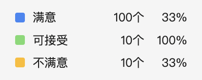

# flex布局
* flex常见属性
* flex-grow，flex-shrink，flex-basis
* flex:1
* space-evenly
* flex布局实例

****

* [Flex 布局教程：语法篇](http://www.ruanyifeng.com/blog/2015/07/flex-grammar.html)
* [flex:1详解](https://blog.csdn.net/qq_40138556/article/details/103967529)
* [重点看这篇文章](https://blog.csdn.net/u012260238/article/details/86656175)

```css
.item {flex: none;}
.item {
    flex-grow: 0;
    flex-shrink: 0;
    flex-basis: auto;
}
```

```css
.item {flex: auto;}
.item {
    flex-grow: 1;
    flex-shrink: 1;
    flex-basis: auto;
}
```

```css
.item {flex: 1;}
.item {
    flex-grow: 1;
    flex-shrink: 1;
    flex-basis: 0%;
}
```

```css
.item-1 {flex: 0%;}
.item-1 {
    flex-grow: 1;
    flex-shrink: 1;
    flex-basis: 0%;
}

.item-2 {flex: 24px;}
.item-1 {
    flex-grow: 1;
    flex-shrink: 1;
    flex-basis: 24px;
}
```

```css
.item {flex: 2 3;}
.item {
    flex-grow: 2;
    flex-shrink: 3;
    flex-basis: 0%;
}
```

```js
flex-basis 规定的是子元素的基准值。所以是否溢出的计算与此属性息息相关。flex-basis 规定的范围取决于 box-sizing。这里主要讨论以下 flex-basis 的取值情况：

auto：首先检索该子元素的主尺寸，如果主尺寸不为 auto，则使用值采取主尺寸之值；如果也是 auto，则使用值为 content。

content：指根据该子元素的内容自动布局。(内容多的占比也会多)

百分比：根据其包含块（即伸缩父容器）的主尺寸计算。如果包含块的主尺寸未定义（即父容器的主尺寸取决于子元素），则计算结果和设为 auto 一样。
```

* space-evenly为项目之间间距与项目与容器间距相等，相当于除去项目宽度，平均分配了剩余宽度作为项目左右margin。

## flex 布局实例

* 场景：一行5个卡片，卡片数量不限，自动换行，从左到右排列，比如现在有9个卡片：

```js
// 如下效果
1 1 1 1 1
1 1 1 1
```

* 每一行子元素的总基准值是：20% * n
* flex-grow 和 flex-shrink 都是 0，不允许放大和缩小，除基准值之外的剩余空间不会被分配

```css
.list {
  display: flex;
  flex-flow: row wrap;
  justify-content: start;
}
.item {
  flex: 0 0 20%;
}
```

****

* 场景：如何实现以下效果，文字部分左对齐，数字百分号部分右对齐



  

```html
<div class="wrap">
  <div class="icon"><span></span></div>
  <div class="name">满意</div>
  <div class="num">100</div>
  <div class="percent">10%</div>
</div>
```

```css
.manner {
  display: flex;
  align-items: center;
  flex-direction: row;
  .icon {
    text-align: left;
    flex: 0 0 10%;
  }
  .name {
    text-align: left;
    flex: 0 0 35%;
  }
  .sum {
    text-align: right;
    flex: 0 0 30%;
  }
  
  .percent {
    text-align: right;
    flex: 0 0 25%;
  }
}
```

> 使用百分比的原因是在外层盒子变化时，里面的元素也会跟随着变化。
>
> 对齐方案使用 text-align 即可。