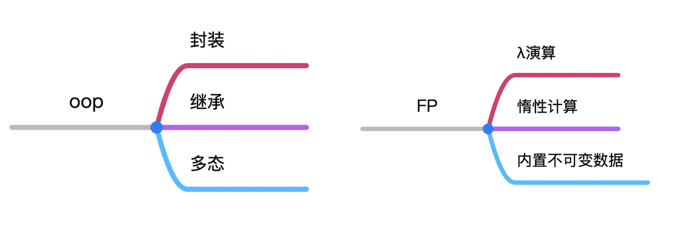
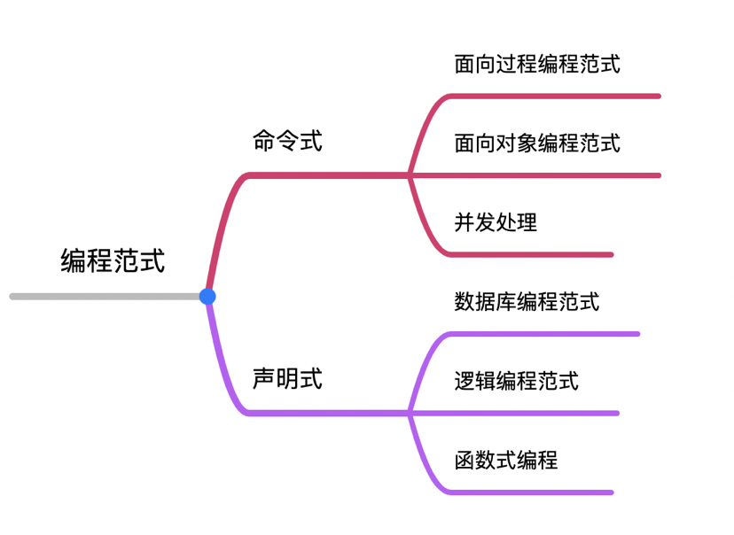
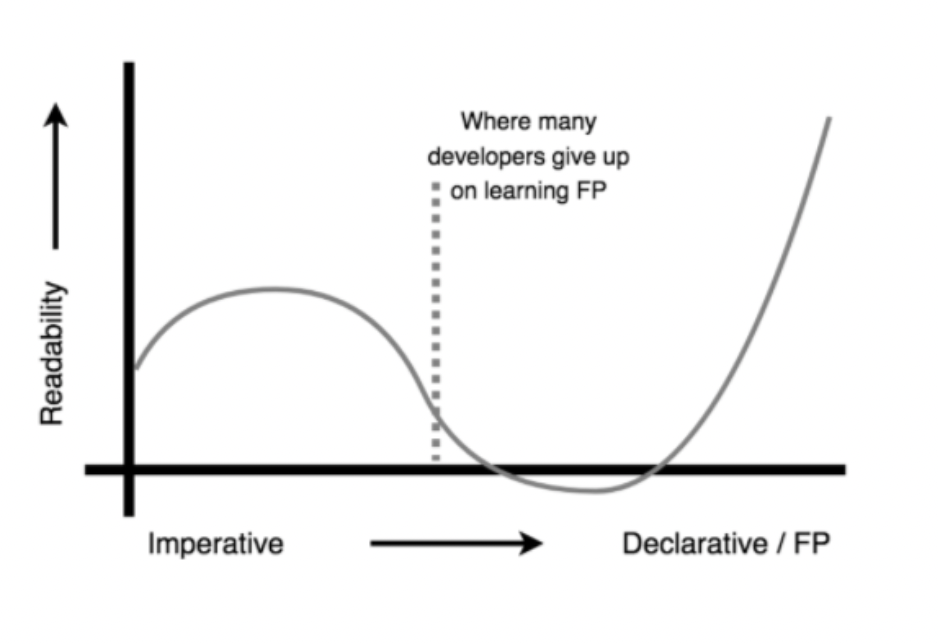
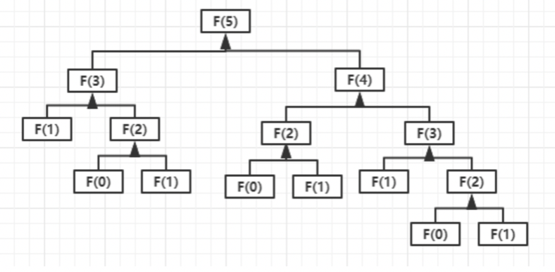
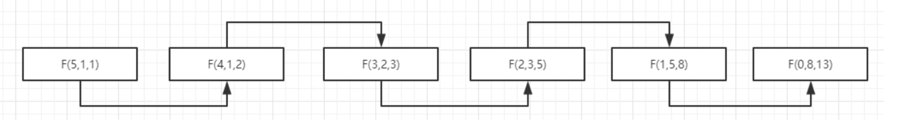

# 函数式编程

## JavaScript是函数式语言吗

JavaScript 既不是 C++，Java 那样的纯面向对象语言，也不是 Haskell 和 Lisp 那样的纯函数式语言。



> Js 可以通过某些方式来实现封装，继承，多态，函数重载，但其中面向对象的设计模式是通过原型对象来实现的，并不是真正的面向对象语言。
>
> Js 允许匿名函数、高阶函数、闭包等函数式特性，且惰性计算可以通过 lazy.js 库实现，不可变数据可以简单地通过编程技术来实现，但这些都是需要程序员 polyfill，并不是语言本身所带的特性。

## 函数式编程定义

In computer science, functional programming is a programming paradigm where programs are constructed by applying and composing functions.

在计算机科学中，函数式编程是一种通过应用和组合函数来构建程序的编程范式。

## 编程范式

编程范式 指的是一种编程风格，它描述了程序员对程序执行的看法。在编程的世界中，同一个问题，可以站在多个角度去分析解决，这些不同的解决方案就对应了不同的编程风格。



* Imperative 命令式：使用流程化的语句和过程直接控制程序的运行和数据状态。
* Declarative 声名式：定义计算的逻辑而不是定义具体的流程控制。

> 命令式，几乎完全集中于告诉计算机“如何”完成任务，它充斥着“if”语句、“for”循环、临时变量、带有副作用的函数调用以及函数之间的隐式数据流。当然，你可以通过它的逻辑来查看数据是如何流动和更改到最终状态的，但它一点也不清楚或直接。
>
> 声明式，它消除了前面提到的大多数命令式技术。注意没有显式的条件、循环、副作用。相反，它使用我们所说的函数式编程，如转换和组合。

## 函数式编程优势

* 代码精简
* 模块化
* 复用性
* 减少耦合
* 可读性



## 衍生应用场景

* 纯函数
* 记忆函数
* 递归与尾递归
* 高阶函数
* 闭包
* 函数柯里化
* 偏函数
* 函数组合
* 惰性求值

### 纯函数

纯函数（*Pure Functions*）是这样一种函数，即相同的输入，永远会得到相同的输出，而且没有任何可观察的副作用。这意味着对外部状态的解耦。

-  可缓存性（Cacheable）
-  可测试性（Testable）
-  合理性（Reasonable）
-  并行代码（Parallel Code）
-  可移植性／自文档化（Portable / Self-Documenting）

```js
// slice 是纯函数，splice 不是
const arr = [1,2,3,4,5,6]
arr.slice(0,2) //[1,2]
arr.slice(0,2) //[1,2]

arr.splice(0,2) //[1,2]
arr.splice(0,2) //[3,4]
```

### 副作用

只要是跟函数外部环境发生的交互就都是副作用---这一点可能会让你怀疑无副作用编程的可行性。

- 发送一个 http 请求
- 获取用户输入
- DOM 查询
- 往数据库插入记录
- 打印/log
- …

> 函数式编程的**哲学**就是假定副作用是造成不正当行为的主要原因。

### 递归与尾递归

> 如何实现一个计算斐波那契数列的函数？
>
> fibonacci：1，1，2，3，5，8，13       函数表达：f (n) = f (n - 1) + f (n - 2)

```js
// 迭代
const fibonacci = n => {
  let current = 0;
  let next = 1;
  for (let i = 0; i < n; i++) {
    [current, next] = [next, current + next];
  }
  return current;
}

// 递归
const fibonacci = n => {
  return n < 3 ? 1 : fibonacci(n - 1) + fibonacci(n - 2);
}
```

递归的缺点：压栈和出栈会消耗性能。



```js
// 尾递归
const fibonacci = (n, sum1 = 1, sum2 = 1) => {
  if (n < 3) return sum2;
  return fibonacci(n - 1, sum2, sum1 + sum2);
}
```



### 记忆函数

```js
function memoize (fn) {
    let cache = {};
    return function () {
        let key = JSON.stringify(arguments);
        cache[key] = cache[key] || fn(...arguments); // 不必重新执行
        return cache[key];
    }
}
let fibonacciWithMemory = memoize(fibonacci);

fibonacciWithMemory(10);
fibonacciWithMemory(10);
```

> 函数经过记忆后运行的例子,可以明显的发现，第二次运行时是几乎不花时间的！
>
> 正是因为纯函数的可靠性，才能确保缓存的数据一定是我们想要的数据。

### 高阶函数

In mathematics and computer science, a higher-order function is a function that does at least one of the following:

- takes one or more functions as arguments (i.e. procedural parameters)
- returns a function as its result.

常见的高阶函数：

* map
* filter
* reduce
* every

```js
// 模拟 map
const map = (array, fn) => {
    let res = []
    for (let i = 0; i < arr.length; i++) {
        res.push(fn(arr[i], i, arr))
    }
    return res
}

// 模拟 every
const every = (array, fn) => {
    let res = true
    for (let value of array) {
        res = fn(value)
        if(!res) break
    }
    return res
}
every(arr, v => v > 10)

// 模拟 some
const some = (array, fn) => {
    let res = false
    for (let value of array) {
        res = fn(value)
        if(res) break
    }
    return res
}
```

### 柯里化与偏函数

* 柯里化：把接受多个参数的函数变换成一系列接受单一参数的函数的技术。将一个 *n* 元函数转换成 *n* 个一元函数。
* 偏函数：一个函数，接受一个多参数的函数且传入部分参数后，返回一个需要更少参数的新函数。也就是将一个 *n* 元函数转换成一个 *n - x* 元函数。**本质上可以将偏函数看成是柯里化的一种特殊情况**。

优势：

* 对函数参数的缓存
* 让函数变得更灵活，让函数的粒度更小
* 把多元函数转换成一元函数，可以组合使用函数产生强大的功能

```js
// arguments对象是所有（非箭头）函数中都可用的局部变量, 所以在这里需要在括号里声明一下 (...arguments)
const curry = (fn, ...args) => 
	args.length < fn.length
     ? (...arguments) => curry(fn, ...args, ...arguments)
	   : fn(...args)

function plus(a, b, c) {
  return a + b + c
}

let curryPlus = curry(plus)
curryPlus(1)(2)(3) // 6
curryPlus(1)(2,3) // 6
curryPlus(1,2)(3) // 6
curryPlus(1,2,3) // 6

let curryPlus = curry(plus, 1, 2, 3) 
console.log(curryPlus) // 6
```

柯里化在 Vue 源码中的应用

```js
// src/platform/web/patch.js
function createPatch (obj) {
    // 这样就不必每次都patch参数里传 obj 了
    return function patch (vdom1, vdom2) {
        ..
    }
}

const patch = createPatch(...)
```

### 函数组合

洋葱代码：`tOUpper(first(reverse(arr))`

可以用函数组合把细粒度的函数组合成一个新的函数

```js
function compose(...args) {
    return function(value) {
        return args.reverse().reduce((acc, cur) => cur(acc), value)
    }
}

// 实现：数组中的字符串 reverse -> 取第一个 -> 转换为大写
function reverse (arr) {
  return arr.reverse()
}
function first (arr) {
  return arr[0]
}
function toUpper(str) {
  return str.toUpperCase()
}

const f = compose(toUpper, first, reverse)
console.log(f(['one', 'two', 'three'])) // THREE
```

> *Pointfree* 编程风格：即不使用所要处理的值，只合成运算过程。

### 惰性计算

[lazy.js]()

惰性计算，也称为非严格计算，按需调用和延迟执行，是一种计算策略，它等待直到需要值才能计算函数的结果，这对函数编程特别有用。

```js
Lazy([1,2,3,4,5,6,7,8,9,10])
	.map(i => i * 2)
	.filter(i => i <= 10)
	.take(3)
	.each(i => print(i))

// 2, 4, 6
```

## 理论范畴

> 对于函数式编程来说，以下这些理论不是必要的，其实你不懂也可以学会函数式编程，作为了解在这里简单介绍下。

- Category theory 范畴论
- Morphisms 态射
- Functors 函子
- Monads 单子
- Semigroup 半群
- Monoid 幺半群

范畴

> 任何事物都是对象，大量的对象结合起来就形成了集合，对象和对象之间存在一个或多个联系，任何一个联系就叫做态射。

函子

> 函子是一个容器，具有 *map* 方法，可以映射到另一个容器。
>
> 自函子：自函子就是一个将范畴映射到自身的函子。

单子

> 自函子范畴上的一个幺半群

幺半群

> 定义一：对于非空集合 *S*，若在 *S* 上定义了二元运算 *○*，使得对于任意的 *a, b* *∈* *S,*有 *a* *○* *b* *∈* *S*，则称 *{S,* *○}* 为群。 
>
> 定义二：若 *{S,* *○}* 为广群，且运算 *○* 还满足结合律，即：任意 *a, b, c* *∈* *S*，有 *(a* *○* *b)* *○* *c = a* *○* *(b* *○* *c)*，则称 *{S,* *○}* 为半群。
>
> 定义三：幺半群是一个存在单位元（幺元）的半群。单位元：对于半群 <S, ○>，存在 e ∈ S，使得任意 a ∈ S 有 a ○ e = e ○ a 

### 函子

```js
class Functor {
  static of (value) {
    return new Functor(value);
  }
  constructor (value) {
    this._value = value;
  }
  map (fn) {
    return Functor.of(fn(this._value));
  }
}

// 链式操作，且不直接操作值
Functor.of(5).map(add5).map(double)
```

- 函子是一个容器，里面包含了值。

- 容器具有map方法。该方法将容器里面的每一个值，映射到另一个容器。

- 函子具有有of方法，用来生成新的容器。

- 运算都是通过函子完成，不直接针对于值。

#### Maybe 函子

```js
// 如何处理初始值为空的情况
Functor.of(null).map(s => s.toUpperCase());

class Maybe {
  static of (value) {
    return new Maybe(value);
  }
  constructor (value) {
    this._value = value;
  }
  map (fn) {
    return this._value ? Maybe.of(fn(this._value)) : Maybe.of(null);
  }
}
```

#### Ethier 函子

```js
// 如何实现以下功能
function addOne (x) {
  return x + 1;
}

Functor.of(5, 6).map(addOne); // Functor(5, 7)
Functor.of(1, null).map(addOne); // Functor(2, null)
```

```js
class Ethier {
  static of (left, right) {
    return new Ethier(left, right);
  }
  constructor (left, right) {
    this.left = left;
    this.right = right;
  }
  map (fn) {
    return this.right 
      ? Ethier.of(this.left, fn(this.right)) : Ethier.of(fn(this.left), this.right);
  }
}
```

### 单子

- 函数嵌套我们可以通过 *compose* 来解决。

- 函子嵌套我们可以通过 *Monads* 来解决。

```js
class Monad {
  static of (value) {
    return new Monad(value);
  }
  constructor (value) {
    this._value = value;
  }
  map (fn) {
    return Monad.of(fn(this._value));
  }
  join () {
    return this.value;
  }
}

const a = Monad.of(Monad.of('str'));
a.join().map(toUpperCase);
```

## 易与不易

- 易：生生之谓易。“落花流水春去也”，这是根本性的规律，人们只有知道如何去适应这种变化的艺术，才不会被社会给淘汰。
- 不易：老子称之为：有物混成，先天地生，寂兮寥兮，独立而不改，周行而不殆。庄子称之为“有情有信，无为无形，可传而不可受，可得而不可见，自本自根，未有天地，自古以固存……先天地生而不为久，长于上古而不为老”。

> 变易：世界上的万事万物包括天地在内，都不是一成不变的，每一分钟都在悄悄的改变着现实的情况，只是有些变化显著，可以被人们所见到，而有些变化缓慢，并不被人们所察觉。
>
> 不易：天地之间万事万物都会改变，可是却有一个永远不变的东西存在，他是万事万物的本源，是永恒的存在。很多人都会感慨“世事无常”，觉得自己好像什么都掌握不住。这世上的变，变的只是现象而已，变的背后一定有不变的东西。所以说不易，就是万事万物背后的规律，背后不变的常则，我们把它叫做“常”，哲学上叫做“本体”。

面向对象编程有两个概念，对象和类。他们是什么？是变化的中间态，个体，实体，张三是一个对象，李四又是一个对象，这是无穷无尽的。

易经里的那个不易，不变，就好比函数式编程，函数具有不变性，一致性。就比如纯函数，一点副作用都没有。所有的变化，最后都通过函数串了起来。而变化的后面，就是不变，以不变应万变。我觉得这就是函数式编程的精髓！

## 参考资料

[JavaScript中的函数式编程](https://github.ahthw.com/natpagle/)

[JavaScript轻量级函数式编程](https://github.com/Simingchen/Functional-Light-JS)

