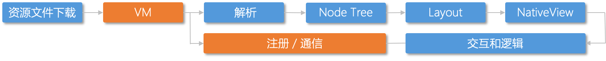

# 跨平台与跨端技术简介

跨平台一般指的是跨操作系统（*nix、windows），而跨端是指客户端（web、android、ios）。

## 跨平台技术

我们知道，cpu 有不同的架构和指令集，上层也有不同的操作系统，一个系统的可执行文件在另一个系统上就是不可执行的，比如 windows 的 exe 文件在 mac 上就不能直接执行。不同的系统就是不同的运行平台。可执行文件是不跨平台的。

### 浏览器

操作系统不同，浏览器上跑的网页的代码确实同一份。浏览器就是一种历史悠久的跨平台方案。

网页跨平台不意味着浏览器也是跨平台的，浏览器的可执行文件还是每个平台单独开发和编译的，但是他们支持的网页解析逻辑一样，这样上面跑的网页就是跨平台的。

### node

起初，node 只能在 *nix 平台上运行，Node 在 v0.6.0 版本支持了 windows 平台，这主要得益于 Node 架构层面的改动，它在操作系统与 Node 上层模块系统之间构建了一层平台层架构，即 libuv。


例如 require 在引入 .node 文件（C++扩展模块）的过程中，*nix 平台下实际调用的是 dlopen 和 dlsym 两个方法；在 windows 平台下则是通过 LoadlibraryExw 和 GetProcAddress 这两个方法实现的，它们分别加载 .so 和 .dll 文件（实际是 .node 文件）

```js
var hello = require('./hello.node');
```

## 跨端技术

简单来说，跨端技术就是写一份代码分别能运行在 ios、android、web，下面介绍一下业界常见的跨端技术：


### webview

参考：https://mp.weixin.qq.com/s/4k087DBswlufx97UpWqE1g

WebView 就是浏览器引擎部分，你可以像插入 iframe 一样将 Webview 插入到你的原生应用中， WebView 通常会从 http:// 或者 https:// 地址下载网络内容。这意味着你可以从服务器中获取部分（或全部）Web 应用并且依赖 Webview 将这部分内容展示在原生应用中，且 Native App 与 WebView 具有交互能力。

如果你有一个在浏览器中运行的响应式 Web 应用，那么在各种设备上使用相同的应用作为混合应用会非常简单。


### 小程序

微信小程序是介于 Native 和 WebApp 之间的产物，它依托浏览器 WebView 展示同时可以调用原生能力，比如获取通讯录、拍照等，同一份代码可运行在Android、iOS和微信调试开发工具内。

与 React Native 的跨端不同的是，小程序大部分UI组件并不是原生渲染，还是类似 WebApp 使用浏览器渲染，只有少量组件使用Native实现，比如`<canvas>、<video>、<map>、<textarea>`。


各平台脚本执行环境以及用于渲染非原生组件的环境是各不相同的，具体区别如下：


### Flutter

相比 React Native 和 Weex 等 JS-Native 技术，Flutter实现跨平台采用了更为彻底的方案。它既没有采用 WebView 也没有采用 JavaScript，而是自己实现了一套 UI 框架，然后直接系统更底层渲染系统上画UI。所以它采用的开发语言不是JS，而是 Dart。

Flutter 使用自己的渲染引擎来绘制 UI，布局数据等由 Dart 语言直接控制，所以在布局过程中不需要像 RN 那样要在 JavaScript 和 Native 之间通信，这在一些滑动和拖动的场景下具有明显优势，因为在滑动和拖动过程往往都会引起布局发生变化，所以 JavaScript 需要和 Native 之间不停的同步布局信息。


### JS-Native

采用 JSEngine 驱动 Native 渲染模式，在这基础上扩展 native 组件，采用 DSL （react、san、vue、html）编写，调用 Native 提供的渲染 api，驱动 Native 渲染。

我们目前最主流的跨端方案就是这种，特别适合前端工程师进行开发，几种业界 js-native 方案及 Flutter 的对比

| 框架                  | Talos（未开源） | React-Native     | Weex         | Hippy              | Flutter      |
| --------------------- | --------------- | ---------------- | ------------ | ------------------ | ------------ |
| 来源                  | 百度            | FaceBook         | 阿里         | 腾讯               | Google       |
| DSL 语言              | San             | React            | Vue          | React、Vue、Dart等 | Dart         |
| 引擎（Android / ios） | V8 / JS core    | Hermes / JS core | V8 / JS core | Hippy 引擎         | Flutter 引擎 |
| 渲染                  | 原生 Native     | 原生 Native      | 原生 Native  | 原生 Native、自绘  | 自绘         |

**JavaScript引擎**是一个专门处理 JavaScript 脚本的**虚拟机**，主要有以下两处应用：

1. web端 JavaScript 引擎：附带在浏览器之中

2. 移动端 JavaScript 引擎：跨端技术 js-native 方案中需要在端上使用 JavaScript 引擎运行 js 代码来进一步调用 Native 。（像 Flutter 这种自绘制的方案使用的是 Dart 语言需要自己的 Flutter 引擎）

****

主流的 JavaScript 引擎主要有以下几种：

- [V8 (Google)](https://link.segmentfault.com/?enc=yrkdt9SUP28juw%2FcqXbaew%3D%3D.%2BkekgJN1o0KF6xcJE5xc%2FQ%3D%3D)
- [JavaScriptCore (Apple)](https://link.segmentfault.com/?enc=3%2FJEmJ%2Bqf1vXvfuC2YUAcw%3D%3D.C7mZA9ISRBHwZHN8oWK6%2Fg0Z%2F3a83z23LzsviKeq4Ytd0thBeTEX6Noj6buayyL9WTCvWQ%2F5dmrPkpGVDJX1Gw%3D%3D)
- [QuickJS](https://link.segmentfault.com/?enc=BCiWpPZ7jte44a%2FurHn4sA%3D%3D.6IgCxYlOjDxPn2bSvHlmC32f3qOPekIKEaJOoCTRcgO2tstuViBDMxiaAdcwyZkc)
- [Hermes(Facebook-React Native)](https://link.segmentfault.com/?enc=Y4NO2fTXmvpqDSfuesAxIQ%3D%3D.%2Bknvl26j5IcAxlhiTMZKXILm15mPnBa4UJsaBrXSyF7roC9gmeQVBUW9mQg0n%2FL5)

关于几种引擎的介绍，强烈推荐这篇文章：[移动端 JS 引擎哪家强？美国硅谷找......](https://mp.weixin.qq.com/s/2cxe1L9_vyB8oNg2jr2rkg)

JIT 技术：[V8引擎的JIT技术简述](https://blog.csdn.net/u012563346/article/details/105810724)

跨端布局引擎 Yoga 官网：https://yogalayout.com/

> yoga 是 facebook 打造的一个跨IOS、Android、Window平台在内的布局引擎，兼容Flexbox布局方式，让界面更加简单。 *react native* 使用*Yoga* 实现跨平台布局。

### DSL + Layout 方案

对于交互较少的基础 UI 动态化布局能力，还有一种方式就是 DSL + Layout：就是动态下发 UI 的布局信息，Native 使用解析之后的数据对 View 进行布局。

对于这种”配置性”的布局信息，我们通常选用` JSON / XML / YAML `等等来进行描述，客户端根据约定进行解析和使用即可。

天猫的 [Tangram](http://tangram.pingguohe.net/)、美团的 [MTFlexbox](https://tech.meituan.com/2019/09/19/litho-practice-in-dynamic-program-mtflexbox.html) 和 [Picasso](https://tech.meituan.com/2018/06/21/picasso-the-future.html) 等等都是在此基础上进行的完善和封装。同时由于 [Flexbox](https://www.w3schools.com/css/css3_flexbox.asp) + [Yoga](https://github.com/facebook/yoga) 的出现，这种技术方案甚至已经发展到了几乎每个小团队都有一个轮子的程度。

> 通俗来讲，这种方案就是利用 json 来写 App。例如我配置好了一张 UI 卡片的 json 信息，下发到客户端，Android 和 IOS 分别按照定好的协议对此 json 进行解析，然后渲染出原生的组件。这样既可以保证一份数据双端运行，又可以保证 UI 卡片动态化能力，不依赖于端上发版，只依赖于下发的数据（可以通过服务端进行下发）。

[动态界面：DSL & 布局引擎](https://toutiao.io/posts/h0jiib/preview)

[基于Web技术栈的动态化跨平台漫谈](https://dequan1331.github.io/web-crossplatform.html)

[动态卡片：富媒体内容井喷式增长下，新一代移动端动态研发的模式](https://juejin.cn/post/7077395733439053855#heading-1)

## 动态化技术

动态化技术指不依赖 APP 发版，就能进行动态的增加或者修改来更新页面的技术。对于消息卡片这种需要快速迭代、实时调整的业务，动态化具有非常重要的意义。主要优势体现在：

- 提高人效
- 缩短版本迭代试错周期
- 解决版本长尾问题
- 减少包大小等

上面介绍的 JS-Native 和 DSL + Layout 均属于动态化技术，不依赖 APP 发版。

通过 DSL + Layout 的方式，我们就可以实现交互较少的基础 UI 动态化布局能力。那么随着动态化 UI 的功能边界不断扩大，这种方式的局限性也渐渐的显露出来：对于自定义视图的扩展、交互能力处理的限制、复杂 UI 状态的管理复杂性等等。

所以 JS-Native 引入了 Javascript 引擎，随着语言运行时的引入可以实现更为复杂的代码逻辑来满足交互处理、通信和状态管理，同时这也需要扩展和完善 JS / Native 的通信机制、封装完善的组件和能力等等，这样就形成了类 [react-native](https://github.com/facebook/react-native) / [Weex](https://github.com/apache/incubator-weex) 框架的雏形。



> DSL + Layout 的方式只需要将定义好的数据格式（如 JSON）下发给客户端，客户端按照已有的规则解析即可，在此期间我们可以修改下发的数据，来完成客户端上对应样式的修改，并不依赖 APP 发版。
>
> JS-Native 的方式只需要将我们写好的代码（如 react native）通过 cli 打包好，然后比如通过某个平台进行资源 bundle 文件的上传，然后客户端将资源下载下来，再通过 Javascript 引擎运行 js 代码，进一步驱动 `NA` 端渲染。
