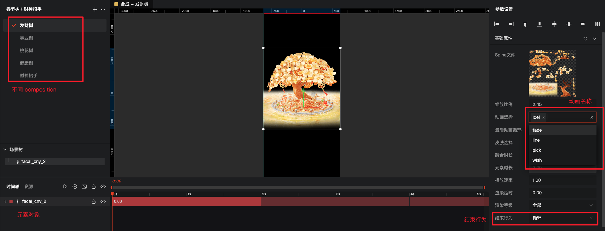

## galacean 

Galacean 是蚂蚁集团的图形互动技术品牌，在 Galacean 品牌下，包含底层引擎 Galacean Engine，在线编辑开发环境 Galacean Editor 等，旨在为互动业务开发者提供完善的互动开发解决方案。

官网：https://galacean.antgroup.com

掘金专栏：https://juejin.cn/column/696130865589980368

-[Galacean Engine](https://galacean.antgroup.com/engine)：行业领先的 Web 3D 引擎，可以理解为 three.js 引擎，底层都是 webgl。

-[Galacean Effects](https://galacean.antgroup.com/effects/)：专注于移动端的在线化动效编辑器，主要用于制作动效。
  - Galacean Effects Studio（编辑器）：用于设计师来制作；研发同时也可以在编辑器中查看动效产物。
  - Galacean Effects Player（播放器）：用于在代码中实现；播放器用于在运行时解析和播放编辑器中发布的动画产物，保障动画上线的效果和效率，大大节约设计师与开发者之间动效实现、效果调试的沟通成本。

## Galacean Effects

主要介绍下 Galacean Effects。

文档：[https://galacean.antgroup.com/effects/user/zn6zshqq6eb7gk2](https://galacean.antgroup.com/effects/user/zn6zshqq6eb7gk2)

语雀开发文档：[https://galacean-effects.yuque.com/kdpoyl/bsbqf](https://galacean-effects.yuque.com/kdpoyl/bsbqf)

demo：[https://galacean.antgroup.com/effects/playground/vanilla-%E5%9F%BA%E6%9C%AC%E6%92%AD%E6%94%BE](https://galacean.antgroup.com/effects/playground/vanilla-基本播放)

-[Galacean Effects Studio](https://galacean.antgroup.com/effects)：设计师制作动效的编辑器。

- VFX：Galacean Effects Studio 的工程文件格式。

- Galacean Effects 产物：Galacean Effects 动画描述文件，在编辑器通过[导出](https://galacean-effects.yuque.com/kdpoyl/guide/ngfx2o)（zip格式）或[发布](https://galacean-effects.yuque.com/kdpoyl/guide/gftgqdp45mo58ddv)（JSON格式）可以获得。

-[Galacean Effects Player](https://www.npmjs.com/package/@galacean/effects)：播放 Galacean Effects 动画的播放器，播放的文件为 Galacean Effects 产物。

一般的工作流程为：

1. 设计师使用编辑器 Galacean Effects Studio 设计动效，并导出 VFX 工程文件给到研发。
2. 研发也可以用编辑器打开 VFX 文件进行查看，然后导出 json 产物。产物中的 json 会引入 bins 和 images，需要把 bins 和 images 上传到bos，在 json 中进行替换。


1. 研发在代码中引入 json 产物，并使用播放器 Galacean Effects Player 进行播放。

## Galacean Effects 编辑器



1. 将vfx导入编辑器可以预览动效，左上方可以看到不同的 composition，设计同学可以在一个 vfx 中放置多个动效。合成是 Galacean Effects 动画中最基础的概念之一。1 个合成 = 1 段动画，一个项目往往包括多个合成。合成列表包含当前项目的所有合成。
2. 左下方选中元素后，右侧可以查看元素的细节。知道这些后我们就可以在代码中根据 name 进行操作。
3. 比如导出的时候记得选择默认动画，然后结束行为设置为循环，这样就不用在代码中单独去设置了。

## spine 动画

spine 官网：https://zh.esotericsoftware.com

Spine动画是一种在游戏开发中广泛应用的2D[骨骼动画](https://zhida.zhihu.com/search?content_id=239094349&content_type=Article&match_order=1&q=骨骼动画&zhida_source=entity)系统，它由Esoteric Software公司开发。相比传统的[帧动画](https://zhida.zhihu.com/search?content_id=239094349&content_type=Article&match_order=1&q=帧动画&zhida_source=entity)，Spine采用骨骼和插槽的概念，使[开发者](https://zhida.zhihu.com/search?content_id=239094349&content_type=Article&match_order=1&q=开发者&zhida_source=entity)能够以更灵活、高效的方式制作和控制角色、物体等元素的动画。

galacean 支持导入 spine 动画，具体怎么制作和导入是设计同学需要关注的，研发需要注意导出后在代码中引入 spine 插件


```js
import {Component} from 'san';
import {Player} from '@galacean/effects';
import {SpineComponent} from '@galacean/effects-plugin-spine';
import {Stats} from '@galacean/effects-plugin-stats';
import tree from './tree.json';
export default class TreasureCard extends Component {
    static template = /* html */`
        <div id="container"></div>
    `;
    attached() {
        // 1. 实例化一个播放器
        const player = new Player({
            container: document.getElementById('container'),
            pixelRatio: window.devicePixelRatio || 2,
        });
        // 1. 加载背景
        player.loadScene(background);
        // 2. 加载树
        player
            .loadScene(tree)
            .then(composition => { // 加载 VFXJSON 获得合成对象 composition
                const VFXItem = composition.getItemByName('treeeee'); // 通过 name 获得元素对象 VFXItem
                const spineComponent = VFXItem.getComponent(SpineComponent); // 获取 VFXItem 上的 SpineComponent
                const animationList = spineComponent.animationList; // 获取 SpineComponent 上的动画列表 animationList
                this.state = spineComponent.state;
                console.log(this.state, animationList);
            })
            .catch(err => {
                // 降级逻辑，以下仅供参考
            });
        // 3. 加载按钮
        player.loadScene(button);
    };
}
```

注意：animationState 一定是在动画播放后才能获取到

## 动画的切换

正常情况下树会执行默认动画，点击或者生长的时候会切换动画，切换播放完之后又会恢复默认动画。

galacean effects 提供了 setAnimation [设置动画](https://www.galacean.com/effects/user/iokpec7e4xra0ilo) 功能

```js
/**
 * 设置单个动画
 * @param animation - 动画名
 * @param speed - 播放速度
 */
setAnimation(animation: string, speed?: number): void;
/**
 * 设置播放一组动画
 * @param animationList - 动画名列表
 * @param speed - 播放速度
 */
setAnimationList(animationList: string[], speed?: number): void;
/**
 * 设置播放一组动画，循环播放最后一个
 * @param animationList - 动画名列表
 * @param speed - 播放速度
 * @since 1.6.0
 */
setAnimationListLoopEnd(animationList: string[], speed?: number): void;
```

但没有这里没有切换完继续播放的功能，其实这里可以使用 galacean engine 中更详细的动画参数，用于队列播放。
[https://galacean.antgroup.com/engine/docs/graphics/2D/spine/runtime/#%E5%8A%A8%E7%94%BB%E9%98%9F%E5%88%97](https://galacean.antgroup.com/engine/docs/graphics/2D/spine/runtime/#动画队列

```js
changeAnimation(name) {
    this.state.setAnimation(0, name, false); // 切换动画
    this.state.addAnimation(0, 'moren', true); // 在轨道 0 播放完继续播放动画 moren
}
```

## loadScene

作用：player 加载 VFXJSON，一般一个 VFXJSON 对应一个 composition，loadScene 中可以传多个，也可以多次传。

```js
// 1. 加载单个合成链接并设置可选参数
const composition = await player.loadScene('xxx.json', { ... });
const composition = await player.loadScene({ url: 'xxx.json' }, { ... });
// 2. 加载单个合成的 JSON 对象并设置可选参数
const composition = await player.loadScene(JSONValue, { ... });
// 3. 加载多个合成链接或 JSON 对象
const [_, _, _] = await player.loadScene(['x1.json', 'x2.json', JSONValue]);
// 4. 加载多个合成链接并各自设置可选参数
const [_, _] = await player.loadScene([{
    url: 'x1.json',
    options: { autoplay: false, ... },
}, {
    url: 'x2.json',
    options: { speed: 2, ... },
}, { ... }]);
// 5. 加载多个合成链接并统一设置可选参数（共用）
const [_, _, _] = await player.loadScene(['x1.json', 'x2.json', ...], { ... });
const [_, _] = await player.loadScene(
    [{ url: 'x1.json' }, { url: 'x2.json' }, { ... }],
    {
        variables: {
            name': 'value',
        },
        speed: 2,
        ...
    },
);
// 6. 疯狂混合
await player.loadScene([
    {
        url: 'x1.json',
        options: {
            variables: {
                'name1': 'value1',
            },
            speed: 2,
        },
    },
    'x2.json',
    JSONValue,
], {
    variables: {
        'name2': 'value2',
    },
    speed: 0.1,
});
```

## 代码修改动效中的文字和图片

galacean 支持将文字和图片设置为变量，在代码中动态去修改。

代码修改文字：[https://galacean-effects.yuque.com/kdpoyl/bsbqfx/acbim2s0uhuty5k](https://galacean-effects.yuque.com/kdpoyl/bsbqfx/acbim2s0uhuty5k)

代码修改图片：[https://galacean-effects.yuque.com/kdpoyl/bsbqfx/oyvu6mxzo4n860m](https://galacean-effects.yuque.com/kdpoyl/bsbqfx/oyvu6mxzo4n860m)

## 粒子动画

粒子动画是由在一定范围内随机生成的大量粒子产生运动而组成的动画，粒子系统常用于游戏引擎，用来实现火、云、烟花、雨、雪花等效果的实现。如红包雨：[https://galacean.antgroup.com/effects/playground/vue-%E4%BA%A4%E4%BA%92%E5%85%83%E7%B4%A0-%E7%82%B9%E5%87%BB](https://galacean.antgroup.com/effects/playground/vue-交互元素-点击)

在编辑器中可以针对粒子动画设置如下属性，红包点击消失的操作也是在这里配置了粒子交互，并不是在代码中实现的。


## 迎财神红包雨实现

从素材中可以看到大部分的动效都已经完善，我们只需在代码中补充红包点击交互的逻辑。

```js
// 给 player 添加点击事件，可以通过参数拿到点击元素对象
player.on('click', evt => {
     // 财神点击则播放红包雨
    if (evt.name === 'caishen') {
        this.playRain();
    }
    // 小红包点击
    else if (evt.name.includes('hongbao')) {
        // 让点击的小红包消失
        const clickItem = this.rainComposition.getItemByName(evt.name);
        clickItem.setVisible(false);
        // 连击数 +1
        this.data.set('clickNum', num + 1);
        // 播放爆炸光效
        this.burstComposition.items.forEach(item => {
            const burst = item.content.emission?.bursts[0];
            if (burst) {
                const next = burst.clone();
                next.once = true;
                // 在点击位置播放爆炸效果
                item.content.addBurst(next, [evt.hitPositions[0].toArray()]);
            }
        });
    }
    // 大红包点击
    else {
        // 切换大红包点击的动画
        this.rainState.setAnimation(0, 'pick', false);
        // 改变连击数
        this.data.set('clickNum', num + 1);
    }
});
```

## 踩坑

### 渲染出现锯齿
[Unity之Spine动画有锯齿和白色描边_spine导出gif有锯齿-CSDN博客](https://blog.csdn.net/CrazyApp/article/details/113701442)

锯齿的原因：[https://juejin.cn/post/723665666975241016](https://juejin.cn/post/723665666975241016)

### 循环播放后卡顿

表现行为是每 8s 一轮循环后都会卡顿一下，改了下 endBehavior 从 5 => 2 。
[https://github.com/galacean/effects-specification/blob/79cfe259f10f2900728294bcf53f0dfc28a5e60d/src/constants.ts](https://github.com/galacean/effects-specification/blob/79cfe259f10f2900728294bcf53f0dfc28a5e60d/src/constants.ts)


### webgl context lost

反作弊的sdk中会创建webgl，有可能导致 webgl 数量超出限制

```js
// webglcontext 超出限制时，会舍弃最开始创建的，这时需要重新初始化
this.player.on('webglcontextlost', () => {
    // your code
    this.initAnimation();
});
// 如何测试webgl超出限制
<canvas id="webgl1"></canvas>
<canvas id="webgl2"></canvas>
<canvas id="webgl3"></canvas>
<canvas id="webgl4"></canvas>
<canvas id="webgl5"></canvas>
<canvas id="webgl6"></canvas>
<canvas id="webgl7"></canvas>
<canvas id="webgl8"></canvas>
<canvas id="webgl9"></canvas>
 setTimeout(() => {
    const canvas = document.getElementById('webgl1');
    const gl1 = canvas.getContext('webgl');
    console.log(gl1);
    const canvas2 = document.getElementById('webgl2');
    const gl2 = canvas2.getContext('webgl');
    console.log(gl2);
    const canvas3 = document.getElementById('webgl3');
    const gl3 = canvas3.getContext('webgl');
    console.log(gl3);
    const canvas4 = document.getElementById('webgl4');
    const gl4 = canvas4.getContext('webgl');
    console.log(gl4);
    const canvas5 = document.getElementById('webgl5');
    const gl5 = canvas5.getContext('webgl');
    console.log(gl5);
    const canvas6 = document.getElementById('webgl6');
    const gl6 = canvas6.getContext('webgl');
    console.log(gl6);
    const canvas7 = document.getElementById('webgl7');
    const gl7 = canvas7.getContext('webgl');
    console.log(gl7);
    const canvas8 = document.getElementById('webgl8');
    const gl8 = canvas8.getContext('webgl');
    console.log(gl8);
    const canvas9 = document.getElementById('webgl9');
    const gl9 = canvas9.getContext('webgl');
    console.log(gl9);
}, 3000);
```

## 优化

测试后手机出现发烫情况，需要进行优化

1. 降低帧数，正常情况渲染帧数为60，在不影响视觉的效果下我们将其降低成30帧

```js
const player = new Player({container: document.getElementById('decorate-bg-container')});
player
    .loadScene('https://feed-activity-new.cdn.bcebos.com/2024wish/huodong-modal1/data.json')
    .then(() => {
        this.player.ticker.setFPS(30);
    })
```

1. 粒子动画，减少发射器/粒子的数量（，如本次将背景烟花动效优化后则发烫效果明显好转。影响比较大）
2. 合成资源优化，如图片资源，具体可以看 https://galacean.antgroup.com/effects/user/dtrbrf#u9da6e47
3. 降级方案，若播放器 player 加载资源失败的话，在 catch 中捕获，则去加载默认的[静态兜底图](https://feed-activity-new.cdn.bcebos.com/2024caishen%2Ftree%2Fdoudi.png

```js
// 加载树
this.player
    .loadScene(treeFacai)
    .then(composition => {
        // ...
    })
    .catch(err => {
        // 降级逻辑
        this.showDowngradeImage();
    });
// 降级处理
showDowngradeImage() {
    const containerStyle = this.ref('container').style;
    containerStyle.backgroundImage = 'url("https://feed-activity-new.cdn.bcebos.com/2024caishen%2Ftree%2Fdoudi.png")';
    containerStyle.backgroundRepeat = 'no-repeat';
    containerStyle.backgroundSize = 'cover';
    containerStyle.backgroundPosition = 'center';
}
```

1. 尽量减少项目中player数量，一般有一个 player 即可。但是如果不可避免的有两个 player 的时候，需要把原有的 player 暂停再去播放新的 player
2. 资源预加载：一个动画的播放由资源载入和播放动画两部分组成，这两部分的耗时是没办法避免的。但是如果我们想继续优化动画播放的体验，这就需要我们将资源载入部分和播放动画拆分，提前将资源准备好，在播放的时候只需要播放动画就可以了，代码参考如下：

```js
/*** === 资源准备阶段 === ***/
// 创建一个资源加载器
const assetManager = new AssetManager();
// 进行资源的加载
const scene = await assetManager.loadScene('xxx.json');
// 其他业务逻辑代码
/*** === 资源准备阶段 === ***/
/*** === 预编译准备阶段 === ***/
// 加载动画资源
await player.loadScene(scene, { autoplay: false });
/*** === 预编译准备阶段 === ***/
// 手动播放
player.play();
```
