# galacean 3d

Galacean 实现 3d 效果有两种方式：

- [Galacean Engine](https://galacean.antgroup.com/engine)：直接用官方给的 Web 3D 引擎，可以理解为 three.js 引擎，底层都是 webgl。
  - Galacean Engine 与 three.js 性能对比，可以看下官方文档：https://galacean.antgroup.com/engine/docs（链接有问题，看下图）


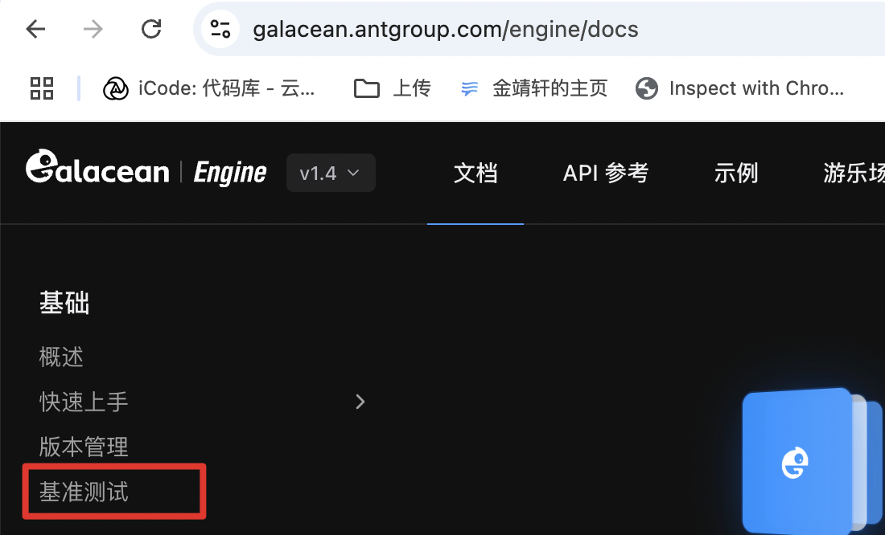

- [Galacean Effects](https://galacean.antgroup.com/effects/)：简单的 3d 效果可直接用 galacean effects 来实现

## Galacean engine 快速入门

快速入手可以看官方例子：https://galacean.antgroup.com/engine/docs/basics/quickStart/quick-start/（链接有问题，看下图）


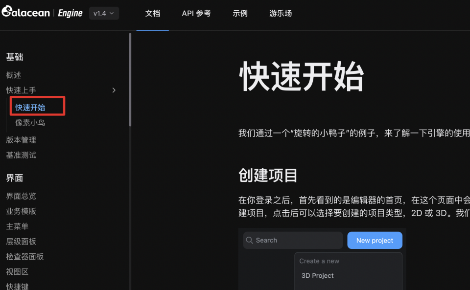

编辑器地址：[https://galacean.antgroup.com/editor/projects](https://galacean.antgroup.com/editor/projects)

按文档一步一步实践即可，这里主要介绍了如何在编辑器中创建 3d 项目以及在编辑器中引入 glb 模型、设置灯光、脚本、真机预览等。

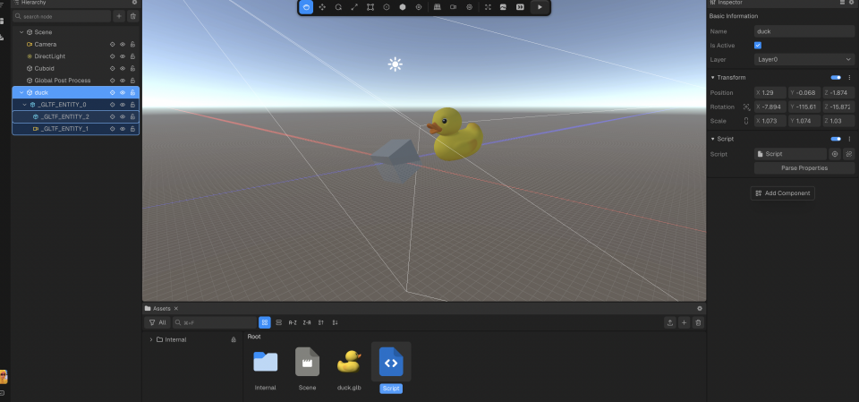

下面主要介绍下导出后在我们的项目中（feed-activity 为例）怎么使用：

1. 在这里我们导出示例中的 Vanilla JS 项目

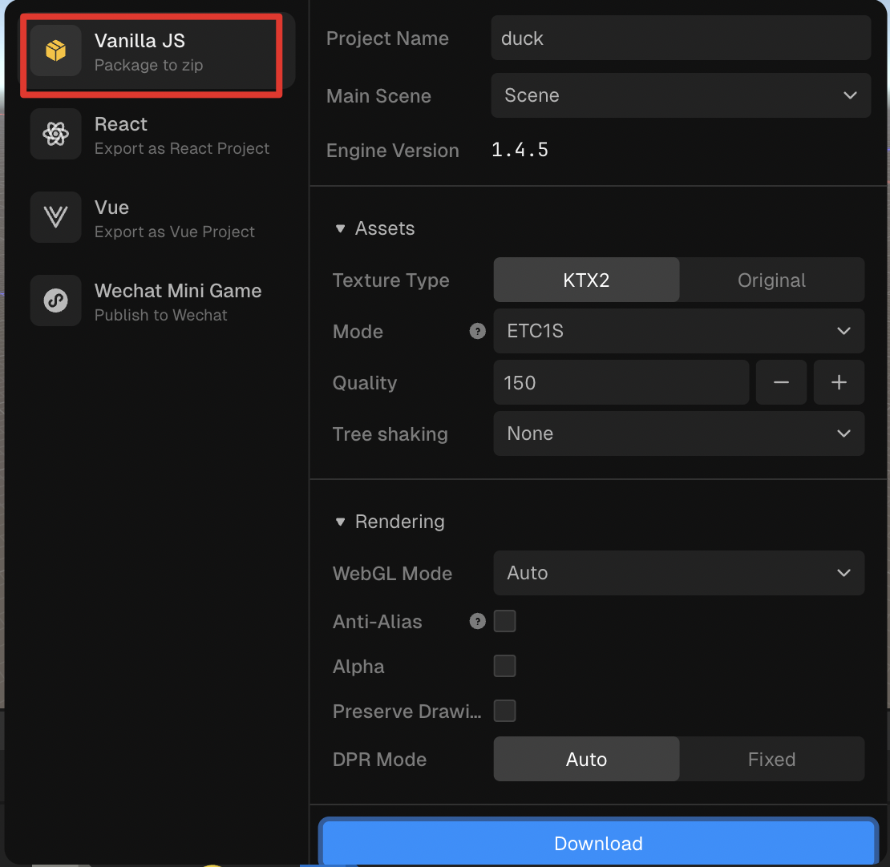

1. 导出后的目录如下，其中public 中的文件都传到 cdn 中，然后在 project.json 中把所有的资源进行路径替换，然后再把 public/project.json 也传到 cdn 中

（script.ts 从本地引入，测试发现不上传cdn也可以）

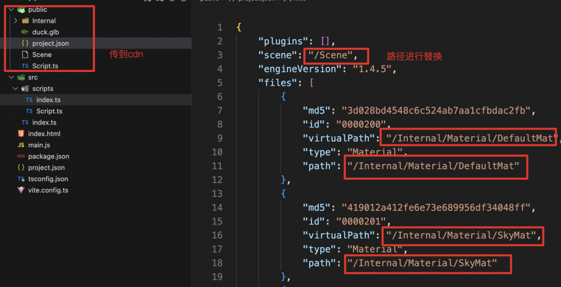

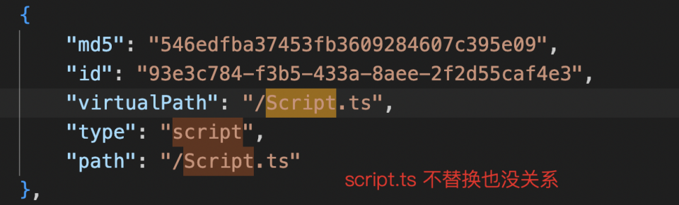

1. 项目根目录中还有一个 project.json ，把其中的 project.json url 替换成第二步的 cdn 地址（public中的那个）

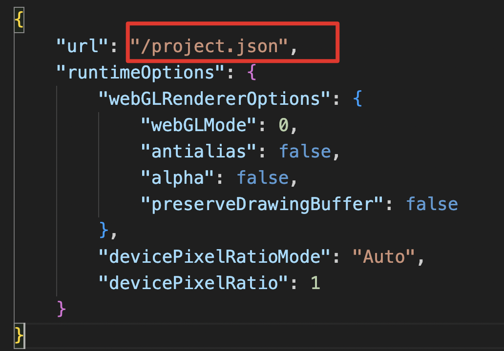

1. 找到 src 中的 index.ts，scripts 就引入导出的 srcipts，projectInfo 引入第3步的 project.json，再把index.ts 中的初始代码复制到项目中即可。

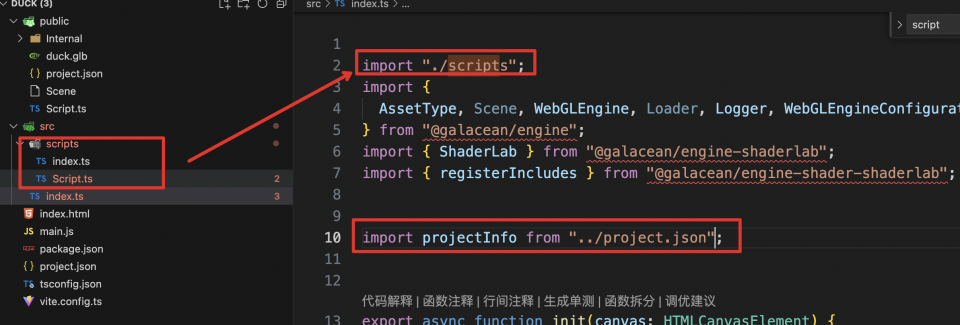

1. 在 feed-activity 中如下，需要的只有 scripts （此处把 ts 改成了 js）和 project.json，其余内容都在 cdn 上

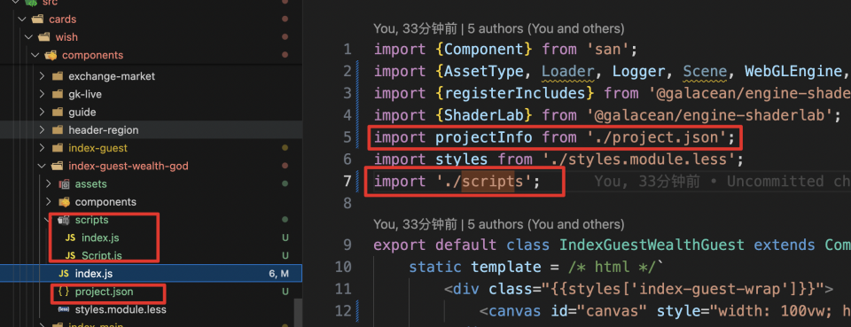

1. 最终在项目中跑通

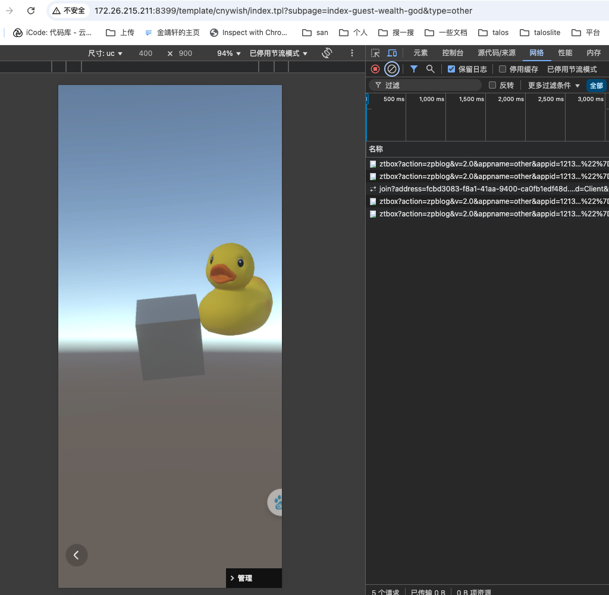


## Galacean Effects 实现 3d

具体操作可以看 [https://galacean.antgroup.com/effects/user/hpb4n5](https://galacean.antgroup.com/effects/user/hpb4n5)

1. 新建合成，场景选择 3d 

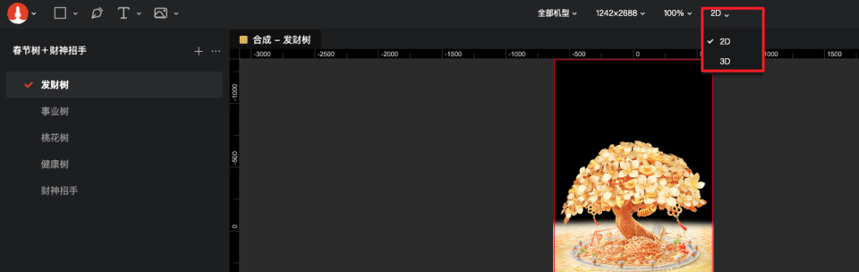

1. 资源中添加 glb 模型，左上角可以平移旋转缩放等

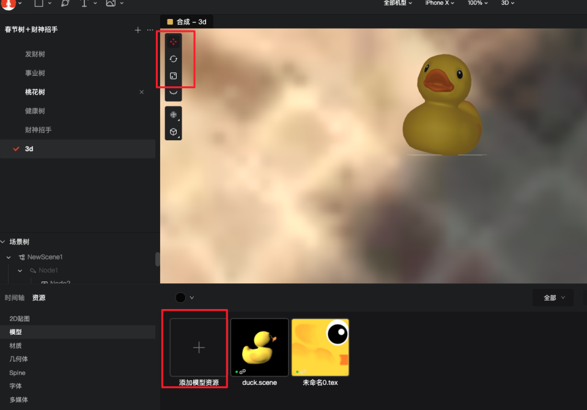

1. 导出流程和2d类似，资源也是 .bin/.webp

1. 在 Galacean Effects 中使用 3D 元素的渲染，需要单独引入 3D 插件包。3D模型可能会引入复杂的渲染，上线前需要评估性能。

```js
// NPM
import { Player } from'@galacean/effects';
// 确保在 Player 引入之后再引入插件, 插件版本保持和 Player 一致
import'@galacean/effects-plugin-model';
```

使用示例：[https://galacean.antgroup.com/effects/playground/vanilla-%E6%92%AD%E6%94%BE%203D%20%E6%A8%A1%E5%9E%8B](https://galacean.antgroup.com/effects/playground/vanilla-播放3D模型)


## 3d 实现对比

- galacean effects 3d
  - 优点：用 Player 就可以实现 2d/3d 效果，3d 只需在原有 player 基础上引入插件即可。
  - 缺点：只适用于简单的 3d 效果，并不适合跑酷等小游戏的实现。
- galacean engine 
  - 优点：可以直接把模型导入3d编辑器，进行灯光位置等参数调试，可真机预览，研发和视觉沟通成本较小
  - 缺点
    - 学习3d编辑器成本，其中实体的脚本需要在编辑器中完成。
    - 编辑器导出项目均是ts，且资源过多都需要上传cdn，从导出资源到在项目中使用这一过程消耗时间过长，一旦频繁改动则时间不可控。
    - 需要导入新的包，体积会增加
- three.js
  - 可实现小游戏复杂交互，有之前的项目经验，上手容易
  - 性能较好，galacean engine 官网给的性能比 three 好的例子都是大量 模型/粒子系统 的情况，正常项目不会有这么多。


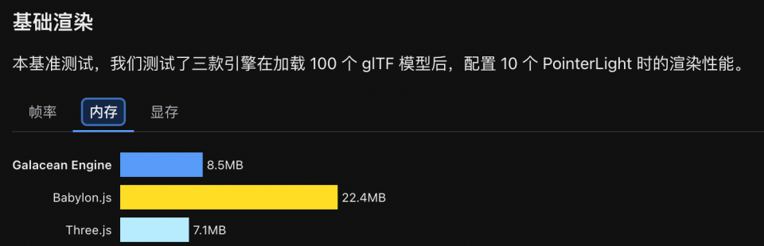

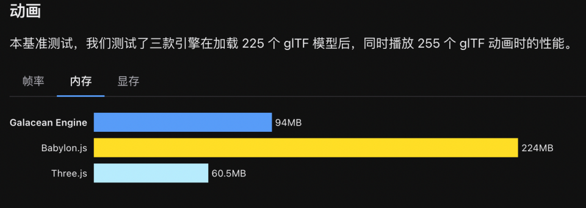


## 包体积对比

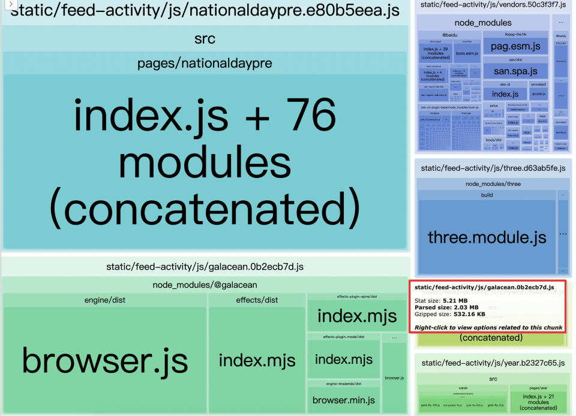

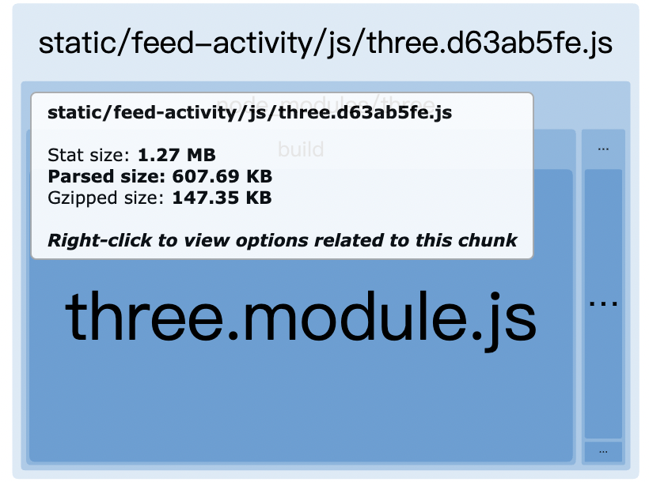

| 场景                                            | 包                                                           | 体积                                             |
| ----------------------------------------------- | ------------------------------------------------------------ | ------------------------------------------------ |
| 普通动效                                        | @galacean/effects                                            | 141.67KB                                         |
| 普通动效 + spine 2d 动效                        | @galacean/effects +@galacean-plugin-spine                    | 141.67KB + 48.99KB = 190.66 KB                   |
| 普通动效 +spine 2d 动效 + 3d 主动效             | @galacean/effects +@galacean-plugin-spine + @galacean-plugin-model | 141.67KB + 48.99KB +35.96KB = 226.62KB           |
| 普通动效 +spine 2d 动效 + 3d 主动效 +复杂小游戏 | @galacean/effects +@galacean-plugin-spine + @galacean-plugin-model +@galacean/engine | 141.67KB + 48.99KB +35.96KB +261.44KB = 487.95KB |
| 普通动效 +复杂小游戏                            | @galacean/effects +@galacean/engine                          | 141.67KB + 261.44KB = 403.11KB                   |

可以看到体积最大的为 @galacean/engine 有 261.44KB，若全部引入则打包出来的 static/feed-acticity/js/galacean.js 有 500KB+

相比之下 three.js 只有 147.35KB，以我们最常见的场景：普通2d动效 + 小游戏，普通东西采用 @galacean/effects，小游戏采用 three.js 则：

| 场景                                 | 包                                                   | 体积                                          |
| ------------------------------------ | ---------------------------------------------------- | --------------------------------------------- |
| 普通动效 +spine 2d 动效 + 复杂小游戏 | @galacean/effects +@galacean-plugin-spine + three.js | galacean.js + three.js =  190.66KB + 147.35KB |

- 综上所述：
  - 普通动效使用 @galacean/effects + @galacean-plugin-spine
  - 简单的3d动效 @galacean/effects + @galacean-plugin-model
  - 小游戏使用 three.js
  - 普通动效 + 3d 动效 + 小游戏：@galacean/effects + @galacean-plugin-spine + @galacean-plugin-model + three.js （不建议）
  - 普通动效 + 小游戏：@galacean/effects + @galacean-plugin-spine + three.js （小游戏项目常见）


