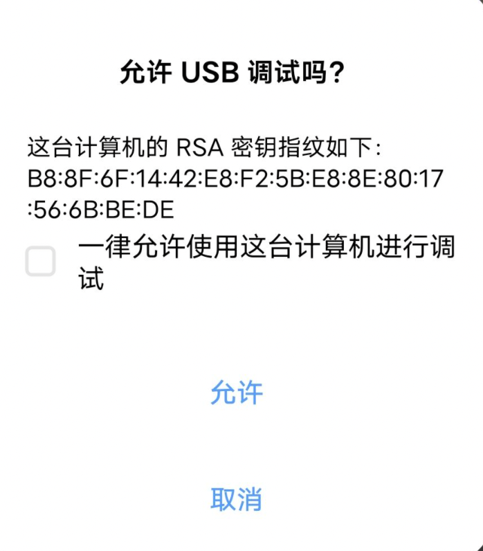
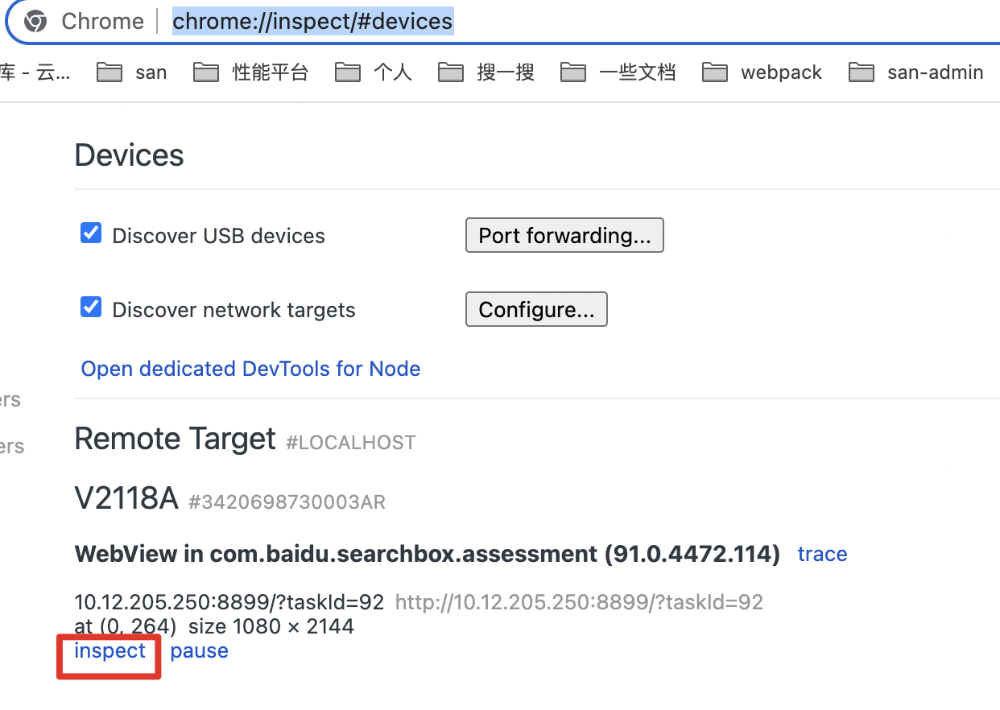

# 移动端h5开发

众所周知，移动端app项目或者小程序项目中的一些页面都会用 h5 来写，一般我们会将写好的 h5 页面做好适配，上传到静态地址（如 Bos），然后 h5 页面会以 webview 的方式嵌入到原生应用中。这里主要总结一下适配方案以及一些在h5开发中的注意事项。

## 适配方案

更多方案可见[移动端适配](./adaptation.html)

### vw + rem方案

首先在 html 根元素中设置：

```css
html {
  font-size: 5vw;
}
```

这样 1rem = 5 vw，20 rem = 100 vw。

如果浏览器不支持 vw 写法，我们需要手动插入以下代码：

```js
(function (doc, win) {
  var dummy = doc.createElement('_').style;
  dummy.width = '1vw';
  // 若支持vw则退出
  if (dummy.width) {
    return;
  }
  // 不支持 vw 则手动计算一下，设置 font-size 为屏幕宽度 1 / 20
  var docEl = doc.documentElement,
      resizeEvt = 'orientationchange' in win ? 'orientationchange' : 'resize',
      recalc = function () {
        var clientWidth = docEl.clientWidth;
        if (!clientWidth) {
          return;
        }
        docEl.style.fontSize = (clientWidth / 20) + 'px';
      };
  recalc();
  win.addEventListener(resizeEvt, recalc, false);
})(document, window);
```

****

开发时我们不建议直接写 rem，理想情况是设计稿给出多少我就写多少，所以我们需要再设置一下 rem 和 px 的转换关系：

先说结论，如果设计稿是 n px 的，那么设置 `1px = (20 / n) rem`

> 如果项目中写 100 px ，其实希望无论屏幕宽度是多少，它都占设计稿宽度的 100 / n 的。按照换算关系：
>
> `100`px = `100 * (20 / n)` rem = `100 * (20 / n) * 5` vw ，那么：
>
> 1 vw 占屏幕宽度的 1 /100 之一，`100 * (20 / n) * 5` vw 则占屏幕的 `100 * (20 / n) * 5 / 100` 分之一，即 `100 / n`  分之一，就是我们所希望的结果。

综上，如果设计稿是 375px 的，一个元素宽度为 100px，我们只需直接在项目中写 100px，那么这个元素无论在什么宽度的屏幕上，其宽度都会占屏幕宽度的 100 / 375 份，这就满足了自适应。

****

至于 px 转 rem 我们可以使用 `postcss-px2rem` 插件来实现，项目中新建 `postcss.config.js`，详见[此项目](https://github.com/jinjingxuan/vue-h5)

```js
// remUnit 即 n / 20 的值
module.exports = {
    plugins: [
        require('postcss-px2rem')({remUnit: 18.75}),
    ]
}
```

## 滚动加载注意事项

一般我们在项目中使用滚动到底加载，这时候要注意两点：

1. 避免多次触发（前一个接口还没请求完，又去请求下一个接口）
2. 监听事件的取消

```js
async getList() {
  // 当上一个接口没返回时，不去请求下一个
  if (this.'loading') {
    return;
  }
  this.loading = true;
  let res = await getDetail();
  if (res && res.data) {
    this.list = res.data;
    return list;
  });
  this.data.set('loading', false);
}
```

关于滚动事件监听

```js
mounted() {
  this.loadingFun = this.loading.bind(this);
  window.addEventListener('scroll', this.loadingFun);
}

unmounted() {
  window.removeEventListener('scroll', this.loadingFun);
}

loading() {
  //文档内容实际高度（包括超出视窗的溢出部分）
  let scrollHeight = Math.max(document.documentElement.scrollHeight, document.body.scrollHeight);
  //滚动条滚动距离
  let scrollTop = window.pageYOffset || document.documentElement.scrollTop || document.body.scrollTop;
  //窗口可视范围高度
  let clientHeight = window.innerHeight || Math.min(document.documentElement.clientHeight,document.body.clientHeight);

  if (clientHeight + scrollTop >= scrollHeight - 500) {
    this.getList();
  }
}
```

为什么要 bind (this) ？

> 因为 loading 内部还有 this，这个 this 应该指向组件实例，但是直接 `window.addEventListener('scroll', this.loading);` this.getList 就会指向 window
>
> 原因是 addEventListener 参数中回调函数的this指向目标元素。

```js
<button id="btn">click</button>

let oBtn = document.getElementById('btn');
oBtn.addEventListener('click', function(){
	console.log(this) // 这里的 this 是button元素
}, false)

--------

oBtn.addEventListener('click', say, false)
function say() {
    console.log(this) // 这里的 this 也是button元素
}

--------

let obj = {
	say: function() {
		console.log(this)
	}
}
oBtn.addEventListener('click', obj.say, false)
// 这里的 this 也是button元素
```

那我使用箭头函数不行吗？这样 this 就会指向外部作用域了？

```js
window.addEventListener('scroll', () => {
  this.loading;
});
window.removeEventListener('scroll', () => {
  this.loading;
});
```

> 不行，因为 () => {} !== () => {}，不是一个函数，同下面这个例子

为什么要定义个 loadingFunc？下面这样写不行吗？

```js
window.addEventListener('scroll', this.loading.bind(this));
window.removeEventListener('scroll', this.loading.bind(this));
```

> 不行，因为 bind 之后返回的是一个新函数，添加监听和移除监听的不是一个函数，不会生效

## 注意事项

### ios 点击背景

在 ios 上，当你点击一个链接或者通过 Javascript 定义的可点击元素的时候，它就会出现一个半透明的灰色背景。需要设置下:

```css
-webkit-tap-highlight-color: rgba(0, 0, 0, 0);
```

### html不可选中

Html 和 css 分别添加

```html
<body onselectstart="return false">
  <div id="app"></div>
</body>
```

```css
-webkit-touch-callout: none; /*系统默认菜单被禁用*/
-webkit-user-select: none; /*webkit浏览器*/
-khtml-user-select: none; /*早期浏览器*/
-moz-user-select: none;/*火狐*/
-ms-user-select: none; /*IE10*/
user-select: none;
```

### 页面不可放大缩小

html 中添加 meta 标签

```html
<meta name="viewport" content="width=device-width, initial-scale=1.0, maximum-scale=1.0, user-scalable=0">
```

## 调试

[H5 移动调试全攻略](https://juejin.cn/post/6844903711714574349)

抓包查看数据：[Charles 工具](../tool/tool.html#charles)

#### Android

1. 首先打开手机开发者选项，允许 usb 调试，然后将手机通过转接头连接到电脑上，出现以下弹窗则成功。



2. chrome 中打开 chrome://inspect/#devices，android 上打开 h5 页面时，Remote Target 中会显示设备。



> 手机开发者选项不同手机不一致，百度一下即可。
>
> 如果没显示 Remote Target 记得拔掉 usb 重试几次，直到手机上弹出【允许 usb 调试】字样。

#### IOS

**safari调试**

打开iPhone手机设置**设置** -> **Safari** -> **高级** -> 打开Web检查器，然后通过数据线将iPhone连接到Mac，电脑和手机同时打开Safari，电脑上Safari打开 开发-iPhone，就能开始调试啦。

> 限制是只能在 ios safari 下调试，app 内的 webview 没办法调试