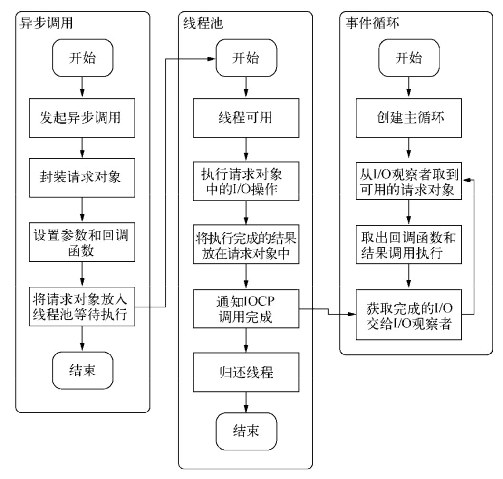
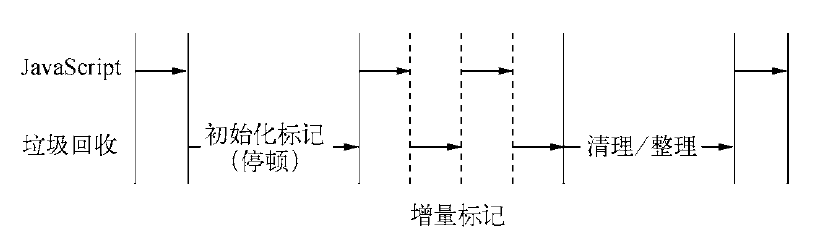

# 精读《深入浅出NodeJs》

## 第一章 Node 简介

异步IO

> Node 底层构建了许多异步 IO 的 API，从文件读取到网络请求，这样的意义在于，我们可以从语言层面很自然地进行并行 IO 操作，每个调用之前无须等待之前的 IO 调用结束，极大提升效率。

事件驱动

> Node 将前端浏览器中广泛且成熟的事件引入后端，配合异步 IO，将事件点暴露给业务逻辑。事件编程的方式具有轻量级，松耦合，只关注事务点等优势。

单线程

> 优点：单线程的最大好处是不用像多线程编程那样处处在意状态的同步问题，这里没有死锁的存在，也没有线程上下文交换所带来性能上的开销。
>
> 缺点：像浏览器中 js 与 UI 共用一个线程，js 长期执行会导致 UI 的渲染和响应被中断。在 Node 中，长时间的 CPU 占用也会导致后续的异步 IO 发不出调用，已完成的异步 IO 回调函数得不到及时执行。

跨平台

> Node 在 v0.6.0 版本支持了 windows 平台，这主要得益于 Node 架构层面的改动，它在操作系统与 Node 上层模块系统之间构建了一层平台层架构，即 libuv。

## 第二章 模块机制

### 基本概念

**模块引用**

```js
var math = require('math');
```

**模块定义**：在 Node 中一个文件就是一个模块，将方法挂载在 exports 对象上作为属性即可定义导出的方式

```js
// math.js
exports.add = function() {};

// program.js
var math = require('math');
exports.increment = function (val) {
  return math.add(val, 1);
}
```

**模块标识**

模块标识其实就是传递给 require 方法的参数，必须符合小驼峰命名，可以是相对路径，绝对路径，可以没有后缀 .js

### 模块实现

在 Node 中引入模块，需要经历以下三个步骤：

* 路径分析
* 文件定位
* 编译执行

在 Node 中，模块又分为两类

* 核心模块：Node 提供的模块
* 文件模块：用户编写的模块

> 核心模块部分在 Node 源代码的编译过程中，编译进了二进制执行文件，在 Node 进程启动时，部分核心模块就被直接加载进内存中，省略掉了文件定位和编译执行的步骤，且在路径分析中优先判断，故加载最快。
>
> 文件模块则需要完整的路径分析，文件定位，编译执行，速度比核心模块慢。

### 缓存策略

与前端浏览器会缓存静态脚本文件提高性能一样，Node对引入过的模块都会进行缓存，以减少二次引入时的开销。不同的地方在于，浏览器仅仅缓存文件，而 Node 缓存的是编译和执行之后的对象。

### 模块路径

模块标识符在 Node 中主要分为以下几类，核心模块，路径形式的文件模块，自定义模块，加载速度为：

> 缓存过的模块 > 核心模块 > 路径形式文件模块 > 自定义模块

原因是自定义模块 Node 在定位时使用**模块路径**的查找策略，具体表现为一个路径组成的数组。

```js
[
  '/home/usr/research/node_modules',
  '/home/usr/node_modules',
  '/node_modules'
]
```

它生成的规则如下：

* 当前文件目录下的 node_modules 目录
* 父目录下的 node_modules 目录
* 父目录的父目录下的 node_modules 目录
* 沿路径向上逐级递归，直到根目录下的 node_modules 目录

并且如果标识符不包含文件扩展名，Node 会按照 `.js`，`.json`，`.node` 的次序补足依次尝试。

### 模块编译

编译和执行是引入文件模块的最后一个阶段，对于不同的文件扩展名，载入方法也有所不同。

* .js 文件：通过 fs 同步读取后编译执行
* .node 文件：C/C++编写的扩展文件
* .json 文件：通过 fs 同步读取后，JSON.parse 解析
* 其余扩展名文件：均被当做 .js 文件载入

**JavaScript 模块**

在 CommonJS 规范中，每个模块文件都存在着 `require`、`exports`、`modules`、`__filename`、`__dirname`，它们是从何而来呢？事实上，Node 对获取的 JavaScript 文件进行了头尾包装，一个正常的 JavaScript 文件会被包装成如下：

```js
(function(exports, require, module, __filename, __dirname) {
	// 模块代码实际存在于此处
});
```

在执行之后，模块的 exports 属性被返回给了调用方，exports 属性上的任何方法和属性都可以被外部调用到，但是模块中的其余变量或属性则不可直接被调用。

 `module.exports.f = ...` 可以更简洁地写成 `exports.f = ...` ，相当于每个模块中存在一句`var exports = module.exports;`，`exports` 对象是通过形参的方式传入的，如果直接赋值形参会改变形参的引用，等于切断了`exports` 与 `module.exports` 的联系。

```js
exports.hello = true; // 从模块的 require 中导出
exports = { hello: false };  // 未导出，仅在模块中可用
```

[exports、module.exports和export、export default到底是咋回事](https://segmentfault.com/a/1190000010426778)

**C/C++ 模块**

`.node`的模块文件并不需要编译，因为他是 C/C++ 模块编译生成的，所以只有加载和执行的过程。Node 调用`dlopen`方法进行加载和执行。

> *nix 下通过 gcc/g++ 等编译器编译为动态链接共享对象文件（.so），在 window 下则需要通过 Visual C++ 的编译器编译为动态链接库库文件（.dll），.node 扩展名其实只是为了看起来自然一些，在 *nix 下它是一个 .so 文件，在 windows 下它是一个 .dll 文件。dlopen 方法内部实现时也区分了平台。

其实在应用中，可能会频繁的出现位运算的需求，包括转码，编码等过程。如果用 JavaScript 来实现，CPU 资源将会耗费很多（JavaScript 的位运算效率较低），此时 C/C++ 模块的优势就体现出来了，我们也可以自己编写 C++ 扩展模块来提升性能。

### npm

CommonJS包规范是理论，NPM 是其中的一种实践。对于 Node 而言，NPM 帮助完成了第三方模块的发布，安装和依赖等。借助 NPM ，Node 与第三方模块之间形成了很好的生态系统。

## 第三章 异步 I/O

假设业务场景中有一组互不相关的任务需要完成，一般有两种方法：

* 单线程串行依次执行
* 多线程并行完成

多线程是首选的，但是代价在于创建线程和执行期线程上下文切换的开销较大，且面临锁、状态同步等问题。但是多线程在多核 CPU 上能够有效提升 CPU 的利用率。

单线程顺序执行缺点在于性能，任意一个略慢的任务都会导致后续执行代码被阻塞，在计算机资源中，通常I/O与CPU计算之间是可以并行执行的，但是同步的编程模型导致的问题是，I/O的进行会让后续任务继续等待，造成资源不能被更好地利用。

Node 在两者之间给出了它的方案：利用单线程，远离多线程死锁，状态同步等问题；利用异步 I/O，让单线程远离阻塞，以更好得利用 CPU。异步 I/O 可以算作 Node 的特色，因为它是首个大规模将异步 I/O 应用在应用层上的平台，它力求在单线程上将资源分配得更高效。

完成 Node 整个异步 I/O 环节需要：事件循环、观察者、请求对象、执行回调

### 事件循环

在进程启动时，Node 便会创建一个类似于 while(true) 的循环，每执行一次循环的过程成为 Tick，每个 Tick 的过程就是查看是否有事件待处理，如果有就取出事件及回调函数并执行。

### 观察者

在每个 Tick 的过程中，如何判断是否有事件需要处理呢？这里就需要观察者，判断是否有事件要处理的过程就是向这些观察者询问是否有要处理的事件。

### 请求对象

如我们调用`fs.open`时，JavaScript 会调用 Node 的核心模块，核心模块调用 C++ 内建模块，内建模块通过 libuv 进行系统调用，libuv 作为封装层，有两个平台的实现，实质上是调用了 `uv_fs_open` 方法，在调用过程中创建了`ESReqWrap`请求对象。

至此，JavaScript 调用立即返回，JavaScript 线程可以继续执行当前任务的后续操作。当前的 I/O 操作在线程池中等待执行，不管他是否阻塞 I/O ，都不回影响 JavaScript 线程的后续执行，如此达到了异步的目的。

请求对象是异步 I/O 过程中的重要中间产物，所有的状态都保存在这个对象中，包括送入线程池等待执行以及I/O操作完毕后的回调处理。

### 执行回调

组装好请求对象、送入 I/O 线程池等待执行，实际上完成了异步 I/O 的第一步，回调通知是第二步。

这个过程中我们还调用了事件循环的 I/O 观察者，在每次 Tick 的执行中，它会检查线程池中是否有执行完的请求，如果存在，会将请求对象加入到 I/O 观察者的队列中，然后将其当作事件处理。

至此，整个异步 I/O 的流程完全结束。



## 非 I/O 的异步 API

尽管我们在介绍 Node 时，多数情况下都会提到异步 I/O，但是 Node 中其实还存在一些与 I/O 无关的异步 API。

setTimeout、setInterval、setImmediate、process.nextTick

### 定时器

setTimeout、setInterval 的实现原理与异步 I/O 比较类似，只是不需要 I/O 线程池的参与，创建的定时器会被插入到定时器观察者内部的一个红黑树中。每次 Tick 执行时从该红黑树中迭代取出定时器对象，检查是否超过定时时间，如果超过立即执行回调函数。

问题在于它并非精确的，尽管事件循环非常快，但是如果某次循环占用的时间过多，那么下次循环时，它也许已经超时很久了。比如 setTimeout 设定一个任务在 10 毫秒后执行，但是在 9 毫秒后，有一个任务占用了 5 毫秒的 CPU 时间片，时间就已经过期 4 毫秒。

### process.nextTick

定时器需要动用红黑树，创建定时器对象和迭代等操作，较为浪费性能。实际上，process.nextTick 更为轻量。

每次调用 process.nextTick ，只会将回调函数放入队列，在下一轮 Tick 时取出执行。

### setImmediate

setImmediate 与 process.nextTick 十分类似，只需记住 process.nextTick 观察者优先级高于 setImmediate

```js
process.nextTick(function() {
  console.log('nextTick延迟执行');
})

setImmediate(function() {
  console.log('setImmediate延迟执行');
})

console.log('正常执行')

// 正常执行
// nextTick延迟执行
// setImmediate延迟执行
```

## 第五章 内存控制

Chrome 浏览器优异的性能背后离不开 V8，V8 的性能优势使得用 JavaScript 写高性能后台服务程序成为可能，在这样的契机下，Node 的作者选择了 JavaScript，选择了 V8，在事件驱动、非阻塞 I/O 模型的设计下实现了 Node。

### V8内存限制

在一般的后端开发语言中，内存使用基本没有什么限制，然而在 Node 中会有内存限制（64位系统下约为 1.4GB，32位系统下约为 0.7 GB），这会导致 Node 无法直接操作大内存对象，如读入 2GB 的文件。

### V8的对象分配

在 V8 中，所有的 JavaScript 对象都是通过堆来进行分配的，当我们在代码中声明变量并赋值时，所使用对象的内存就分配在堆中。至于 V8 为何要限制堆的大小，主要有两点原因：

* 表层原因：V8 最初是为浏览器而设计，不太可能遇到用大量内存的场景。
* 深层原因：V8 垃圾回收的限制，因为垃圾回收会引起 JavaScript 线程暂停执行，如果内存过大，垃圾回收需要的时间会越多，应用的性能和响应能力都会直线下降。

当然也可以打开这个限制，不过需要注意这只是在启动时指定，无法在使用时根据情况自动扩充。

```bash
node --max-old-space-size=1700 test.js # 单位为 MB，用于设置老生代内存最大值
node --max-new-space-size=1024 test.js # 单位为 KB，用于设置新声代内存最大值
```

### V8的垃圾回收机制

在 V8 中主要将内存分为新生代和老生代，新生代中是存活时间较短的对象，老生代中是存活时间较长的或常驻内存的对象。在默认设置下：

* 老生代在 64 位系统下为 1400 MB，在 32 位系统下为 700 MB
* 新生代在 64 位系统下为 32 MB，在 32 位系统下为 16 MB

这也就解释了为何在 64 位系统下只能使用约 1.4 GB内存和在 32 位系统下只能使用约 0.7 GB内存

#### Scavenge 算法

在分代的基础上，新生代的对象主要通过 Scavenge 算法进行垃圾回收，在 Scavenge 的具体实现中，主要采用了 Cheney 算法：

> 内存一分为二：From 空间和 To 空间
>
> 分配对象时先在 From 空间分配，进行垃圾回收时，会检查 From 空间中的存活对象，这些存活对象将被复制到 To 空间，而非存活对象占用的空间将被释放，完成复制后，From 和 To 发生对换。

这种算法的缺点是只能使用堆内存中的一半，典型的空间换取时间的算法，无法大规模应用到所有垃圾回收中。但是特别适合应用在新生代中，因为新生代中对象生命周期较短，恰恰适合这个算法。

#### 晋升

当一个对象经过多次复制依然存活时，它将会被认为是生命周期较长的对象，这种较长生命周期的对象随后会被移动到老生代中，采用新的算法进行管理。对象晋升的条件有2个：

1. 对象是否经历过 Scavenge 回收
2. To 空间的内存占用比超过限制

> 当对象从 From 空间复制到 To 空间时，会检查它的内存地址是否已经经历过一次 Scavenge 回收，如果经历过了，将该对象从 From 空间复制到老生代空间中。
>
> 当对象从 From 空间复制到 To 空间时，如果 To 空间已经使用了超过 25%，则这个对象直接晋升到老生代中。（25% 原因是因为当这次回收完成后，这个 To 空间将变回 From 空间，接下来的内存分配将在这个空间内进行，如果占比过高，会影响后续的内存分配）

#### Mark Sweep & Mark-Compact

**标记清除**

Mark Sweep 分为标记和清除两个阶段，在标记阶段遍历堆中的所有对象，并标记活着的对象，在随后的清除阶段，只清除没有被标记的对象。

缺点：在进行一次标记清除时，内存空间会出现不连续的状态。如果后续需要分配一个大的对象，碎片空间无法完成分配。


**标记整理**

在标记清除的基础上，如果对象被标记死亡，在整理的过程中，将活着的对象往一端移动，移动完成后，直接清理掉边界外的内存。


| 回收算法     | Mark-Sweep   | Mark-Compact | Scavenge           |
| ------------ | ------------ | ------------ | ------------------ |
| 速度         | 中等         | 最慢         | 最快               |
| 空间开销     | 少（有碎片） | 少（无碎片） | 双倍空间（无碎片） |
| 是否移动对象 | 否           | 是           | 是                 |

Mark-Compact 速度比 Mark-Sweep 慢，所以在取舍上，V8 主要使用 Mark-Sweep，在空间不足时对从新生代晋升过来的对象进行分配时才使用 Mark-Compact。

#### Incremental Marking

为了避免出现 JavaScript 应用逻辑与垃圾回收器看到的不一致的情况，垃圾回收的3种基本算法都需要将应用逻辑暂停下来，这种行为称作"全停顿"，为了降低这种停顿时间，V8 先从标记阶段入手，将原本要一口气完成的动作改为增量标记，也就是拆分成许多小"步进"，每做完一"步进"，就让 JavaScript 应用逻辑执行一小会儿，垃圾回收与应用逻辑交替执行。



