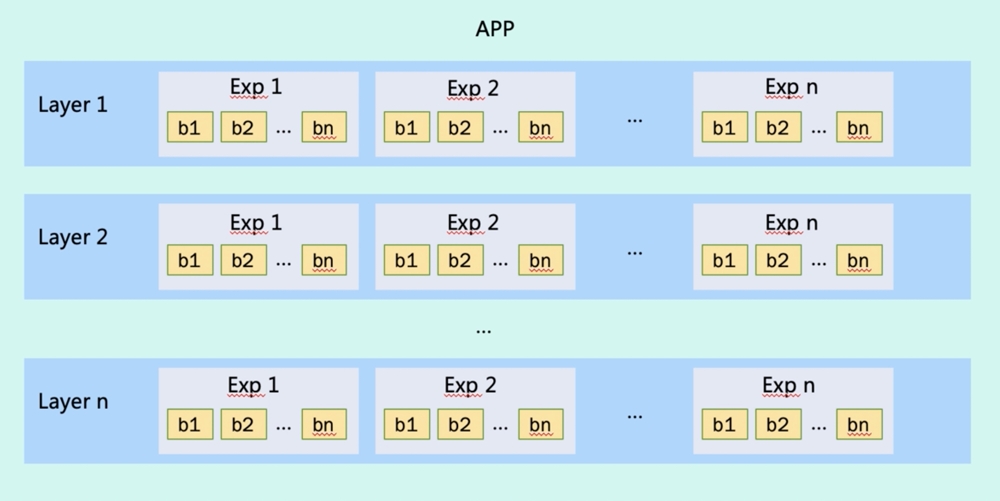
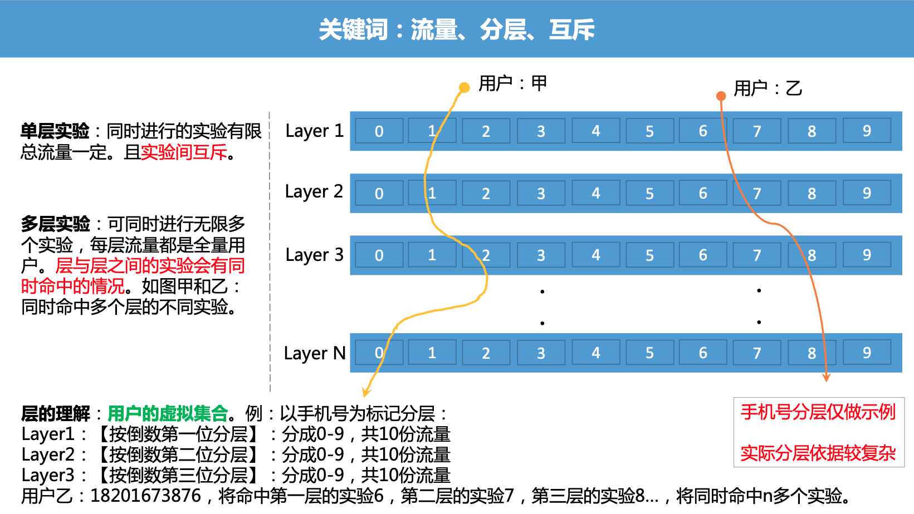

# AB 实验

## 前言

在产品的开发迭代中，如果 pm 有几个非常好的 idea，但是由于我们线上的资源是有限的，所以必须在几个 idea 中做出取舍，那么如何评估几种 idea 的效果，评估的方式有什么呢？

* 内测：用户群有偏差
* 灰度：用户比例小、干扰因素多，可比性差

* A/B test：
  * 普通用户、真实反馈
  * 严格对比、结论可靠
  * 收益量化

> **A/B测试**为一种[随机测试](https://zh.wikipedia.org/w/index.php?title=隨機測試&action=edit&redlink=1)，将两个不同的东西（即A和B）进行假设比较。该测试运用[统计学](https://zh.wikipedia.org/wiki/統計學)上的[假设检定](https://zh.wikipedia.org/wiki/假設檢定)和[双母体假设检定](https://zh.wikipedia.org/w/index.php?title=雙母體假設檢定&action=edit&redlink=1)。 A/B测试可以用来测试某一个变量两个不同版本的差异，一般是让A和B只有该变量不同，再测试其他人对于A和B的反应差异，再判断A和B的方式何者较佳。

## A/B实验中的基础知识

在开始进行A/B实验之前需要了解一些关于A/B测试的基础知识，包含**流量的分层分流**、**正交与互斥、实验分组、AA实验**等。 

### 正交与互斥

* 互斥：是集合的概念，事件A和B的交集为空，A与B就是互斥事件。
* 正交：是线性代数的概念，若内积空间中两向量的内积为0，则称它们是正交向量。**正交矩阵**中所有的列向量、行向量都是正交向量。

****

* 互斥实验：**实验在同一层拆分流量，且不论如何拆分，不同组的流量是不重叠的。**

* 正交实验：**每个独立实验为一层，层与层之间流量是正交的，一份流量穿越每层实验时，都会再次随机打散，且随机效果离散。**

### 流量分层分流

Layer: 层，Exp：实验，b：分支

分层：按照不同的方式将用户分为不同的集合，层与层之间是正交（独立无关联）的关系。

分流：在同一层拆分流量，此时流量是互斥的。

**为什么要对实验分层？**

> 如果每日用户活跃量为100000，如果只有两个实验A和实验B，如果流量平分，则每天进入两个实验的人数为50000左右
>
> **如果实验数量变多增加到1000个，如果还是对流量进行平分，则每天进入两个实验的人数为100左右，实验体量太小导致实验结果可信度大幅下降，**此时我们发现流量明显不够用。此时我们在想有没有一种方法可以解决这个问题，那么就是分层。
>
> **分层实验有个很重要的概念就是每一层用完的流量进入下一层时，一定会均匀的重新分配。**

以手机号为例，第一层是按照手机号的倒数第一位分层，分为了 0 - 9 十组实验。第二层是按照倒数第二位分层，也分为了 0 - 9 十组实验。那么那一个用户的手机号是 18201673876 ，将命中第一层的实验 6，第二层的实验7......具体如下图：

## AB 实验分类

### 分工视角

- **产品实验：**验证不同策略对产品指标的影响。
- **研发实验：**主要是性能调优、资源优化、能力升级等方面验证，但所有此类实验均要围绕产品指标。

### 随版视角

- **非随版实验：**一般为后端策略实验，生效时间短，样本收敛时间短，例如：检索召回、排序等。（推荐系统普遍采用[召回+排序](https://zhuanlan.zhihu.com/p/424397193)的两阶段模型）
- **随版本实验：**必须依赖客户端版本发布，冷启生效、样本收敛时间长，例如：端样式修改、端性能调优。

### 架构视角

- **服务端实验**
- **客户端实验**

## AB 实验生命周期

1. 抽样阶段：抽取实验组、对照组，并确保各组内用户数据相同人群（用户日志打点信息）
2. 实验阶段：实验组上线新功能，对照组保持现状，在线上运行一段时间。
3. 回归阶段：对比实验组、对照组在实验期间内的各项数据指标，判断新功能是否符合预期。
4. 发布阶段：全量固化新功能效果。

### 抽样方式

1. 随机抽样：按照一定随机算法先划分实验组及对照组，然后在线上运行一段时间（空转），观察实验组及对照组在这段时间内各项指标是否相同。
2. 正交平衡抽样：根据前段时间的用户的使用历史，圈定出属性相同，且符合实验流量要求的用户，针对这部分用户，划分出实验组及对照组。

> 正交平衡抽样就是已经正确切分出来实验组和对照组，不需要进行空转。

## 注意点

* 人群不同质：AB实验需要切分流量到不同方案，如果不能正确切分，使得分到不同方案的用户群体特征分布一致，那么实验将没有任何意义。
* 实验不同时：假如实验 A 的作用时间是节日，而实验 B 非节日，那么实验明显对于 B 是不公平的。
* 没有进行 AA 实验（空转）：AA指的是实验中的各个方案都是一致的，**这是为了测试埋点、分流、实验统计的正确性，增加AB实验的实验结论可信度。**

> 空转是指先抽样，统计关键数据，而不修改页面样式的流程，相当于AA实验。 虽然随机抽样能够保证两份流量的关键指标相差不大，但毕竟存在抽样不均情况。空转可以明显地发现 抽样不均，摒弃掉这部分流量，保证实验数据的变化仅仅是实验本身(样式改变)引起的。