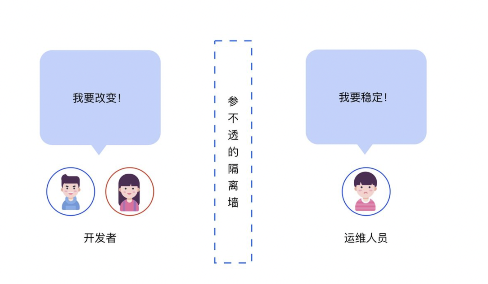
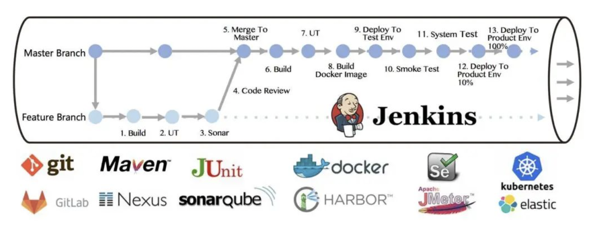

# devops

[什么是DevOps？ - CODING的回答 - 知乎]( https://www.zhihu.com/question/58702398/answer/608049028)

## devops 是什么

DevOps（Development和Operations的组合词）是一组过程、方法与系统的统称，用于促进开发（[应用程序](https://baike.baidu.com/item/应用程序/5985445)/软件工程）、技术运营和质量保障（QA）部门之间的沟通、协作与整合。

它是一种重视“软件开发人员（Dev）”和“IT运维技术人员（Ops）”之间沟通合作的文化、运动或惯例。透过自动化“软件交付”和“架构变更”的流程，来使得构建、测试、发布软件能够更加地快捷、频繁和可靠。

举个例子，对于运维来说，稳定压倒一切，新 Feature 越少越好。而对于研发来说，却希望能开发更多的功能。这种矛盾会导致大量的资源和时间的浪费。就像两匹马拉一辆车，如果马头向着的方向不一致，肯定是没法全速前进的。

* 在价值流下游的 Ops 认为价值链上游的 Dev 软件非功能质量不满足要求，因此阻止变更。
* 在价值流上游的 Dev 无法获得价值链下游的 Ops 的真实运行环境，因此无法提升交付质量。

DevOps 的理念就是希望能打破这种屏障，让研发（Development）和运维（Operations）一体化，让团队从业务需求出发，向着同一个目标前进。

字面意思上说 DevOps 是指“开发运维一体化”，即通过工具辅助开发完成运维的部分工作，减少成本。但深入理解了 DevOps 之后，你会发现 DevOps 其实是一种软件研发管理的思想，方法论，他追求的是一种没有隔阂的理想的研发协作的状态，可能涉及到的角色有开发、测试、产品、项目管理、运维等等。所以我们认为，**为了帮助研发团队在保持质量的前提下提高交付效率的方法和方法论都隶属于 DevOps 的范畴**。

比如 Google 提出的 **5 个 DevOps 原则**，这套原则中必须依赖于工具辅助的部分只有后两点，更多的则是对于开发组织形式的内省：

1. 精简组织架构；
2. 愿意承担一部分试错带来的损失；
3. 分阶段地一小步一小步地进行转型；
4. 最大化地利用工具和自动化流程；
5. 对所有的过程和结果进行记录和分析。

所以 **DevOps 不是简单的开发软件化，而是企业的学习能力不断提升的结果**，将企业改造成敏捷应对的学习型组织，运用新的工具，优化组织架构和流程，不断地进行自我革命和创新的方式。工具是辅助，而非基础。

## 工具使用层

Devops 落地，研发交付的每个过程都离不开工具的支撑。传统的方式，是自己搭建零散的弱整合工具系统，比如我们用 gitlab 来管理代码；我们用 Jenkins 来做持续集成；使用 selenium 来做自动化测试；使用 ansible 来自动化部署；使用 chef 或者 puppet 来管理基础环境等等。这种情况的问题是：

1. 系统完全需要自己维护，成本高，不稳定；
2. 子系统之间存在隐形墙，缺少数据共享、权限共享、系统交互等功能；

目前大型金融以及互联网企业普遍采用强整合的统一 DevOps 平台。

## 瀑布 / 敏捷 / devops

###  瀑布开发
瀑布式开发是早期被广泛采用的软件开发模型，要求有明确的需求，大家按照需求一步步做好规划，每一阶段工作的完成是下一阶段工作开始的前提，每一阶段都要进行严格的评审，保证各阶段的工作做得足够好时才允许进入下一阶段，它适用于需求明确的项目。其最大的风险是，当产品研发完成后， 到了产品测试阶段如果发现了问题 ，或者发现其无法满足市场需求， 那么就需要重新开发，甚至需要重新规划产品。

### 敏捷开发

敏捷开发是一种以用户需求进化为核心、迭代、循序渐进的开发方法。首先把用户最关注的软件原型做出来并交付给用户，用户在实际场景中发现问题并给予反馈，研发人员快速修改弥补需求中的不足。上述过程不断迭代，直到用户满意。敏捷适用于需求不明确、创新性或者需要抢占市场的项目，特别适合互联网项目。

### devops

DevOps是一种软件开发实践，它将人员、流程和技术结合在一起，以交付持续的价值。该方法分为计划和跟踪、开发、生成和测试、交付以及监视和操作。DevOps 的独特之处在于开发、IT 运营、质量工程和安全团队协同工作，在发布新产品、版本或更新所涉及的所有任务中创造效率。

## 总结

DevOps 不能简单认为是工具、方法、技能或组织结构，DevOps 结合所有这一切元素，去帮助我们让业务更快的开发交付运营以更快地应对变化。

DevOps 强调协作共赢，强调从项目整体上全盘考虑整个软件生命周期的所有事情，产品如何开发、测试、部署、升级、监控、运维、运营等等都要列入项目目标。开发团队和运维运营团队又要深入合作，频繁小颗粒度的完成产品开发、测试、交付、反馈。