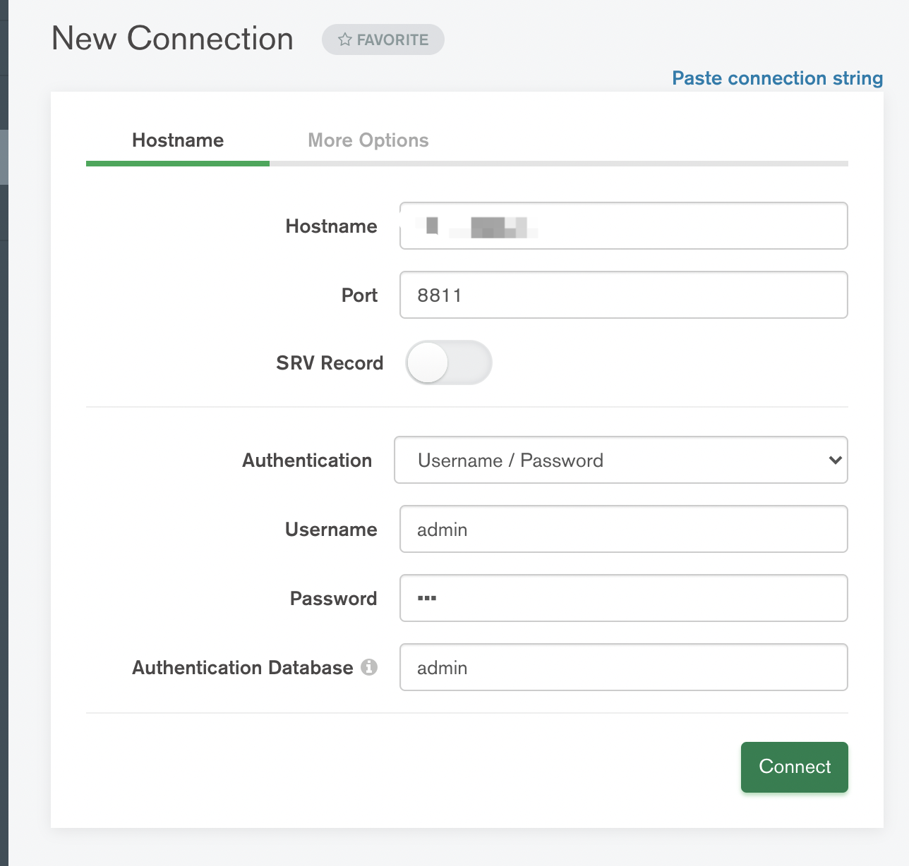

# mongodb

MongoDB是一个基于分布式文件存储的数据库。由C++语言编写。旨在为WEB应用提供可扩展的高性能数据存储解决方案。

## 安装教程

以下是在 cenos7 开发机上安装的过程，具体参考[官网](https://docs.mongodb.com/v4.4/tutorial/install-mongodb-on-red-hat/)

```bash
sudo vim /etc/yum.repos.d/mongodb-org-4.4.repo

# 添加如下配置
[mongodb-org-4.4]
name=MongoDB Repository
baseurl=https://repo.mongodb.org/yum/redhat/$releasever/mongodb-org/4.4/x86_64/
gpgcheck=1
enabled=1
gpgkey=https://www.mongodb.org/static/pgp/server-4.4.asc
```

安装

```bash
sudo yum install -y mongodb-org
```

验证安装结果

```bash
rpm -qa |grep mongodb
rpm -ql mongodb-org-server
```

锁定版本，避免 yum 更新

```bash
sudo vi /etc/yum.conf

# 添加如下内容
exclude=mongodb-org,mongodb-org-server,mongodb-org-shell,mongodb-org-mongos,mongodb-org-tools
```

启动

```bash
sudo systemctl start mongod

# 默认端口 27017，查看是否启动
netstat -natp | grep 27017

# 查看数据库的进程是否存在
ps -aux | grep mongod    

# 验证服务开启
mongo

# 设置开机自动启动
systemctl enable mongod
```

修改配置

```bash
sudo vi /etc/mongod.conf

################################################################
net:
  port: 8811 # 默认为27021端口
  bindIp: 0.0.0.0 # 127.0.0.1 只允许本地连接
  
  
# 默认情况下 mongodb 的数据和日志存储位置是 /var/log/mongodb/mongod.log 和 /var/lib/mongo
# 首先在/home/work/mongodb目录下执行：mkdir -p var/log var/database
# 然后修改以下配置

systemLog:
  destination: file
  logAppend: true
  path: /home/work/mongodb/var/log/mongodb/mongod.log # 修改这里

storage:
  dbPath: /home/work/mongodb/var/lib/mongo # 修改这里
  
###############################################################

# 重启服务
sudo service mongod restart
```

用户配置

```bash
# 进入命令行
mongo

# admin数据库
use admin
db.createUser({user:"admin",pwd:"***",roles:[{role:"root",db:"admin"}]})
```

重新开启带认证的服务

```bash
# 查看之前未认证的时候开启的服务pid
ps -ef | grep mongo

# 杀死pid对应服务
kill pid

cd /usr/bin/

# fork参数是服务在后台运行，auth是访问需要验证：
./mongod --bind_ip 0.0.0.0 --port 8811 --dbpath /home/work/mongodb/var/database --logpath /home/work/mongodb/var/log/mongo.log --fork --auth
```

## 数据备份与恢复

**数据备份到本地**

```bash
mongodump -h <ip>:<port> -d <dbname> -o <path>
```

* -h：host
* -d：db
* -o：output

**本地数据恢复到数据库**

```bash
mongorestore -h <ip>:<port> -u <user> -p=<password> -d <dbname> <path>
```

## 数据库连接

```bash
# 连接本地
mongo mongodb://localhost:8811

# 连接开发机
mongo mongodb://<user>:<password>@<ip>:<port>
```

## mongodb compass

mongodb compass 是一款可视化工具，直接在[官网](https://www.mongodb.com/zh-cn/products/compass)安装即可，以下是连接时所填的字段。

* Hostname：开发机的公网IP
* port：端口号
* Username/password：用户配置时添加的用户名和密码
* Authentication Database：数据库默认为 admin

