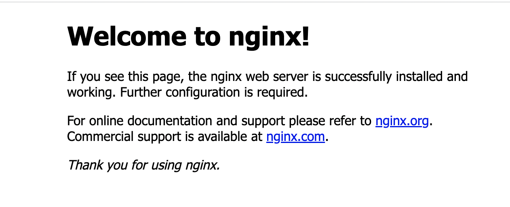

# nginx

本文参考自：https://juejin.cn/post/6844904129987526663

> “Nginx 是一款轻量级的 HTTP 服务器，采用事件驱动的异步非阻塞处理方式框架，这让其具有极好的 IO 性能，时常用于服务端的**反向代理**和**负载均衡**。”

## 安装

在 mac 上按照以下来安装：

```sh
brew install nginx
nginx -v # 查看版本
```

* 启动 Nginx：`sudo nginx `

* 停止 Nginx：`sudo nginx -s stop `

* 热重启 Nginx：`sudo nginx -s reload`

* 强制停止 Nginx：`sudo pkill -9 nginx`

## 配置文件

1. `/usr/local/etc/nginx/nginx.conf` （nginx配置文件路径）
2. `/usr/local/var/www` （nginx服务器默认的根目录）
3. `/usr/local/Cellar/nginx/1.17.9` （nginx的安装路径）
4. `/usr/local/var/log/nginx/error.log` (nginx默认的日志路径)

Nginx 默认配置文件

```
server {  
        # 当nginx接到请求后，会匹配其配置中的service模块
        # 匹配方法就是将请求携带的host和port去跟配置中的server_name和listen相匹配
        listen       8080;        
        server_name  localhost; # 定义当前虚拟主机（站点）匹配请求的主机名

        location / {
            root   html; # Nginx默认值
            # 设定Nginx服务器返回的文档名
            index  index.html index.htm; # 先找根目录下的index.html，如果没有再找index.htm
        }
}
```

当访问 `localhost:8080` 时，对应的即是 `/usr/local/var/www` 路径下的 `index.html` 文件，如下：



可以在 vscode 中打开对应的 html 文件：

```html
<!DOCTYPE html>
<html>
<head>
<title>Welcome to nginx!</title>
<style>
    body {
        width: 35em;
        margin: 0 auto;
        font-family: Tahoma, Verdana, Arial, sans-serif;
    }
</style>
</head>
<body>
<h1>Welcome to nginx!</h1>
<p>If you see this page, the nginx web server is successfully installed and
working. Further configuration is required.</p>

<p>For online documentation and support please refer to
<a href="http://nginx.org/">nginx.org</a>.<br/>
Commercial support is available at
<a href="http://nginx.com/">nginx.com</a>.</p>

<p><em>Thank you for using nginx.</em></p>
</body>
</html>

```

## Nginx 主要应用

### 动静分离

动静分离其实就是 Nginx 服务器将接收到的请求分为**动态请求**和**静态请求**。

动静分离的一种做法是将静态资源部署在nginx上，后台项目部署到应用服务器上，根据一定规则静态资源的请求全部请求 nginx 服务器，达到动静分离的目标。

```
server {  
        listen       8080;        
        server_name  localhost;

        location / {
            root   html; # Nginx默认值
            index  index.html index.htm;
        }
        
        # 静态化配置，所有静态请求都转发给 nginx 处理
        location ~ .*\.(html|htm|gif|jpg|jpeg|bmp|png|ico|js|css)$ {
            root /usr/local/var/www; # 静态请求所代理到的根目录
        }
        
        # 动态请求匹配到 path 为 myblog 的就转发到 8081 端口处理
        location /myblog/ {  
            proxy_pass http://localhost:8081; # 充当服务代理
        }
}
```

* 静：访问 `localhost:8080/index.html` 会直接从代理的根目录中去取。
* 动：访问`localhost:8080/myblog/` 请求会转发到 `http://localhost:8081` 处理。

#### 场景一

此时假如我本地启动了一个博客服务，地址为：`http://localhost:8081`，经过以上配置那么当我请求 `localhost:8080/myblog/` 就会转发到 `http://localhost:8081` 上，也会打开博客页面。

```
http://localhost:8088/myblog/ => http://localhost:8081
```

正常情况下静态配置用于获取资源文件，动态配置用于转发接口请求给真正的服务。

#### 场景二

如果项目分别部署在同一台机器上时，由于无法使用相同的端口，故后端一般会将端口号设置成不同的值（例如8080、8081），但是当前端向后端请求资源时还要加上端口号，未免显得麻烦，故利用可以 nginx 将前端的指定路径代理到后端的8080、8081端口上。

```text
http: {
  server {
    server_name example.com

    location /mail {
    	proxy_pass http:example.com:8080;
    }

    location /user {
    	proxy_pass http:example.com:8081;
    }
  }
}
```

* 将 `http://example.com/mail/` 下的请求转发到 `http://example.com:8080/`
* `http://example.com/mail/index.html` -> `http://example.com:8080/index.html`
* 将 `http://example.com/user/` 下的请求转发到 `http://example.com:8081/`
* `http://example.com/user/index.html` -> `http://example.com:8081/index.html`

### 反向代理

> 这个功能也就是 nginx 的反向代理功能，即客户端不知道真正请求的服务端，我们可以用反向代理来解决跨域问题。

例如：

- 前端server的域名为：`fe.server.com`
- 后端服务的域名为：`dev.server.com`

现在我在`fe.server.com ` 对 `dev.server.com`发起请求一定会出现跨域。

现在我们只需要启动一个nginx服务器，将 `server_name` 设置为 `fe.server.com` ,然后设置相应的 location 以拦截前端需要跨域的请求，最后将请求代理回`dev.server.com`。如下面的配置：

```text
server {
        listen       80;
        server_name  fe.server.com;
        location / {
                proxy_pass dev.server.com;
        }
}
```

这样可以完美绕过浏览器的同源策略：`fe.server.com`访问`nginx`的`fe.server.com`属于同源访问，而`nginx`对服务端转发的请求不会触发浏览器的同源策略。

#### 场景一

访问某一台机器的域名时，我希望返回我上传到 bos 上的 html 地址。

```
server {  
  listen       8088;        
  server_name  xxx.com;

  location / {
  	proxy_pass   http://bos/index.html;
  }

}
```

此时访问的虽然是 `xxx.com`，但是实际请求的是 `http://bos/index.html`，对客户端隐藏了真实请求地址。

### 负载均衡

随着业务的不断增长和用户的不断增多，一台服务已经满足不了系统要求了。这个时候就出现了服务器集群。

在服务器集群中，Nginx 可以将接收到的客户端请求“均匀地”（严格讲并不一定均匀，可以通过设置权重）分配到这个集群中所有的服务器上。这个就叫做**负载均衡**。

```sh
# 负载均衡：设置domain
upstream domain {
    server localhost:8000;
    server localhost:8001;
}
server {  
        listen       8080;        
        server_name  localhost;

        location / {
            # root   html; # Nginx默认值
            # index  index.html index.htm;
            
            proxy_pass http://domain; # 负载均衡配置，请求会被平均分配到8000和8001端口
            proxy_set_header Host $host:$server_port;
        }
}
```

8000和8001是我本地起的两个页面，负载均衡成功后可以看到访问 `localhost:8080` 有时会访问到8000端口的页面，有时会访问到8001端口的页面。