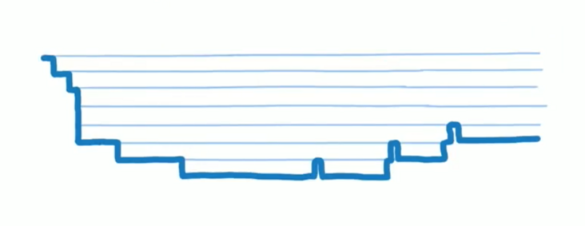
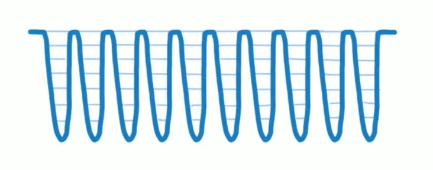
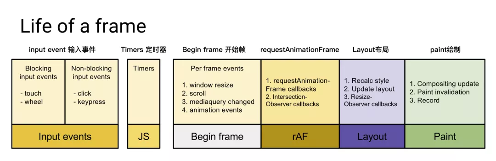
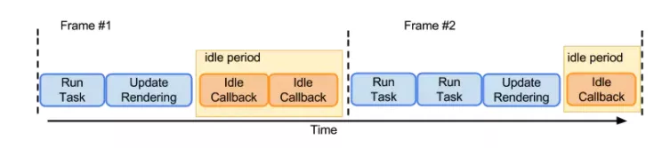
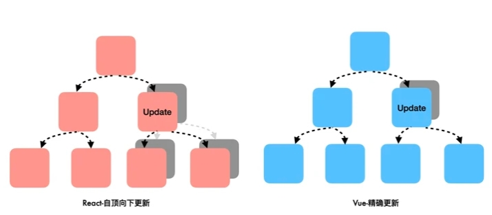

# React Fiber

本文转载自：

* [你不知道的 React Virtual DOM](https://juejin.cn/post/6985058301184737287)
* [面试官：React 为什么需要 Fiber？](https://juejin.cn/post/7081606403785228325)
* [有React fiber，为什么不需要Vue fiber呢？](https://www.51cto.com/article/704554.html)
* [react fiber 到底有多细](https://developers.weixin.qq.com/community/develop/article/doc/0000ee55268a387e202cc210c50013)

## ReactElement

本质上 Virtual DOM 对应的是一个 JavaScript 对象，那么 React 是如何通过一个 js 对象将 Virtual DOM 和真实 DOM 对应起来的呢？这里面的关键就是 ReactElement。

ReactElement 即 react 元素，描述了我们在屏幕上所看到的内容，它是构成 React 应用的最小单元。比如下面的 jsx 代码：

```js
const element = <h1 id="hello">Hello, world</h1>

// 上面的代码经过编译后生成 React Api, createElement 有三个参数，标签，属性，内容
React.createElement("h1", {
  id: "hello"
}, "Hello, world");

// 执行 React.createElement 函数，会返回类似于下面的一个 js 对象，这个对象就是我们所说的 React 元素：
const element = {
  type: 'h1',
  props: {
    id: 'hello',
    children: 'hello world'
  }
}
```

React 元素也可以是用户自定义的组件：

```js
function Button(props) {
  return <button style={{ color }}>{props.children}</button>;
}

const buttonComp = <Button color="red">点击我</Button>

// 以上 JSX 代码经过 Babel 编译后的代码如下，注意自定义组件为大写
React.createElement("Button", {
  color: "red"
}, "点击我");
```

> 因此我们就可以说 React 元素其实就是一个普通的 js 对象(plain object)，这个对象用来描述一个 DOM 节点及其属性或者组件的实例，当我们在 JSX 中使用 Button 组件时，就相当于调用了`React.createElement()`方法对组件进行了实例化。由于组件可以在其输出中引用其他组件，当我们在构建复杂逻辑的组件时，会形成一个树形结构的组件树，React 便会一层层的递归的将其转化为 React 元素，当遇见 type 为大写的类型时，react 就会知道这是一个自定义的组件元素，然后执行组件的 render 方法或者执行该组件函数（根据是类组件或者函数组件的不同），最终返回 、描述 DOM 的元素进行渲染。

综上：react 是通过 jsx 描述界面的，它会被 babel 或 tsc 等编译工具编译成 render function，然后执行产生 vdom

## 为什么会出现 React fiber 架构

一个 React 组件的渲染主要经历两个阶段：

- 调度阶段（Reconciler）：用新的数据生成一棵新的树，然后通过 Diff 算法，遍历旧的树，快速找出需要更新的元素，放到更新队列中去，得到新的更新队列。
- 渲染阶段（Renderer）：遍历更新队列，通过调用宿主环境的 API，实际更新渲染对应的元素。宿主环境如 DOM，Native 等。

React 15 `Stack Reconciler` （栈协调器）是通过`递归`更新子组件 。由于递归执行，所以更新`一旦开始`，中途就`无法中断`。当层级很深时，递归更新时间超过了 `16ms`，用户交互就会卡顿。在`setState`后，react 会立即开始`reconciler`过程，从`父节点`（Virtual DOM）开始`遍历`，以找出不同。将所有的`Virtual DOM遍历完`成后，`reconciler`才能给出当前需要修改真实DOM的信息，并传递给`renderer`，进行渲染，然后屏幕上才会显示此次`更新`内容。对于特别`庞大的DOM树`来说，`reconciliation过程会很长(x00ms)`，在这期间，主线程是被 js 占用的，因此任何`交互、布局、渲染都会停止`，给用户的感觉就是页面被卡住了。



React 16 及以后使用的是 `Fiber Reconciler`（纤维协调器），将递归中无法中断的更新重构为迭代中的异步可中断更新过程，这样就能够更好的控制组件的渲染。

简单理解就是把一个`耗时长的任务`分解为一个个的工作单元（每个工作单元运行时间很短，不过总时间依然很长）。在执行工作单元之前，由`浏览器判断是否有空余时间执行`，`有时间就执行`工作单元，执行完成后，继续判断是否还有空闲时间。`没有时间就终止执行`让浏览器执行其他任务（如 GUI 线程等）。等到下一帧执行时判断是否有空余时间，有时间就从终止的地方继续执行工作单元,`一直重复`到任务结束。



## 浏览器渲染

介绍 Fiber 前，我们先了解下浏览器渲染的一些概念。

### 渲染帧

我们知道，在浏览器中，页面是一帧一帧绘制出来的，渲染的帧率与设备的刷新率保持一致。一般情况下，设备的屏幕刷新率为 1s 60次，当每秒内绘制的帧数（FPS）超过60时，页面渲染是流畅的；而当 FPS 小于60时，会出现一定程度的卡顿现象。下面来看完整的一帧中，具体做了哪些：



1. 首先需要处理输入事件，能够让用户得到最早的反馈
2. 接下来是处理定时器，需要检查定时器是否到时间，并执行对应的回调
3. 接下来处理 Begin Frame（开始帧），即每一帧的事件，包括 window.resize、scroll、media query change 等
4. 接下来执行请求动画帧 requestAnimationFrame（rAF），即在每次绘制之前，会执行 rAF 回调
5. 紧接着进行 Layout 操作，包括计算布局和更新布局，即这个元素的样式是怎样的，它应该在页面如何展示
6. 接着进行 Paint 操作，得到树中每个节点的尺寸与位置等信息，浏览器针对每个元素进行内容填充

到这时以上的六个阶段都已经完成了，接下来处于空闲阶段（Idle Peroid），可以在这时执行requestIdleCallback里注册的任务（它就是 React Fiber 任务调度实现的基础）

### RequestIdleCallback

RequestIdleCallback 是 react Fiber 实现的基础 api 。该方法将在浏览器的空闲时段内调用的函数排队，使开发者在主事件循环上执行后台和低优先级的工作，而不影响延迟关键事件，如动画和输入响应。正常帧任务完成后没超过16ms，说明有多余的空闲时间，此时就会执行requestIdleCallback里注册的任务。

可以参考下图来理解requestIdleCallback在每帧中的调用：



## Fiber Reconciler 如何工作

为了实现渐进渲染的目的，Fiber 架构中引入了新的数据结构：Fiber Node，Fiber Node Tree 根据 React Element Tree 生成，并用来驱动真实 DOM 的渲染。

Fiber 节点的大致结构：

```js
{
    tag: TypeOfWork, // 标识 fiber 类型
    type: 'div', // 和 fiber 相关的组件类型
    return: Fiber | null, // 父节点
    child: Fiber | null, // 子节点
    sibling: Fiber | null, // 同级节点
    alternate: Fiber | null, // diff 的变化记录在这个节点上
    ...
}
```

双缓存 Fiber Tree 是 React Fiber 架构中的核心机制，用于实现高效的 UI 更新与渲染。它的核心思想是通过两个交替的 Fiber 树（当前树和待更新树）实现无阻塞渲染，确保用户交互的流畅性。

1. 当前树（Current Tree）：
对应屏幕上当前显示的 UI 结构，每个 Fiber 节点（组件）保存了当前状态的引用。

2. 待更新树（WorkInProgress Tree）：
后台构建的新树，用于描述下一次渲染的 UI 结构。当构建完成且无更高优先级任务时，会替换当前树。

3. 交替机制：
每次更新时，React 复用当前树的 Fiber 节点生成待更新树，最终通过切换树指针完成更新，避免直接操作当前树导致的渲染阻塞。

关键优势
1. 无阻塞渲染：
构建待更新树的过程可中断（时间分片），浏览器可优先处理高优先级任务（如用户输入）。

2. 高效复用：
通过复用 Fiber 节点减少内存分配，提升性能（如 key 相同的节点仅更新属性而非重建）。

3. 一致性保证：
提交阶段一次性提交所有变更，避免渲染中间状态导致的 UI 不一致。

## 为什么没有 vue-fiber?

* 在react中，组件的状态是不能被修改的，setState没有修改原来那块内存中的变量，而是去新开辟一块内存；
* vue则是直接修改保存状态的那块原始内存。

所以经常能看到react相关的文章里经常会出现一个词"immutable"，翻译过来就是不可变的。数据修改了，接下来要解决视图的更新：

> react中，调用setState方法后，会自顶向下重新渲染组件，自顶向下的含义是，该组件以及它的子组件全部需要渲染；
>
> 而 vue 使用 Object.defineProperty（vue@3迁移到了Proxy）对数据的设置（setter）和获取（getter）做了劫持，也就是说，vue能准确知道视图模版中哪一块用到了这个数据，并且在这个数据修改时，告诉这个视图，你需要重新渲染了。

所以当一个数据改变，react的组件渲染是很消耗性能的——父组件的状态更新了，所有的子组件得跟着一起渲染，它不能像vue一样，精确到当前组件的粒度。



react fiber是在弥补更新时“无脑”刷新，不够精确带来的缺陷。这是不是能说明react性能更差呢？

并不是。孰优孰劣是一个很有争议的话题，在此不做评价。因为vue实现精准更新也是有代价的，一方面是需要给每一个组件配置一个“监视器”，管理着视图的依赖收集和数据更新时的发布通知，这对性能同样是有消耗的；另一方面vue能实现依赖收集得益于它的模版语法，实现静态编译，这是使用更灵活的 JSX 语法的 react 做不到的。

在react fiber出现之前，react也提供了PureComponent、shouldComponentUpdate、useMemo、useCallback等方法给我们，来声明哪些是不需要连带更新子组件。