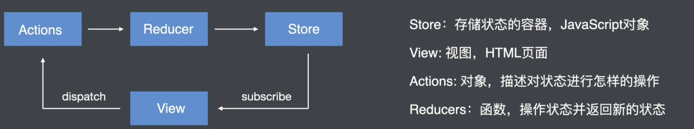

# [Rudux](http://cn.redux.js.org/)



* View：视图，html页面
* Actions：对象，描述对状态进行怎样的操作
* Reducers：函数，操作状态并返回新的状态
* Store：对象，存储状态的容器

> 整体流程：视图不可直接更改 Store 数据，触发 Actions （描述要对Store进行怎样的操作），Actions 被 Ruducer 接收到，根据 Actions 的 type 属性进行判断，对状态进行操作，进而更新 Store，同步给视图。

## Action

**action** 是一个具有 `type` 字段的普通 JavaScript 对象。**你可以将 action 视为描述应用程序中发生了什么的事件**.

`type` 字段是一个字符串，给这个 action 一个描述性的名字，比如`"todos/todoAdded"`。我们通常把那个类型的字符串写成“域/事件名称”，其中第一部分是这个 action 所属的特征或类别，第二部分是发生的具体事情。

```js
const addTodoAction = {
  type: 'todos/todoAdded',
  payload: 'Buy milk'
}
```

**action creator** 是一个创建并返回一个 action 对象的函数。它的作用是让你不必每次都手动编写 action 对象：

```js
const addTodo = text => {
  return {
    type: 'todos/todoAdded',
    payload: text
  }
}
```

## Reducer

**reducer** 是一个函数，接收当前的 `state` 和一个 `action` 对象，必要时决定如何更新状态，并返回新状态。函数签名是：`(state, action) => newState`。 **你可以将 reducer 视为一个事件监听器，它根据接收到的 action（事件）类型处理事件。**

> "Reducer" 函数的名字来源是因为它和 [`Array.reduce()`](https://developer.mozilla.org/en-US/docs/Web/JavaScript/Reference/Global_Objects/Array/reduce) 函数使用的回调函数很类似。
>
> [`Array.reduce()`](https://developer.mozilla.org/en-US/docs/Web/JavaScript/Reference/Global_Objects/Array/reduce) 方法处理数组的方式是，一次处理数组中的每一项，并返回一个最终结果。您可以将其视为“将数组减少到一个值”。
>
> **Redux reducer 函数与这个“reduce 回调函数”函数的想法完全相同！** 它接受上一个结果（`state`）和当前项（`action` 对象），根据这些参数计算出一个新 state，并返回该新 state。

- 仅使用 `state` 和 `action` 参数计算新的状态值
- 禁止直接修改 `state`。必须通过复制现有的 `state` 并对复制的值进行更改的方式来做 *不可变更新（immutable updates）*。
- 禁止任何异步逻辑、依赖随机值或导致其他“副作用”的代码

```js
const initialState = { value: 0 }

function counterReducer(state = initialState, action) {
  // Check to see if the reducer cares about this action
  if (action.type === 'counter/increment') {
    // If so, make a copy of `state`
    return {
      ...state,
      // and update the copy with the new value
      value: state.value + 1
    }
  }
  // otherwise return the existing state unchanged
  return state
}
```

## Store

Store 就是用来维持应用所有的 [state 树](http://cn.redux.js.org/understanding/thinking-in-redux/glossary#state) 的一个对象。 改变 store 内 state 的惟一途径是对它 dispatch 一个 [action](http://cn.redux.js.org/understanding/thinking-in-redux/glossary#action)。

### store方法

* getState()
* dispatch(action)
* subscribe(listener)
* replaceReducer(nextReducer)

## 计数器案例

```js
const initialState = { count: 0 };

// 定义 reducer
function reducer(state = initialState, action) {
	switch (action.type) {
    case 'increment':
      return { ...state, count: state.count + 1};
    case 'decrement':
      return { ...state, count: state.count - 1};
    default:
      return state;
  }  
}

// 创建 store
const store = Redux.createStore(reducer);

// 定义 action
const increment = { type: 'increment' };
const decrement = { type: 'decrement' };

// 触发 action
store.dispatch(increment); // {count : 1}
store.dispatch(decrement); // {count : 0}

// 订阅
store.subscribe(() => {
  console.log(store.getState());
})
```

## Redux、Vuex、san-store 对比

|            | Redux                                                        | Vuex                                                       | San-store                                                 |
| ---------- | ------------------------------------------------------------ | ---------------------------------------------------------- | --------------------------------------------------------- |
| 核心概念   | action、reducer、store                                       | action、mutation、state、getters                           | action、store                                             |
| 是否可变性 | 不可变，reducer 内部禁止直接修改 `state`。必须通过复制现有的 `state` 并对复制的值进行更改的方式来做 | 可变，直接修改 state                                       | 不可变，san-update 提供 Immutable 方法 builder 来修改数据 |
| 同步与异步 | action 中可同步可异步（依赖 redux-thunk 插件）               | commit 触发mutation同步操作，dispatch 触发 action 异步操作 | action 中 返回 builder 为同步，返回 Promise 为异步        |

