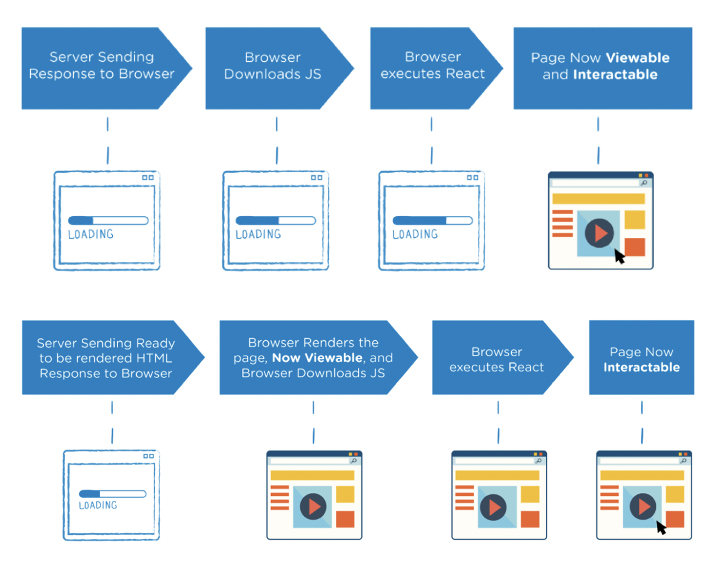
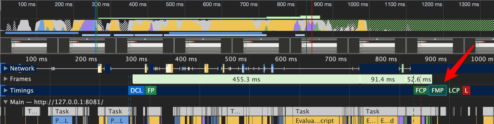
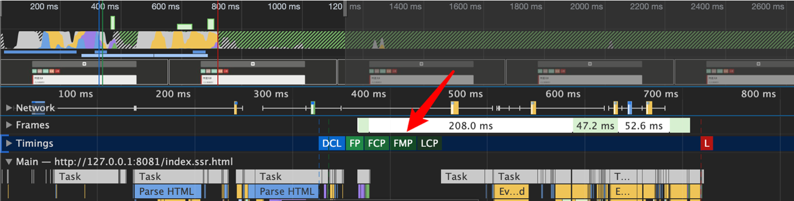

# 服务端渲染

SSR（Server Side Render）是指在服务端把数据填充到模板形成完整的页面，减少了客户端的工作优化了首屏（FMP：first meaningful paint）性能。

## 渲染模式

### 传统服务端渲染

* 最早期，Web 页面渲染都是在服务端完成的，即服务端运行过程中将所需的数据结合页面模板渲染为

  HTML，响应给客户端浏览器。所以浏览器呈现出来的是直接包含内容的页面。

* 这种方式的代表性技术有：ASP、PHP、JSP，再到后来的一些相对高级一点的服务端框架配合一些模板

  引擎

* 在今天看来，这种渲染模式是不合理或者说不先进的。因为在当下这种网页越来越复杂的情况下，这种

  模式存在很多明显的不足：

  * 应用的前后端部分完全耦合在一起，在前后端协同开发方面会有非常大的阻力；

  * 前端没有足够的发挥空间，无法充分利用现在前端生态下的一些更优秀的方案；

  * 由于内容都是在服务端动态生成的，所以服务端的压力较大；

  * 相比目前流行的 SPA 应用来说，用户体验一般；


### SPA单页应用

* 随着ajax的发展（AJAX 是与服务器交换数据并更新部分网页的艺术，在不重新加载整个页面的情况下）以及前端框架的发展，Vue，React，Angular 都是基于客户端渲染的前端框架，这类框架所构建的都是单页应用（SPA）
* 优点：用户体验好、开发效率高、渲染性能好、可维护性好
* 缺点：首屏渲染时间长、不利于 SEO

### 同构应用

* 同构服务端渲染首屏直出，解决 SPA 应用首屏渲染慢以及不利于 SEO 问题
* 然后通过客户端渲染接管页面内容交互得到更好的用户体验
* 实际是【服务端渲染】 + 【客户端渲染】的结合
* 优点：首屏渲染速度快、有利于 SEO
* 缺点：
  * 开发成本高。
  * 涉及构建设置和部署的更多要求。与可以部署在任何静态文件服务器上的完全静态单页面应用程序 (SPA) 不同，服务器渲染应用程序，一般需要处于 Node.js server 运行环境。
  * 更多的服务器端负载。在 Node.js 中渲染完整的应用程序，显然会比仅仅提供静态文件的server 更加大量占用 CPU 资源 (CPU-intensive - CPU 密集)，因此如果你预料在高流量环境(high traffic) 下使用，请准备相应的服务器负载，并明智地采用缓存策略

后面我们介绍的服务端渲染一般是指同构应用，前端组件化框架的服务端渲染，比如 React SSR、Vue SSR、San SSR。



* 上面为 CSR：加载 HTML、加载 JS、渲染/FMP
* 下面为 SSR：加载HTML、渲染/FMP、加载 JS

## 为什么要 SSR

### 1. SEO

多数搜索引擎都可以读取 SPA 内容，但异步内容仍然不容易索引。

* 抓取异步内容 10-20s Timeout[[1\]](https://medium.com/@l.mugnaini/spa-and-seo-is-googlebot-able-to-render-a-single-page-application-1f74e706ab11)
* 爬虫不一定认识前端路由[[2\]](https://www.freecodecamp.org/news/using-fetch-as-google-for-seo-experiments-with-react-driven-websites-914e0fc3ab1/)，尤其是 Hash
* JavaScript 错误等 Edge Case
* 用户体验会影响排名，尤其是页面性能：TTI、FMP、……

### 2. 性能

首先看 CSR 的性能



再看 SSR 的性能



* 曲线图中黄色和箭头指向为脚本执行，紫色为渲染，如果有多个紫色则是发生了重绘。
* 名词解释
  * `FP (First Paint)`首次绘制 
  * `FCP (First Contentful Paint)` 首次内容绘制 
  * `LCP (Largest Contentful Paint)` 最大内容渲染
  * `DCL (DomContentloaded)`
  * `FMP(First Meaningful Paint)` 首次有效绘制
  * `L (onLoad)`
  * `TTI (Time to Interactive)` 可交互时间 
* SSR 的 DCL 时间会变长，因为服务端做的事情变多了，返回的不是空的 Html。
* SSR 的 DCL 和 FMP 是同时到达的，即获取到 html 后就可以展示到页面上，用户可以看的见。

## SSR 的代价

* **TTFB** **更晚，服务器端时间更长**
  * DCL、FP 指标应当调整为 FMP、TTI。
  * 考虑离线预渲染替代服务端渲染
* **TTI** **不一定更早**
  * 用户首次看到的只是静态页面，但此时还不能交互。
  * 下一步需要执行脚本，这个过程 vue 中称为 [Hydration](https://vuejs.org/guide/scaling-up/ssr.html#client-hydration)（客户端激活），不一定比重新渲染更快。
* **维护成本更高**
  * 组件需要同时考虑 Node.js 和浏览器两种宿主环境。

## 不适合 SSR 的场景

1. 后台系统：CMS、MIS、Dashboard
2. 功能型页面：个人中心、我的收藏
3. 静态内容：用户无关的页面、静态的页面、考虑预渲染

## vue-ssr

官方文档：https://vuejs.org/guide/scaling-up/ssr.html#rendering-an-app

* [Vue SSR 指南](https://www.bookstack.cn/read/vue-ssr-zh/intro.md)

* [Vue SSR 官网](https://vuejs.org/guide/scaling-up/ssr.html)

```js
// this runs in Node.js on the server.
import { createSSRApp } from 'vue'
// Vue's server-rendering API is exposed under `vue/server-renderer`.
import { renderToString } from 'vue/server-renderer'

const app = createSSRApp({
  data: () => ({ count: 1 }),
  template: `<button @click="count++">{{ count }}</button>`
})

renderToString(app).then((html) => {
  console.log(html)
})
```

## san-ssr

官网：https://github.com/baidu/san-ssr

```js
const { defineComponent } = require('san');
const { compileToRenderer } = require('san-ssr');

const MyApp = defineComponent({
  template: '<div>Hello {{ name }} !</div>'
});

const render = compileToRenderer(MyApp);
const html = render({ name: 'San' });  
```

**关于 hydration 即客户端激活的解释**

思考：如何通过 ssr 的方式将以下组件展示到页面上：

```vue
<!-- App.san -->
<template>
    <div id="app" on-click="onClick">
      <p>Hello {{name}}!</p>
      <p class="count">Click count: {{ count }}</p>
    </div>
</template>
<script>
import {Component} from 'san'
class x extends Component {}
    export default {
        initData() {
            return {
                name: 'San',
                count: 0
            };
        },
        onClick() {
            const count = this.data.get('count')
            this.data.set('count', count + 1)
        }
    };
</script>
<style lang="less">
    @highlight: #f00;

    div {
        .count {
            color: @highlight;
        }
    }
</style>
```

首先在服务端，san-ssr 对该组件处理后得到如下，即为服务端通过 html 直接返回给浏览器展示的

```html
<div id="app"><!--s-data:{"count":1,"name":"San"}-->
  <p>Hello San!</p>
  <p class="count">Click count: 1</p>
</div>
```

但是其中的点击事件不会生效，所以下面需要客户端激活，以下代码在打包之后会引入到浏览器中执行。注意这里是直接 new App ，而不是 attach 进行添加。

```js
// client.js
import App from './App.san'

const app = new App({
    el: document.querySelector('#app')
});
```

如果客户端 new App 能够和服务端返回的 html 匹配得上，则会激活成功，客户端代码生效，点击事件即可执行。这个过程中还涉及到 webpack 的配置，express 服务的启动，详见[demo](https://github.com/jinjingxuan/san-loader/tree/next/examples/ssr)

