# Three.js

介绍 three.js 之前先需要介绍一下一门计算机基础学科：计算机图形学

## 计算机图形学

计算机图形学是一门研究通过计算机将数据转换成图形，并在专门显示设备上显示的原理方法和技术的学科。它是建立在传统的图学理论、应用数学及计算机科学基础上的一门边缘学科。

总而言之计算机图形学是研究怎样利用计算机来显示、生成和处理图形的原理、方法和技术的一门学科，这里的图形是指三维图形的处理。

### 1. 电影特效

计算机图形学在电影特效中有着广泛的应用。通过计算机生成的图形，电影制作人员可以创造出各种想象力丰富的特效，例如逼真的爆炸、怪物与外星人、超凡脱俗的场景等。这些特效大大提升了电影的视觉效果，并为故事情节增添了动态和吸引力。

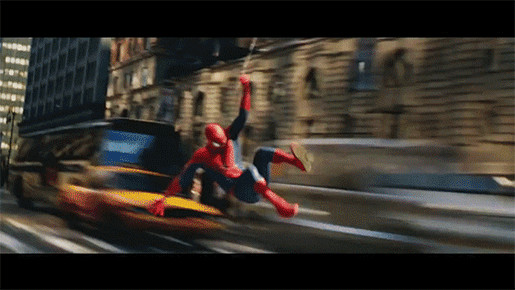

### 2. 游戏开发

计算机图形学在游戏开发中也扮演着重要角色。游戏开发人员使用计算机图形学的技术来设计游戏中的场景、角色和动画效果。通过逼真的渲染和交互性能，计算机图形学为玩家提供了身临其境的游戏体验。

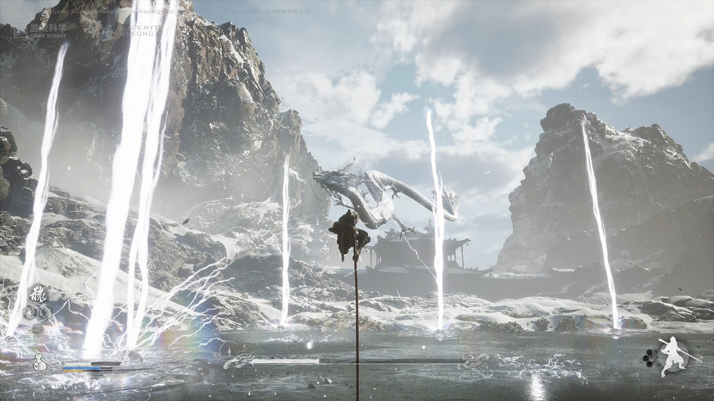

### 3. 虚拟现实

虚拟现实是计算机图形学的一个重要应用领域。借助于计算机图形学的技术，虚拟现实可以模拟出现实世界或虚构世界的场景，并通过头戴式设备等交互工具让用户身临其境地体验。虚拟现实技术已经在游戏、教育、医疗等领域得到了广泛应用。

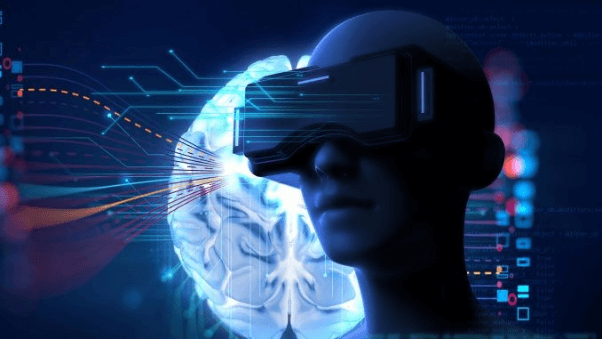

### 4. 工程设计

计算机图形学在工程设计中也起到了重要的作用。通过使用三维建模和渲染技术，工程师可以设计和模拟出各种产品和建筑的外观和功能，从而实现对设计方案的可视化评估和改善。

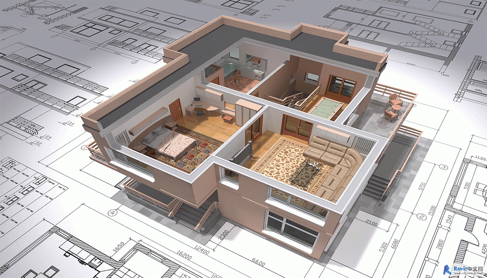

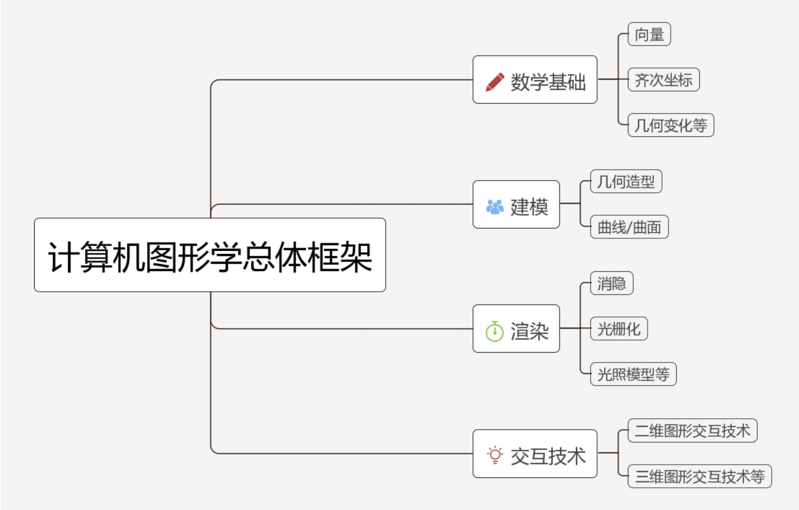

## 计算机图形学、OpenGL、webGL、three.js 关系

**计算机图形学**：计算机图形学是一门学科，范畴非常大，被广泛应用于特效、捕捉、动画、设计、模拟与仿真当中。

**OpenGL**：是一种C语言标准的库，将各种[计算机图形学](https://www.zhihu.com/search?q=计算机图形学&search_source=Entity&hybrid_search_source=Entity&hybrid_search_extra={"sourceType"%3A"answer"%2C"sourceId"%3A2333041265})的成果封装入库，其它开发人员可以非常方便的调用，不需要进行繁复的底层构建工作，便可以实现相关应用的开发。它提供了一组函数和接口，是一种底层的API。

**WebGL**：WebGL是基于JavaScript的Web图形库，它将OpenGL ES 2.0的功能暴露给了Web浏览器。WebGL允许在Web页面上使用GPU加速的2D和3D图形渲染。它是一种用于在Web浏览器中创建交互式图形应用程序的技术，无需插件。通过WebGL，开发者可以在网页上创建高性能的图形和游戏。

**Three.js**：Three.js是一个用于在Web上创建3D图形应用程序的JavaScript库。它建立在WebGL之上，简化了3D图形编程的复杂性。Three.js提供了高级的抽象和工具，使开发者能够更容易地创建各种3D场景、对象和特效，而无需深入了解WebGL的底层细节。它广泛用于Web上的3D游戏、可视化、虚拟现实等应用的开发。



简而言之，OpenGL是底层的图形渲染API，WebGL是将OpenGL引入到Web浏览器中的技术，而Three.js是一个建立在WebGL之上的高级JavaScript库，用于简化Web上的3D图形编程。使用Three.js可以更容易地创建具有吸引力和互动性的Web上的3D图形应用程序。

## Canvas

看到这里可能会有疑问，那平时我们用过的 canvas 是什么呢？

Canvas 是一个HTML5标准的2D绘图API，它使用JavaScript API来绘制图形。Canvas提供了一组简单的绘图函数，可以用于绘制图形、文本和图像。Canvas通常用于创建简单的2D图形，比如图表、游戏和用户界面。因此，WebGL主要用于创建复杂的3D场景，而Canvas则用于创建简单的2D图形。当需要处理复杂的3D场景时，使用WebGL会更加适合。当只需要创建简单的2D图形时，使用Canvas会更加便捷。

## three.js 

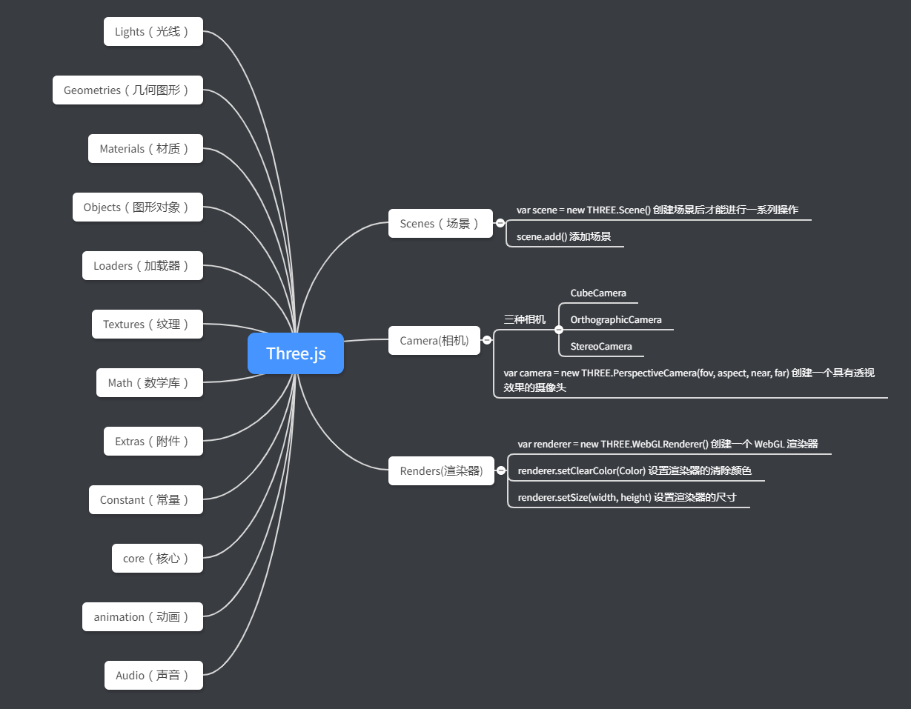

计算机是如何显示3d物体的? 显示器是二维的, 三维的物体要变成二维的, 一定是经过了某种变换.

这个过程跟照相是很相似的, 照相也是将真实世界(三维的)变成一张照片(二维的), 想象一下是如何照相的:

1. 找一个好地点, 被照相的人摆好姿势
2. 找个好的角度放置相机
3. 按下快门

### 基础元素

**场景（scene）**相当于一个舞台，我们需要将展示的东西放在这个舞台上。

**照相机（camera）**相当于人的眼睛，我们想要看到物体，就需要眼睛去看。

**光源（light）**物体需要光照才能看见，不然就是漆黑一片（但是在某些情况下展示物体不需要光源）。

**物体（object）**我们想要表现的内容，会有形状和材质属性。

**渲染器（render）**我们可以把渲染器想想成为一个画布，我们需要在这个画布上去画出我们需要展示的东西。

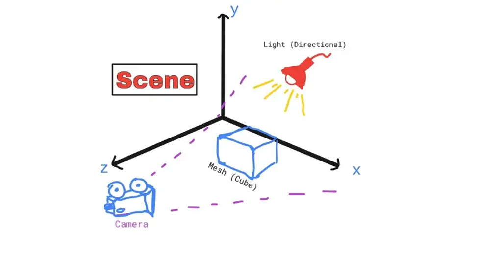

## 场景

场景是一个三维空间，是存放所有物品的容器，可以把场景想象成一个空房间，房间里面可以放置要呈现的物体、相机、光源等。

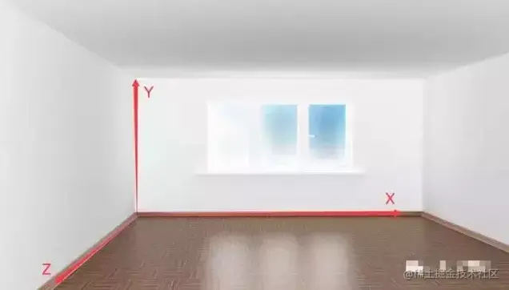

**场景**允许在什么地方、摆放什么东西来交给 three.js 来进行渲染，场景也就是放置物体、灯光和相机的地方。

创建场景：要构件一个场景很简单，只需要new一个场景对象出来即可：

```js
const scene = new THREE.Scene()
```

## 相机

在场景中需要添加一个相机，相机用来确定观察位置、方向、角度，相机看到的内容，就是我们最终在屏幕上看到的内容。在程序运行过程中，可以调整相机的位置、方向、角度。

想象一下，在房间里放了一个摄像机，你不在房间里面，但可以远程控制相机移动，摄像机传给远程电脑上展示出来的画面，就是 three.js 在屏幕上呈现的画面。

相机分为两种 **透视投影相机（perspectiveCamera）和正交投影相机（OrthographicCamera ）**

**透视投影相机（perspectiveCamera）特点**透视相机的效果是模拟人眼看到的效果，跟人眼看到的世界是一样的，近大远小。

**正交投影相机（OrthographicCamera ）特点**正交投影则远近都是一样的大小，三维空间中平行的线，投影到二维空间也一定是平行的。

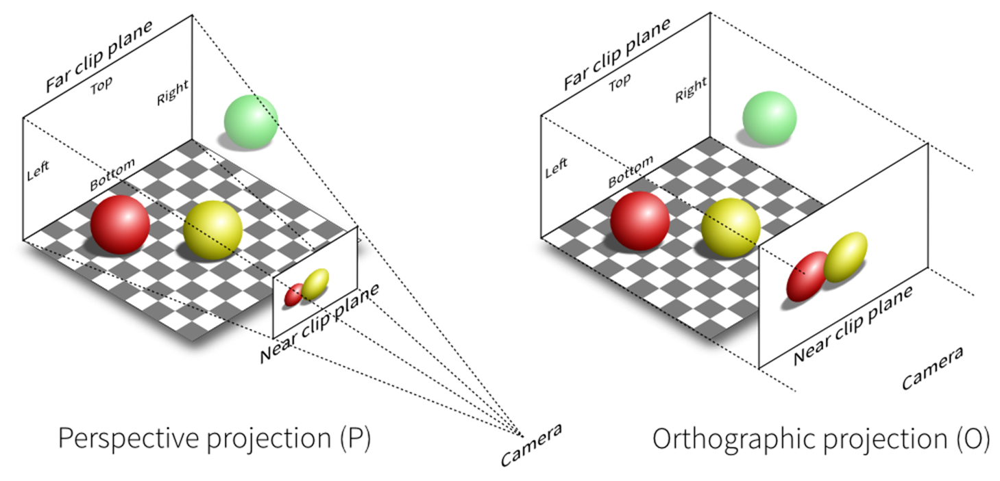

创建透视投影相机：

```js
const camera = new THREE.PerspectiveCamera(fov, aspect, near, far);
// 设置相机位置：
camera.position.set(5, 10, 10);
```

| 参数   | 介绍                                                         |
| ------ | ------------------------------------------------------------ |
| fov    | 视野：表示摄像机能看到的视野。推荐默认值50                   |
| aspect | 指定渲染结果水平方向和竖直方向长度的比值，推荐默认值为窗口的宽高比，即window.innerWidth/window.innerHeight，如果比例设置的不对，会发现渲染出来的画面有拉伸或者压缩的感觉。 |
| near   | 近端渲染距离：指定从距离摄像机多近的位置开始渲染，推荐默认值0.1 |
| far    | 远端距离：指定摄像机从它所在的位置最远能看到多远，太小场景中的远处不会被渲染，太大会浪费资源影响性能，推荐默认值1000。 |

## 物体

在 Three.js 中为我们预设了一些二维和三维几何体模型：

**PlaneGeometry（平面几何体）**

**CircleGeometry（圆形几何体）**

**RingGeometry（圆环几何体）**

**BoxGeometry（立方几何体）**

**SphereGeometry（球几何体）**

**CylinderGeometry（圆柱几何体）**

**TorusGeometry（圆环几何体）**

```js
// 创建一个长、宽、高均为1个单位的立方体
const geometry = new THREE.BoxGeometry(1, 1, 1); 
```

## 光源

在 Three.js 中可以创建出很多不同类型的光源：

**环境光（AmbientLight）：**环境光是一种基本光源，它会均匀的照亮场景中的所有物体，环境光没有特定的来源方向，且不会产生阴影。

**聚光灯（SpotLight）：**聚光灯（类似手电筒、舞台聚光灯）是从一个方向上的一个点发出，沿着一个圆锥体，它离光越远，它的尺寸就越大。这种光源会产生阴影。

**平行光（DirectionalLight）：**平行光是沿着特定方向发射的光。这种光的表现像是无限远,从它发出的光线都是平行的。常常用平行光来模拟太阳光 的效果; 太阳足够远，因此我们可以认为太阳的位置是无限远，所以我们认为从太阳发出的光线也都是平行的。这种光源会产生阴影。

```js
// 创建光源
const spotLight = new THREE.SpotLight(0xffffff);
// 设置光源位置
spotLight.position.set(0, 20, 20);
// 设置光源照射的强度
spotLight.intensity = 5;
// 将光源添加到场景中
scene.add(spotLight);
```

### 渲染器

渲染器的作用就是将相机拍摄出的画面在浏览器中呈现出来。渲染器决定了渲染的结果应该画在页面的什么元素上面，并且以怎样的方式来绘制。

Three.js中有很多种类的渲染器，例如webGLRenderer、canvasRenderer、SVGRenderer，通常使用的是WebGLRenderer渲染器。

```js
// 创建WebGLRenderer渲染器
const renderer = new THREE.WebGLRenderer();
 // 通过调用 setSize() 方法设置渲染的长宽（设置渲染器为全屏）
renderer.setSize(window.innerWidth, window.innerHeight);
 // 将渲染结果展示到页面上
document.body.appendChild(renderer.domElement);
// 创建完渲染器后，需要调用render方法将之前创建好的场景和相机相结合从而渲染出来
renderer.render(scene, camera);
```

## 三维坐标系

为了方便观察3D图像，添加三维坐标系对象

```js
// 为了方便观察3D图像，添加三维坐标系对象
const axes = new THREE.AxisHelper(4); // 坐标系轴长设置为 4
// 把三维坐标系 添加到场景中
scene.add(axes);
```

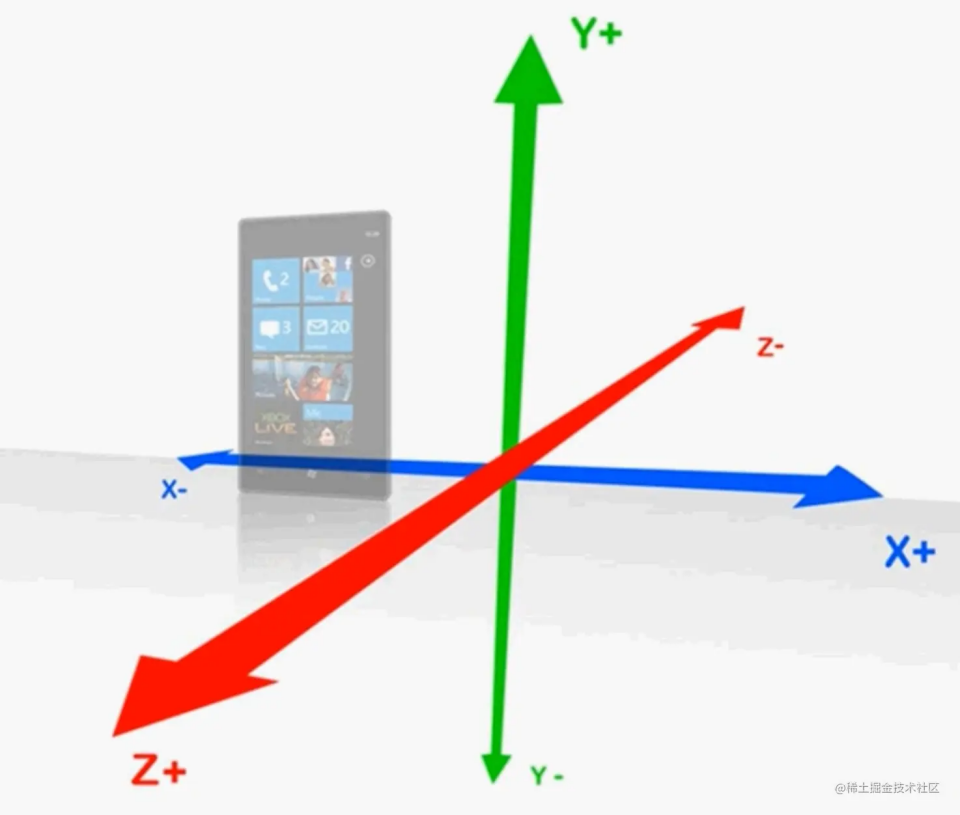

综上使用 Three.js，在屏幕上展示 3D 图形的大概步骤：

1. 创建一个三维空间场景（ Scene ）；
2. 创建一个相机（ Camera ），确定一个观察点，并设置相机的观察方向和角度；
3. 创建渲染器，设置渲染器的长宽，将渲染结果展示到页面上；
4. 创建物体（几何体、材质、网格）、光源（同时设置光源位置），并添加到场景中去；
5. 最后通过渲染器，把场景、相机渲染到页面上。



## three.js 中的数学

### 向量

在数学中，向量（也称为矢量），指具有大小（magnitude）和方向的量。它可以形象化地表示为带箭头的线段。

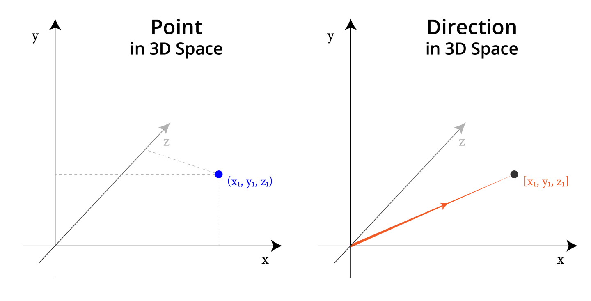

```js
// 已知两个点的坐标
const A = Vector3(1, 2, 0)
const B = Vector3(-2, 1, 2)
// 求 AB 向量
const AB = B.clone().sub(A) // Vector3(-3, -1, 2)
```

## 点乘

已知两个向量，如何求向量的夹角？

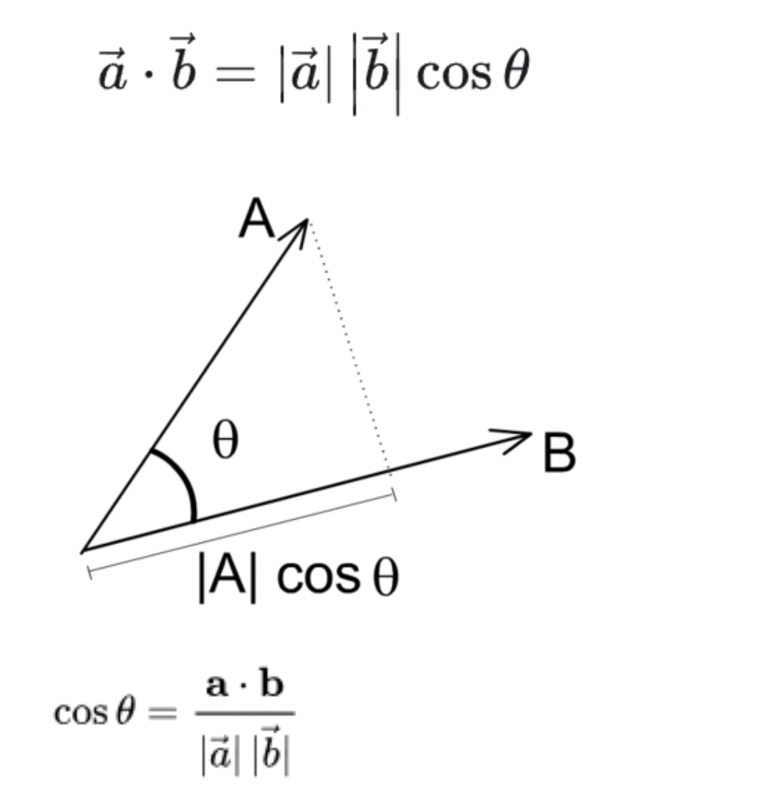

```js
const CosineValue = A.dot(B) / (A.length() * B.length())
```

## 叉乘

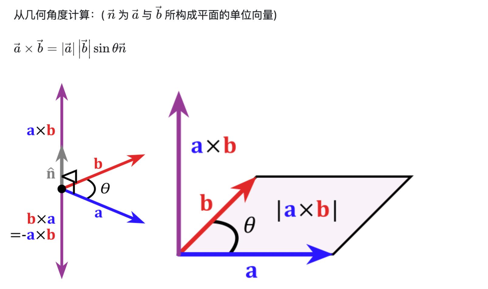

几何意义：如果以向量a和b为边构成一个平行四边形，那么这两个向量外积的模长与这个平行四边形的面积相等。

```js
// 声明一个向量对象，用来保存.crossVectors()方法结果
  const C = new THREE.Vector3();
  C.crossVectors(A, B);
```

## 欧拉角

3D游戏或者3D电影中，比如[黑客帝国](https://www.zhihu.com/search?q=黑客帝国&search_source=Entity&hybrid_search_source=Entity&hybrid_search_extra={"sourceType"%3A"answer"%2C"sourceId"%3A"236284413"})中酷炫的旋转是怎么实现的？旋转的算法有很多，这里主要介绍其中一种：欧拉角。

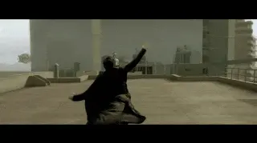

欧拉角是飞控系统中用于描述飞行器姿态的方式，使用三个角度来表示，分别是`yaw`偏航角、`pitch`俯仰角、`roll` 滚转角。

- yaw：偏航角，是指飞行器偏离原来航线的角度。
- pitch：俯仰角，是指飞行器机头抬起的角度。
- roll：滚转角，是指飞行器绕着自身头尾轴线翻滚的角度。

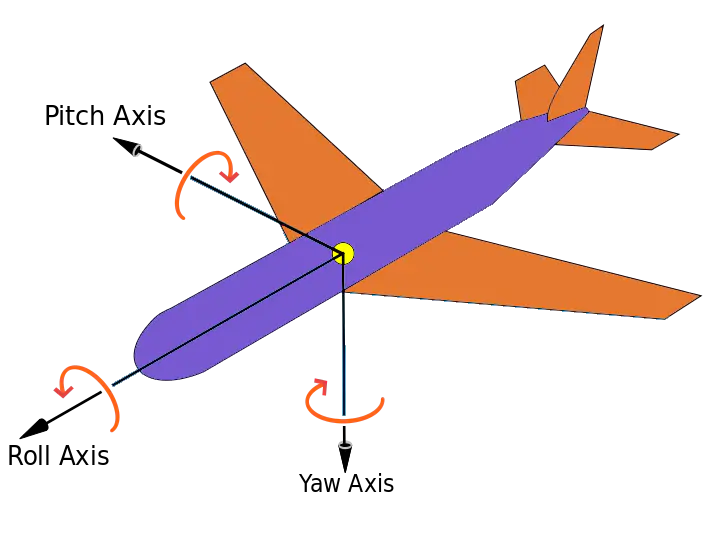

```js
const a = new THREE.Euler( 0, 1, 1.57, 'XYZ'); // 创建一个欧拉对象，'XYZ'表示旋转顺序的字符串，默认为大写
const b = new THREE.Vector3( 1, 0, 1 ); // 创建一个变量
b.applyEuler(a); // 将欧拉变换应用到这一向量上
```

## 四元数

形如a+bi（a、b均为实数）的数为复数，其中，a被称为实部，b被称为虚部，i为虚数单位，i^2 = -1。

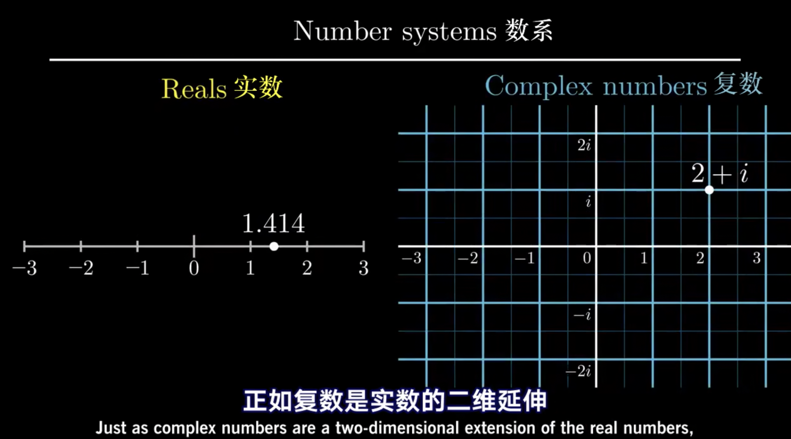

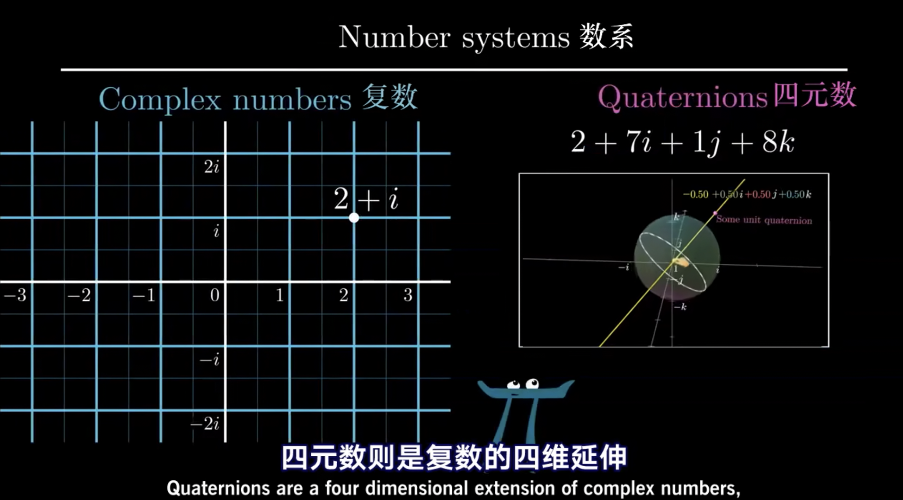

四元数的发现者是由[爱尔兰](https://zh.wikipedia.org/wiki/爱尔兰)数学家[威廉·卢云·哈密顿](https://zh.wikipedia.org/wiki/威廉·盧雲·哈密頓)在1843年创立出的。他花了一生中大部分时间寻找『三维复数』，据说每天早上他儿子都会问他，找没找到三维复数，但他总是说还没有。但是在 1843年10月16日，走过都柏林的布鲁姆桥的时候，他灵光一闪，他需要给复数加上的不是一个维度，而是额外两个假想的维度，即一共三个虚维度来描述空间，而实数在第四个维度，垂直于全部三个虚数轴，他就在桥上刻下了描述这三个虚数单位的等式。

在发现四元数后，他努力地推广四元数，并作为教学生描述三维空间时的第一语言。但当时的反派数学家也没闲着，批判晦涩难懂的四元数是邪恶的，甚至四元数乘法不满足交换律。知道一个世纪之后，四元数在计算机工业界起死回生，程序员把它应用到图像，机器人，以及涉及到3维空间旋转的领域。二十世纪四元数还被应用于另一个重要的领域：量子力学。

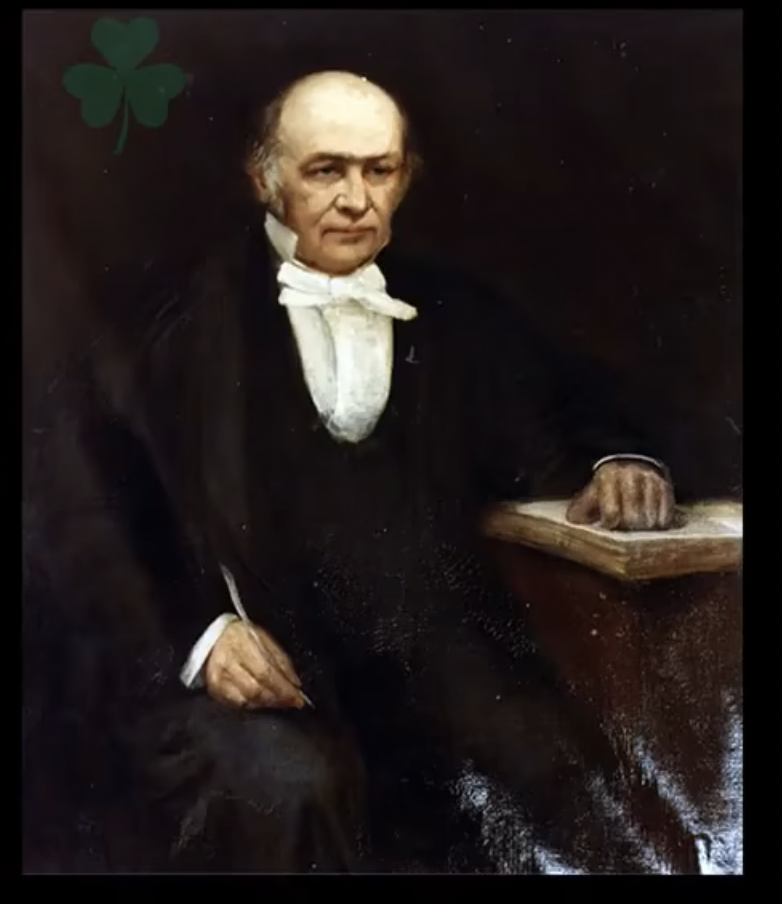

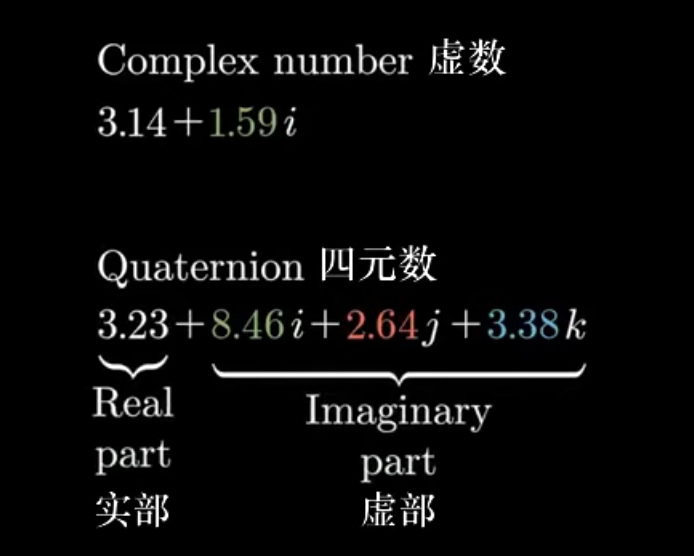

three.js 对四元数的数学细节和算法进行了封装。

```js
// 创建一个四元数对象
const quaternion = new THREE.Quaternion();
// 给定旋转轴和旋转角度生成旋转四元数，物体绕z轴旋转90度
quaternion.setFromAxisAngle(new THREE.Vector3(0, 0, 1).normalize(), Math.PI / 2);
// 创建向量
const vector = new THREE.Vector3( 1, 0, 0 );
// 将四元数变换应用在此向量上
vector.applyQuaternion( quaternion );
```

## 加载 .GLTF/.GLB 文件

- **glTF** 即是 **GL Transmission Format** 的缩写。
- **glTF** 是一种3D内容的格式标准，由Khronos Group管理，（**Khronos Group**还管理着**OpenGL**系列、**OpenCL**等重要的行业标准）。
- **glTF** 的设计是**面向实时渲染应用**的，尽量提供可以直接传输给图形API的数据形式，**不再需要二次转换**。
- **glTF** 对**OpenGL ES**、**WebGL**非常友好。
- **glTF** 的目标是：3D领域的**JPEG**。
- 作为一个标准，自2015年10月发布（glTF 1.0）以来，已经得到了业界广泛的认可，你可以相信它的水平。
- glTF目前最新版本为2.0已于2017年6月正式发布。

GLTF格式是三维模型格式（json），你可以把GLTF格式的三维模型理解为.jpg、.png格式的图片一样。Web 开发图片会是常用格式，而对于 Web3D 开发，GLTF必然成为一个重要的标准格式。

.glTF是文本格式文件，而 .glb 是 .glTF 的二进制格式。

[Sketchfab](https://sketchfab.com/3d-models?features=downloadable&sort_by=-likeCount) 上可以下载 GLTF 模型

```js
import * as THREE from 'three';
import { GLTFLoader } from 'three/examples/jsm/loaders/GLTFLoader.js';
import { OrbitControls } from 'three/examples/jsm/controls/OrbitControls.js';
// 创建场景
const scene = new THREE.Scene();
// 创建相机
const camera = new THREE.PerspectiveCamera(
    50, 
    window.innerWidth / window.innerHeight, 
    0.1, 
    1000 
);
camera.position.set(0, 0, 5);
// 创建渲染器
const renderer = new THREE.WebGLRenderer();
renderer.setSize(window.innerWidth, window.innerHeight);
document.body.appendChild(renderer.domElement);
// 添加光源
const spotLight = new THREE.SpotLight(0xffffff);
spotLight.position.set(0, 20, 20);
spotLight.intensity = 5;
scene.add(spotLight);
// 加载模型
const loader = new GLTFLoader().setPath('models/shiba/');
loader.load('scene.gltf', function (gltf) {
    scene.add(gltf.scene);
    render();
})
// 创建控件对象, 可以使得相机围绕目标进行轨道运动。
const controls = new OrbitControls(camera, renderer.domElement);
controls.addEventListener('change', render);
controls.minDistance = 2; // 能够将相机向内移动多少
controls.maxDistance = 10; // 能够将相机向外移动多少
controls.target.set(0, 0, 0); // 控制器的焦点，轨道围绕它运行
controls.update(); // 更新控制器

function render() {
    renderer.render(scene, camera);
};
```
