# 乒乓球游戏

### 屏幕的位置

近裁剪面和远裁剪面定义了相机的渲染范围。位于近裁剪面之前的物体和位于远裁剪面之后的物体都不会被渲染。为了提高渲染性能，通常应该尽量将近裁剪面和远裁剪面之间的距离设置得较小。

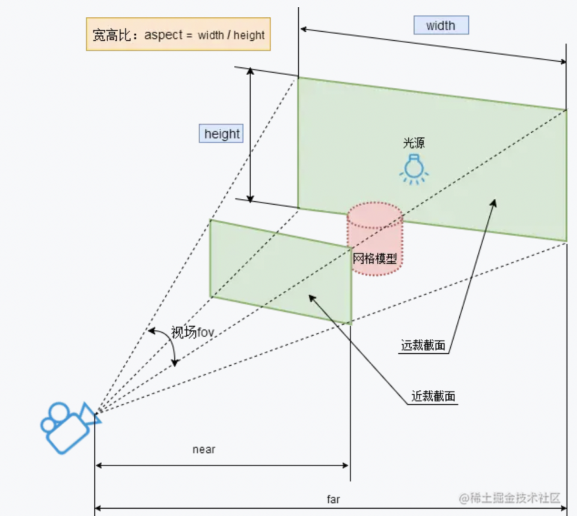

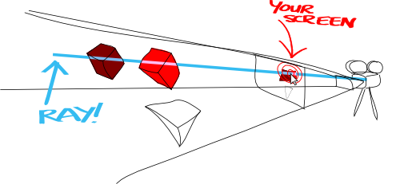

## 页面组成

gltf/glb 模型：

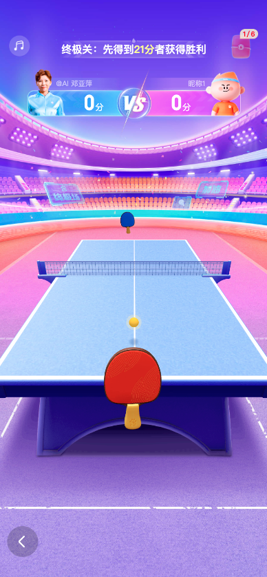

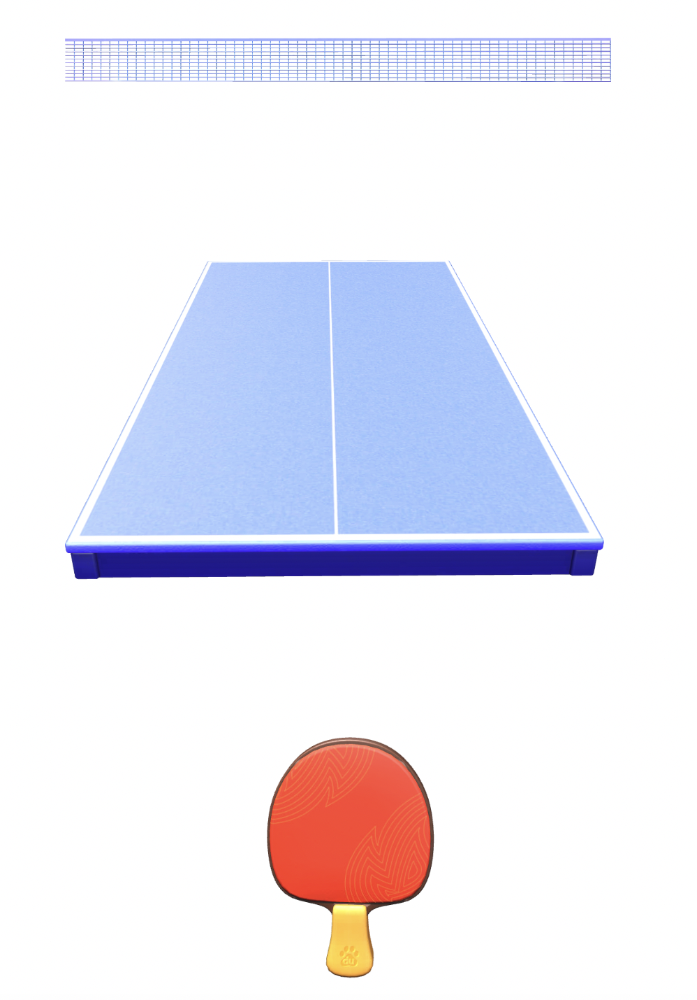

直接使用模型虽然方便我们开发，但是还要考虑到性能和资源的影响，例如本次一个球拍的 glb模型大小就有接近800KB。开发时需要考虑有没有其他方式。

> 如何给三维世界设置背景？

## HDR

High-Dynamic Range （HDR）image的缩写，简单说，HDRI是一种亮度范围非常广的图像，它比其它格式的图像有着更大亮度的数据贮存，而且它记录亮度的方式与传统的图片不同，不是用非线性的方式将亮度信息压缩到8bit或16bit的颜色空间内，而是用直接对应的方式记录亮度信息，它可以说记录了图片环境中的照明信息，因此我们可以使用这种图像来“照亮”场景。有很多HDRI文件是以全景图的形式提供的，我们也可以用它做环境背景来产生反射与折射。

用最简单最直白易懂的话来总结说：HDRI就是会发光的图片。它的每一个像素，就相当于是一个小LED灯泡。最亮的部分就是太阳所在的部分。因为它是LED灯，所以它可以把光和色照射出来，影响到周围。

```js
import {RGBELoader} from 'three/examples/jsm/loaders/RGBELoader';
const rgbeLoader = new RGBELoader();

rgbeLoader.load('xxx.hdr', envMap => {
    // hdr作为环境贴图生效，设置.mapping为EquirectangularReflectionMapping
    envMap.mapping = THREE.EquirectangularReflectionMapping;
    scene.environment = envMap; // 设置每个物体
    scene.background = envMap; // 设置整体的天空背景
})
```

## 如何设置背景图

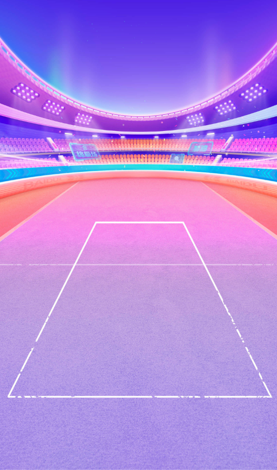


```js
// 可以给 render 设置透明，这样后面的背景图就会展示出来
const renderer = new THREE.WebGLRenderer({antialias: true, alpha: true});
renderer.setClearAlpha(0.0);
```

## 纹理贴图

对于场景中的某些地方的展示可以用纹理贴图

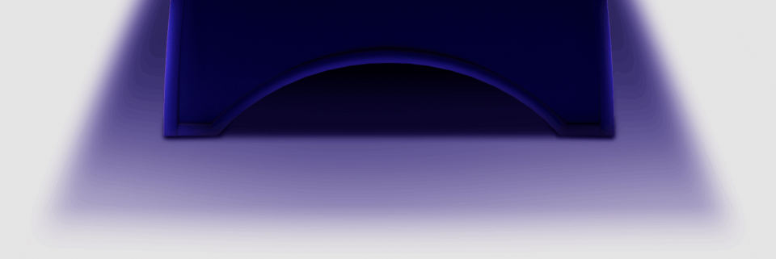


```js
const geometry = new THREE.PlaneGeometry(1.1, 0.3); // 平面
const textureLoader = new THREE.TextureLoader();
textureLoader.load(TableFootPng, texture => {
    const material = new THREE.MeshBasicMaterial({
        map: texture,
        transparent: true, // 防止图片背景透明部分为黑色
    });
    const mesh = new THREE.Mesh(geometry, material);//纹理贴图网格模型对象
    mesh.position.set(0, -0.3, 1);
    mesh.rotation.x = -Math.PI / 6;
    scene.add(mesh);//网格模型添加到场景中
});
```

ok，目前位置我们资源都准备好了，那么如何进行组装呢？

## 单位与坐标

在 three.js 中一般会默认一个单位对应一米，然后提前和视觉同学对齐，比如我们乒乓球中设置的各个物体的长宽如：

```js
const TABLEWIDTH = 1.1; // 桌子宽度
const TABLEDEPTH = 2; // 桌子深度
const PADDLEWIDTH = 0.153; // 球拍模型宽度
const PADDLEHIGHT = 0.22; // 球拍模型高度
```

然后我们需要约定好坐标原点，比如我们本次约定桌面中心为左边原点

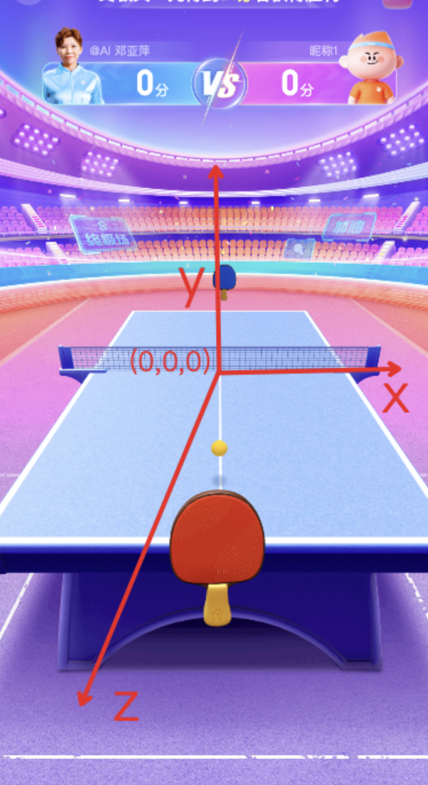

我们约定好上述条件后，视觉提供给我们的一般模型中会自带位置信息，我们只需要将其直接添加到场景中即可

```js
// GLTF 加载器
import {GLTFLoader} from 'three/examples/jsm/loaders/GLTFLoader';
const loader = new GLTFLoader();
const TABLEGLB = 'https://feed-activity.cdn.bcebos.com/lego/duanju/nowuhuan-table.glb'; // 桌面
loader.load(TABLEGLB, gltf => {
    scene.add(gltf.scene);
});
```

## 透视关系

摄影相关知识：

- 超广角：20mm以下，常用于风光摄影
- 广角：20mm-40mm，有拉伸空间的效果，比如房产中介拍摄房间视频。
- 标准焦段：40mm-60mm，最接近人眼，用于拍摄人像
- 长焦：60mm以上，有压缩空间的效果，拍摄远距离主体，如生态摄影及运动摄影

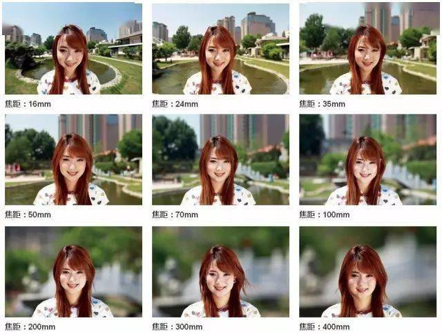

在 three.js 中左图设置的相机焦距为 10mm，右图设置的为 35mm。

由于要保证乒乓球桌的大小不变，10mm焦距的相机离物体较近，35mm焦距的相机离物体较远。

离物体的距离会改变透视关系，所以两种焦距看到的乒乓球桌并不一样。

```js
camera.setFocalLength(10); // 设置相机焦距
```

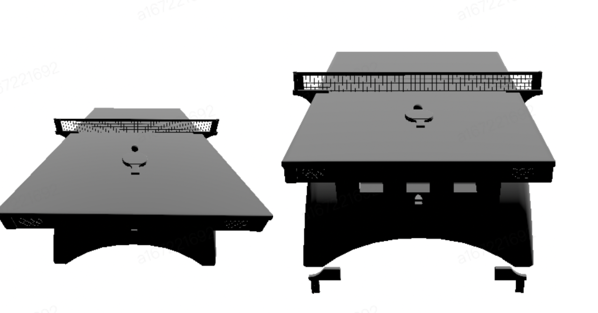

## 抗锯齿

通过Three.js开发应用程序的时候，场景渲染效果默认会有锯齿

1. 提高渲染器的抗锯齿质量，在创建渲染器时，可以设置抗锯齿属性来减少锯齿。
2. 使用更高分辨率的纹理来减少锯齿。
3. 使用多重采样抗锯齿（MASS）创建更平滑的边缘。
4. 使用平滑着色（Smooth Shading）来减少锯齿。
5. 使用后期处理（Post-Processing）来减少锯齿。

效果越好的算法，渲染负担也越重，此处我们直接使用第一种即可。

```js
const renderer = new THREE.WebGLRenderer({
    antialias: true, // 抗锯齿
});
// 设置设备像素比，防止模糊输出 canvas
renderer.setPixelRatio(window.devicePixelRatio);
```

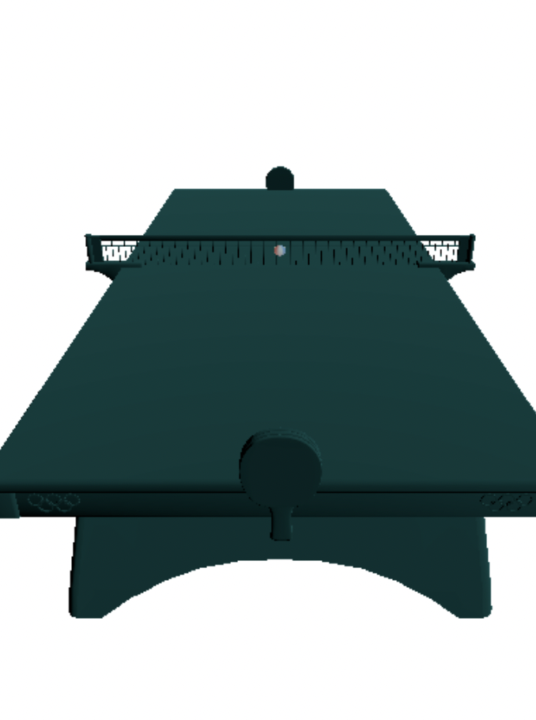

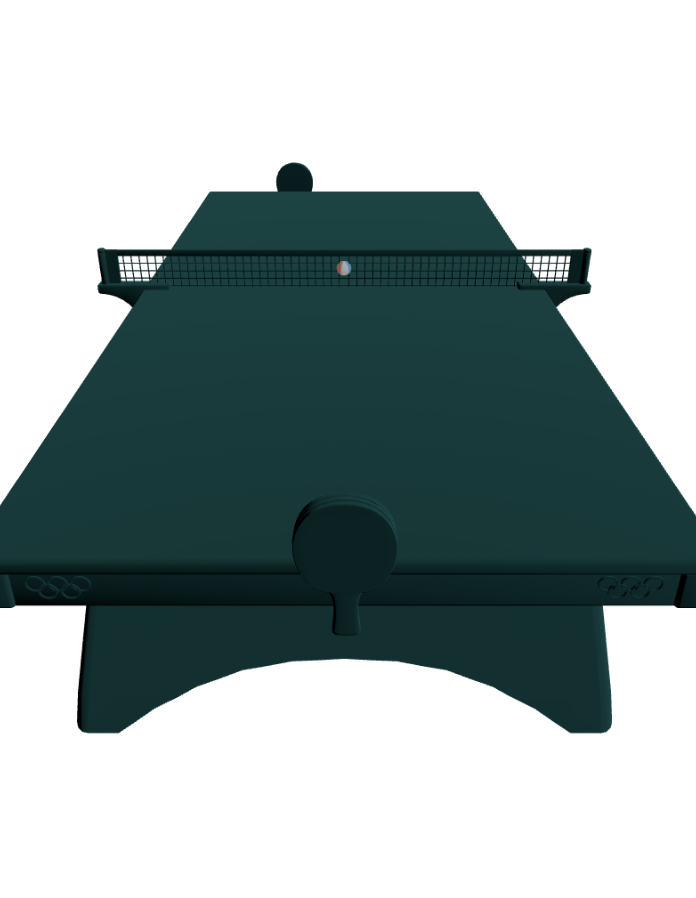

## 运动轨迹

三维空间，横向x轴，纵向y轴，垂直于屏幕z轴

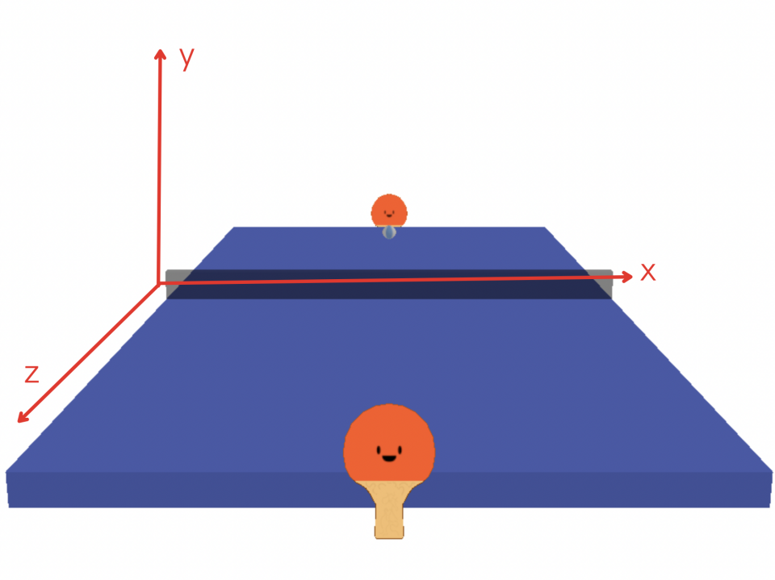

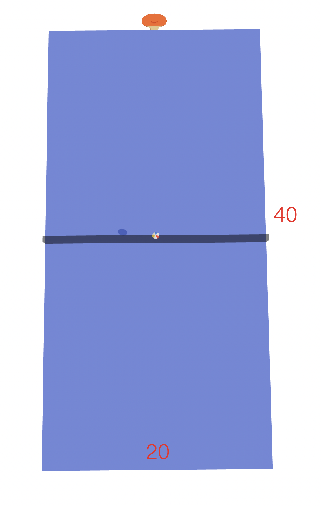

小球运动轨迹：x轴，z轴可以变化，y轴为抛物线（y随z变化）

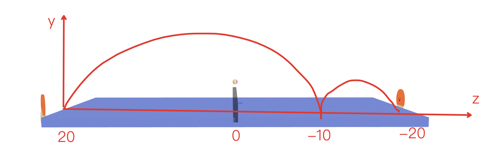

求经过（20，0）和（-10，0）且开口向下的抛物线方程，形如 y = - (z - a)^2/ b + c 或者 y = az^2 + bz + c，当然我们不希望每一次乒乓球的抛物线轨迹都相同，所以我们需要给出一些范围，随机产生轨迹的抛物线。

```js
const calculateRanges = (
    {
        currentPos, // 当前位置坐标
        zRange = [-0.8, -0.2], // 落点的z轴范围
        bRange = [-2, 2], // 最高点的z轴范围
        yRange = [0.12, 0.2], // z为0时的y轴范围
    }
) => {
    const {y: yc, z: zc} = currentPos;
    const [zMin, zMax] = zRange;
    const [bMin, bMax] = bRange;
    const [yMin, yMax] = yRange;
    const results = [];
    for (let z = zMin; z < zMax; z += 0.01) {
        for (let b = bMin; b <= bMax; b += 0.01) {
            if (Math.abs(zc - z) < 1e-6 || Math.abs(z + b) < 1e-6) {
                continue;
            } // 避免分母为0
            const aNumerator = yc;
            const aDenominator = (zc - z) * (zc + z + 2 * b);
            const a = aNumerator / aDenominator;
            if (isNaN(a) || !isFinite(a)) {
                continue;
            } // 检查a的有效性
            const c = -a * (z + b) ** 2;
            const inequalityLeft = a * b ** 2 + c;
            if (inequalityLeft >= yMin && inequalityLeft <= yMax) {
                results.push({a, b, c, z});
            }
        }
    }
    const random = Math.floor(Math.random() * results.length);
    return results[random];
};
```

## 用户交互

用户如何操作球拍？手指触摸在屏幕上其实是个二维平面，如何在二维平面上操作使得三维场景中的球拍移动？【此处demo演示下】

- 球拍x坐标：根据mouseX变化
- 球拍y坐标：固定即可
- 球拍z坐标：raycast 算法求出真实的三维坐标

## raycast 算法

光线投射用于进行鼠标拾取（在三维空间中计算出鼠标移过了什么物体）

https://threejs.org/docs/#api/zh/core/Raycaster


```js
const raycaster = new THREE.Raycaster();
const pointer = new THREE.Vector2();

function onPointerMove( event ) {
	// 将鼠标位置归一化为设备坐标。x 和 y 方向的取值范围是 (-1 to +1)
	pointer.x = ( event.clientX / window.innerWidth ) * 2 - 1;
	pointer.y = - ( event.clientY / window.innerHeight ) * 2 + 1;
}

function render() {
	// 通过摄像机和鼠标位置更新射线
    // coords —— 在标准化设备坐标中鼠标的二维坐标 —— X分量与Y分量应当在-1到1之间。
    // camera —— 射线所来源的摄像机。
	raycaster.setFromCamera( pointer, camera );
	// 计算物体和射线的焦点
	const intersects = raycaster.intersectObjects( scene.children );
	for ( let i = 0; i < intersects.length; i ++ ) {
		intersects[ i ].object.material.color.set( 0xff0000 );
	}
	renderer.render( scene, camera );
}

window.addEventListener( 'pointermove', onPointerMove );
window.requestAnimationFrame(render);
```

## 相机视角移动

使用户体验来回击打乒乓球拉扯的感觉，增添视觉冲击力。

此处先演示下 demo，主要优化点为：

1. ai击中后相机跟随乒乓球进行一定程度的移动
2. 设定阈值防止视角拉的过远
3. 击中后视角回正

> 为了实现相机移动后，用户球拍也跟随移动，需要将相机和用户球拍添加到一个 group 中

```js
initCameraGroup() {
    this.group = new THREE.Group();
    // 将相机添加到组中
    this.group.add(camera);
    // 用户球拍添加到组中
    this.group.add(user);
    // 将组添加到scene中
    scene.add(this.group);
}
```

`THREE.Group`是一个组合对象，把零散的对象组合到一块便于操作，可以使用`THREE.Group`来操作一组对象，包括旋转，缩放，移动等，里面的子对象都会受到影响。

## 碰撞检测

完成对打过程的基础上，使用户体验发力打球的感觉，享受对战的真实感。

计算球拍与小球三维坐标的关系来判断是否碰撞。

1. 方向
2. 速度

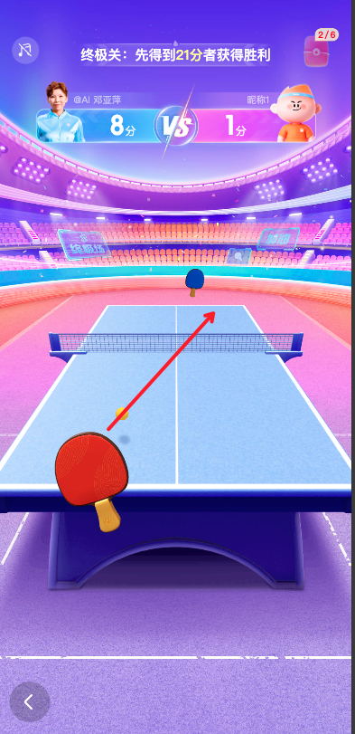

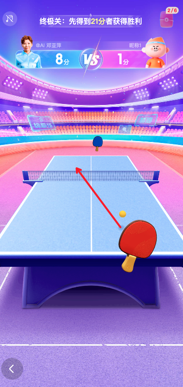

```js
 // 2 * 1 / 60 = 0.1，记录击中球拍前 30ms 的位置
const nowPos = this.posArr[this.posArr.length - 1];
const prevPos = this.posArr[this.posArr.length - 3];
if (nowPos && prevPos) {
    // 偏移量
    const offsetZ = prevPos.z - nowPos.z;
    const offsetX = prevPos.x - nowPos.x;
    // 判断方向
    if (offsetX > 0) {
        xDir = -1;
    }
    else if (offsetX < 0) {
        xDir = 1;
    }
    // 根据offset算速度比例
    this.xVelRatio = Math.min(2, 1 + Math.abs(offsetX) / 0.01);
    this.zVelRatio = Math.min(2, 1 + Math.abs(offsetZ) / 0.1);
}
```

## AI策略

1. 如何让用户必赢
2. 如何让AI必赢

思考：AI 能否接住球是靠什么控制的？答：x轴方向的移动速度

## 帧率

当前处理方式，每一帧球会移动一定的距离，在帧率不同的设备，移动相同的距离所花的时间不一样，这样就导致了不同设备上移动速度不一致的问题。不过时间是统一的，所有设备上 1s 就是 1s，因此由于之前动态计算抛物线的时候能获取到 z 的值，因此我们可以通过设置完成这个抛物线的时间，来控制球的速度，这样就不依赖帧率了。并且 y 和 z 的关系还是满足特定抛物线方程。

## 炫酷效果

1. 拖尾：粒子系统实现，使用 ShaderMaterial 将球形纹理图片生成顶点着色器数据，再使用片元着色器为顶点描绘的形状片源着色。为了形成拖尾，需要复制顶点位置，当球速快的时候绘制的拖尾会不连续，因此增加插值让拖尾连续，也可以使用 tween.js 处理，但是会增加包体积。
2. 碰撞动效：二维击打动效，图片的切换
3. 落点提示：落在球台上的效果，使用光圈纹理，动画通过缩放实现
4. buff球光圈：buff 球同光圈纹理


## 代码结构

```bash
├── const.js # 常量
├── index.js # 主体页面
├── render #游戏相关
│   ├── ai.js # ai球拍
│   ├── ball.js # 乒乓球
│   ├── collision.js # 碰撞特效
│   ├── const.js # 常量
│   ├── index.js # 渲染入口
│   ├── user.js # 我方球拍
│   └── utils.js # util方法
└── styles.less # 样式
```

## 性能优化

1. three.js自带性能监测工具
2. 纹理贴图替换模型：桌腿使用贴图，背景使用图片
3. pag对游戏的影响：多个 pag 可能会超过 canvas context 的限制，导致各个 pag 之间抢占 GPU 资源，游戏模型无法加载。
4. 音频加载优化：new Audio 是一个同步的操作，因此需要在空闲的时候初始化好，在使用的时候直接 play 即可，audio play 也是一个同步操作，会阻塞 js 执行
5. 游戏中应该暂停主框架多余的操作：主框架有一个拉新的轮询请求，在游戏中没有停止，一定程度上也占用系统资源。
6. 游戏中保证每一帧的处理函数尽可能少的同步逻辑，一些耗时操作使用异步。

## 兼容性

threejs 兼容性问题

1. 0.160.0 以上不支持 webgl，只支持 webgl2，会导致部分手机白屏
2. 0.158.0 以上部分着色器语法不支持，导致对应效果无法渲染