## react three fiber

**React**-**three**-**fiber 是**一个基于 React 的3D 渲染库，它将three.js 的强大渲染能力与React 的声明式编程模型相结合。

https://docs.pmnd.rs/react-three-fiber/getting-started/introduction

```bash
# 创建项目
npm create vite 3d-app

# 安装依赖
cd 3d-app
yarn
yarn add three @react-three/fiber

# Start
npm run dev
```

### Mesh 网格

在Three.js中，网格（Mesh）是由几何体（Geometry）和材质（Material）组成的对象。要缩放网格对象，您可以使用网格对象的scale属性。

因此在定义一个物体时，我们需要依次指定一个物体的「形状」和「材质」，通过一种特殊的类「[Mesh](https://threejs.org/docs/index.html?q=Mesh#api/en/objects/Mesh)」，我将其称为「**网格材料**」，在 Three.js 中，Mesh 是表示三维物体的基础类，它将接收两个参数：

- `geometry`：定义物体的形状；
- `material`：定义物体的材质；

现在，让我们创建一个简单的立方体：

```js
const geometry = newTHREE.BoxGeometry()
const material = newTHREE.MeshBasicMaterial()
const mesh = newTHREE.Mesh(geometry, material)
scene.add(mesh)
```

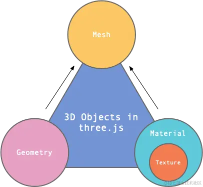

### Material 材质

https://threejs.org/docs/index.html?q=mater#api/zh/materials/Material

材质是**几何体表面的材料，**用来定义物体外观的属性。它包含如何渲染物体的信息，如颜色，光照，反射等等。材质可以被赋予不同的属性，以便实现各种不同的外观效果。

- [MeshBasicMaterial 基础网格材质](https://threejs.org/docs/index.html?q=mesh#api/zh/materials/MeshBasicMaterial)：一个以简单着色（平面或线框）方式来绘制几何体的材质，这种材质不受光照的影响。
- [MeshStandardMaterial 标准网格材质](https://threejs.org/docs/#api/zh/materials/MeshStandardMaterial.map)：一种基于物理的标准材质。

更多材质可以看这篇文章：https://juejin.cn/post/7224112064461144123

### Texture 纹理

Texture 用于创建一个纹理贴图，将其应用到一个表面，或者作为反射/折射贴图。就类似将一个商标图片粘贴到一个商品上。

```js
// 通过TextureLoader 加载贴图，并生成纹理对象，交给材质的map属性。
  const ballTexture = useLoader(
    THREE.TextureLoader,
    "./textures/beach_ball_texture.png"
  );
  
  <mesh castShadow receiveShadow>
    <sphereGeometry args={[0.3, 128, 128]} />
    <meshStandardMaterial map={ballTexture} flatShading />
  </mesh>
```

这张贴图会按照[等距圆柱投影](https://juejin.cn/post/7067424887601627166)的原理映射到球体上

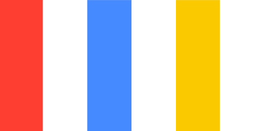

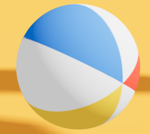

### useFrame

此`hook`允许在页面每一帧渲染的时候运行代码，比如更新渲染效果、控件等，与`Three.js`中调用`requestAnimationFrame`实行重绘动画效果是一样的。你将接收到状*态值`state`和时钟增量`delta`。回调函数将在渲染帧之前被调用，当组件卸载时，它会自动从渲染循环中注销。

- delta：若设备的屏幕刷新频率问 60Hz，即每秒钟屏幕刷新60次，每次刷新为 1/60 = 0.016s，这里的 delta 值即为 0.016

```js
useFrame((state, delta, xrFrame)=>{// 此函数在共享渲染循环内以本机刷新率运行});
```

### useLoader

https://docs.pmnd.rs/react-three-fiber/tutorials/loading-models

如果你想在 Three.js Fiber 应用程序中加载模型，可以使用 Three.js 的`useLoader`钩子来实现。这个钩子允许你在 React 组件中异步加载 Three.js 中的资源，包括模型、纹理和其他文件。然后，你可以在组件中使用 `useLoader` 钩子来异步加载 glTF 模型。在加载完成后，钩子将返回一个包含加载的模型的 `THREE.Group` 实例。你可以将这个实例添加到场景中，或者在组件的 JSX 中使用它：

```js
import { useLoader } from '@react-three/fiber';
import { GLTFLoader } from 'three/examples/jsm/loaders/GLTFLoader';

function Model() {
  const gltf = useLoader(GLTFLoader, '/path/to/model.gltf');
  return <primitive object={gltf.scene} />;
}

// <primitive object={...} /> can mount any existing, foreign threejs object into the scene.
```

### useGLTF

```bash
// 加载模型可以使用 useGLTF
import { useGLTF } from '@react-three/drei'
const gltf = useGLTF('/test.glb')

useGLTF.preload('/test.glb') // 预加载
```

### GLTF格式

[GLTF 文档](https://github.com/KhronosGroup/glTF-Tutorials/blob/main/gltfTutorial/README.md)

代码中打印引入的 GLTF 是如下格式：


- scenes：一个GLTF 可能包含多个场景
- scene：`scene`属性指示这些场景中的哪一个应该是加载资产时显示的默认场景，它通过引用node来定义场景图。
- nodes：每个场景都对应一个 nodes 数组
- node：场景图中的一个结点。它可以包含一个变换(比如旋转或平移)，引用更多的子结点。它可以引用 mesh 和 camera。
- animation：animation 可以用来描述节点的`translation`、`rotation`或`scale`属性如何随时间变化。
- materials：包含定义材质及其属性的元素，这里是 [MeshBasicMaterial](https://threejs.org/docs/#api/zh/materials/MeshBasicMaterial)

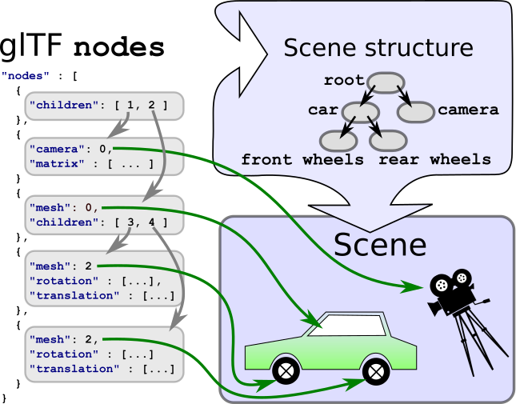

### GLTF 动画

`Three.js`的最基础的动画系统，由以下几部分组成：

- `KeyFrameTrack`
- `AnimationClip`
- `AnimitionMixer`
- `AnimationAction`

#### AnimationClip

在建模软件制作好动画之后，可以导出模型文件；通过`Loader`将模型文件加载之后，建模软件制作的动画就会被保存在`animations`中。这个`animations`就是一个`AnimationClip`的数组。

例如，常见的对人进行建模时，通常会包含一些动作动画：走路、跑步、挥手等。导出模型后，被`Loader`载入之后，每一个动作都会变成一个`AnimationClip`对象。

下面这个例子里只有一个 `AnimationClip` 对象，说明只有一个动画。如果有多个动画时，可能需要用户做某些操作来播放不同的动画。

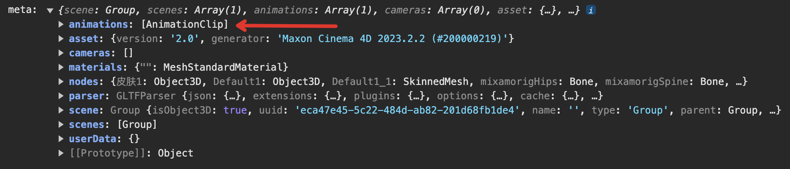

#### KeyFrameTrack

对于每个`AnimationClip`（可以理解为每个动作），都包含了很多对象属性的变化。例如，跑步这个动作包含：左胳膊、右胳膊、左腿、右腿等对象的属性变化。对于每一个属性，可以通过**关键帧**（`KeyFrameTrack`）来描述它的变化。如这个 AnimationClip 中包含了许多 KeyFrameTrack：

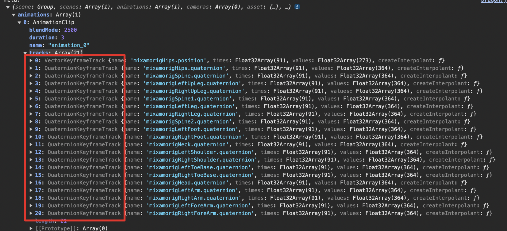

#### AnimationMixer

https://threejs.org/docs/#api/zh/animation/AnimationMixer

- 描述：动画混合器是用于场景中特定对象的动画的播放器。当场景中的多个对象独立动画时，每个对象都可以使用同一个动画混合器。可以理解成一个**总控制台**，它的作用，就是用来**控制“时刻”** 。可以形象的理解为是一个动画播放的**进度条**。
- 参数：`rootObject` 混合器播放的动画所属的对象。就是包含动画模型的场景对象。
- 常用属性：
  - `.time` 全局的混合器时间。
  - `.clipAction(AnimationClip)` 返回所传入的剪辑参数的`AnimationAction`对象。
  - `.getRoot()` 返回混合器的根对象。
  - `.update()` 推进混合器时间并更新动画。在渲染函数中调用更新动画。

#### AnimationAction

https://threejs.org/docs/#api/zh/animation/AnimationAction

AnimationActions 用来调度存储在[AnimationClips](https://threejs.org/docs/index.html#api/zh/animation/AnimationClip)中的动画。通过`AnimationMixer.clipAction()`进行创建。这个动作可以理解为把`AnimationClip`放进控制台进行播放。`AnimationAction`提供了一系列的`API`来控制对应的`AnimationClip`的播放。

```js
// 引入 gltf
const meta = useGLTF('./models/dazhaohu.glb');
// 获取 场景和动画
const { scene, animations } = meta;
// 创建动画混合器
const mixer = new THREE.AnimationMixer(scene);
// 遍历动画
animations.forEach((clip) => {
    // animationMixer.clipAction 来生成 animationAction ，然后进行 play
    mixer.clipAction(clip).play();
});

const clock = new THREE.Clock();
function animate() {
    requestAnimationFrame(animate);
    const delta = clock.getDelta();
    if (mixer !== undefined) {
        // 推进混合器时间并更新动画
        mixer.update(delta);
    }
}
```

### THREE.Scene.traverse()

我们可以将一个方法作为参数传递给 traverse() 方法，这个传递来的方法将会在每一个子对象上执行。由于THREE.Scene对象存储的是对象树，所以如果子对象本身还有子对象，traverse()方法会在所有的子对象上执行，直到遍历完场景树中的所有对象为止。

### 光源介绍

[https://hicc.pro/p/three.js/threejs-lighting#threepointlight%E7%82%B9%E5%85%89%E6%BA%90](https://hicc.pro/p/three.js/threejs-lighting#threepointlight点光源)

- Ambient Light：环境光可以照亮三维场景中的所有物体，没有阴影；只有两个属性，color和intensity
- DirectionalLight：方向是从一个平行光的位置 [position](https://threejs.org/docs/index.html#api/zh/core/Object3D.position) 到 [target](https://threejs.org/docs/index.html#api/zh/lights/DirectionalLight.target) 的位置
  - target：灯光从它的位置（[position](https://threejs.org/docs/index.html#api/zh/lights/DirectionalLight.position)）指向目标位置。默认的目标位置 target 为`(0, 0, 0)`。

### 阴影相机

为了在three.js中使用阴影，您需要创建一个阴影相机。

阴影相机（Shadow Camera）是一个用于生成阴影图像的虚拟相机。它不会在屏幕上渲染图像，而是在后台计算阴影贴图。阴影相机类似于场景中的主相机，但是需要一些不同的设置和参数。

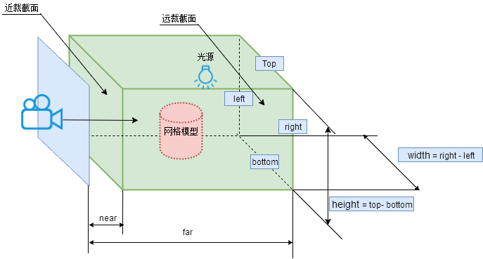

```js
const light = useRef();
<directionalLight
    ref={light}
    castShadow
    position={[4, 4, 1]}
    intensity={1.5}
    shadow-mapSize={[512, 512]}
    shadow-camera-near={1}
    shadow-camera-far={10}
    shadow-camera-top={10}
    shadow-camera-right={10}
    shadow-camera-bottom={-10}
    shadow-camera-left={-10}
 />
```

### 参数写法

```js
new THREE.SphereGeometry(1, 32)
// 在 React Three Fiber 中，构造函数参数始终通过 args 作为数组传递

// 球体几何体，参数为：半径，水平分段数，垂直分段数，详见 https://threejs.org/docs/#api/zh/geometries/SphereGeometry
<sphereGeometry args={[1, 32, 32]} />

// 类似地 <meshStandardMaterial color={new THREE.Color('hotpink')} /> 可以直接写成
<meshStandardMaterial color="hotpink" />

// 缩放 mesh 的 scale 参数可以写成 <mesh scale={[1, 1, 1]} />
<mesh scale={1} />

// 嵌套属性 mesh.rotation.x 用破折号
<mesh rotation-x={1} material-uniforms-resolution-value={[512, 512]} />
```

### attach

https://docs.pmnd.rs/react-three-fiber/api/objects#attach

```js
<mesh>
  <meshNormalMaterial attach="material" />
  <boxGeometry attach="geometry" />
</mesh>

// equal to

mesh.material = new THREE.MeshNormalMaterial()
mesh.geometry = new THREE.BoxGeometry()
```

### 事件

和浏览器事件类似：[https://developer.mozilla.org/zh-CN/docs/Web/API/Pointer_events#%E4%BA%8B%E4%BB%B6%E7%B1%BB%E5%9E%8B%E4%B8%8E%E5%85%A8%E5%B1%80%E4%BA%8B%E4%BB%B6%E5%A4%84%E7%90%86](https://developer.mozilla.org/zh-CN/docs/Web/API/Pointer_events#事件类型与全局事件处理)

```js
<mesh
  onClick={(e) => console.log('click')}
  onContextMenu={(e) => console.log('context menu')}
  onDoubleClick={(e) => console.log('double click')}
  onWheel={(e) => console.log('wheel spins 滚轮')}
  onPointerUp={(e) => console.log('up')}
  onPointerDown={(e) => console.log('down')}
  onPointerOver={(e) => console.log('over')}
  onPointerOut={(e) => console.log('out')}
  onPointerEnter={(e) => console.log('enter')}
  onPointerLeave={(e) => console.log('leave')}
  onPointerMove={(e) => console.log('move')}
  onPointerMissed={() => console.log('missed')} // fires on clicks that haven't hit any meshes.
  onUpdate={(self) => console.log('props have been updated')} // that is called every time the object gets fresh props,
/>
```

### Shadows

```js
// shadows 属性代表全局允许添加阴影
<Canvas shadows />

// castShadow 代表允许投射阴影
<mesh castShadow />

// receiveShadow 代表允许接收阴影
<mesh receiveShadow />
```

一个例子

```js
<Canvas shadows camera={{ position: [0, 3, 3] }}>
  // 物体投射阴影
  <mesh rotation-y={Math.PI / 4} castShadow>
    <boxGeometry />
    <meshStandardMaterial color="white" />
  </mesh>
    
  // 平面接收阴影
  <mesh rotation-x={-Math.PI / 2} position-y={-0.5} receiveShadow>
    <planeGeometry args={[5, 5]} />
    <meshStandardMaterial color="white" />
  </mesh>
  
  // 除此之外，还有添加灯光 castShadow，不然不会展示阴影
  <directionalLight position={[5, 5, 5]} intensity={0.5} castShadow />
  <directionalLight position={[-5, 5, 5]} intensity={0.5} color="red" castShadow />
</Canvas>
```

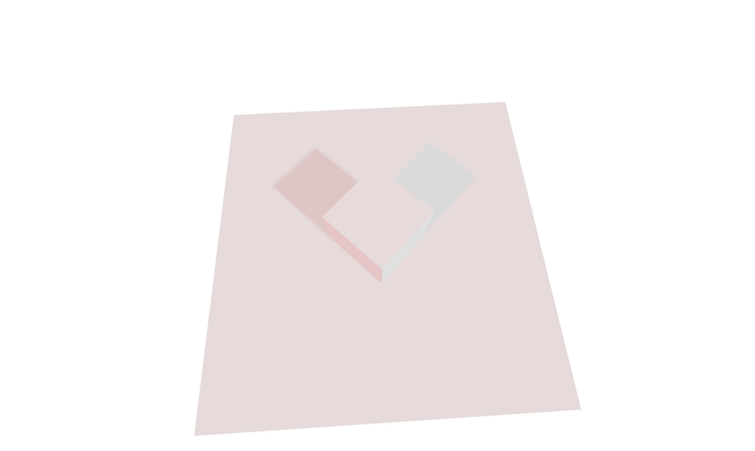

## react three rapier 物理引擎

https://github.com/pmndrs/react-three-rapier

### Physics 组件

https://github.com/pmndrs/react-three-rapier?tab=readme-ov-file#the-physics-component

- **gravity 重力：默认为 [0, -9.81, 0]，用来模拟真实物理世界**

```js
const Scene = () => {
  return (
    <Canvas>
      <Suspense>
        <Physics gravity={[0, 1, 0]} interpolation={false} colliders={false}>
          ...
        </Physics>
      </Suspense>
    </Canvas>
  );
};
```

### RigidBody 刚体

- restitution={0.2}：弹性系数 ，衡量两个物体在碰撞后的反弹程度
- friction={1}：摩擦力，摩擦力是对抗碰撞体接触的两个刚体之间相对切向运动的力
- linearDamping={0.5}：线性阻尼，用于减小刚体的线性速率，值越大物体移动越慢
- angulularDamping={0.5}：角阻尼，用于减小刚体的旋转速率，值越大刚体旋转越慢

刚体组件常用于在 physics 中添加一个 mesh ，基于 mesh 的形状会默认生成一个 Colliders。

```js
const RigidBodyMesh = () => (
  <RigidBody>
    <mesh />
  </RigidBody>
);
```

### Automatic Colliders 自动碰撞体

默认情况下，RigidBody 会为其包含的所有网格体生成自动碰撞体。您可以通过在 <RigidBody /> 上设置 colliders 属性来控制碰撞体，或者通过在 <Physics /> 上设置 colliders 来全局更改它。设置 Colliders={false} 会禁止自动生成。

```js
const Scene = () => (
  <Physics colliders="hull">
    <RigidBody>
      <Box />
    </RigidBody>
    <RigidBody position={[0, 10, 0]}>
      <Sphere />
    </RigidBody>
  </Physics>
);

// 关闭 physics 设置全局碰撞体，在每个 RigidBody 上设置
const Scene = () => (
  <Physics colliders={false}>
    {/* Use an automatic CuboidCollider for all meshes inside this RigidBody */}
    <RigidBody colliders="cuboid">
      <Box />
    </RigidBody>

    {/* Use an automatic BallCollider for all meshes inside this RigidBody */}
    <RigidBody position={[0, 10, 0]} colliders="ball">
      <Sphere />
    </RigidBody>
  </Physics>
);
```

碰撞体包括几种类型：cuboid（长方体）、ball（球体）、trimesh、hull

一个直观的例子：https://codesandbox.io/p/sandbox/react-three-rapier-auto-colliders-b4coz1?file=%2Fsrc%2FApp.tsx%3A35%2C29-35%2C36

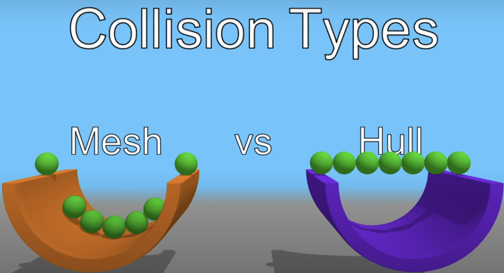

当然我们也可以在 RigidBody 中手动创建 colliders

```js
const Scene = () => (<>
  {/* 创建自定义的碰撞体 */}
  <RigidBody position={[0, 10, 0]}>
    <BallCollider args={[0.5]} /> // 球体，参数为半径
    
    <CuboidCollider args={[0.5, 0.5, 0.5]} /> // 长方体，参数为长宽高
    
    <MeshCollider type="trimesh">
      <mesh ... />
    </MeshCollider>

    <MeshCollider type="hull">
      <mesh ... />
    </MeshCollider>
  </RigidBody>
<>)
```

### Collision Events 碰撞事件

- onCollisionEnter：开始碰撞
  - target：触发碰撞的物体
  - other：被碰撞的物体
  - manifold：碰撞产生的接触流形（[contact manifold](https://rapier.rs/javascript3d/classes/TempContactManifold.html)）
- onCollisionExit：碰撞结束

```js
const RigidBottle = () => {
  const [isAsleep, setIsAsleep] = useState(false);

  return (
    <RigidBody
      colliders="hull"
      onSleep={() => setIsAsleep(true)}
      onWake={() => setIsAsleep(false)}
      name="Bally McBallFace"
      onCollisionEnter={({ manifold, target, other }) => {
        console.log(
          "Collision at world position ",
          manifold.solverContactPoint(0)
        );

        if (other.rigidBodyObject) {
          console.log(
            // this rigid body's Object3D
            target.rigidBodyObject.name,
            " collided with ",
            // the other rigid body's Object3D
            other.rigidBodyObject.name
          );
        }
      }}
    >
      <Sphere>
        <meshPhysicalMaterial color={isAsleep ? "white" : "blue"} />
      </Sphere>
    </RigidBody>
  );
};
```

### Configuring collision and solver groups 配置碰撞组

最有效防止碰撞体直接相互碰撞的方法就是给出碰撞体所属的碰撞组。[详见文档](https://github.com/pmndrs/react-three-rapier?tab=readme-ov-file#configuring-collision-and-solver-groups)

### Contact force events 碰撞力事件

在碰撞体发生碰撞时会触发碰撞力事件

```js
<RigidBody
  colliders="ball"
  onContactForce={(payload) => {
    console.log(`The total force generated was: ${payload.totalForce}`);
  }}
>
  <Sphere>
    <meshPhysicalMaterial color={"grey"} />
  </Sphere>
</RigidBody>
```

- payload：
  - target：触发碰撞的物体
  - other：被碰撞的物体
  - totalForce：两个碰撞体之间所有力的总和
  - totalForceMagnitude：两个碰撞体之间所有力大小总和
  - maxForceDirection：接触点处最大力的方向
  - maxForceMagnitude：接触点处最大力的大小

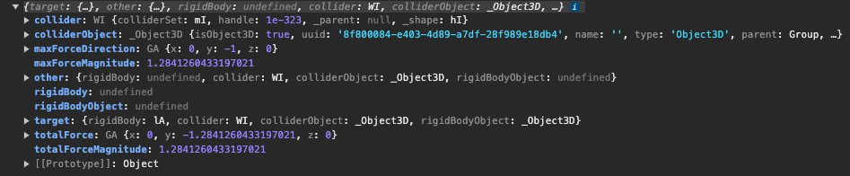

### Sensor 传感器

https://github.com/pmndrs/react-three-rapier?tab=readme-ov-file#sensors

碰撞体可以设置传感器，它可以用于监测一个碰撞体进入或者离开另一个碰撞体，在此过程中不会经历碰撞。

- onIntersectionEnter
- onIntersectionExit

```js
<RigidBody>
  <GoalPosts />

  <CuboidCollider
    args={[5, 5, 1]}
    sensor
    onIntersectionEnter={() => console.log("Goal!")}
  />
</RigidBody>
```

### useRapier

https://github.com/pmndrs/react-three-rapier?tab=readme-ov-file#advanced-hooks-usage

如果想要对物理世界更加精细的控制，可能需要用到 useRapier

```js
const { rapier, world } = useRapier();
```

### Ray-casting 光线投射

https://rapier.rs/docs/user_guides/javascript/scene_queries/#ray-casting

光线投射可查找与光线相交的一个或多个碰撞体。光线投射是一种极其常见的操作，涵盖了多种用例：发射子弹、角色控制器、渲染。

射线：https://threejs.org/docs/#api/zh/math/Ray

- [origin](https://threejs.org/docs/index.html#api/zh/math/Vector3) - 射线的原点，默认值是一个位于(0, 0, 0)的[Vector3](https://threejs.org/docs/index.html#api/zh/math/Vector3)。
- [direction](https://threejs.org/docs/index.html#api/zh/math/Vector3) - 射线的方向。该向量必须经过标准化使向量长度为1（使用[Vector3.normalize](https://threejs.org/docs/index.html#api/zh/math/Vector3.normalize)），这样才能使方法正常运行。 默认值是一个位于(0, 0, -1)的[Vector3](https://threejs.org/docs/index.html#api/zh/math/Vector3)。

```js
// 光线由 origin [1, 2, 3] 和 direction [0, 1, 0] 定义：
let ray = new RAPIER.Ray({ x: 1.0, y: 2.0, z: 3.0 }, { x: 0.0, y: 1.0, z: 0.0 });
let maxToi = 4.0;
let solid = true;

// maxToi: max time of impact
// solid: considers everything as solid (如果光线起点在一个固体内，那么光线则无法继续传播，toi 为 0， 若设置为false那么会继续传播直到触碰到固体边界)
let hit = world.castRay(ray, maxToi, solid);

// 如果光线发生碰撞
if (hit != null) {
    // 光线传播的距离 = ray.dir * toi
    // 撞击点 = ray.origin + ray.dir * toi
    let hitPoint = ray.pointAt(hit.toi); // hit.toi 即为发生碰撞所经历的时间
    console.log("Collider", hit.colliderHandle, "hit at point", hitPoint);
}

```

## 小球弹跳案例

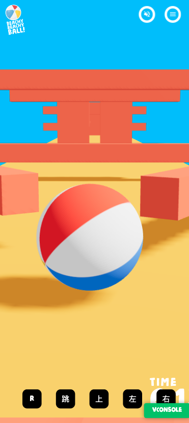

需要实现点击【跳】小球弹起，已知：

1. 底部反弹平面所处位置为 y = -0.1，高度为 0.1，所以若小球静止在平面上小球底部则正好处于 y = 0
2. 小球在空中不能弹跳，只能处在平面上时进行跳跃

思路：利用光线投射计算小球与底部平面的距离，在底部平面或者离底部平台很近时则进行弹跳。

```js
const jump = () => {
    // 设 orgin 为小球的球心坐标，为射线 ray 的起点
    const origin = body.current.translation();
    // origin 坐标向下移动 0.31，小球半径为 0.3，若初始位置小球就在平面上，那么 orgin 则在底部反弹面的内部，此时若进行光线投射则会直接碰撞，toi 为 0
    origin.y -= 0.31;
    // direction 设为 y 轴负方向的单位向量，即射线 ray 的方向
    const direction = { x: 0, y: -1, z: 0 };
    // 射线 rag 从 orgin 出发，方向为正下方
    const ray = new rapier.Ray(origin, direction);
    // 射线与物体碰撞，则返回碰撞结果
    const hit = world.castRay(ray, 10, true); 

    // 进行弹跳操作
    // toi = 0 代表小球正处于平面上
    // 0 < toi < 0.15 代表小球即将落到平面上也可以进行弹跳
    // toi > 0.15 代表小球仍在空中比较高的地方，不能弹跳
    if (hit.toi < 0.15) {
      // 施加一个向上的冲量
      body.current.applyImpulse({ x: 0, y: 0.75, z: 0 });
    }
 };
```

## React 相关

### createRoot

https://zh-hans.react.dev/reference/react-dom/client/createRoot

### Suspense

https://zh-hans.react.dev/reference/react/Suspense

### Zustand

Zustand 状态库：轻便、简洁、强大的 React 状态管理工具

https://awesomedevin.github.io/zustand-vue/

```js
import { create } from 'zustand'

// Store 初始化
const useBearStore = create((set) => ({
  bears: 0,
  increasePopulation: () => set((state) => ({ bears: state.bears + 1 })),
  removeAllBears: () => set({ bears: 0 }),
}))

// Store 绑定组件
function BearCounter() {
  const bears = useBearStore((state) => state.bears)
  return <h1>{bears} around here ...</h1>
}

// 更新目标状态
function Controls() {
  const increasePopulation = useBearStore((state) => state.increasePopulation)
  return <button onClick={increasePopulation}>one up</button>
}
```

监听 store 状态：https://awesomedevin.github.io/zustand-vue/docs/advanced/read-set-state-outside-of-component

```js
const useDogStore = create(() => ({ paw: true, snout: true, fur: true }))

// 获取非反应性最新状态
const paw = useDogStore.getState().paw
// 监听所有更改，对每个更改同步触发
const unsub1 = useDogStore.subscribe(console.log)
// 更新状态，将触发监听器
useDogStore.setState({ paw: false })
// 取消监听
unsub1()

// 当然，你可以像往常一样使用钩子
const Component = () => {
  const paw = useDogStore((state) => state.paw)
  ...
```

subscribeWithSelector

```js
import { subscribeWithSelector } from 'zustand/middleware'
const useDogStore = create(
  subscribeWithSelector(() => ({ paw: true, snout: true, fur: true }))
)

// 仅限 `paw` 修改时，触发监听
const unsub2 = useDogStore.subscribe((state) => state.paw, console.log)
// subscribe 还可以监听到旧值
const unsub3 = useDogStore.subscribe(
  (state) => state.paw,
  (paw, previousPaw) => console.log(paw, previousPaw)
)
// subscribe 也支持自定义相等函数
const unsub4 = useDogStore.subscribe(
  (state) => [state.paw, state.fur],
  console.log,
  { equalityFn: shallow }
)
// 立即订阅并触发
const unsub5 = useDogStore.subscribe((state) => state.paw, console.log, {
  fireImmediately: true,
})
```

### 将 JSX 作为子组件传递

https://zh-hans.react.dev/learn/passing-props-to-a-component#passing-jsx-as-children

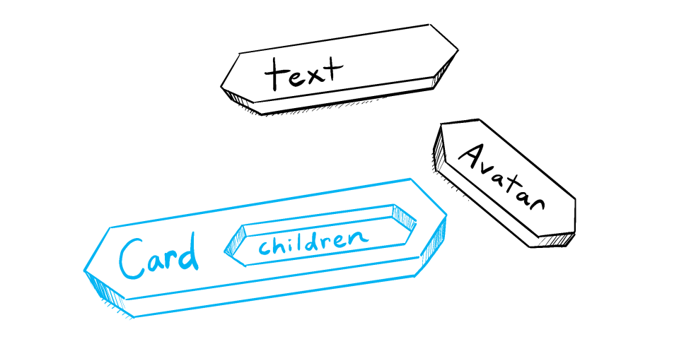

```js
import Avatar from './Avatar.js';

function Card({ children }) {
  return (
    <div className="card">
      {children}
    </div>
  );
}

export default function Profile() {
  return (
    <Card>
      <Avatar
        size={100}
        person={{ 
          name: 'Katsuko Saruhashi',
          imageId: 'YfeOqp2'
        }}
      />
    </Card>
  );
}
```

