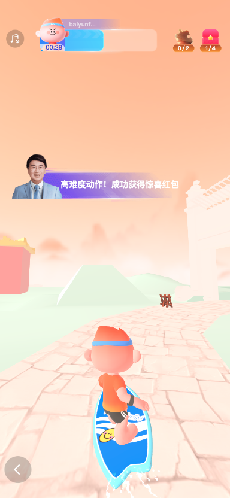
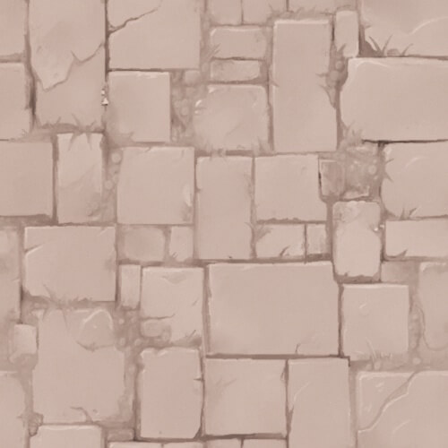
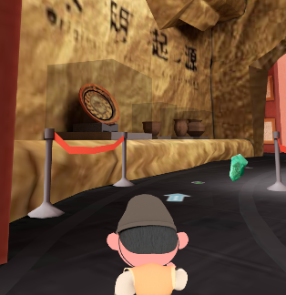
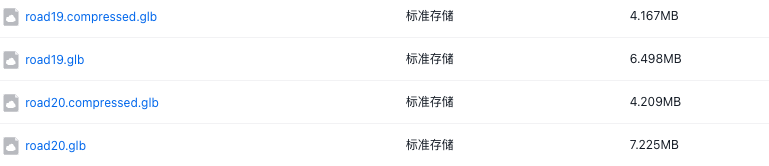
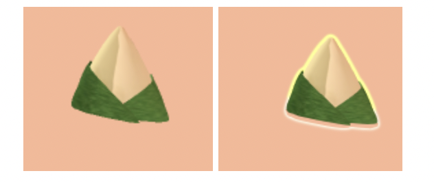

# 贴图

[【threeJs笔记】3. Three.js贴图Texture_three js obj 贴纸-CSDN博客](https://blog.csdn.net/weixin_41192637/article/details/109680932)

https://juejin.cn/post/7311219067118026762

给路面添加纹理贴图（颜色贴图）





```js
// 2.1 创建材质，并加载路面颜色贴图
const texture = new THREE.TextureLoader().load(TRACK_WATER_TEXTURE);
texture.wrapS = THREE.RepeatWrapping;
texture.wrapT = THREE.RepeatWrapping;
texture.repeat.set(20, 20); // 设置重复次数，数值越大重复次数越多
const material = new THREE.MeshStandardMaterial({
    // color: 0x4193ea,
    map: texture,
    // emissive: 0x0426cd,
    // metalness: 0.5,
    // roughness: 0.3,
    // transparent: true,
    // opacity: 0.9,
    // fog: this.scene.fog !== undefined,
});
material._my_is_water = true; // _my_ 标记为水面材质
this.trackWaterModel.traverse(object => {
    if (object.isMesh) {
        object.material = material;
    }
});
```

## 自发光

一开始每个室内场景都需要添加许多光源，导致渲染卡顿。后面替换成了自发光的模型，glb里面自带发光信息，然后把代码中光照删除。

three.js 如何添加自发光：[Three.js自发光贴图 .emissiveMap_threejs 材质通过贴图实现发光-CSDN博客](https://blog.csdn.net/qq_36990263/article/details/134705199)

## 材质的 color 和 emissive

http://www.webgl3d.cn/pages/57f348/

```js
const material = new THREE.MeshStandardMaterial({
    color: 0xfbefb1,
    alphaMap: this.animationTextures[this.currentFrame],
    emissive: 0xfbefb1,
    metalness: 0.3,
    roughness: 0.3,
    transparent: true,
    blending: THREE.AdditiveBlending,
    depthTest: false,
});
```

## 监听动画 finish 和 loop

小人默认是跑步动作，在小人动作做衔接的时候可能需要等当前跑步动作循环完成后再触发别的动作，所以需要监听动作循环结束。

```js
this.mixer.addEventListener('finished', e => {
    console.log(e.action._clip.name);
    // 动作结束
});

this.mixer.addEventListener('loop', e => {
    console.log(e.action._clip.name);
    // 动作每次循环后
});
```

## 玻璃材质

场景中有许多国宝陈列在玻璃中，需要给对应的 mesh 增加玻璃材质。



```js
boliScene.traverse(object => {
    // 和视觉统一好需要添加 mesh 的 name，找到对应的 mesh 添加玻璃材质
    if (object.name === '玻璃') {
        const material = new THREE.MeshPhongMaterial({
            // color: 0xffffff,
            // emissive: 0xffffff,
            // reflectivity: 0.5,
            // refractionRatio: 0.5,
            transparent: true,
            opacity: 0.2,
        });
        // 为透明的网格禁用深度写入：这样可以避免玻璃内部的物体在某个角度不见了
        material.depthWrite = false; 
        object.material = material;
    }
});
```

# ext_meshopt_compression 模型压缩

### **EXT_meshopt_compression 简介**

- **目标**：高效压缩 glTF/GLB 模型的顶点、索引等几何数据，通常可减少**30%~50%**体积。
- **特点**：
  - 基于无损压缩算法，数据解压后与原始数据完全一致。
  - 解压速度极快，适合实时应用（如 Web 或游戏）。
- **支持工具**：
  - [glTF-Transform](https://github.com/donmccurdy/glTF-Transform)（推荐）
  - Blender（需插件支持）
  - Three.js（运行时解码）

------

## **压缩模型步骤（以 glTF-Transform 为例）**

### **安装工具**

通过 Node.js 安装命令行工具：

```bash
npm install --global @gltf-transform/cli
```

### **压缩模型**

使用`meshopt`压缩命令处理 glTF/GLB 文件：

```bash
gltf-transform meshopt input.glb output.glb
```

**可选参数**：

- `--level`：压缩级别（`0`=最快，`1`=平衡，`2`=最高压缩率，默认为`1`）。
- `--keep-points`：保留顶点数据不压缩（默认压缩所有属性）。 示例（最高压缩率）：

```bash
gltf-transform meshopt input.glb output.glb --level 2
```

### 3. 在 Three.js 中加载压缩模型

确保 Three.js 版本 ≥**r137**，并在初始化时注册扩展，使用`GLTFLoader`加载压缩后的模型：

```js
import {MeshoptDecoder} from 'three/examples/jsm/libs/meshopt_decoder.module.js';
import {GLTFLoader} from 'three/examples/jsm/loaders/GLTFLoader.js';
const loader = new GLTFLoader();
loader.setMeshoptDecoder(MeshoptDecoder);
```

## 收益

压缩阶段：优化后两个模型分别从 6.4M -> 4.1M 和 7.2M -> 4.2 M，整体减少了 39%

解压阶段：加载模型阶段事件变化基本无新增，（解压速度通常在 1ms 内完成）

整体模型的 loading时间从 2s -> 1.5s，整体减少了 25%



### **1. 压缩的核心价值：减少传输和存储成本**

- **压缩阶段**：模型在导出或传输前被压缩，文件体积显著减小（通常可减少 50%-80%）。
- **解压阶段**：运行时通过 GPU 或 CPU 快速解压，恢复为原始网格数据供渲染使用。
- **实际效果**：
  - **加载时间缩短**：用户下载/加载模型的时间减少（尤其对 Web 场景关键）。
  - **带宽成本降低**：传输小体积文件节省流量（对移动端或弱网环境友好）。

------

### **2. 解压开销可控，总体收益为正**

- **解压效率**：`meshopt`算法针对运行时优化，解压速度极快（通常在 1ms 内完成）。
- **CPU vs. 传输时间**：解压消耗的 CPU 时间远小于未压缩时等待网络传输的时间。
- **内存占用**：解压后的数据可能通过优化布局（如量化、顶点重排）减少内存占用。

------

### **3. 压缩的附加优化**

- **顶点/索引优化**：`meshopt`不仅压缩，还会优化顶点顺序、索引缓冲区，可能提升渲染性能。
- **兼容性**：解压过程通常由引擎内置工具（如 Three.js 的`MeshoptDecoder`）自动处理，无需手动干预。

------

### **4. 适用场景权衡**

- **推荐使用**：
  - 大型场景（如 3D 地图、游戏关卡）。
  - 网络传输场景（如 Web 应用、多人在线游戏）。
  - 资源受限平台（如移动端、VR/AR 设备）。
- **谨慎使用**：
  - 模型本身已极简（压缩收益有限）。
  - 运行时解压可能成为瓶颈（需测试解压时间）。

------

## **结论**

压缩后的模型在运行时解压是合理的权衡：**用可控的 CPU 开销换取更快的加载速度和更低的传输成本**。对于大多数 3D 应用（尤其是 Web 和移动端），这是性能优化的关键步骤。

# shader

https://thebookofshaders.com/?lan=ch

## 什么是 shader

如果你曾经有用计算机绘图的经验，你就知道在这个过程中你需要画一个圆，然后一个长方形，一条线，一些三角形……直到画出你想要的图像。这个过程很像用手写一封信或一本书 —— 都是一系列的指令，需要你一件一件完成。

Shaders 也是一系列的指令，但是这些指令会对屏幕上的每个像素同时下达。也就是说，你的代码必须根据像素在屏幕上的不同位置执行不同的操作。就像活字印刷，你的程序就像一个 function（函数），输入位置信息，输出颜色信息，当它编译完之后会以相当快的速度运行。

## 为什么 shader 运行特别快

为了回答这个问题，不得不给大家介绍***\*并行处理\****（parallel processing）的神奇之处。

想象你的 CPU 是一个大的工业管道，然后每一个任务都是通过这个管道的某些东西，这些任务需要串行，每个管道通常被称为***\*线程\****。

视频游戏和其他图形应用比起别的程序来说，需要高得多的处理能力。因为它们的图形内容需要操作无数像素。想想看，屏幕上的每一个像素都需要计算，而在 3D 游戏中几何和透视也都需要计算。

让我们回到开始那个关于管道和任务的比喻。屏幕上的每个像素都代表一个最简单的任务。单独来看完成任何一个像素的任务对 CPU 来说都很容易，那么问题来了，屏幕上的每一个像素都需要解决这样的小任务！也就是说，哪怕是对于一个老式的屏幕（分辨率 800x600）来说，都需要每帧处理480000个像素，每秒就需要处理14400000个像素。

这个时候，并行处理就是最好的解决方案。比起用三五个强大的微处理器（或者说“管道”）来处理这些信息，用一大堆小的微处理器来并行计算，就要好得多。这就是图形处理器（GPU : Graphic Processor Unit)的来由。

设想一堆小型微处理器排成一个平面的画面，14400000个像素可以在一秒内阻塞几乎任何管道。但是一面800x600的管道墙，每秒接收30波480000个像素的信息就可以流畅完成。这在更高的分辨率下也是成立的 —— 并行的处理器越多，可以处理的数据流就越大。

另一个 GPU 的魔法是特殊数学函数可通过硬件加速。非常复杂的数学操作可以直接被微芯片解决，而无须通过软件。这就表示可以有更快的三角和矩阵运算 —— 和电流一样快。

## GLSL是什么？

GLSL 代表 openGL Shading Language，openGL 着色语言，在 three.js 中也可以编写 GLSL。

## 为什么 Shaders 不好学？

GPU 的强大的架构设计也有其限制与不足。

为了能使许多管线并行运行，每一个线程必须与其他的相独立。我们称这些线程对于其他线程在进行的运算是“盲视”的。这个限制就会使得所有数据必须以相同的方向流动。所以就不可能检查其他线程的输出结果，修改输入的数据，或者把一个线程的输出结果输入给另一个线程。允许数据在线程之间线程流动会使数据的整体性面临威胁。

并且 GPU 会让所有并行的微处理器（管道们）一直处在忙碌状态；只要它们一有空闲就会接到新的信息。一个线程不可能知道它前一刻在做什么。它可能是在画操作系统界面上的一个按钮，然后渲染了游戏中的一部分天空，然后显示了一封 email 中的一些文字。每个线程不仅是“盲视”的，而且还是“无记忆”的。同时，它要求编写一个通用的规则，依据像素的不同位置依次输出不同的结果。这种抽象性，和盲视、无记忆的限制使得 shaders 在程序员新手中不是很受欢迎。

## 顶点着色器和片段着色器

shader 有两种，在最简配置下，至少都得有两个着色器：一个叫顶点着色器（vertex shader），另一个叫片段着色器（fragment shader）。

顶点着色器负责处理每个顶点的位置，可能还有法线、颜色等信息。每个顶点都会执行一次。

片元着色器则是处理每个像素的颜色和其他属性。每个像素片元都会执行一次代码。

## 在 three.js 中实现一个水墨风的 shader

在 three.js 有许多内置的材质，有些时候这些材质不能满足我们的需求，比如下面给一个用 shader 实现的水墨风材质。

```js
// 着色器代码
const shaderMaterial = new THREE.ShaderMaterial({
    vertexShader: `
        varying vec2 vUv;        // 将 UV 坐标传给片元着色器
        varying vec3 vNormal;    // 传递法线方向
        varying vec3 vPosition;  // 传递顶点位置
        void main() {
            vUv = uv;                        // 保存 UV 坐标
            vNormal = normal;                // 保存法线
            vPosition = position;            // 保存顶点位置
            gl_Position = projectionMatrix * modelViewMatrix * vec4(position, 1.0); // 计算屏幕坐标
        }
    `,
    fragmentShader: `
        varying vec2 vUv;
        varying vec3 vNormal;
        varying vec3 vPosition;
        // 简单噪声函数
        float rand(vec2 n) { 
            return fract(sin(dot(n, vec2(12.9898, 4.1414))) * 43758.5453);
        }
        void main() {
            // 边缘检测（简易版）
            float edge = length(fwidth(vNormal)) * 2.0; // 计算法线变化的剧烈程度（边缘区域变化大）
            edge = 1.0 - smoothstep(0.0, 1.5, edge); // 将边缘值转为 0-1 的强度（1代表边缘）
            // 生成水墨噪声
            float noise = rand(vUv * 100.0) * 0.2; // 通过 UV 坐标生成噪点（*100 控制噪点密度）
            // 颜色量化（3个色阶）
            float color = length(vPosition) * 0.3 + noise; // 混合位置信息和噪点
            color = floor(color * 3.0) / 3.0; // 将颜色分为 3 个色阶（0, 0.33, 0.66, 1.0）
            // 组合效果
            float final = max(color * 0.8, edge * 0.9); // 合并颜色和边缘（深色优先）
            // 添加纸质纹理
            float paper = rand(vUv * 50.0) * 0.1; // 生成更细腻的纸质纹理
            final = clamp(final + paper, 0.0, 1.0); // 叠加纸质噪点并限制范围
            // 最终颜色（带少许青色）
            gl_FragColor = vec4(vec3(final * 0.9, final * 1.0, final * 0.95), 1.0); // 通过 RGB 系数调整颜色偏向青灰色（0.9, 1.0, 0.95 加强绿色和蓝色）。
        }
    `,
    side: THREE.DoubleSide, // 双面渲染（防止背面透明）
});

// 创建测试物体
const geom = new THREE.TorusKnotGeometry(2, 0.8, 64, 16);
const mesh = new THREE.Mesh(geom, shaderMaterial);
scene.add(mesh);
```

- projectionMatrix 表示的是摄像机的投影矩阵，modelViewMatrix 表示的是场景中物体的位置到真实世界的映射，这两个共同来决定将物体渲染到屏幕的哪个位置。
- fwidth：是一个GLSL内置函数，用于计算函数在屏幕空间（或者其他坐标系）中x和y方向的变化率，也就是函数沿着x和y方向的梯度。
- length：用于计算向量的长度（模长）
- smoothstep：是一个平滑阶梯插值函数，它在两个阈值之间产生平滑的过渡。小于起点时为0，大于终点时为1，在这之间则平滑过渡。
- clamp：clamp(x,a,b)  **// 当x<a时返回a,当x>b时返回b,否则返回本身**

# composer 描边

```js
import {EffectComposer} from 'three/addons/postprocessing/EffectComposer.js';
import {OutlinePass} from 'three/addons/postprocessing/OutlinePass.js';
import {OutputPass} from 'three/addons/postprocessing/OutputPass.js';
import {RenderPass} from 'three/addons/postprocessing/RenderPass.js';

const composer = new EffectComposer(renderer); // 创建后处理对象EffectComposer，WebGL渲染器作为参数
composer.setPixelRatio(window.devicePixelRatio); // 关键：适配高DPI屏幕
composer.setSize(window.innerWidth, window.innerHeight);
const renderPass = new RenderPass(scene, camera); // 创建一个渲染器通道，场景和相机作为参数
composer.addPass(renderPass); // 设置renderPass通道
const outlinePass = new OutlinePass(new THREE.Vector2(window.innerWidth, window.innerHeight), scene, camera);
outlinePass.visibleEdgeColor.set('#FFFF00'); // 发光颜色
outlinePass.hiddenEdgeColor.set('gray'); // 被其它物体挡住部分的颜色
outlinePass.edgeGlow = 0.0; // 边缘辉光大小
outlinePass.usePatternTexture = false; // 默认是flase，改成true后仅显示边框
outlinePass.edgeThickness = 3.0; // 发光厚度
outlinePass.edgeStrength = 6.0; // 发光强度
outlinePass.downSampleRatio = 2; // 能改变光的宽度，建议默认不动
outlinePass.pulsePeriod = 0; // 边缘闪烁，默认为0无闪烁，数值越小，闪的越快
composer.addPass(outlinePass);
const outputPass = new OutputPass();
composer.addPass(outputPass);
outlinePass.selectedObjects = [];

// 给具体的模型添加
this.fragmentModel.traverse(obj => {
    if (obj.type === 'Mesh') {
        outlinePass.selectedObjects = [obj];
    }
});
```

前后效果对比



注意：若给物体添加了环境光（如hdr）可能会影响描边。

# 内存问题

由于重复游戏可能会因为模型卸载不干净或者引用没清除导致内存泄露，建议使用 chrome 自带的内存分析，多次游戏进行前后的内存对比，来查找原因