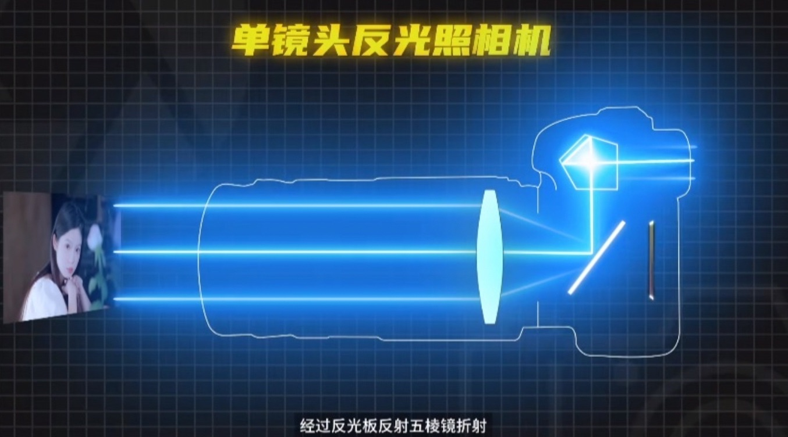
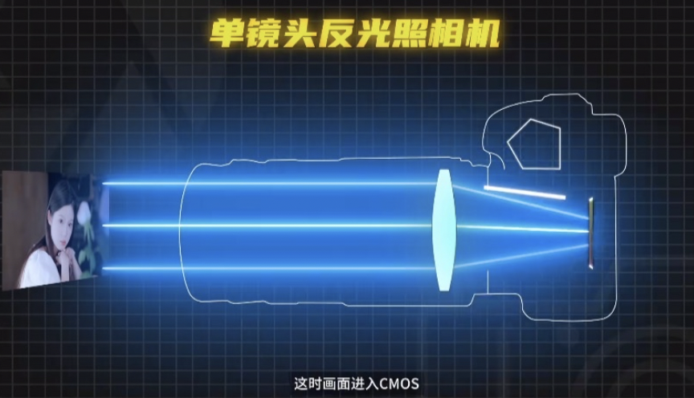
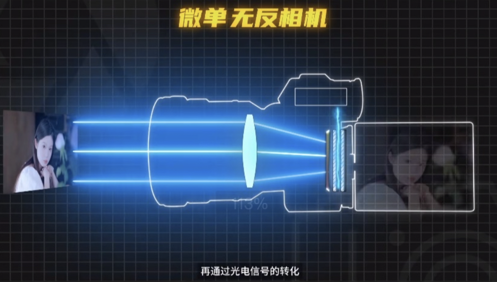
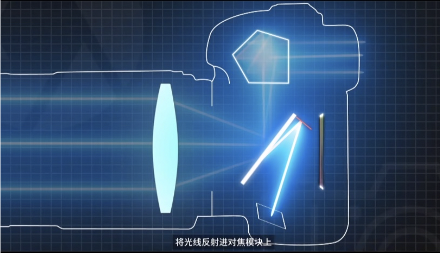
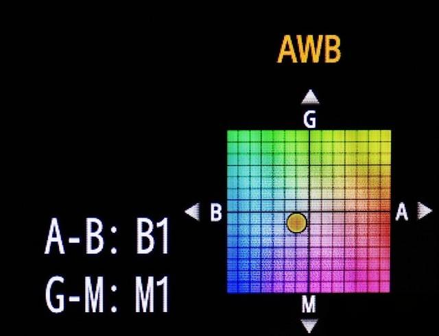

## 单反和微单

单反：单镜头反光照相机

- 画面进入镜头，经过反光板反射五棱镜折射，从光学取景器中就可以看到成像。
- 按下快门，反光板抬起，画面进入 CMOS，成为了照片。

微单：无反相机

- 没有反光板，光线透过镜头直接落在传感器上，再通过光电信号的转化，显示在电子取景器里。

对比：

- 重量：同样像素，微单更轻。
- 对焦：单反的取景和对焦是两个系统，在反光板的旁边还有一个小的反光板，将光线反射进对焦模块上（本质也是个传感器），对焦模块有多大，对焦的范围就有多大。而微单直接将对焦集成到 CMOS 上，兼顾了对焦和成像，使得对焦点可以完全铺满整个 CMOS，可以全屏对焦追焦

> 总结：微单更轻更小更强，只是因为单反硕大的外观，繁多的按键，先入为主的定位看起来更专业而已。

## 曝光三要素

光圈、快门、感光度（ISO）

### 光圈

用来控制相机进光量多少的装置，它通常存在镜头内，由一组可开合的叶片组成。在相机上用 F 表示。

F = 镜头焦距 / 通光孔直径

根据公式就解释了，为什么 **光圈值 F 越大，实际光圈越小**。

* 光圈 F 值越大，光圈越小，通光量变小，画面变暗，景深越深
* 光圈 F 值越小，光圈越大，通光量变大，画面变亮，景深越浅

> 景深指的是焦点范围相对清晰的这一区间。所以光圈另一个重要的应用就是实现背景模糊。
>
> 光圈越小，景深越深，物体越清晰；光圈越大，景深越浅，更容易实现背景模糊的效果。
>
> 类似于近视眼的人，眯起眼睛相当于光圈变小，会看的更清晰。

* 大光圈更适合拍摄人像，希望主体从杂乱的背景中突出
* 小光圈更适合拍摄风景，希望全局清晰的大场景

在设计光圈的时候，相邻两档的透光亮要相差一倍，也就是面积要相差一倍，直径则相差 1.2 倍，所以整数档光圈会呈现 1.4 倍的倍数关系

> F1.4 => F2.0 => F2.8 => F4.0 => F5.6 => F8.0 ....

### 快门

控制光线进入相机时间长短的装置，单位是 s，时间越长，接收到的光线也就越多。

* 高速快门：适用于抓拍运动物体，会更加清晰。
* 慢速快门：能拍到运动轨迹，适用于拍车的轨迹，细水长流的感觉

### 感光度

对光线的敏感度，适用于在光圈和快门调整后仍然很暗，或者阴天的环境下提高亮度。

正因为提高了光线敏感度所以也可能会出现噪点。

## 焦距（焦段）

焦距：凸透镜的光学中心到焦点的距离，当然相机不止一个镜片，只需要理解即可。焦距是一个固定的值，如 16mm 焦距，24mm焦距，如果达到 3000mm 就属于望远镜了

焦段：一般指焦距的范围，比如 16-35mm，24-70mm

> 焦距越短，视角越广；焦距越长，视角越窄

* 超广角：20mm以下
* 广角：20mm-40mm
* 标准焦段：40mm-60mm
* 长焦：60mm以上

> 其中 40mm-60mm 标准焦段最接近人的眼睛，50mm小痰盂是一个比较火的镜头

* 数字变焦：放大裁剪图片达到类似于增加焦距的效果。
* 光学变焦：通过光学镜头结构来实现变焦，比数字变焦会更清晰。
* 长焦镜头：有压缩空间的效果
* 广角镜头：有拉伸空间的效果，比如房产中间拍摄房间视频。

> 希区柯克变焦：是电影制作中的流行元素，镜头中的主体大小不变，而背景大小改变。会有一种背景不断涌动的感觉。

## 白平衡

色温：环境中客观存在的光源颜色，随温度越高，颜色呈现 红（1000K） => 白（5500K） => 蓝（8000K）

> 一个物体的温度越高，则它辐射的电磁波波长越短，其中可见光里，红橙黄绿蓝靛紫，红光光波最长，紫光光波最短，所以暖色调的物体温度比冷色调的物体温度低。

* 日出日落：2000K - 3000K
* 晴天正午：5000K - 6000K
* 阴天色温：6000K - 7000K

白平衡：人为控制相机设置用来平衡环境的色温，还原现实中物体原本的颜色（让白色的物体恢复白色），即把白平衡的K值和色温的K值调整为相同即可。K值越低画面越冷，K值越高画面越暖，与色温正好相反。

> 色温 > 白平衡：画面偏冷
>
> 色温 < 白平衡：画面偏暖
>
> 色温 = 白平衡：物体本色

如果画面偏绿了怎么办？可以在相机的色彩偏移界面向绿色的对角线方向移动即可。

其实这里我们可以用色彩偏移来制造氛围感，按一二三四象限：

* 红绿色：港风
* 蓝绿色：小清新风格
* 蓝粉色：法式风格
* 红粉色：复古风格

> 调整白平衡的统一标准一般是让任务肤色保持在一个健康写实的范围。
>
> 黄种人的皮肤可以在还原白色的情况下再往冷色调调一些