# chrome 和 vscode 调试工具

在开发过程中，我们最常用的是 `console.log` 调试，但是这样会有很多问题，比如[console.log 打印出来的数据不一定准确](https://juejin.cn/post/7035969663288737822)。

再比如调试 node 程序打印时，你会发现对象的值也是对象的时候不会展开，而是打印一个 `[Object] [Array]` 这种字符串，更致命的是打印的太长会超过缓冲区的大小，终端里会显示不全，所以这时候就需要使用 chrome 调试工具和 vscode调试工具。

## chrome 调试 web 项目

在调试的时候，我们直接在想要调试的代码位置加上 `debugger` 即可，此时运行项目即可在 chrome 控制台看到：

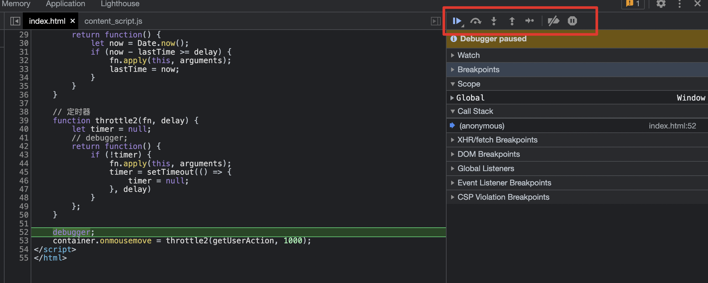

其中红框内的调试按钮，从左到右含义分别为：

* resume/pause script execution：恢复/暂停脚本执行。
* step over next function call：跨过函数，不遇到函数时，执行下一步。遇到函数时，不进入函数。
* step into next function call：进入函数，不遇到函数时，执行下一步。遇到函数时，进入函数执行上下文。
* step out of current function：跳出当前函数。
* step：执行下一步。
* deactivate breakpoints：使所有断点暂时失效。
* pause on exceptions：出现异常暂停。

假如选择了 `pause on exceptions` ，那么程序在遇到错误时也会暂停：

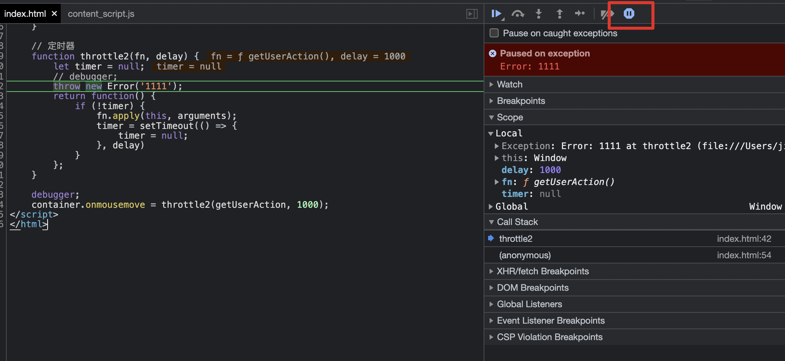

## vscode 调试 web 项目

我们拿一个 vue 项目来操作，用 vscode 打开项目之后，切换到左侧的调试区域并点击创建 `launch.json`,然后选择 `Web App (Chrome)`

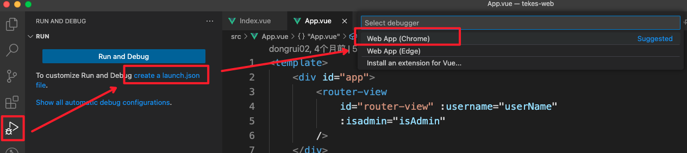

```json
// .vscode/launch.json
{
    "version": "0.2.0",
    "configurations": [
        {
            "type": "chrome",
            "request": "launch",
            "name": "Launch Chrome against localhost",
            "url": "http://localhost:8080", // 填项目本地运行地址
            "webRoot": "${workspaceFolder}"
        }
    ]
}
```

本地`npm run dev`运行项目之后，然后就可以在代码上打上断点，然后点击 `Launch` 按钮（或者 F5）进行调试，点击后会自动启动一个 chrome 窗口打开项目，此时断点就已经生效了。

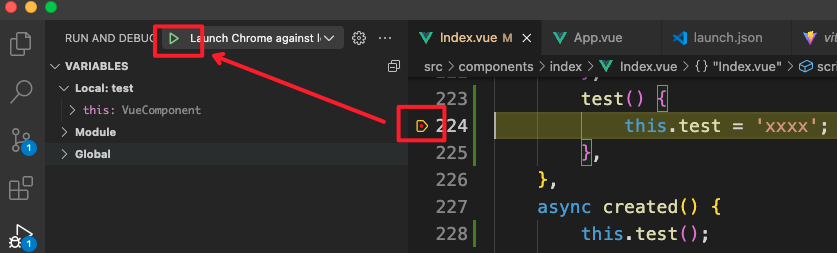

同样的，此时 vscode 中有和 chrome 类似的调试按钮，把 `Caught Exceptions` 勾上，这样在代码报错的地方，就会自动中断执行。

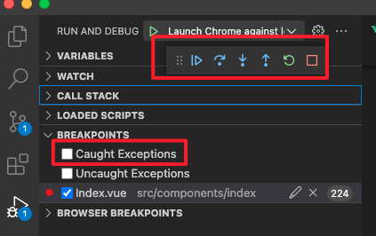

断点生效后，vscode 中会有一个调试控制台 `debug console`，在这里可以打印想要看到的变量，例如这里我打印了`this`：

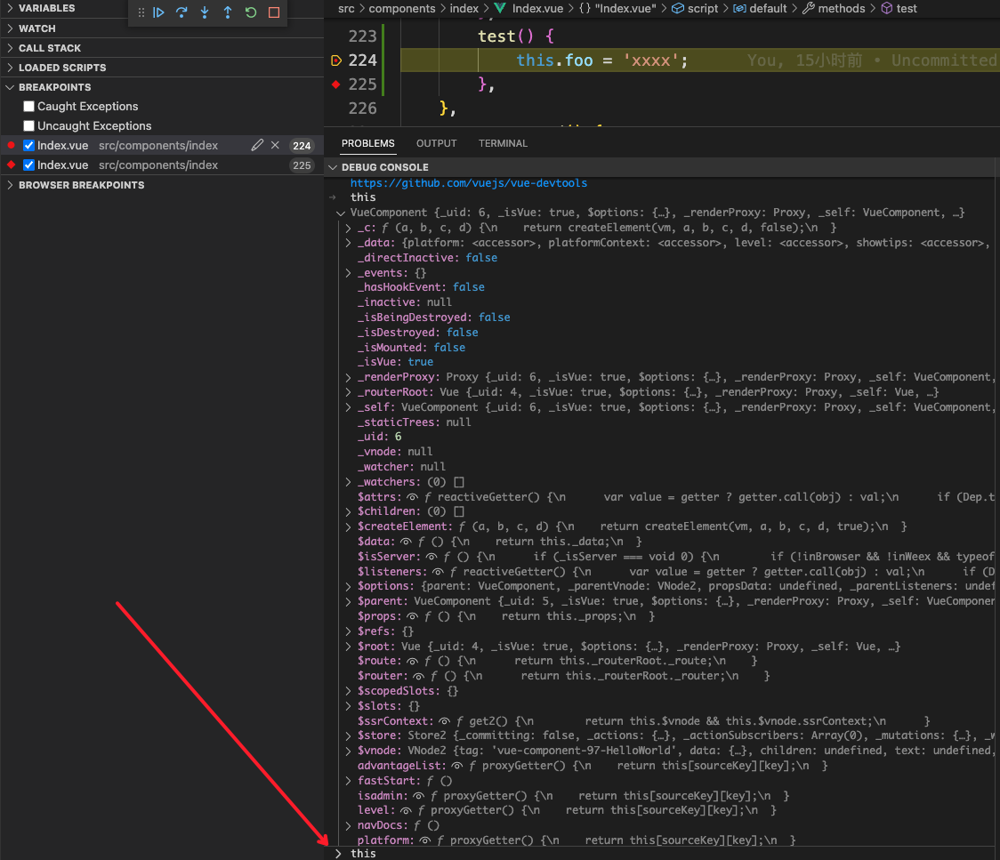

如果想打印出某个变量，也可以使用 `log point` 功能，右键选择`Add Logpint`，然后使用`{}`包裹想要打印的变量，这样也会在调试控制台输出。

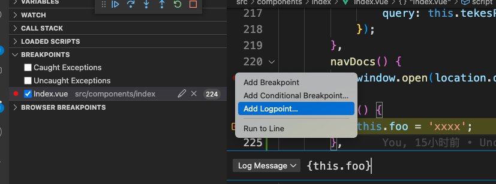

> 这种方式的优点是没有污染代码，如果用 console.log 的话调试完之后这个 console 还需要删掉。

左侧还可以查看调用栈`call stack`，例如这里执行路线为：`created()` => `test()`

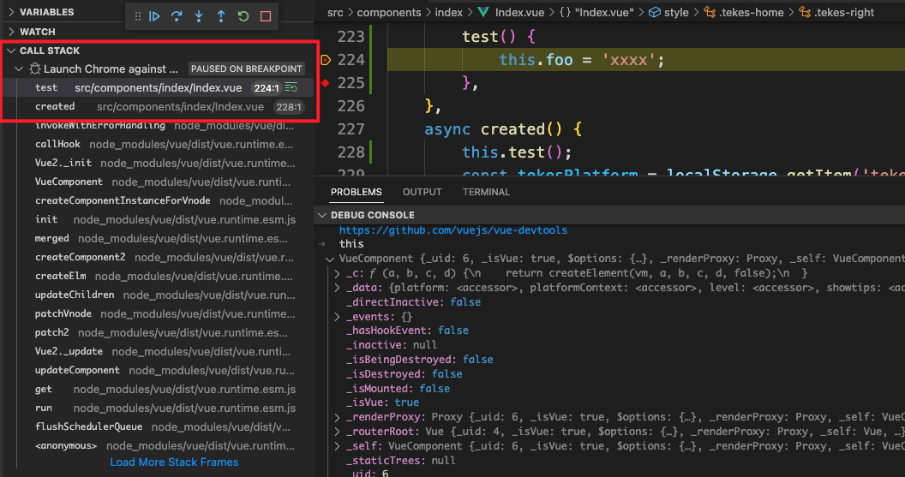

而且点击每个调用栈，在 `variables` 中还可以看到当前调用栈中的变量：

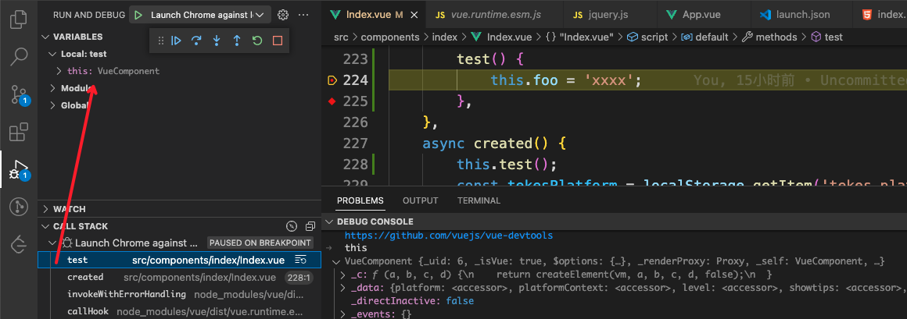

## chrome 调试 node 项目

```js
// index.js
const greeting = 'hello nodejs debugger';
debugger;
console.log(greeting);
```

终端中输入：` node --inspect-brk index.js`，然后打开 [chrome://inspect/#devices](chrome://inspect/#devices)

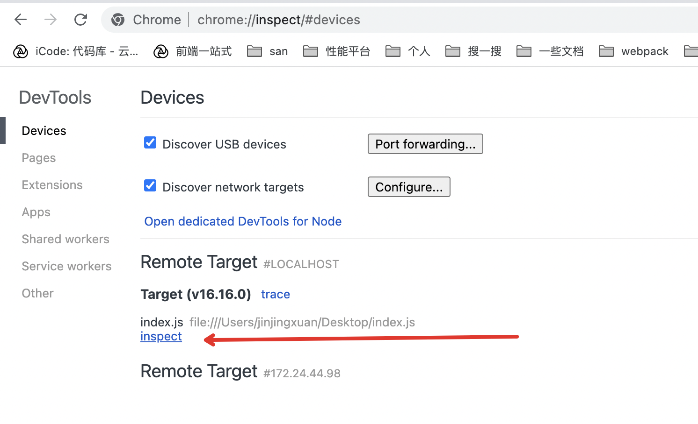

> `--inspect-brk` 表示运行这个 js 文件的同时，在文件的第一行打上断点。

点击 inspect 此时 chrome 会打开一个 nodejs 专用的调试窗口，并且代码在第一行中断了。

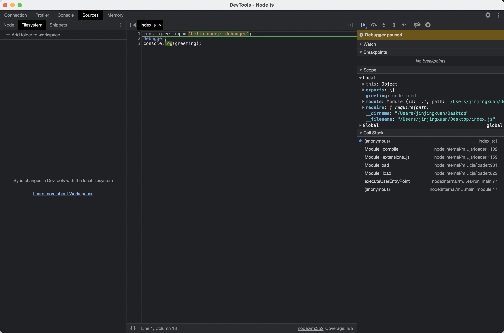

## vscode 调试 node 项目

同样地，和 vscode 调试 web 项目一样，在项目中创建 `launch.json`:

```json
{
    // Use IntelliSense to learn about possible attributes.
    // Hover to view descriptions of existing attributes.
    // For more information, visit: https://go.microsoft.com/fwlink/?linkid=830387
    "version": "0.2.0",
    "configurations": [
        {
            "type": "node",
            "request": "launch",
            "name": "Launch Program",
            "skipFiles": [
                "<node_internals>/**"
            ],
            "program": "${workspaceFolder}/index.js"
        }
    ]
}
```

然后就可以在 vscode 中进行调试了，和上面介绍过的没有差别：

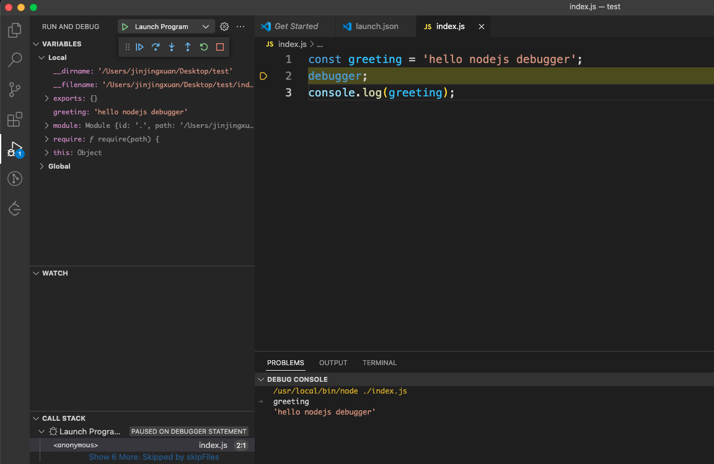

## 条件断点

在某些情况下，我们不希望打上的每个断点都发挥作用，而是在执行到断点那行，且满足某个条件再中断代码执行。这就是条件断点。

```tsx
for (let i = 0; i < 10; i++) {
  console.log('i', i);
}
```

比如上面的代码，假设我们在第二行 `console.log` 打了断点，那么这个断点总计会中断十次。这往往是我们不希望看到的，可能我们需要的仅仅是其中某一次循环而非所有。这时候可以右键点击并选择 `Add Conditional Breakpoint`。

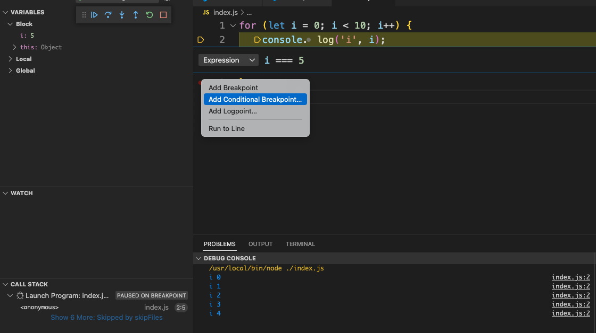

可以看到调试控制台前几次 i 均打印出来，直到 `i === 5` 时才中断执行。
