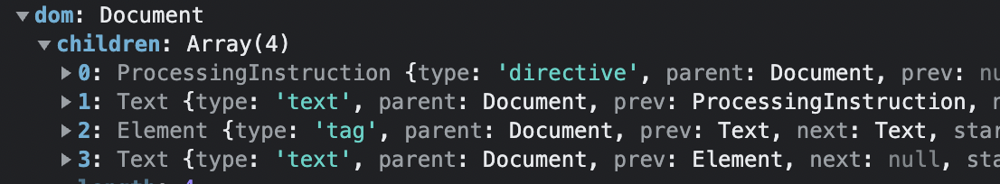

# htmlparser2

[htmlparser2](https://github.com/fb55/htmlparser2) 是一个 HTML/XML 解析器。

```js
const htmlparser2 = require("htmlparser2");
const parser = new htmlparser2.Parser({
    // 当遇到标签时调用
    onopentag(name, attributes) {
        if (name === "script" && attributes.type === "text/javascript") {
            console.log("JS! Hooray!");
        }
    },
    // 当遇到文本时调用
    ontext(text) {
        console.log("-->", text);
    },
    // 当标签结束时调用
    onclosetag(tagname) {
        if (tagname === "script") {
            console.log("That's it?!");
        }
    },
});
parser.write(
    "Xyz <script type='text/javascript'>const foo = '<<bar>>';</ script>"
);
parser.end();

/**
--> Xyz
JS! Hooray!
--> const foo = '<<bar>>';
That's it?!
*/
```

解析成 DOM tree

```js
const htmlparser2 = require("htmlparser2");

const htmlString = 
`<!DOCTYPE html>
<html>

<body>
    <h1>My First Heading</h1>
    <p>My first paragraph.</p>
</body>

</html>
`

const dom = htmlparser2.parseDocument(htmlString);
console.log(dom)
```



解析结果也可以到 [astexplorer.net](https://astexplorer.net/) 中查看。