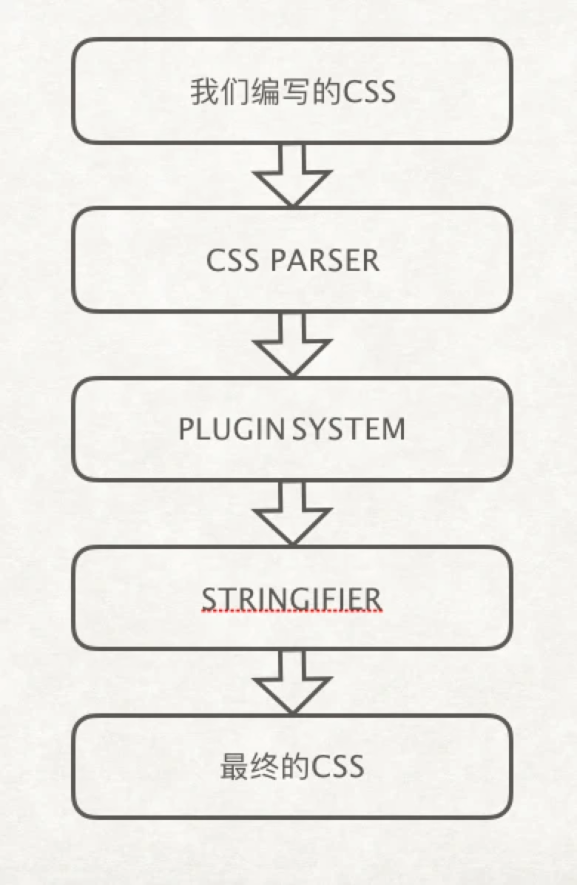

# postcss

[官方文档](https://www.postcss.com.cn/)

[github地址](https://github.com/postcss/postcss#usage)

PostCSS 是一个用 JavaScript 工具和插件转换 CSS 代码的工具，常见的功能如：

* 使用下一代css语法
* 自动补全浏览器前缀
* 自动把px代为转换成rem
* css 代码压缩等等

PostCSS 可以称为一个平台，提供了一个解析器，能够将 CSS 解析成 AST，还需要配合插件使用。



## 与预处理器的区别

* Less / Sass / Stylus，这类工具都属于 CSS 预处理工具。预处理指的是通过特殊的规则，将非 css 文本格式最终生成 css 文件。
* postcss 则是对 CSS 进行处理，最终生成的还是 CSS。

## 常用插件

* Autoprefixer：前缀补全
* postcss-pxtorem：把 px 转换成 rem

```css
:fullscreen {
}

/* 处理后 */
:-webkit-full-screen {
}
:-ms-fullscreen {
}
:fullscreen {
}
```

## [JS API](https://github.com/postcss/postcss#js-api)

```js
let postcss = require('postcss');
let autoprefixer = require('autoprefixer');

let css = `:fullscreen {}`

postcss([autoprefixer]).process(css).then(result => {
  console.log(result.css)
})

// 输出
// :-webkit-full-screen {}
// :-ms-fullscreen {}
// :fullscreen {}
```

## [Result.root](https://postcss.org/api/#result-root)

除了 Result.css 还有 Result.root 等属性


## [LazyResult](https://postcss.org/api/#lazyresult)

Post CSS 转换结果的 Promise 代理

```js
const lazy = postcss([autoprefixer]).process(css)
```

* [LazyResult.root]()

通过同步插件处理输入 CSS 并返回 Result.root，也就是说两个 API 返回结果相同。

注意：此属性仅适用于同步插件。 如果处理器包含任何异步插件，它将引发错误。

```js
let postcss = require('postcss');
const autoprefixer = require('autoprefixer');

let css = `:fullscreen {}`

const lazy = postcss([autoprefixer]).process(css)
console.log(lazy.root)
```

