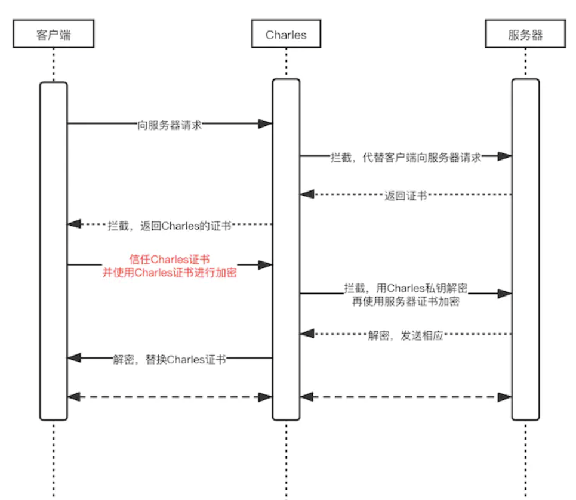
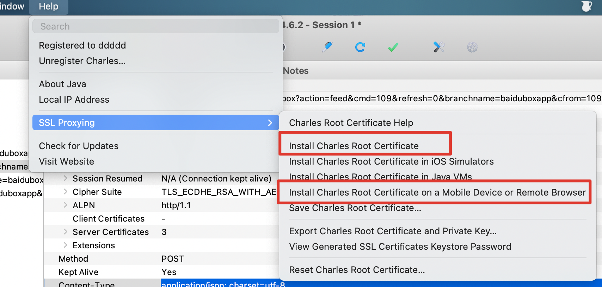
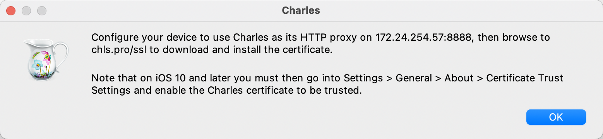
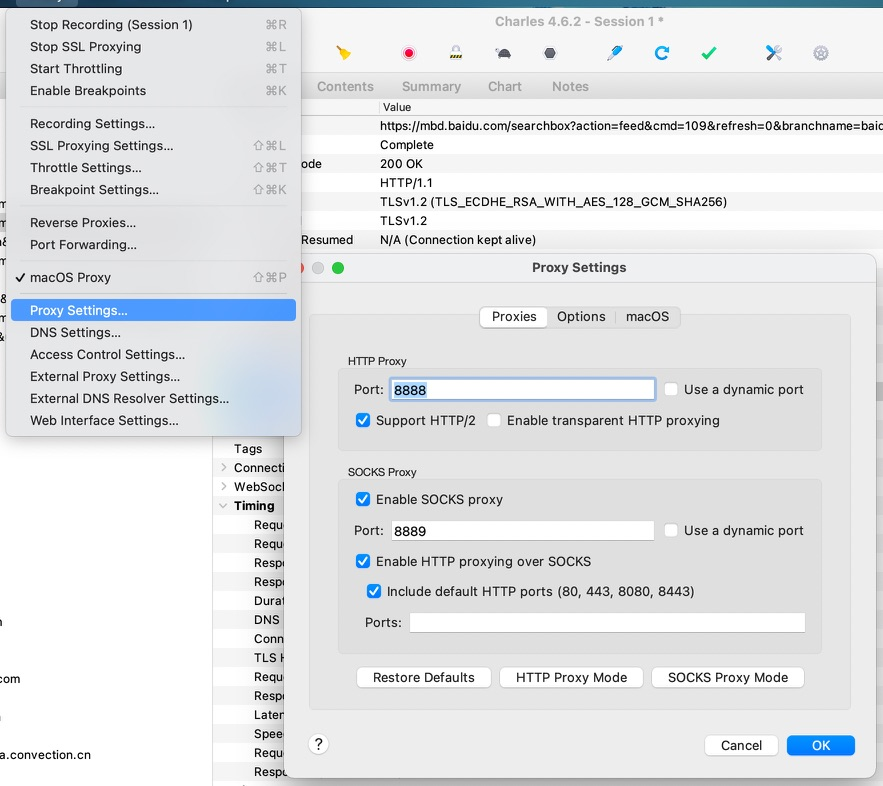
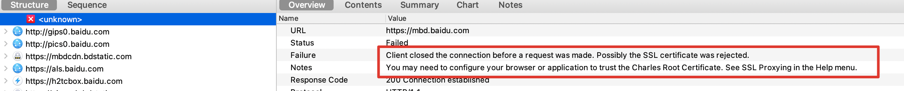
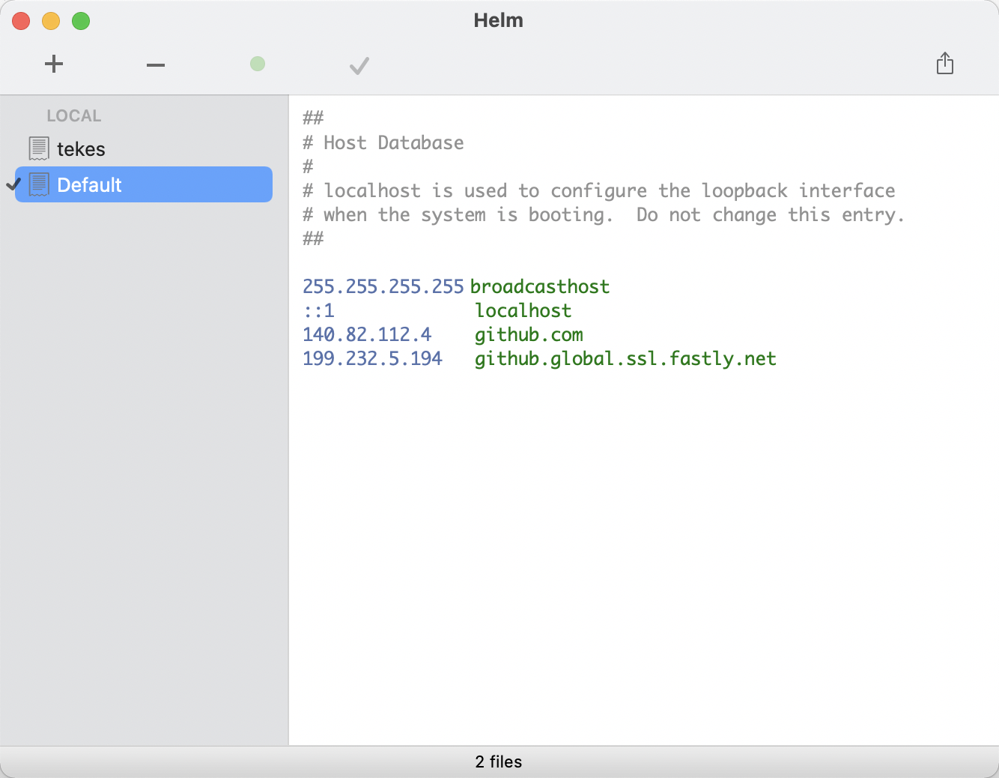

# 常用工具和插件
## VSCode 常用插件

* Git History： 查看 git 历史
* Leetcode：刷题必备
* Bracket Pair Colorizer：括号匹配
* GitLens：在 vscode 上使用 git 功能
* Chinese (Simplified) Language Pack for Visual Studio Code：中文设置

> 安装后，在 `locale.json` 中添加 `"locale": "zh-cn"`，即可载入中文（简体）语言包。要修改 `locale.json`，你可以同时按下 `Ctrl+Shift+P` 打开**命令面板**，之后输入 "config" 筛选可用命令列表，最后选择**配置语言**命令。

* Babel JavaScript：JavaScript 语法高亮显示
* ESLint
* Live Server
* open in browser
* Minapp：微信小程序标签、属性的智能补全
* wechat-snippet：微信小程序代码辅助
* wxml：微信小程序 wxml 格式化以及高亮组件
* Vetur: 支持vue文件的语法高亮显示，除了支持template模板以外，还支持大多数主流的前端开发脚本和插件，比如Sass和TypeScript
* vscode-icons
* vue-helper插件：代码提示，函数跳转
* Codelf：右键变量命名
* any-rule：正则大全
* es6-string-html：模板字符串高亮
* [模板字符串闭合](https://blog.csdn.net/qq_36634628/article/details/107650540)
* [自动补全](https://blog.csdn.net/qq_35393869/article/details/101280343)

## vue-dev-tools

> 控制台调试 vue，[安装](https://juejin.cn/post/6994289281141309476)

## Jsonview

https://github.com/gildas-lormeau/JSONView-for-Chrome

## Iterm2 + oh my zsh

[iTerm2 + Oh My Zsh 打造舒适终端体验](https://segmentfault.com/a/1190000014992947)

其中字体包等资源github访问慢可以去gitee上找

[oh my zsh命令提示功能 ](https://blog.csdn.net/sunyv1/article/details/108049209),提示颜色在 `perference / profiles / color / ANSI Colors / Bright`设置

## nvm和n

安装node：`brew install node`

管理node版本工具：[nvm](https://juejin.cn/post/6844904056024989710)或者[n](https://www.jianshu.com/p/c641dcc47b48)，我比较喜欢用n

## homebrew

[Homebrew](https://zhuanlan.zhihu.com/p/90508170)是一款自由及开放源代码的软件包管理系统，用以简化macOS系统上的软件安装过程。对于Appstore中没有的软件，推荐使用此方法安装管理第三方软件。

## tree

安装：`brew install tree`

使用：`tree -a`

## npm, cnpm, yarn,tyarn

下载完 node 就自动有了 npm

```js
npm install -g cnpm --registry=https://registry.npm.taobao.org
```

```js
cnpm i -g yarn
```

## 同时配置github和gitlab

生成公钥：`ssh-keygen -t rsa -C 915397405@qq.com -f ~/.ssh/id_rsa_github`

进入 ssh 配置目录：`cd ~/.ssh`

配置文件生效：`sudo source config`

[git配置github与gitlab同时使用](https://blog.csdn.net/qq_36625806/article/details/111589620)

```
# gitlab
Host icode
  HostName gitlab.com
  PreferredAuthentications publickey
  IdentityFile ~/.ssh/id_rsa

# github
Host github
  HostName github.com
  User 915397405@qq.com
  PreferredAuthentications publickey
  IdentityFile ~/.ssh/id_rsa_github
```

如果出现了 `git@github.com: Permission denied (publickey).`

可以进入`ssh`目录运行下`ssh-add id_rsa_github`试试

****

如果出现以下错误：`Bad owner or permissions on .ssh/config`

这个时候，只需要在.ssh目录，执行以下命令行：`sudo chmod 600 config`

****

```
kex_exchange_identification: Connection closed by remote host
fatal: Could not read from remote repository.

Please make sure you have the correct access rights
and the repository exists.
```

则配置下 `hosts` 中的 github ip 地址即可

****

```js
@@@@@@@@@@@@@@@@@@@@@@@@@@@@@@@@@@@@@@@@@@@@@@@@@@@@@@@@@@@
@    WARNING: REMOTE HOST IDENTIFICATION HAS CHANGED!     @
@@@@@@@@@@@@@@@@@@@@@@@@@@@@@@@@@@@@@@@@@@@@@@@@@@@@@@@@@@@
IT IS POSSIBLE THAT SOMEONE IS DOING SOMETHING NASTY!
Someone could be eavesdropping on you right now (man-in-the-middle attack)!

// 删除下 know_hosts 重新 push
ssh-keygen -R github.com
```

****

```js
Unable to negotiate with xx.xx.xx.xx port xxxx: no matching host key type found. Their offer: ssh-rsa
fatal: Could not read from remote repository.

Please make sure you have the correct access rights
and the repository exists.

// config 中增加配置
Host *
HostkeyAlgorithms +ssh-rsa
PubkeyAcceptedKeyTypes +ssh-rsa
```

## github访问慢

[解决GitHub下载速度太慢问题](https://www.jianshu.com/p/238f8242e1a6)

## carbon

https://carbon.now.sh/

## github部署

项目中新建脚本 `scripts/deploy-gh.sh`

```sh
# 确保脚本抛出遇到的错误
set -e

# 生成静态文件
npm run build

# 进入生成的文件夹
cd dist

# git 命令
git init
git add .
git commit -m 'deploy'

# 发布: git push -f git@github.com:<USERNAME>/<REPO>.git master:gh-pages
git push -f git@github.com:jinjingxuan/san-admin.git master:gh-pages

# 返回上一次的工作目录
cd -
```

`package.json`中：

```json
"scripts": {
  "deploy-gh": "bash scripts/deploy-gh.sh"
}
```

## tmux

开发机常用

http://www.ruanyifeng.com/blog/2019/10/tmux.html

## 绘图工具

https://excalidraw.com/

## charles



charles 相当于插在服务器和客户端之间的过滤器，当客户端向服务器发起请求的时候，先到 charles 进行过滤，然后 charles 在把最终的数据发送给服务器。服务器接收请求后的返回数据，也会先到 charles，经过 charles 过滤后再发给客户端。charles 发给服务器的数据，不一定是客户端请求的数据，charles 在接到客户端的请求时可以自由的修改数据。同理：客户端接收的数据，不一定就是服务器返回的数据，而是 charles 给的数据。(类似中间人攻击)

官网：https://www.charlesproxy.com/

破解：https://www.zzzmode.com/mytools/charles/

### 如何使用 charles 抓包（APP）

1. 点击顶部菜单栏【Help】-->选择【SSL Proxying】，点击【install Charles Root Certificate】在 mac 上安装 Charles 根证书即可； 点击安装【Install Charles Root Certificate On a Mobile Device or Remote Browser】在移动设备上或远程浏览器安装证书；



2. 保证手机和 mac 在同一局域网内，wifi 配置手动代理（按 charles 给出的 ip 和 端口号），然后访问 `chls.pro/ssl` 下载证书，然后通用 -> 关于本机 -> 证书信任设置中选中 Charles 的证书



3. 检查下 charles proxy setting



4. 接下来就可以抓包了，如果出现红叉以下情况，可能是证书过期了。【Help】-->【SSL Proxying】--> 【Reset Charles Root Certificate】重置证书，手机上也把之前下载好的证书卸载掉，按照以上步骤重新安装。



## nodemon

nodemon是一种工具，可以自动检测到目录中的文件更改时通过重新启动应用程序来调试基于node.js的应用程序。

```bash
npm install -g nodemon
```

## helm

Mac 上修改 host 文件的工具，Appstore中就能下载。可以建多份配置文件来回切换。



## ipic

图床工具，Appstore中就能下载。

## Mac 软件

https://www.macwk.com/

## github cli

当我们将本地代码提交到 `GitHub` 后，就可以在 `GitHub` 网站上查看到各种的交互信息了，例如其它开发者提的 `Issue`，或者提交的代码合并请求等。但是，如果我们能在命令行上直接查看、处理这些信息，那么就有了 `github cli`

官网：https://cli.github.com/

安装：`brew install gh`

更新：` brew update && brew upgrade gh`

授权登录：`gh auth login`（通过命令行交互会调起浏览器 github 进行授权）

查看 issue 列表：`gh issue list`

切换到 pr 分支：`gh pr checkout 111`

## JSDoc

js注释工具：https://www.jsdoc.com.cn/

## HomeBrew 清华镜像

[https://mirrors.tuna.tsinghua.edu.cn/help/homebrew/](https://mirrors.tuna.tsinghua.edu.cn/help/homebrew/)

brew 安装 php：https://stackoverflow.com/questions/70417377/error-php7-3-has-been-disabled-because-it-is-a-versioned-formula、https://github.com/shivammathur/homebrew-php/discussions/743

