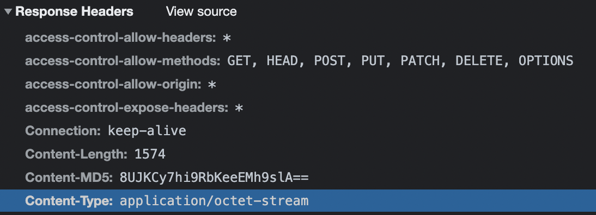

# yaml

**YAML** 是一个可读性高，用来表达资料序列化的格式。常用于存储一些配置文件，如：

```yaml
receipt:     Oz-Ware Purchase Invoice
date:        2012-08-06
customer:
    given:   Dorothy
    family:  Gale
   
items:
    - part_no:   A4786
      descrip:   Water Bucket (Filled)
      price:     1.47
      quantity:  4

    - part_no:   E1628
      descrip:   High Heeled "Ruby" Slippers
      size:      8
      price:     133.7
      quantity:  1
```

Yaml 和 json 可以互相转换（[在线转换工具](https://www.dute.org/yaml)），其实可以把 yaml 看成 json 文件的变形，其中短横线看做为数组，其他看作为对象。上面的 yaml 可以转换成如下 json：

```json
{
    "receipt": "Oz-Ware Purchase Invoice",
    "date": "2012-08-06T00:00:00.000Z",
    "customer": {
        "given": "Dorothy",
        "family": "Gale"
    },
    "items": [
        {
            "part_no": "A4786",
            "descrip": "Water Bucket (Filled)",
            "price": 1.47,
            "quantity": 4
        },
        {
            "part_no": "E1628",
            "descrip": "High Heeled \"Ruby\" Slippers",
            "size": 8,
            "price": 133.7,
            "quantity": 1
        }
    ]
}
```

npm 包 [yaml](https://www.npmjs.com/package/yaml) 也可实现该功能：

```js
import fs from 'fs'
import YAML from 'yaml'

const file = fs.readFileSync('./file.yml', 'utf8')
YAML.parse(file)
```

举一个场景，后端提供了一份 yaml 文件的 url，前端如何将其下载并读取内容呢？

```js
// 根据获取 yaml 配置文件并转 json
function getYaml(url) {
  let that = this;
  let fileUrl = url;
  let xhr = new XMLHttpRequest();
  xhr.open('get', fileUrl, true);
  xhr.responseType = 'blob';
  xhr.onload = function () {
    if (this.status === 200) {
      const reader = new FileReader();
      reader.readAsText(this.response);
      reader.onload = function () {
        that.json = yaml.parse(reader.result);
        that.parseJson(that.json);
      };
    }
  };
  xhr.send();
}
```

使用 axios 封装一下：

>  这里有两层异步操作，第一步是 axios.get，第二步是文件读取 reader
>
>  第二层利用 Promise 封装，使用 async / await 来得到 最终结果。

```js
function downloadYaml(url) {
  return axios.get(url, {
      responseType: 'blob',
    })
    .then(res => {
      return new Promise((resolve, reject) => {
        const reader = new FileReader();
        reader.readAsText(res.data);
        reader.onload = function () {
          resolve(reader.result);
        };
      });
    })
});

async function getYaml(url){
  const res = await downloadYaml(url);
  this.json = yaml.parse(res);
  this.parseJson(this.json);
}

getYaml(url);

// 简化后相当于
function a() {
    return new Promise((resolve, reject) => {
        setTimeout(() => {
            resolve(111)
        }, 1000)
    }).then(() => {
        return new Promise((resolve, reject) => {
            setTimeout(() => {
                resolve(222)
            }, 1000)
        })
    })
}

async function b() {
    const x = await a();
    console.log(x) // 222
}

b();
```

请求的时候我们可以看到，请求文件的响应类型为 [application/octet-stream](https://developer.mozilla.org/zh-CN/docs/Web/HTTP/Basics_of_HTTP/MIME_types#applicationoctet-stream)，是二进制数据流的文件。



* [`Blob`](https://developer.mozilla.org/zh-CN/docs/Web/API/Blob)对象表示一个不可变、原始数据的类文件对象。它的数据可以按文本或二进制的格式进行读取，也可以转换成 [`ReadableStream`](https://developer.mozilla.org/zh-CN/docs/Web/API/ReadableStream) 来用于数据操作。 

* [`XMLHttpRequest`](https://developer.mozilla.org/zh-CN/docs/Web/API/XMLHttpRequest) 属性 **`responseType`** 是一个枚举字符串值，用于指定响应中包含的数据类型。

  它还允许作者更改响应类型。`XMLHttpRequest.responseType = blob` 代表 [`response`](https://developer.mozilla.org/zh-CN/docs/Web/API/XMLHttpRequest/response) 是一个包含二进制数据的 [`Blob`](https://developer.mozilla.org/zh-CN/docs/Web/API/Blob) 对象。
  
* [`FileReader`](https://developer.mozilla.org/zh-CN/docs/Web/API/FileReader) 对象允许Web应用程序异步读取存储在用户计算机上的文件（或原始数据缓冲区）的内容，使用 [`File`](https://developer.mozilla.org/zh-CN/docs/Web/API/File) 或 [`Blob`](https://developer.mozilla.org/zh-CN/docs/Web/API/Blob) 对象指定要读取的文件或数据。

* [`FileReader.readAsText`](https://developer.mozilla.org/zh-CN/docs/Web/API/FileReader/readAsText) 方法可以将 [Blob](https://developer.mozilla.org/zh-CN/docs/Web/API/Blob) 或者 [File](https://developer.mozilla.org/zh-CN/docs/Web/API/File)[ ](https://developer.mozilla.org/zh-CN/docs/MDN/Doc_status/API/File_API)对象转根据特殊的编码格式转化为内容(字符串形式)

