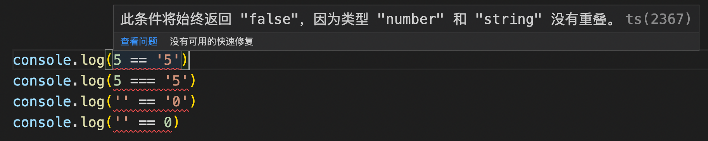

# 《深入理解 TypeScript》

## 第二章 JavaScript 常见语法

### 相等

在 JavaScript 中：

```js
5 == '5' // true
5 === '5' // false
"" == "0" // false
"" == 0 // true
```

而在 TypeScript 中在编写代码时就会报错，避免了隐式类型转换：

```ts
5 == '5' // false
5 === '5' // false
"" == "0" // false
"" == 0 // false
```



### null 和 undefined

* undefined：变量没有初始化
* null：变量不可用

无论在 JavaScript 还是在 TypeScript 中：

```js
null == undefined // true
0 == undefined // false
"" == undefined // false 
false == undefined // false
```

推荐使用 == null 来检查 undefined 和 null，因为你通常不希望区分它们。

```js
function foo (arg: string | null | undefined) {
  if (arg != null) {
    // arg 是字符串的情况，因为 != 排除了 null 和 undefined
  }
}
```

限制显示地使用 undefined

```ts
function foo() {
  // if ...
  return { a: 1, b: 2 }
  // else ...
  return { a: 1, b: undefined }
}

// 应该使用一个返回值的类型注解
function foo(): {a: number, b?: number} {
  // if ...
  return { a: 1, b: 2 }
  // else ...
  return { a: 1}
}
```

