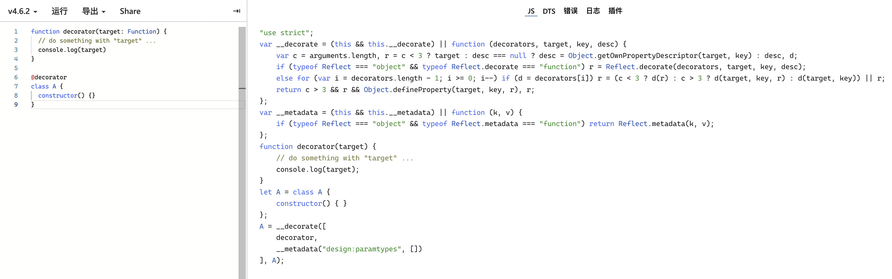

# TypeScript中的装饰器(@)

装饰器是一种特殊类型的声明，它能够被附加到[类声明](https://www.tslang.cn/docs/handbook/decorators.html#class-decorators)，[方法](https://www.tslang.cn/docs/handbook/decorators.html#method-decorators)， [访问符](https://www.tslang.cn/docs/handbook/decorators.html#accessor-decorators)，[属性](https://www.tslang.cn/docs/handbook/decorators.html#property-decorators)或[参数](https://www.tslang.cn/docs/handbook/decorators.html#parameter-decorators)上。 装饰器使用 `@expression`这种形式，`expression`求值后必须为一个函数，它会在运行时被调用，被装饰的声明信息做为参数传入，详见[官方文档](https://www.tslang.cn/docs/handbook/decorators.html)。

## 装饰器模式

介绍 TS 装饰器之前，我们从**设计模式**出发，了解一下其中的**装饰器模式**

> 装饰器模式实现了不改变原有对象，在原有对象上实现功能的添加。这是一种对原有对象的一种包装。

假设现在有两个形状，一个矩形一个圆形，这时候我们希望能在形状上实现一些特殊的功能，但又不改变原来的类，我们要如何做呢？

```js
class Rectangle {
    draw() {
       console.log("Shape: Rectangle");
    }
}
class Circle {
    draw() {
       console.log("Shape: Circle");
    }
}
```

这时我们可以用装饰器来实现，假设我们要给形状添加颜色功能

```js
class RedShapeDecorator {
    constructor(decoratedShape) {
       this.decoratedShape = decoratedShape;    
    }
    draw() {
       this.decoratedShape.draw();        
       this.setRedBorder();
    }
    setRedBorder(){
       console.log("Border Color: Red");
    }
}
```

那么在使用装饰器的类，在画圆的时候就实现了了画边框的颜色。

```js
const circle = new Circle();
const redCircle = new RedShapeDecorator(new Circle());
const redRectangle = new RedShapeDecorator(new Rectangle());
console.log("Circle with normal border");
circle.draw();
console.log("\nCircle of red border");
redCircle.draw();
console.log("\nRectangle of red border");
redRectangle.draw();
/**
 * output:
 * Circle with normal border
 * Shape: Circle
 * 
 * Circle of red border
 * Shape: Circle
 * Border Color: Red
 * 
 * Rectangle of red border
 * Shape: Rectangle
 * Border Color: Red
 */
```

### 装饰器模式的优势

即使原有对象发生改变，装饰器是种非侵入式功能添加，对原有对象的影响也能降低到最小。

## TS 装饰器

* 语法：装饰器使用 `@expression` 这种形式，`expression`求值后必须为一个函数，它会在运行时被调用，被装饰的声明信息做为参数传入

* 若要启用实验性的装饰器特性，必须`tsconfig.json`里启用`experimentalDecorators`编译器选项

* 常见的装饰器有: `类装饰器`、`属性装饰器`、`方法装饰器`、`参数装饰器`

* 装饰器的写法: 分为`普通装饰器(无法传参）`和`装饰器工厂(可以传参)`

### 装饰器写法

#### 1. 普通装饰器

```js
function decorator(target: Function) {
  // do something with "target" ...
  console.log(target)
}

@decorator
class A {
  constructor() {}
}

// 编译后输出的 target 其实就是 class A
// class 本质上是构造函数的语法糖，所以类型注解是 Function
class A {
    constructor() { }
} 
```

个人理解 ts 中的装饰器的含义其实和装饰器模式的本质相同，都是把原有的对象（A）拿过来通过 decorator 装饰（处理）一下。

#### 2. 装饰器工厂

装饰器工厂就是一个简单的函数，它返回一个表达式，以供装饰器在运行时调用。

```js
function color(value: string) { // 这是一个装饰器工厂
    return function (target: Function) { //  这是装饰器
        // do something with "target" and "value"...
        target.prototype.color = value
    }
}

@color('red')
class Apple {
  constructor() {}
}

const apple = new Apple()
console.log(apple.color) // 'red'
```

### 装饰器分类

#### 1. 类装饰器

* 类装饰器应用于类构造函数，可以用来监视，修改或替换类定义。 类装饰器不能用在声明文件中( `.d.ts`)，也不能用在任何外部上下文中（比如`declare`的类）。

* 类装饰器表达式会在运行时当作函数被调用，类的构造函数作为其唯一的参数。

```js
function decorator(target: any) {
  target.xx = 'test' ; // 给类增加属性
  target.prototype.name = 'tom'
  target.prototype.age = '18'
}

@decorator
class Person {
  constructor() { }
}

let p = new Person()
console.log(Person.xx); // test
console.log(p.age) // 18
```

* 如果类装饰器返回一个构造函数, 它会使用提供的构造函数来替换类之前的声明。

```js
function decorator (target: any) {
  return class B extends target {
    name = 'B'
  }
}

@decorator
class A {
  name = 'A'
  constructor() {}
}

console.log(new A().name) // 'B'
```

#### 2. 属性装饰器

属性装饰器声明在一个属性声明之前（紧靠着属性声明）

属性装饰器表达式会在运行时当作函数被调用，传入下列2个参数：

1. 对于静态成员来说是类的构造函数，对于实例成员是类的原型对象。
2. 成员的名字。

> 属性描述符不会做为参数传入属性装饰器，

```js
function decorator(target: any, propertyKey: string) {
  console.log(target) // Person: {}
  console.log(propertyKey) // "name" 
}

class Person {
  constructor() { }

  @decorator
  name: string = 'Tom'
}
```

#### 3. 方法装饰器

方法装饰器声明在一个方法的声明之前（紧靠着方法声明）。 它会被应用到方法的 属性描述符上，可以用来监视，修改或者替换方法定义。 

方法装饰器表达式会在运行时当作函数被调用，传入下列3个参数：

1. 对于静态成员来说是类的构造函数，对于实例成员是类的原型对象。
2. 成员的名字。
3. 成员的*属性描述符*，即 `Object.getOwnPropertyDescriptor(target,key)`。

```js
function decorator(target: any, propertyKey: string, descriptor: PropertyDescriptor) {
  console.log(target) // Person: {} 
  console.log(propertyKey) // "say" 
  console.log(descriptor) // {"writable":true,"enumerable":false,"configurable":true} 
  descriptor.writable = false;
}

class Person {
  constructor() { }

  @decorator
  say() {
    console.log('say hi')
  }
}
let p = new Person()

// 因为已经设置 writable 为 false，不可以修改所以下面这段代码会报错
p.say = function() {
  console.log('say hello')
}
```

**静态成员**

```js
function decorator(target: any, propertyKey: string, descriptor: PropertyDescriptor) {
  console.log(target)
  console.log(propertyKey)
  console.log(descriptor)
}

class Person {
  constructor() { }

  @decorator
  static say() {
    console.log('say hi')
  }
}

// 输出的 target 为类的构造函数
class Person {
    constructor() { }
    static say() {
        console.log('say hi');
    }
} 
```

#### 4. 参数装饰器

参数装饰器声明在一个参数声明之前（紧靠着参数声明）。 参数装饰器应用于类构造函数或方法声明。

参数装饰器表达式会在运行时当作函数被调用，传入下列3个参数：

1. 对于静态成员来说是类的构造函数，对于实例成员是类的原型对象。
2. 成员的名字。
3. 参数在函数参数列表中的索引。

```js
function decorator(target: any, propertyKey: string, parameterIndex: number) {
  console.log(target) // Person: {} 
  console.log(propertyKey) // "say" 
  console.log(parameterIndex) // 0
}

class Person {
  word: string
  constructor() {
    this.word  = 'hi'
  }

  say(@decorator word: string) {
    console.log(word)
  }
}
```

### 装饰器原理

装饰器的编译结果如下：



我们来具体看一下代码：

```js
var __decorate = 
    // 当前上下文是否有 __decorate 这个函数，如果有就返回这个函数，如果没有就定义一个
    (this && this.__decorate) || function (decorators, target, key, desc) {
      
    // c: 参数个数，此例为 2
    // r: 此例为 target 即构造函数
    var c = arguments.length, 
        r = c < 3 ? target : desc === null ? desc = Object.getOwnPropertyDescriptor(target, key) : desc, 
        d;
    
    // 如果系统支持反射，则直接使用Reflect.decorate(decorators,target, key, desc)方法。
    if (typeof Reflect === "object" && typeof Reflect.decorate === "function") {
      r = Reflect.decorate(decorators, target, key, desc);
    }
    // 否则自行定义实现装饰器机制的代码。
    else for (var i = decorators.length - 1; i >= 0; i--) {
      if (d = decorators[i]) {
        r = (c < 3 ? d(r) : c > 3 ? d(target, key, r) : d(target, key)) || r;
      }
    }
    if (c > 3 && r) {
      return Object.defineProperty(target, key, r)
    }
    return r;
};

var __metadata = (this && this.__metadata) || function (k, v) {
    if (typeof Reflect === "object" && typeof Reflect.metadata === "function") {
      return Reflect.metadata(k, v);
    }
};

function decorator(target) {
    // do something with "target" ...
    console.log(target);
}
let A = class A {
    constructor() { }
};
A = __decorate([
    decorator,
    __metadata("design:paramtypes", [])
], A);
```

