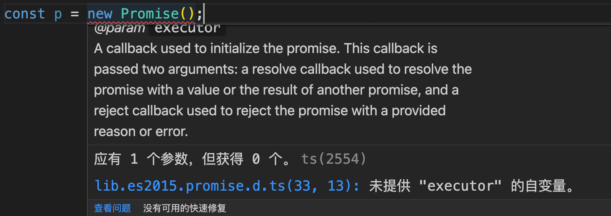

# TypeScirpt类型声明文件

**类型声明（Type Declaration）**或者**类型定义（Type Definition）**文件是一个以`.d.ts`作为文件后缀名的TypeScript文件。

类型声明文件用来帮助开发者在 typescript 中使用已有的 JavaScript 工具包。

## `.d.ts`

类型声明文件的后缀名为`.d.ts`，文件中只包含与类型相关的代码，不包含逻辑代码，它们的作用旨在为开发者提供类型信息，所以它们只在开发阶段起作用。

> 我们知道第三方库一般会使用 ts 代码编写，ts 代码会编译成 js 代码，发布后供他人使用。这个时候类型信息就丢失了。当我们在 IDE 中引入第三方库时，如果该库没有提供类型声明，TypeScript 则不知道该库是什么类型，有什么东西，进而 IDE 会进行报错。

比如我们在项目中使用jQuery，直接在全局使用变量`$`或`jQuery`：

```ts
$('#foo');
// 找不到名称 "$"。是否需要安装 jQuery 的类型定义? 请尝试使用 `npm i --save-dev @types/jquery`。ts(2581)
```

[DefinitelyTyped](https://github.com/DefinitelyTyped/DefinitelyTyped) 社区为我们提供了很多第三方 npm 声明文件包，例如`@types/lodash`和`@types/node`等等。你可以使用npm安装[`@types`](https://www.npmjs.com/org/types)下的声明包。

```bash
npm install -D @types/jquery
```

这些包会被下载到 `node_modules/@types `文件夹下。

声明文件有两种使用方法：

* 将声明文件和源码放在一起
* 将声明文件发布到 `@types` 下

我们一般不需要手动去写声明文件，如果我们的文件本身是用 TS 编写的，在编译的时候让 TS 自动生成声明文件，并在发布的时候将 .d.ts  文件一起发布即可。

如果是手动写的声明文件，那么需要满足以下任一一项条件，才能被正确的识别：

- 给 package.json 中的 `types` 或 `typings` 字段指定类型声明文件的路径。
- 声明文件放在项目根目录下，命名为 `index.d.ts`
- 与入口文件（package.json 中的 main 字段指定的入口文件）一起，编写一个同名 `.d.ts` 文件

## 全局声明

**全局声明（global declaration）**在任何 TypeScript 项目或者 TypeScript 代码片段中都会起作用的。例如当你写下`const p = new Promise();`时，TypeScript编译器不会去编译你的代码，因为`const p = new Promise();`语法错误了。



从IDE的提示中，可以看到`Promise`类型是定义在`lib.es2015.promise.d.ts`文件中的，由 TypeScript 提供，TypeScript 提供的很多这样的声明文件，被称作**标准库**（这些声明文件会随TypeScript一起安装）。

## 编写声明文件

详见以下两篇文章：

* [声明文件 *.d.ts](https://drylint.com/Typescript/%E5%A3%B0%E6%98%8E%E6%96%87%E4%BB%B6.d.ts.html#%E5%A3%B0%E6%98%8E%E6%96%87%E4%BB%B6-d-ts)
* [TypeScirpt类型声明完全指南](https://www.pengfeixc.com/blogs/javascript/typescript-declarations)

