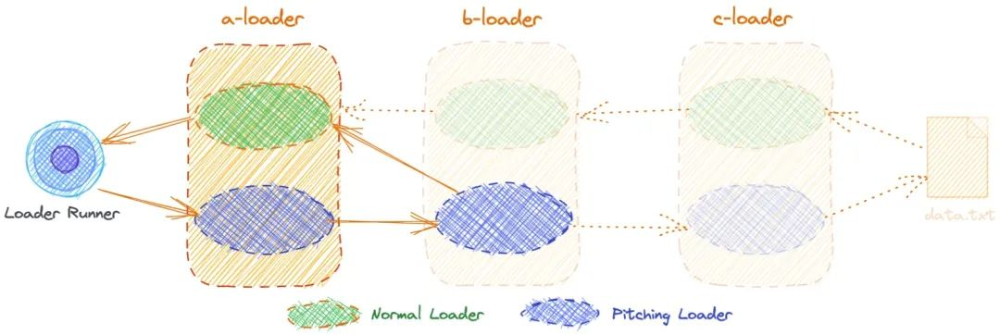
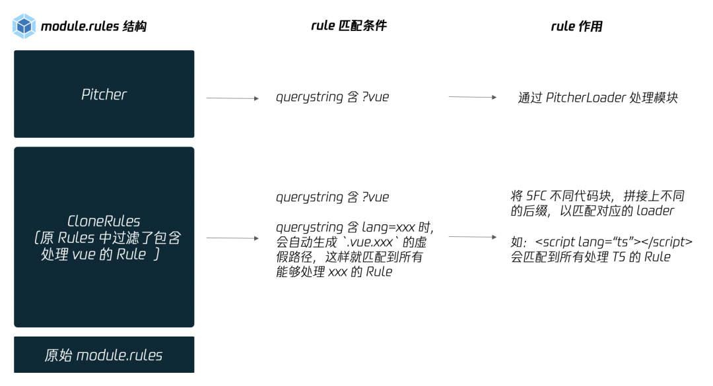
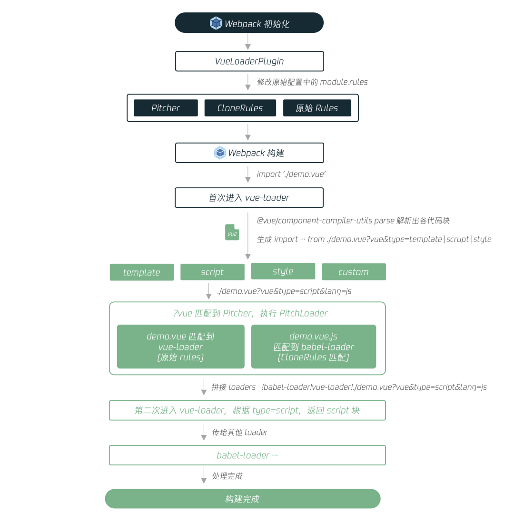
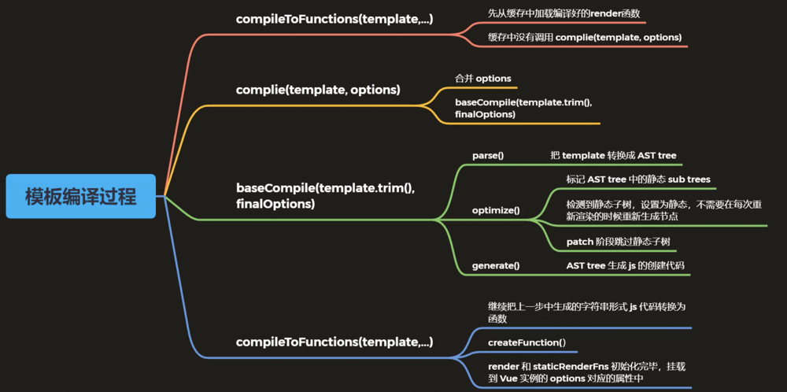

# vue-loader原理解析

## [vue-loader](https://github.com/vuejs/vue-loader#how-it-works)

> vue-loader 是用于 webpack 的加载器，允许你用 Single-File Components 单文件组件的格式来写 Vue 组件。其作用就是提取 *.vue 文件中的template，script，style等，再通过 vue-template-compiler，style-loader 等插件，最终形成一个可以在浏览器中运行的 js 文件。

### vue-loader 处理 SFC

* 首先 `vue-loader  ` 是怎么处理 SFC 的？他会使用 `@vue/component-compiler-utils` （下文会介绍）将 SFC 源码解析成 `SFC 描述符` ，[源码地址](https://github.com/vuejs/vue-loader/blob/master/lib/index.js#L67)

```js
// vue-loader lib/index.js
const { parse } = require('@vue/component-compiler-utils');

module.exports = function (source) {
  // 解析源码，得到描述符
  const descriptor = parse({ source, ... });
	
  // 打印结果
  console.log(descriptor);
  /**
  	descriptor {
      template: { ... },
      script: { ... },
      styles: [ ... ],
      customBlocks: [],
      errors: []
    }
  */
}
```

* 然后根据 `SFC描述符` 为每个语言块进行处理，[源码地址](https://github.com/vuejs/vue-loader/blob/master/lib/index.js#L113)

```js
  // 如果 template 块存在
  if (descriptor.template) { ... }
  // 如果 script 块存在
  if (descriptor.script) { ... }
  // 如果 style 块存在（支持多 style 块）
  if (descriptor.styles.length) { ... }
  // Vue 还支持自定义块
  if (descriptor.customBlocks && descriptor.customBlocks.length) { ... }
```

* 处理后打印出的结果：

```js
// 从主加载程序返回的代码source.vue的代码

// import the <template> block
import render from 'source.vue?vue&type=template'

// import the <script> block
import script from 'source.vue?vue&type=script'
export * from 'source.vue?vue&type=script'

// import <style> blocks
import 'source.vue?vue&type=style&index=1'

script.render = render
export default script
```

* 以上就是使用 vue-loader 处理 SFC 的结果，那么问题来了语句中`?vue&type=template` 的作用是什么？这首先需要了解一下 [pitch loader](https://webpack.docschina.org/api/loaders/#pitching-loader) 和  [VueLoaderPlugin](https://github.com/vuejs/vue-loader/blob/master/lib/plugin-webpack4.js)

### Pitch Loader

* Normal loader：Loader 本质上是导出函数的 JavaScript 模块，而该模块导出的函数（若是 ES6 模块，则是默认导出的函数）就被称为 Normal Loader。**需要注意的是， Normal Loader 与 Webpack Loader 分类中定义的 Loader 是不一样的**。在 Webpack 中，loader 可以被分为 4 类：pre 前置、post 后置、normal 普通和 inline 行内。其中 pre 和 post loader，可以通过 `rule` 对象的 `enforce` 属性来指定
* Pitch loader：在开发 Loader 时，我们可以在导出的函数上添加一个 `pitch` 属性，它的值也是一个函数。该函数被称为 **Pitching Loader**

请看例子，我们定义 3 个 loader：

```js
// aLoader
function aLoader(content, map, meta) {
  console.log("开始执行aLoader Normal Loader");
  content += "aLoader]";
  return `module.exports = '${content}'`;
}

aLoader.pitch = function (remainingRequest, precedingRequest, data) {
  console.log("开始执行aLoader Pitching Loader");
};

// bLoader
function bLoader(content, map, meta) {
  console.log("开始执行bLoader Normal Loader");
  return content + "bLoader->";
}

bLoader.pitch = function (remainingRequest, precedingRequest, data) {
  console.log("开始执行bLoader Pitching Loader");
};

// cLoader
function cLoader(content, map, meta) {
  console.log("开始执行cLoader Normal Loader");
  return content + "[cLoader->";
}

cLoader.pitch = function (remainingRequest, precedingRequest, data) {
  console.log("开始执行cLoader Pitching Loader");
};

// config
module: {
  rules: [
    {
      test: /.txt$/i,
      use: ["a-loader", "b-loader", "c-loader"],
    },
  ],
},
```

 **Pitching Loader** 和 **Normal Loader** 的执行顺序：

```
开始执行aLoader Pitching Loader
...
开始执行bLoader Pitching Loader
...
开始执行cLoader Pitching Loader
...
开始执行cLoader Normal Loader
开始执行bLoader Normal Loader
开始执行aLoader Normal Loader
```

很明显对于我们的示例来说，**Pitching Loader** 的执行顺序是 **从左到右**，而 **Normal Loader** 的执行顺序是 **从右到左**。其实**Pitching Loader**的另一个作用是当某个 **Pitching Loader** 返回非 `undefined` 值时，就会实现熔断效果。例如在 `bLoader.pitch` 中返回值时，执行效果会如下图所示：



### VueLoaderPlugin

> 我们知道 Webpack 插件的作用是能够 hook 到在每个编译(compilation)中触发的所有关键事件，并且在插件实例的 apply 方法中，可以通过 compiler.options 获取 Webpack 配置，并进行修改。

VueLoaderPlugin 的处理流程中，修改了 module.rules，在原来的规则基础上加入了 pitcher 和 cloneRules 。新增的 rule ，能识别形如 `?vue&type=template` 的 querystring，让不同语言的代码块匹配到对应的 rule。

```js
class VueLoaderPlugin {
  apply (compiler) {
    // 对 Webpack 配置进行修改
    const rawRules = compiler.options.module.rules;
    const { rules } = new RuleSet(rawRules);
    ...
    
    // pitcher
    const pitcher = {
      loader: require.resolve('./loaders/pitcher'),
      resourceQuery: query => {
        if (!query) { return false }
        const parsed = qs.parse(query.slice(1))
        // 匹配第一个查询条件是否是 vue
        return parsed.vue != null
      },
      options: { ... }
    }

    // 替换初始 module.rules，在原有 rule 上，增加 pitcher、clonedRules
    compiler.options.module.rules = [
       pitcher,
       ...clonedRules,
       ...rules
     ];
  }
}
```



* 在这里由于我们注入了 pitcher 规则，上面的 `source.vue?vue&type=script`  被 pitcher 规则匹配到，就会被 [pitch函数](https://github.com/vuejs/vue-loader/blob/master/lib/loaders/pitcher.js#L51) 处理，且 pitch 中返回了结果，由于熔断机制会跳过剩余的 loader。这个函数根据参数 `type` 来生成 [行内lodaer](https://webpack.docschina.org/concepts/loaders/#inline) ：

```js
export * from "-!../../node_modules/vue-loader/lib/loaders/templateLoader.js??vue-loader-options!../../node_modules/vue-loader/lib/index.js??vue-loader-options!./index.vue?vue&type=template&id=21fec300&"
```

* `行内loader` 按照从右到左的顺序执行，在得到上述的 `request`  之后，`webpack `会先使用 `vue-loader` 处理，然后再使用 `template-loader` 来处理，最终得到的就是  `render`  函数。

> 在 PitchLoader 的转化结果中，还是会以 vue-loader 作为第一个处理的 loader，与第一次 vue-loader 处理不同的是，这次 vue-loader 的作用，仅仅是把 SFC 中语法块的源码提取出来，并交给后面的 loader 进行处理。
>



## [@vue/component-compiler-utils](https://github.com/vuejs/vue-docs-zh-cn/blob/master/vue-component-compiler-utils/README.md)

> 用来编译 vue 单文件组件

`@vue/component-compiler-utils` 的作用是解析 vue SFC 并分别得到 html(模板) 和 JavaScript(script块) 的源码。对于 html 源码我们可以再次使用 `vue-template-compiler` 模块将其解析为模板对应的 `render`函数。

### API

#### parse(ParseOptions): SFCDescriptor

将 SFC 解析为一个带有 source map 的 `SFC 描述器`。编译器 (`vue-template-compiler`) 通过 `compiler` 传入。

```ts
interface ParseOptions {
  source: string
  filename?: string
  compiler: VueTemplateCompiler
  // https://github.com/vuejs/vue/tree/dev/packages/vue-template-compiler#compilerparsecomponentfile-options
  // default: { pad: 'line' }
  compilerParseOptions?: VueTemplateCompilerParseOptions
  sourceRoot?: string
  needMap?: boolean
}

interface SFCDescriptor {
  template: SFCBlock | null
  script: SFCBlock | null
  styles: SFCBlock[]
  customBlocks: SFCCustomBlock[]
}

interface SFCCustomBlock {
  type: string
  content: string
  attrs: { [key: string]: string | true }
  start: number
  end: number
  map?: RawSourceMap
}

interface SFCBlock extends SFCCustomBlock {
  lang?: string
  src?: string
  scoped?: boolean
  module?: string | boolean
}
```

#### compileTemplate(TemplateCompileOptions): TemplateCompileResults

将 template 编译为 JavaScript 代码。编译器 (`vue-template-compiler`) 通过 `compiler` 选项被传入。

它也可以通过 [consolidate](https://github.com/tj/consolidate.js/) 可选地为任何模板引擎进行预处理。

```ts
interface TemplateCompileOptions {
  source: string
  filename: string

  compiler: VueTemplateCompiler
  https://github.com/vuejs/vue/tree/dev/packages/vue-template-compiler#compilercompiletemplate-options
  // default: {}
  compilerOptions?: VueTemplateCompilerOptions

  // Template preprocessor
  preprocessLang?: string
  preprocessOptions?: any

  // 将模板里找到的资源 URL 转换为 `require()` 调用
  // 这个选项默认是关闭的。如果设置为 true，则默认值为：
  // {
  //   video: ['src', 'poster'],
  //   source: 'src',
  //   img: 'src',
  //   image: 'xlink:href'
  //   use: 'xlink:href'
  // }
  transformAssetUrls?: AssetURLOptions | boolean

  // 为 vue-template-es2015-compiler，即一个 Buble 的 fork，指定的选项
  transpileOptions?: any

  isProduction?: boolean  // default: false
  isFunctional?: boolean  // default: false
  optimizeSSR?: boolean   // default: false

  // 是否美化编译后的渲染函数 (只在开发环境下有效)
  // 默认值：true
  prettify?: boolean
}

interface TemplateCompileResult {
  code: string
  source: string
  tips: string[]
  errors: string[]
}

interface AssetURLOptions {
  [name: string]: string | string[]
}
```

处理得到的 JavaScript 代码形如；

```js
var render = function (h) { /* ... */}
var staticRenderFns = [function (h) { /* ... */}, function (h) { /* ... */}]
```

它**不会**假定任何模块系统。你要在必要的时候负责处理导出。

#### compileStyle(StyleCompileOptions)

将输入的原始 CSS 进行 scoped CSS 转换。它不会处理预处理器。如果组件没有使用 scoped CSS 那么这一步会被跳过。

```ts
interface StyleCompileOptions {
  source: string
  filename: string
  id: string
  map?: any
  scoped?: boolean
  trim?: boolean
  preprocessLang?: string
  preprocessOptions?: any
  postcssOptions?: any
  postcssPlugins?: any[]
}

interface StyleCompileResults {
  code: string
  map: any | void
  rawResult: LazyResult | void // 来自 PostCSS 的懒处理原始结果
  errors: string[]
}
```

#### compileStyleAsync(StyleCompileOptions)

和 `compileStyle(StyleCompileOptions)` 相同，但是返回一个解析 `StyleCompileResults` 的 Promise 对象。可用于异步的 PostCSS 插件。

## vue-template-compiler



模板编译的作用是将模板（template）转换为渲染函数（render），**template => ast => render**

* 模板

```html
<div>
  <h1 @click="handler">title</h1>
  <p>some content</p>
</div>
```

* 渲染函数

```js
render (h) {
  return h('div', [
    h('h1', { on: { click: this.handler } }, 'title'),
    h('p', 'some content')
  ])
}
```

渲染函数中的 `h 函数`内部调用 `vm.$createElement` 生成虚拟 DOM

### 模板编译的作用

* Vue 2.x 中使用 VNode 描述视图以及各种操作，但是不可能让用户自己写 VNode 或者 渲染函数，用户只需要写类似 HTML 代码，通过编译器将模板转换成返回 VNode 的 render 函数
* `.vue`文件会被 webpack 构建过程中转换成 render 函数，webpack 本身是不支持转换的，是通过 `vue-loader`来支持的
* 运行时编译：运行时编译的前提是必须使用完整版的 vue（包含编译器），会在项目运行的过程中把模板编译成 render 函数，但是缺点是 vue 体积过大。

* 构建时编译：`vue-cli`自带的是运行时版本的 vue，使用 `webpack` + `vue-loader`完成编译，这样不仅体积小而且运行时不需要额外操作时间更快。

### 体验模板编译的结果

* 带编译器版本的 Vue.js 中，使用 template 或 el 的方式设置模板

```vue
<div id="app">
  <h1>Vue<span>模板编译过程</span></h1>
  <p>{{ msg }}</p>
	<comp @myclick="handler"></comp>
</div>
<script src="../../dist/vue.js"></script>
<script>
  Vue.component('comp', {
    template: '<div>I am a comp</div>'
  })
  const vm = new Vue({
    el: '#app',
    data: {
      msg: 'Hello compiler'
    },
    methods: {
      handler () {
        console.log('test')
      }
     } 
  })
  console.log(vm.$options.render)
</script>
```

* 编译后 render 输出的结果

```js
(function anonymous() {
  with (this) {
    return _c(
      "div",
      { attrs: { id: "app" } },
      [
        _m(0),
        _v(" "),
        _c("p", [_v(_s(msg))]),
        _v(" "),
        _c("comp", { on: { myclick: handler } }),
			],
			1
		);
  }
});
```

> _c： createElement
>
> _m：renderStatic，处理静态节点
>
> _v：createTextVNode，处理文本节点 
>
> _s：处理字符串

### Vue Template Explorer

* [vue-template-explorer](https://template-explorer.vuejs.org/)：Vue 2.6 把模板编译成 render 函数的工具
* [vue-next-template-explorer](https://vue-next-template-explorer.netlify.app/)：Vue 3.0 beta 把模板编译成 render 函数的工具

### 模板编译过程

* 解析、优化、生成

#### 编译入口

* src\platforms\web\entry-runtime-with-compiler.js

```js
Vue.prototype.$mount = function (
  ......
// 把 template 转换成 render 函数
const { render, staticRenderFns } = compileToFunctions(template, {
    outputSourceRange: process.env.NODE_ENV !== 'production',
    shouldDecodeNewlines,
    shouldDecodeNewlinesForHref,
    delimiters: options.delimiters,
    comments: options.comments
  }, this)
  options.render = render
  options.staticRenderFns = staticRenderFns
  ......
)
```

* 调试 compileToFunctions() 执行过程，生成渲染函数的过程：
  * `compileToFunctions`: src\compiler\to-function.js 
  * `complie(template, options)`:src\compiler\create-compiler.js，主要作用是合并 options
  * `baseCompile(template.trim(), finalOptions)`:src\compiler\index.js，核心编译函数

```js
export const createCompiler = createCompilerCreator(function baseCompile (
  template: string,
  options: CompilerOptions
): CompiledResult {
  // 把模板转换成 ast 抽象语法树
  const ast = parse(template.trim(), options)
  if (options.optimize !== false) {
    // 优化抽象语法树
    optimize(ast, options)
  }
  // 把抽象语法树生成字符串形式的 js 代码
  const code = generate(ast, options)
  return {
    ast,
    // 渲染函数
    render: code.render,
    // 静态渲染函数，生成静态 VNode 树
    staticRenderFns: code.staticRenderFns
  }
})
```

#### 解析-parse

* 解析器将模板解析为抽象语树 AST，只有将模板解析成 AST 后，才能基于它做优化或者生成代码字符串。

```js
const ast = parse(template.trim(), options)

//src\compiler\parser\index.js
parse()
```

#### 优化-optimize

* 优化抽象语法树，检测子节点中是否是纯静态节点
* 一旦检测到纯静态节点，例如永远不会更改的节点
  * 提升为常量，重新渲染的时候不在重新创建节点
  * 在 patch 的时候直接跳过静态子树

#### 生成-generate

```js
// src\compiler\index.js
const code = generate(ast, options)

// src\compiler\codegen\index.js
export function generate (
  ast: ASTElement | void,
  options: CompilerOptions
): CodegenResult {
  const state = new CodegenState(options)
  const code = ast ? genElement(ast, state) : '_c("div")'
  return {
    render: `with(this){return ${code}}`,
    staticRenderFns: state.staticRenderFns // 静态根节点对应的渲染函数
  }
}

// 把字符串转换成函数
// src\compiler\to-function.js
function createFunction (code, errors) {
  try {
    return new Function(code)
  } catch (err) {
    errors.push({ err, code })
    return noop
} }
```

参考链接

* [vue-loader](https://github.com/vuejs/vue-loader#how-it-works)
* [多图详解，一次性搞懂Webpack Loader](https://www.teqng.com/2021/08/11/%E5%A4%9A%E5%9B%BE%E8%AF%A6%E8%A7%A3%EF%BC%8C%E4%B8%80%E6%AC%A1%E6%80%A7%E6%90%9E%E6%87%82webpack-loader/#yiLoader_de_ben_zhi_shi_shen_me)

* [图解 VueLoader : .vue 文件是如何被打包的?](https://www.infoq.cn/article/lBI6h9AXeBBkGuRvYPtO)
* [vue-loader都做了些什么](http://sunjl729.cn/2021/05/28/vue-loader%E9%83%BD%E5%81%9A%E4%BA%86%E4%BA%9B%E4%BB%80%E4%B9%88/)
* [深入 vue-loader 原理](http://soiiy.com/index.php/Vue-js/15262.html)
